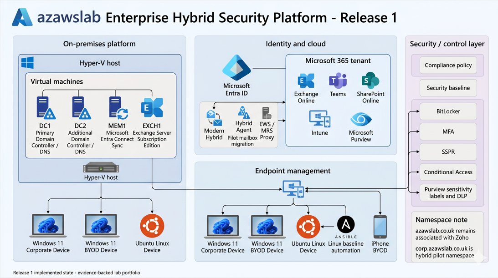

# azawslab Enterprise Hybrid Security Platform

A phased flagship project demonstrating hybrid identity, Microsoft 365, endpoint security, information protection, Azure platform engineering, and secure workload modernization.

---

## What This Project Demonstrates

- Hybrid Active Directory and Microsoft Entra ID integration
- Exchange hybrid migration to Microsoft 365
- Teams, SharePoint, Intune, and endpoint lifecycle controls
- MFA, SSPR, Conditional Access, and compliant-device access logic
- Windows, Linux, and iPhone endpoint management scenarios
- Windows compliance, security baseline, and BitLocker recovery lessons
- Purview sensitivity labels, DLP, and retention baseline
- Monitoring and compliance-aligned documentation
- Azure secure platform engineering in later phases
- Secure workload modernization in Release 3

---

## Release Summary

| Release | Focus | Status |
|---|---|---|
| Release 1 | Hybrid identity, Microsoft 365, endpoint management, Zero Trust direction, information protection, and operational recovery lessons | Implemented / near-complete |
| Release 2 | Azure landing zone, IaC, governance, Defender for Cloud, Sentinel, and MSP-style operations | Planned |
| Release 3 | Secure workload modernization, containerized services, observability, and resilience | Planned |

---

## Quick Links

- [Release 1 Build Checklist](docs/16-release1-build-checklist.md)
- [Release 1 Final Summary](docs/17-release1-final-summary.md)
- [Hybrid Identity](docs/05-hybrid-identity.md)
- [Modern Workplace](docs/06-m365-modern-workplace.md)
- [Endpoint Security and Intune](docs/07-endpoint-security-intune.md)
- [Information Protection and Purview](docs/10-information-protection-purview.md)
- [Monitoring and Alerting](docs/11-monitoring-alerting.md)
- [Security and Compliance Mapping](docs/12-security-compliance-mapping.md)
- [Roadmap](docs/13-roadmap.md)
- [Lessons Learned](docs/15-lessons-learned.md)

---

## Release 1 Implemented Scope

Release 1 now includes implemented and evidenced work across:

- Active Directory domain services with DC1 and DC2
- DNS, replication, OU structure, users, and pilot group design
- Exchange Server Subscription Edition source platform
- Entra Connect pilot synchronization using Password Hash Synchronization
- Modern Hybrid configuration and pilot Exchange Online migration
- Teams and SharePoint pilot collaboration baseline
- Intune tenant baseline and endpoint administration
- Windows 11 corporate-managed and BYOD scenarios
- Ubuntu Linux Intune visibility plus Ansible baseline automation
- iPhone BYOD enrollment through Intune Company Portal
- MFA, SSPR, and Conditional Access pilot baseline
- compliant-device access logic for Microsoft 365 pilot scope
- Windows compliance policy and Windows security baseline
- BitLocker recovery-key escrow and rebuild / stale-record cleanup lessons
- Purview sensitivity labels, DLP, and retention baseline
- monitoring and visibility baseline with further depth still maturing

---

## Why This Matters Professionally

This project is designed to demonstrate practical engineering capability across hybrid Microsoft environments, Microsoft 365 administration, secure endpoint management, Zero Trust access control direction, information protection, and phased Azure platform planning.

It is documented as a recruiter-facing portfolio with:

- implementation notes
- screenshots
- diagrams
- troubleshooting history
- phased expansion planning
- operational lessons learned

The goal is to show not only that technologies were configured, but that they were connected into a realistic platform story.

---

## Release 1 Architecture

---

## Overview

This repository documents a phased flagship project designed to model a realistic enterprise hybrid infrastructure, identity, messaging, modern workplace, endpoint administration, and security platform.

The project is built as a security-led engineering portfolio to demonstrate practical capability across:

- Active Directory and hybrid identity
- Microsoft Entra ID and Microsoft 365
- Exchange Server Subscription Edition (Exchange SE) and Exchange Online migration
- Microsoft Teams and SharePoint Online collaboration services
- Intune and endpoint administration
- Windows corporate and BYOD endpoint onboarding
- Linux endpoint visibility and baseline automation
- iPhone BYOD enrollment with Intune
- Zero Trust access controls
- information protection and compliance mapping
- monitoring, alerting, and governance-aligned operations

The goal is to present a realistic enterprise build path rather than isolated lab exercises.

This repository now includes active Release 1 implementation evidence across Hyper-V, Active Directory, Microsoft 365, Entra Connect Sync, Exchange hybrid configuration, pilot mailbox migration, Teams baseline validation, SharePoint baseline validation, Microsoft Intune endpoint onboarding, Linux Intune visibility, Linux baseline automation with Ansible, iPhone BYOD enrollment, Windows compliance policy validation, Windows security baseline assignment, BitLocker recovery testing, Purview pilot controls, and the growing monitoring baseline.

---

## Project Objectives

- Design and implement a secure hybrid identity foundation using on-premises Active Directory and Microsoft Entra ID
- Build a realistic Exchange hybrid migration path from on-premises Exchange SE to Microsoft 365
- Establish a Microsoft 365 modern workplace baseline across Exchange Online, Teams, and SharePoint
- Demonstrate endpoint administration and security through Intune, compliance policy, and device governance
- Extend endpoint management beyond Windows into practical Linux visibility, Linux baseline automation, and iPhone BYOD enrollment
- Apply Zero Trust principles across identity, endpoint, and access layers
- Integrate security, compliance, monitoring, and operational evidence into every phase
- Extend the platform in later phases into Azure governance, delegated administration, and workload modernization

---

## Release Model

### Release 1 - Secure Hybrid Identity and Modern Workplace

Focus areas:

- Hyper-V-based on-prem foundation
- Active Directory domain services with DC1 and DC2
- Member server and Exchange Server Subscription Edition source platform
- Microsoft 365 tenant setup and namespace onboarding
- Entra Connect pilot synchronization
- Exchange hybrid readiness and pilot migration path
- Exchange Online, Teams, and SharePoint baseline
- Intune endpoint administration and lifecycle management
- Windows corporate and BYOD endpoint onboarding
- Linux support path with Intune visibility and Ansible baseline automation
- iPhone BYOD enrollment through Intune
- Conditional Access, MFA, and Self-Service Password Reset (SSPR)
- information protection with sensitivity labels, DLP, retention baseline, and document fingerprinting direction
- initial monitoring, audit visibility, and alerting baseline
- security and compliance mapping against GDPR, NIST, and CIS principles

### Release 2 - Azure Secure Platform, MSP Operations & Network Security

Planned focus areas:

- Azure landing zone foundation
- Terraform-based infrastructure deployment
- Azure Policy, RBAC, and governance controls
- Azure Lighthouse for delegated administration / MSP operating model
- Global Secure Access / Entra Private Access
- VPN and routing design patterns
- Monitoring, alerting, and Microsoft Sentinel onboarding
- Defender for Cloud integration
- expanded compliance and governance controls

### Release 3 - Secure Workload Modernization & Resilience

Planned focus areas:

- 3-tier workload architecture
- Docker-based application deployment
- future AKS extension if justified
- secure workload connectivity and observability
- application security controls
- disaster recovery and high availability design patterns
- extended monitoring and alerting across workload and infrastructure layers

---

## Current Implementation Status

Release 1 is no longer at planning stage. The core on-premises, hybrid messaging, collaboration, endpoint, identity-protection, information-protection, and monitoring baseline has been implemented at practical pilot scope.

### Implemented and validated so far

- Hyper-V base image, internal switch, and host NAT foundation
- Active Directory domain build for `corp.azawslab.co.uk`
- DC1 deployment, promotion, DNS validation, and health checks
- DC2 deployment, additional DC promotion, replication validation, and AD consistency checks
- OU structure, standard users, security groups, and pilot sync scoping with `SG-Pilot-Hybrid-Sync`
- MEM1 deployment and Microsoft Entra Connect Sync configuration
- Microsoft 365 tenant onboarding and domain verification
- Entra Connect pilot synchronization using Password Hash Synchronization
- Exchange Server Subscription Edition deployment on EXCH1
- Exchange administration validation through EAC
- Modern Hybrid configuration using Minimal Hybrid with Hybrid Agent
- recovery from HCW warning `HCW8078 - Migration Endpoint could not be created`
- public-trust SAN certificate correction for:
  - `mail.corp.azawslab.co.uk`
  - `exch1.corp.azawslab.co.uk`
- EWS / MRS Proxy path validation for remote move migration
- migration endpoint created successfully through PowerShell
- successful `Test-MigrationServerAvailability`
- pilot Exchange Online migration completed for:
  - `u.finance01@corp.azawslab.co.uk`
  - `u.hr01@corp.azawslab.co.uk`
- post-migration Outlook on the web validation completed
- Teams baseline validated at pilot scope
- SharePoint baseline validated at pilot scope
- Intune baseline enabled at tenant scope
- EMS E5 licensing path activated for management capability
- Apple MDM Push Certificate prerequisite completed for iOS/iPadOS management
- Windows 11 corporate-managed endpoint scenario validated
- Windows 11 personal/BYOD endpoint scenario validated
- iPhone BYOD enrollment validated through Intune Company Portal
- device visibility confirmed in Intune and Microsoft Entra ID across Windows, Linux, and iPhone scenarios
- Linux Intune Agent enrollment path validated
- Ubuntu Linux endpoint visibility confirmed in Microsoft Entra ID and Intune
- Linux baseline automation validated with Ansible
- MFA pilot baseline implemented
- SSPR pilot baseline implemented
- Conditional Access pilot baseline implemented
- Windows compliance policy baseline implemented and validated
- Windows security baseline implemented and assigned
- BitLocker recovery-key escrow and advanced rebuild / re-enrollment scenario tested, including stale device record cleanup
- Purview sensitivity labels implemented and validated
- DLP pilot policy and policy-tip validation implemented
- Purview retention-policy baseline created and visible
- monitoring and visibility baseline established across identity, endpoint, and information-protection workflows

### Current Release 1 position

Release 1 has completed the infrastructure, hybrid identity, Exchange source build, hybrid recovery path, pilot mailbox migration, collaboration baseline, endpoint onboarding baseline, identity-protection pilot baseline, information-protection pilot baseline, and monitoring visibility baseline needed to demonstrate a realistic hybrid Microsoft platform.

### Current focus

The current focus is now shifting away from baseline activation and toward the remaining Release 1 depth workstreams:

- Windows configuration profiles
- update rings / patching baseline
- Windows LAPS password retrieval and recovery validation
- Defender and endpoint hardening
- audit-log and alerting depth
- document fingerprinting
- final documentation closeout and public presentation polish

---

## Important Namespace Design Decision

The environment intentionally separates namespaces during pilot migration work:

- `azawslab.co.uk` remains associated with Zoho for business mail flow
- `corp.azawslab.co.uk` is the dedicated hybrid pilot namespace

This allows pilot hybrid and migration work to proceed without disrupting the root business mail namespace.

---

## Real-World Delivery Context

The pilot users in this project were migrated as:

- `u.finance01@corp.azawslab.co.uk`
- `u.hr01@corp.azawslab.co.uk`

The lab validates mailbox migration into Exchange Online, but real enterprise mail routing can vary depending on whether Microsoft 365 is the direct mail ingress point or whether a third-party secure email gateway remains in front.

Common real-world patterns include:

### Option 1 - No third-party gateway

`Internet sender -> Exchange Online Protection / Microsoft 365 -> Exchange Online mailbox`

### Option 2 - Mimecast or Proofpoint in front of Microsoft 365

`Internet sender -> Mimecast / Proofpoint -> Microsoft 365 / Exchange Online -> user mailbox`

### Option 3 - Hybrid coexistence during staged migration

`Internet sender -> Mimecast / Proofpoint -> Microsoft 365 / Exchange Online`

Then Microsoft 365 determines mailbox location:

- if the mailbox is already in Exchange Online, deliver there directly
- if the mailbox is still on-premises, route back to on-premises through the hybrid connector path

This project does not claim full implementation of all gateway patterns, but it documents them as part of real-world migration design awareness.

---

## Endpoint Direction in Release 1

Release 1 is not limited to identity and messaging. It also establishes a practical endpoint baseline across multiple management scenarios.

### Windows scenarios validated

- corporate-managed Windows 11 device
- personal/BYOD Windows 11 device
- ownership distinction inside Intune
- compliance visibility for enrolled Windows devices
- Windows compliance policy baseline
- Windows security baseline
- BitLocker recovery and re-enrollment scenario

### Linux scenario validated

- Ubuntu device enrollment path using Microsoft Intune Agent
- Linux device visibility in Entra ID
- Linux device visibility in Intune
- Linux baseline automation using Ansible

### iPhone scenario validated

- Apple MDM Push Certificate prerequisite
- Company Portal-based iPhone BYOD enrollment
- iPhone visibility in Entra ID
- iPhone visibility and compliant state in Intune

This gives the platform a more realistic mixed-endpoint story than a Windows-only lab.

---

## Core Technologies

### Identity & Access
- Active Directory
- Microsoft Entra ID
- Entra Connect Sync
- Password Hash Synchronization
- Conditional Access
- Multi-Factor Authentication
- Self-Service Password Reset
- role-based administration

### Microsoft 365 & Modern Workplace
- Exchange Online
- Microsoft Teams
- SharePoint Online
- Intune
- device compliance
- endpoint lifecycle management

### Messaging & Hybrid
- Exchange Server Subscription Edition (Exchange SE)
- Modern Hybrid configuration
- Hybrid Agent
- MRS Proxy
- Exchange remote move migration
- manual migration endpoint recovery path

### Endpoint & Automation
- Windows 11
- Ubuntu Linux
- iPhone / iOS
- Microsoft Intune Agent
- Ansible
- SSH-based Linux automation
- baseline package and configuration automation

### Security & Governance
- Zero Trust principles
- Sensitivity labels
- Data Loss Prevention
- retention baseline
- Sensitive Information Types
- document fingerprinting direction
- security baselines
- governance-aligned administration

### Infrastructure & Operations
- Hyper-V
- Windows Server
- Ubuntu Server/Desktop
- PowerShell
- monitoring and visibility baseline
- Azure governance (future phase)
- Terraform (future phase)

---

## Documentation Structure

- `docs/01-project-overview.md` - overall scope and vision
- `docs/02-business-scenario.md` - fictional enterprise scenario and requirements
- `docs/03-current-state-architecture.md` - current on-premises implementation state
- `docs/04-target-state-architecture.md` - phased target architecture
- `docs/05-hybrid-identity.md` - AD, Entra ID, sync, namespace, and pilot identity status
- `docs/06-m365-modern-workplace.md` - tenant setup, licensing, Exchange migration, Teams, SharePoint, and M365 scope
- `docs/07-endpoint-security-intune.md` - endpoint overview and navigation page
- `docs/08-endpoint-platforms-and-enrollment.md` - Windows, Linux, and iPhone platform enrollment detail
- `docs/09-endpoint-compliance-and-security-baseline.md` - compliance, security baseline, BitLocker, and LAPS direction
- `docs/10-information-protection-purview.md` - labels, publishing, DLP, and retention baseline
- `docs/11-monitoring-alerting.md` - monitoring baseline and next-step visibility plan
- `docs/12-security-compliance-mapping.md` - control mapping against GDPR, NIST, and CIS
- `docs/13-roadmap.md` - phased roadmap
- `docs/14-advanced-recovery-scenarios.md` - BitLocker recovery, rebuild, and stale-record cleanup
- `docs/15-lessons-learned.md` - technical decisions, troubleshooting notes, and build lessons
- `docs/16-release1-build-checklist.md` - authoritative Release 1 delivery checklist
- `docs/17-release1-final-summary.md` - polished Release 1 closeout summary
- `docs/18-release2-build-checklist.md` - Release 2 planning tracker

---

## Supporting Artifacts

- Exchange / migration scripts: `scripts/exchange/`
- Ansible baseline content: `ansible/`
- diagrams: `diagrams/`
- screenshots and implementation evidence: `screenshots/`

---

## Evidence Strategy

This repository prioritizes implementation evidence over claims. Evidence includes:

- architecture diagrams
- portal screenshots
- Exchange and PowerShell validation output
- hybrid and migration troubleshooting evidence
- migration batch and outcome evidence
- Outlook on the web validation screenshots
- Teams collaboration evidence
- SharePoint access and file-validation evidence
- Intune and device-enrollment evidence
- Linux endpoint visibility evidence
- iPhone enrollment evidence
- Windows compliance and security baseline evidence
- BitLocker recovery and stale-device cleanup evidence
- MFA, SSPR, Conditional Access, and LAPS pilot evidence
- Purview label, DLP, and retention evidence
- Ansible files and playbook execution evidence
- monitoring evidence as the baseline deepens

---

## Guiding Principles

- security is embedded in every phase
- governance and compliance are documented, not assumed
- evidence is prioritized over buzzwords
- scope is phased to remain realistic and defensible
- the platform is designed for extension into Azure, MSP, and workload modernization scenarios
- design decisions are recorded and not reworked without clear technical justification

---

## Author

Hashibur Rahman  
Senior Hybrid Cloud & Infrastructure Engineer  
Belfast, UK