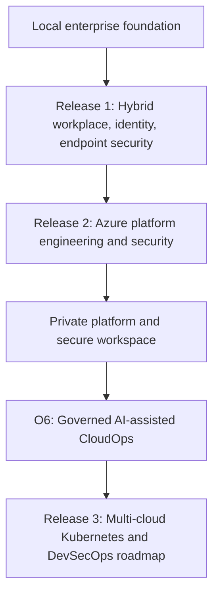

# Azawslab Enterprise Hybrid Security Platform

[](https://www.azawslab.co.uk/)
[](REVIEWER_GUIDE.md)
[](PROOF_GALLERY.md)
[](ARCHITECTURE.md)

[](STATUS.md)
[](docs/release1/README.md)
[](docs/release2/README.md)
[](docs/release3/README.md)

> Evidence-backed enterprise hybrid security and platform engineering portfolio: zero-trust hybrid identity, modern endpoint governance, secretless Infrastructure as Code delivery, secure hybrid and multi-cloud networking, private platform patterns, automation control planes, and governed AI-assisted CloudOps.

---

## Primary entry point: live portfolio showroom

The best way to review this project is the curated MkDocs portfolio site:

### [Explore the live showroom: www.azawslab.co.uk](https://www.azawslab.co.uk/)

The showroom provides searchable navigation, role-based review paths, architecture narratives, proof gallery, skills matrix, evidence guide, AI operations overview, and companion-project context.

---

## Start here

| Reader | Best first step |
|---|---|
| Recruiter | [Live showroom](https://www.azawslab.co.uk/) and [Skills Matrix](SKILLS_MATRIX.md) |
| Hiring manager | [Portfolio Case Study](PORTFOLIO.md) and [Architecture](ARCHITECTURE.md) |
| Technical reviewer | [Reviewer Guide](REVIEWER_GUIDE.md), [Terraform State Map](docs/release2/11-terraform-state-and-pipeline-map.md), and [Release 2 evidence](docs/release2/evidence/) |
| Security architect | [Architecture](ARCHITECTURE.md), [Evidence Guide](EVIDENCE_GUIDE.md), and [O6 evidence](docs/release2/evidence/O6/) |
| Evidence-first reviewer | [Proof Gallery](PROOF_GALLERY.md), [Evidence Guide](EVIDENCE_GUIDE.md), and [Release 2 evidence root](docs/release2/evidence/) |

---

## Targeted reader pathways

| Target reader | Strategic focus | Showroom gateway |
|---|---|---|
| Recruiter | Skills, role alignment, high-level proof | [Recruiter overview](https://www.azawslab.co.uk/role-paths/recruiter/) |
| Hiring manager | Business context, delivery ownership, risk mitigation | [Hiring manager path](https://www.azawslab.co.uk/role-paths/hiring-manager/) |
| Technical reviewer | IaC structure, state boundaries, workflows, implementation evidence | [Technical reviewer path](https://www.azawslab.co.uk/role-paths/technical-reviewer/) |
| Security architect | Zero-trust boundaries, private access, network inspection, AI governance | [Security architect path](https://www.azawslab.co.uk/role-paths/security-architect/) |
| DevOps / SRE reviewer | OIDC delivery, AWX, monitoring, backup, validation, operational readiness | [DevOps and SRE path](https://www.azawslab.co.uk/role-paths/devops-sre/) |
| Evidence-first reviewer | Screenshots, CLI output, logs, manifests, workflow and evidence folders | [Proof gallery](https://www.azawslab.co.uk/proof-gallery/) |

---

## 60-second architectural evolution

This project is structured as a staged enterprise cloud adoption journey rather than an isolated lab.



The full architecture narrative and diagrams are available on the [portfolio site](https://www.azawslab.co.uk/architecture/).

---

## Enterprise capability matrix

| Architectural pillar | Implemented value | Engineering signal |
|---|---|---|
| Identity and Endpoint Governance | Hybrid identity, modern endpoint management, compliance, recovery scenarios | Realistic Microsoft enterprise foundation |
| Secretless IaC Delivery | Terraform delivered through GitHub Actions OIDC without long-lived deployment credentials | CI/CD security maturity |
| Terraform State and Root Boundaries | Platform ownership separated across networking, management, AKS, AVD, shared services, governance, and AWS branch roots | Blast-radius control and maintainability |
| Secure Hybrid and Multi-Cloud Networking | Hub-spoke routing, firewall inspection patterns, branch connectivity, IPSec/BGP context | Practical network architecture depth |
| Automation Control Plane | Ansible and AWX used for controlled day-2 operational automation | Operational repeatability and governance |
| Private Platform Delivery | Private AKS and AVD/FSLogix patterns reduce public exposure and separate admin access | Zero-trust platform orientation |
| Governed AI Operations | O6 enclave and `local-ai-lab-infra` demonstrate local-first, permission-aware, human-reviewed AI-assisted infrastructure workflows | Modern AI governance and CloudOps innovation |

---

## Release status

| Release | Focus | Status | Evidence position |
|---|---|---|---|
| Release 1 | Hybrid Modern Workplace, Identity, Endpoint Security | Complete and evidenced | `screenshots/release1/` and `docs/release1/` |
| Release 2 | Azure Platform Engineering, Security, Automation, Private Platform, AI Operations | Implemented and evidenced | `docs/release2/evidence/` |
| Release 3 | Multi-cloud Kubernetes, GitOps, DevSecOps | Roadmap / platform evolution | `docs/release3/` |

---

## Flagship proof paths

| Area | Start here |
|---|---|
| Curated evidence | [Proof Gallery](https://www.azawslab.co.uk/proof-gallery/) |
| Evidence handling model | [Evidence Guide](https://www.azawslab.co.uk/evidence-guide/) |
| Skills map | [Skills Matrix](https://www.azawslab.co.uk/skills-matrix/) |
| Full case study | [Portfolio Case Study](https://www.azawslab.co.uk/portfolio-case-study/) |
| GitHub audit path | [Reviewer Guide](REVIEWER_GUIDE.md) |
| Release 2 evidence root | [docs/release2/evidence/](docs/release2/evidence/) |
| Terraform state and pipeline map | [docs/release2/11-terraform-state-and-pipeline-map.md](docs/release2/11-terraform-state-and-pipeline-map.md) |
| O6 AI operations evidence | [docs/release2/evidence/O6/](docs/release2/evidence/O6/) |
| Companion AI infrastructure lab | [local-ai-lab-infra](https://github.com/jrikobd-azaws/local-ai-lab-infra) |

---

## Complete ecosystem technology stack

| Domain | Technologies |
|---|---|
| Identity and endpoint | Active Directory DS, Entra ID, Entra ID Connect, Microsoft 365, Intune, Autopilot, Purview DLP, Defender, BitLocker, Windows LAPS |
| Infrastructure as Code | Terraform, GitHub Actions OIDC, remote backend patterns, Azure Policy, RBAC |
| Networking | Azure hub-spoke, Azure Firewall, FortiGate, VyOS, Cisco, IPSec, BGP, AWS branch context |
| Automation and operations | Ansible, AWX, Azure Key Vault, AWS Systems Manager, monitoring, backup, validation scripts |
| Private platform | Private AKS, Azure Virtual Desktop, FSLogix, private DNS, private endpoints |
| Governed AI operations | O6 AI Operations Enclave, local-first AI workflow, RAG, MCP/tool boundaries, validation hooks, human review |
| Roadmap direction | AKS, EKS, Argo CD, GitOps, DevSecOps, observability, resilience |

---

## Repository structural map

```text
azawslab-enterprise-hybrid-security/
|-- .github/
|   |-- workflows/                 # GitHub Actions workflows and Pages deployment
|   |-- copilot-instructions.md    # Repository-specific engineering guardrails
|-- ansible/                       # Automation and day-2 operations content
|-- diagrams/                      # Architecture diagrams and visual references
|-- docs/
|   |-- foundation/                # Scenario and foundation documentation
|   |-- release1/                  # Hybrid workplace and identity documentation
|   |-- release2/                  # Azure platform engineering documentation
|   |   |-- evidence/              # Redacted validation evidence and proof folders
|   |-- release3/                  # Multi-cloud Kubernetes and DevSecOps roadmap
|-- kubernetes/                    # Kubernetes support manifests
|-- scripts/                       # Validation and operational scripts
|-- screenshots/                   # Release 1 screenshot evidence
|-- site/                          # MkDocs Material portfolio showroom source
|   |-- ai-operations/
|   |-- engineering/
|   |-- role-paths/
|   |-- index.md
|   |-- proof-gallery.md
|-- terraform/                     # Multi-root Terraform implementation
|-- ARCHITECTURE.md
|-- EVIDENCE_GUIDE.md
|-- PORTFOLIO.md
|-- README.md
|-- REVIEWER_GUIDE.md
|-- SKILLS_MATRIX.md
|-- STATUS.md
|-- mkdocs.yml
```

---

## Source-of-truth documents

| Purpose | File |
|---|---|
| Current status and truth lock | [STATUS.md](STATUS.md) |
| GitHub audit map | [REVIEWER_GUIDE.md](REVIEWER_GUIDE.md) |
| Full case study | [PORTFOLIO.md](PORTFOLIO.md) |
| Architecture narrative | [ARCHITECTURE.md](ARCHITECTURE.md) |
| Skills mapping | [SKILLS_MATRIX.md](SKILLS_MATRIX.md) |
| Evidence handling | [EVIDENCE_GUIDE.md](EVIDENCE_GUIDE.md) |
| Release 2 reader layer | [docs/release2/README.md](docs/release2/README.md) |
| Terraform state map | [docs/release2/11-terraform-state-and-pipeline-map.md](docs/release2/11-terraform-state-and-pipeline-map.md) |

---

## Implementation position

This is a professional flagship portfolio project demonstrating:

- production-style cloud platform engineering patterns;
- evidence-backed implementation and validation;
- secretless, workflow-controlled infrastructure delivery;
- hybrid and multi-cloud security architecture;
- private platform and secure workspace delivery;
- governed AI-assisted CloudOps with human review and tool-use boundaries;
- clear separation between implemented releases and future roadmap.

---

## Author

**Hashibur Rahman**  
Hybrid Cloud, IT Infrastructure, and Operations Engineer  
Belfast, United Kingdom

This repository is owned, built, and maintained as a professional platform portfolio. Evidence is curated for public review and redacted to avoid exposing secrets, raw state, credentials, private keys, or sensitive tenant details.

---

## Navigation

- [Live portfolio showroom](https://www.azawslab.co.uk/)
- [Reviewer guide](REVIEWER_GUIDE.md)
- [Proof gallery](PROOF_GALLERY.md)
- [Evidence guide](EVIDENCE_GUIDE.md)
- [Architecture](ARCHITECTURE.md)