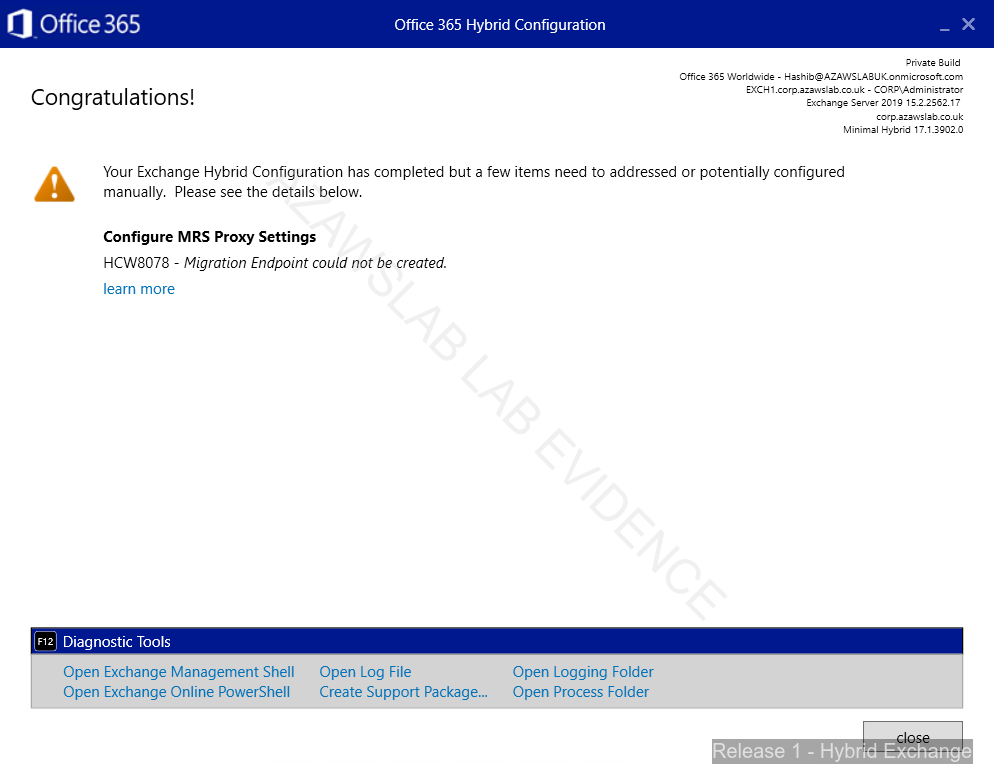

# Hybrid Identity

## Purpose

This document records the hybrid identity design, implementation state, namespace decisions, pilot synchronization scope, migration-readiness path, and final pilot migration outcome for Release 1 of the `azawslab Enterprise Hybrid Security Platform`.

The objective of this phase is to establish a working hybrid identity foundation between on-premises Active Directory and Microsoft Entra ID, while preparing and validating a realistic Exchange hybrid migration path for pilot users.

---

## Release 1 Scope for This Document

This document covers:

- on-premises Active Directory identity source
- Entra Connect Sync on MEM1
- pilot synchronization scope
- namespace design decisions
- pilot licensing and sign-in validation
- dependency relationship between hybrid identity and Exchange hybrid migration
- migration endpoint recovery path
- final pilot migration completion state

It does not claim completion of broader Zero Trust, Intune, or Purview controls unless separately documented in those relevant files.

---

## On-Premises Identity Foundation

The on-premises Active Directory domain for the lab is:

`corp.azawslab.co.uk`

### Domain Controller State

- `DC1` deployed as primary domain controller and DNS server
- `DC2` deployed as additional domain controller and DNS server
- DNS functionality validated
- AD replication validated

### Organizational Design

A tiered OU structure is in place.

Standard pilot users are located under:

`Tier-2 > User Accounts > Standard Users`

This structure supports cleaner administration, pilot scoping, and later governance/control mapping.

---

## Hybrid Identity Design

### Synchronization Host

Microsoft Entra Connect Sync is installed on:

`MEM1`

### Selected Sign-In Method

The selected sign-in method is:

- **Password Hash Synchronization (PHS)**

This was chosen to keep Release 1 practical, support pilot cloud access quickly, and avoid unnecessary authentication complexity during initial hybrid identity rollout.

### Synchronization Scope Controls

The synchronization design uses multiple scope controls:

- OU filtering configured
- group-based filtering configured
- pilot synchronization group:
  - `SG-Pilot-Hybrid-Sync`

This allows the environment to remain controlled and supports pilot-first validation without synchronizing unnecessary identities.

---

## Pilot Identity Scope

The current pilot synchronized users are:

- `u.hashibur`
- `u.finance01`
- `u.hr01`

These users appear in:

- Microsoft 365 admin center
- Microsoft Entra admin center

This confirms that Entra Connect Sync is operational at pilot scope.

---

## Licensing and Sign-In Validation

### Pilot Licensing State

Pilot users were licensed successfully.

### Sign-In Validation State

At least one pilot user successfully signed in to Microsoft 365.

Access was validated using Microsoft 365 web applications such as:

- Designer
- Excel for the web

This confirmed that:

- synchronized identities were present in the tenant
- pilot licensing was functional
- basic cloud access was working

### Outlook on the Web Clarification Before Migration

Outlook on the web initially returned a mailbox-not-found result for pilot users.

This was treated as an expected pre-migration state because the users did not yet have Exchange Online mailboxes. This was not interpreted as a sign-in failure.

---

## Namespace and Identity Design Decisions

The project uses deliberate namespace separation during the pilot phase.

### Root Business Namespace

`azawslab.co.uk`

- remains associated with Zoho
- continues to represent the root business namespace
- is not repointed during the initial hybrid pilot phase

### Hybrid Pilot Namespace

`corp.azawslab.co.uk`

- is the dedicated hybrid pilot namespace
- is used for pilot synchronized users
- is the namespace used for Exchange hybrid and migration work

### Important Clarification

Users such as:

- `u.hr01@corp.azawslab.co.uk`
- `u.finance01@corp.azawslab.co.uk`

are not Zoho mailbox users.

This separation is intentional and avoids disrupting root business mail flow while hybrid work is validated.

---

## Hybrid Messaging Relationship to Identity

Hybrid identity in this phase supports a staged real-world migration approach:

- mailboxes remain on-premises first
- identity and licensing are validated in Microsoft 365
- Exchange hybrid and migration path are built next
- pilot mailbox moves are performed only after migration readiness is confirmed

This avoids creating shortcut cloud mailboxes that would break the intended migration narrative and technical sequence.

---

## Exchange Hybrid Dependency Notes

Hybrid identity work in this phase is tightly linked to the Exchange hybrid build.

### Exchange Source Platform

The on-premises messaging source platform is:

- **Exchange Server Subscription Edition (Exchange SE)**

Hosted on:

- `EXCH1`

### Hybrid Design Decisions Already Locked

The following design choices were made and remained stable through migration completion:

- selected hybrid path: **Modern Hybrid**
- selected HCW mode: **Minimal**
- planned HCW execution host: `EXCH1`
- pilot mailbox move candidates:
  - `u.finance01`
  - `u.hr01`
- validation/admin account:
  - `u.hashibur`
- `azawslab.co.uk` remains on Zoho
- `corp.azawslab.co.uk` is the hybrid migration namespace

---

## HCW and Migration Endpoint Outcome

Hybrid Configuration Wizard progressed through the expected hybrid setup path and configured hybrid services, but initially returned:

`HCW8078 - Migration Endpoint could not be created`

This did not mean the overall hybrid design had failed. It meant the automatic endpoint-creation step did not complete successfully.

### Root Cause Area

Manual testing showed that the remote move path could not establish SSL/TLS trust to:

`mail.corp.azawslab.co.uk`

The issue was not hybrid identity itself. The issue was certificate trust and name coverage on the Exchange side for the final migration path.

### Certificate Resolution

The working configuration used a public-trust SAN certificate covering both:

- `mail.corp.azawslab.co.uk`
- `exch1.corp.azawslab.co.uk`

An earlier certificate for `mail.corp.azawslab.co.uk` still existed, but it was not sufficient by itself for the final migration workflow.

The final working certificate was bound for IIS.

### Additional Hybrid Troubleshooting Steps Already Completed

The following supporting work was already completed during hybrid troubleshooting:

- EWS external URL set to:
  - `https://mail.corp.azawslab.co.uk/EWS/Exchange.asmx`
- MRS Proxy enabled on:
  - `EWS (Default Web Site)`
- Extended Protection adjusted for EWS as follows:
  - `Default Web Site > EWS = Off`
  - `Exchange Back End > EWS = Required`
- `iisreset` completed after changes
- Hybrid Agent validation succeeded

### Recovery Path

After certificate correction, the migration endpoint was created manually in PowerShell and validated successfully.

`Test-MigrationServerAvailability` then succeeded, confirming that the Exchange remote move path was working correctly.

---

## Pilot Migration Outcome

A pilot migration batch was created for:

- `u.finance01@corp.azawslab.co.uk`
- `u.hr01@corp.azawslab.co.uk`

Migration states progressed through synchronization and later completion.

Both pilot users completed remote move migration successfully into Exchange Online mailboxes.

### Post-Migration Validation

Post-migration validation was performed using Outlook on the web.

This confirmed successful mailbox access for pilot users after migration.

### What This Phase Proves

This phase now demonstrates:

- working on-premises AD identity source
- scoped Entra Connect synchronization
- successful pilot licensing and Microsoft 365 sign-in validation
- successful Modern Hybrid configuration
- recovery from HCW automatic endpoint-creation failure
- successful remote move path validation
- successful pilot Exchange Online migration
- post-migration OWA validation for migrated users

---
## MFA, SSPR, and Conditional Access Baseline

After the hybrid identity and pilot migration path were completed, Release 1 moved into the next identity-control layer:

- Self-Service Password Reset (SSPR)
- Multi-Factor Authentication (MFA) registration and enforcement
- Conditional Access (CA) pilot policies
- compliant-device access logic for Microsoft 365 resources

This work was implemented as a controlled pilot rather than a tenant-wide rollout.

### Pilot Scope Groups

The following Microsoft Entra security groups were created for pilot targeting:

- `SG-Pilot-MFA-SSPR-CA`
- `SG-CA-Exclude-BreakGlass`

#### Pilot Control Group

`SG-Pilot-MFA-SSPR-CA` was used to scope pilot users for:

- SSPR enablement
- MFA registration targeting
- Conditional Access policy targeting

Pilot users in this group:

- `u.hashibur`
- `u.finance01`
- `u.hr01`

#### Break-Glass Exclusion Group

`SG-CA-Exclude-BreakGlass` was used to exclude the emergency portal administration account from Conditional Access pilot policies:

- `hashib@azawslabuk.onmicrosoft.com`

In this lab, this account functioned as the emergency access exclusion path for Conditional Access rollout. This should be interpreted as a lab-safe control decision rather than a full production emergency-access design.

### Security Defaults Transition

Before Conditional Access policies were created, Microsoft Entra Security Defaults were disabled.

This was necessary to avoid overlapping enforcement models and to allow pilot Conditional Access policies to be implemented and tested cleanly.

The change was intentional and documented as part of the Conditional Access rollout sequence.

### SSPR Baseline

Self-Service Password Reset was enabled for the pilot identity scope using the selected pilot group:

- target group: `SG-Pilot-MFA-SSPR-CA`

This allowed Release 1 to demonstrate user self-service identity recovery within the pilot scope.

The SSPR baseline was treated as part of the overall identity resilience layer rather than as an isolated feature.

### MFA Registration Baseline

Pilot MFA registration was aligned to the modern Microsoft Entra authentication methods model.

Pilot users were prepared for MFA registration using the pilot identity-control group:

- `SG-Pilot-MFA-SSPR-CA`

This phase focused on:

- controlled pilot targeting
- registration readiness
- secure rollout sequencing before broad enforcement

### Conditional Access Baseline

Conditional Access policies were introduced using a staged rollout model.

The rollout sequence was:

1. Security Defaults disabled
2. pilot groups created
3. Conditional Access policies created in **Report-only**
4. pilot review and live sign-in validation performed
5. policies later switched to **On**

This approach reduced lockout risk and allowed the policy behavior to be checked before enforcement.

### Conditional Access Policies Implemented

#### CA01 — Require MFA for Microsoft Admin Portals

Policy name:

`CA01 - Require MFA - Microsoft Admin Portals - Pilot`

Scope:

- include: `SG-Pilot-MFA-SSPR-CA`
- exclude: `SG-CA-Exclude-BreakGlass`

Target resource:

- Microsoft Admin Portals

Grant control:

- Require multifactor authentication

This policy was used to introduce stronger access control for administrative portal access within pilot scope.

#### CA02 — Require MFA for All Cloud Apps

Policy name:

`CA02 - Require MFA - All Cloud Apps - Pilot`

Scope:

- include: `SG-Pilot-MFA-SSPR-CA`
- exclude: `SG-CA-Exclude-BreakGlass`

Target resource:

- All cloud apps

Grant control:

- Require multifactor authentication

This policy became the broader pilot MFA enforcement layer for cloud access.

#### CA03 — Require Compliant Device for Microsoft 365 Apps

Policy name:

`CA03 Require compliant device for Microsoft 365 apps`

Scope:

- include: `SG-Pilot-MFA-SSPR-CA`
- exclude: `SG-CA-Exclude-BreakGlass`

Target resource:

- Office 365 / Microsoft 365 workload scope

Grant controls configured in the pilot policy:

- Require multifactor authentication
- Require device to be marked as compliant

This policy linked identity access decisions to the endpoint compliance state and formed the first pilot implementation of compliant-device access logic in Release 1.

### Validation Approach

The Conditional Access baseline was not introduced as a blind tenant-wide enforcement change.

Validation included:

- staged rollout using **Report-only**
- pilot user targeting
- break-glass exclusion preservation
- later policy enforcement after review
- live sign-in behavior validation

Some screenshots were captured during the report-only stage because that was the main design and validation phase. Final enforcement was applied afterward and validated through sign-in behavior and access results.

### What This Phase Proves

This identity-control phase now demonstrates:

- staged pilot targeting through Entra security groups
- controlled Security Defaults transition
- SSPR pilot enablement
- MFA registration readiness for pilot users
- Conditional Access policy design using included and excluded groups
- stronger MFA enforcement for admin portals and cloud apps
- compliant-device access logic for Microsoft 365 resources
- reduced lockout risk through explicit break-glass exclusion

### Current Status

The Release 1 hybrid identity layer is no longer limited to synchronization and pilot migration.

It now includes:

- on-premises AD identity source
- scoped Entra synchronization
- pilot licensing and sign-in validation
- successful pilot Exchange migration
- SSPR pilot enablement
- MFA pilot rollout
- Conditional Access pilot enforcement
- compliant-device access logic for Microsoft 365 access

### Remaining Identity-Control Actions

Remaining work in this area is now primarily:

1. final evidence organization
2. sign-in log / Conditional Access result capture where needed
3. final control-mapping refresh in the security and compliance documentation

---

## Current Status

Hybrid identity is operational and complete at pilot scope.

Completed state:

- on-premises AD identity source established
- Entra Connect Sync installed on MEM1
- Password Hash Synchronization configured
- OU filtering configured
- group-based filtering configured using `SG-Pilot-Hybrid-Sync`
- pilot identities synchronized successfully
- pilot licensing completed
- pilot Microsoft 365 sign-in validated
- Modern Hybrid configured
- migration endpoint created successfully through manual recovery path
- pilot mailbox migration completed successfully
- post-migration Outlook on the web access validated

This means hybrid identity is no longer just “ready for migration.” It has now been exercised through a successful pilot migration path.

---

## Remaining Actions

The remaining actions for this hybrid identity phase are now limited to documentation and evidence closeout:

1. consolidate final screenshots and PowerShell evidence
2. update GitHub pages and tracker sheets consistently
3. carry forward lessons learned into later Release 1 security and governance phases

The next major implementation work for Release 1 is no longer mailbox migration. It is the remaining modern workplace, endpoint, security, monitoring, and compliance layers.

---

## Evidence to Capture

The following evidence should be retained in the repository screenshot/evidence set:

- Entra Connect Sync configuration summary on MEM1
- OU filtering configuration
- group-based filtering / `SG-Pilot-Hybrid-Sync`
- synced pilot users in Entra admin center
- synced pilot users in Microsoft 365 admin center
- pilot license assignment
- successful pilot sign-in evidence
- HCW warning evidence showing HCW8078
- migration endpoint creation evidence
- successful `Test-MigrationServerAvailability`
- migration batch and migration user status evidence
- post-migration Outlook on the web validation evidence

---

## Related Documents

- `docs/03-current-state-architecture.md`
- `docs/06-m365-modern-workplace.md`
- `docs/12-lessons-learned.md`
- `docs/13-release1-build-checklist.md`

---

## Flagship Hybrid Identity Evidence

### Scoped synchronization design

*Figure: Entra Connect filtering configuration showing that Release 1 used scoped pilot synchronization rather than broad uncontrolled sync.*

### Pilot users synchronized successfully

*Figure: Pilot synchronized users visible in Microsoft 365 after Entra Connect configuration, proving that the hybrid identity path was functioning successfully.*

### Hybrid migration-readiness validation

*Figure: Successful migration-readiness validation after hybrid trust, certificate coverage, and endpoint configuration were corrected.*

---
## Summary

Release 1 hybrid identity work is complete at pilot scope and has been validated through an end-to-end hybrid migration path.

The environment now has:

- working on-premises AD
- pilot-scoped Entra synchronization
- licensed pilot users
- successful Microsoft 365 sign-in validation
- locked namespace separation for safe pilot work
- Modern Hybrid configuration
- manual migration endpoint recovery
- successful pilot mailbox migration into Exchange Online

The key lesson from this phase is that hybrid identity readiness and successful migration depend not only on synchronization and licensing, but also on correct certificate trust and Exchange migration endpoint validation.
