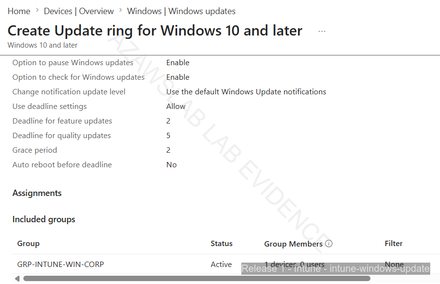

# Endpoint Compliance and Security Baseline

**Navigation:** [README](../README.md) | [Release 1 Build Checklist](16-release1-build-checklist.md) | [Release 1 Final Summary](17-release1-final-summary.md)

**Endpoint docs:** [Endpoint Security and Intune Overview](07-endpoint-security-intune.md) | [Endpoint Platforms and Enrollment](08-endpoint-platforms-and-enrollment.md) | [Advanced Recovery Scenarios](14-advanced-recovery-scenarios.md)

---

## Purpose

This document records the **endpoint control layer** implemented in Release 1 for the `azawslab Enterprise Hybrid Security Platform`.

Where `08-endpoint-platforms-and-enrollment.md` explains how devices entered the managed environment, this document explains how Release 1 began to **govern, assess, and harden** those devices through:

- compliance policy
- Windows security baseline
- BitLocker-related control and recovery implications
- Windows LAPS direction and early implementation state
- identity-protection dependency through Conditional Access and compliant-device logic

This is the document that turns endpoint work from “devices enrolled” into “devices controlled.”

---

## Scope of This Document

This document covers:

- Windows compliance policy baseline
- Windows security baseline
- BitLocker-related control outcomes
- compliant-device logic in the Release 1 pilot
- Windows LAPS direction and pilot implementation state
- the relationship between endpoint state and access control

This document does **not** focus on:
- basic device enrollment
- Linux visibility and Ansible onboarding
- iPhone Company Portal enrollment steps
- the full BitLocker rebuild / stale-record recovery narrative

Those are covered in:

- `08-endpoint-platforms-and-enrollment.md`
- `14-advanced-recovery-scenarios.md`

---

## Release 1 Control Layer in Context

Release 1 endpoint work now has two major layers:

### Layer 1: Enrollment and managed visibility
Devices are brought into:
- Intune
- Microsoft Entra ID

This establishes:
- ownership state
- device presence
- pilot management scope

### Layer 2: Compliance, protection, and access logic
Devices are then evaluated or governed through:
- compliance policy
- security baseline
- BitLocker-related requirements
- Conditional Access dependency on compliant-device state
- future local admin recovery design through Windows LAPS

This second layer is what makes the endpoint story operationally meaningful.

---

## Windows Compliance Policy Baseline

A baseline Windows compliance policy was created in Intune for Release 1 and assigned by group, not by one-off per-device targeting.

### Policy

- `CP-WIN-Release1-Baseline`

### Assigned groups

- `GRP-INTUNE-WIN-CORP`
- `GRP-INTUNE-WIN-BYOD`

### Why Group Assignment Matters

This is important because it reflects a more realistic enterprise operating model.

The compliance baseline was not treated as:
- a one-device test only
- a manual exception workflow
- a temporary direct assignment

Instead, it was scoped to pilot device groups, which is much more credible and easier to expand later.

---

## Baseline Compliance Requirements

The Windows compliance policy required key security conditions such as:

- BitLocker
- Secure Boot
- Trusted Platform Module (TPM)
- Antivirus
- Antispyware
- Microsoft Defender Antimalware

These requirements were meaningful because they connected hardware trust, platform state, and endpoint security posture.

---

## Compliance State Progression

Release 1 compliance should be understood as a **timeline**, not a single static badge.

### Earlier enforcement state

At an earlier stage in testing, Windows devices showed noncompliant states while:

- BitLocker-related enforcement conditions were still being worked through
- policy effects were still being validated
- remediation was not yet fully completed

### Later validated state

A later validated state showed both Windows pilot devices as compliant against:

- `CP-WIN-Release1-Baseline`
- `Default Device Compliance Policy`

### Practical interpretation

The correct way to describe this is:

- the compliance policy was implemented successfully
- enforcement and remediation took place over time
- the final documented pilot state is compliant for the Windows devices

This is more credible than pretending the devices were always compliant from first deployment.

---

## Windows Security Baseline

Release 1 also implemented a Windows security baseline as a second control layer beyond compliance.

### Security baseline

- `SB-WIN-Release1-Baseline`

### Assigned groups

- `GRP-INTUNE-WIN-CORP`
- `GRP-INTUNE-WIN-BYOD`

### Why This Matters

Compliance policy and security baseline are not the same thing.

The compliance policy answers questions like:
- is the device meeting required security conditions?
- is the device eligible for compliant-device logic?

The security baseline is more about:
- hardening direction
- recommended control posture
- moving the device toward a more secure default state

That distinction is important and should be preserved in the project narrative.

---

## Relationship Between Compliance and Security Baseline

Release 1 now shows the beginning of a real endpoint control stack.

### Compliance policy
Used to:
- assess whether the device meets required security conditions
- support device state for access control decisions

### Security baseline
Used to:
- apply a harder Windows posture
- move beyond visibility and enrollment
- support the transition into broader endpoint hardening

### Combined value
Together, these controls show that Release 1 endpoint work is no longer just about registration and device presence. It has now entered the **policy and control enforcement** phase.

---

## BitLocker as a Control and an Operational Dependency

BitLocker became one of the most important Windows security controls in Release 1.

### Why BitLocker mattered

BitLocker was important for two reasons:

1. it contributed directly to compliance and security posture
2. it later became central to the advanced recovery scenario

This is a valuable lesson because some controls are not just “security settings” — they also affect:

- recoverability
- trust state
- device rebuild handling
- local admin recovery needs

### What Release 1 proves

Release 1 proves:
- BitLocker-related policy requirements were part of the endpoint security story
- recovery-key escrow mattered operationally
- BitLocker behavior influenced compliance and recovery handling

The detailed recovery sequence is intentionally moved to:

- `14-advanced-recovery-scenarios.md`

That keeps this document focused on the control layer itself.

---

## Compliant-Device Logic and Conditional Access Relationship

The endpoint control story is stronger because device state was not isolated from identity protection.

Conditional Access pilot policy in Release 1 now uses compliant-device logic for Microsoft 365 pilot scope.

### What this means

This means the project is now showing an important Zero Trust relationship:

- device enrolled
- device assessed
- device state matters
- access control depends on device condition

That is a much more mature story than:
- “we turned on MFA”
- “we enrolled a device”
- “we created a compliance policy”

### Why This Matters

This is one of the strongest enterprise signals in Release 1 because it shows that endpoint state and access control are beginning to work together.

---

## Windows LAPS Direction and Pilot Implementation

Windows LAPS became important because of the recovery lessons discovered during BitLocker and rebuild testing.

### Why LAPS matters in this project

The recovery scenario showed that if:

- cloud trust breaks
- the user is a standard user
- the device is no longer healthy enough for normal management recovery

then local admin recovery becomes much more important.

### Current Release 1 position

At this stage, Release 1 should describe Windows LAPS carefully:

- LAPS is now clearly identified as an important endpoint recovery control
- pilot implementation work has begun
- assignment / policy evidence exists
- password retrieval and deeper operational validation still need to be documented fully before the story is considered complete

### Practical wording

So the correct description is:

- **Windows LAPS direction is established**
- **pilot implementation has begun**
- **full operational validation remains part of the next hardening layer**

That is accurate and avoids overclaiming.

---

## How This Document Fits the Endpoint Story

The endpoint documentation now breaks into three layers:

### `07-endpoint-security-intune.md`
Overview / navigation / lifecycle story

### `08-endpoint-platforms-and-enrollment.md`
How the devices entered the managed environment

### `09-endpoint-compliance-and-security-baseline.md`
How the devices were assessed and hardened

### `14-advanced-recovery-scenarios.md`
What happened when control enforcement met operational recovery reality

This separation is intentional and makes the endpoint work much easier to understand.

---

## Evidence Areas

This document is supported by screenshot evidence under:

- `screenshots/release1/release1-intune/intune-compliance-policy/`
- `screenshots/release1/release1-intune/intune-security-baseline/`
- `screenshots/release1/release1-intune/intune-bitlocker-recovery-scenario/`
- `screenshots/release1/release1-identity-protection/conditional-access/`
- `screenshots/release1/release1-identity-protection/laps/`

The detailed rebuild and stale-record evidence should be emphasized more in `14-advanced-recovery-scenarios.md`.

---

## Diagram Placement Recommendation

This document could support either:

- one compliance/security control diagram
- or one selected screenshot showing policy/baseline assignment and final compliant state

Best current fit:
- keep diagrams mostly in `07` and `14`
- use screenshots here later for control proof

---

## Suggested Embedded Screenshot Strategy

This file should eventually include a small number of high-value screenshots.

Recommended maximum:
- one compliance policy overview screenshot
- one security baseline assignment screenshot
- one final compliant-state screenshot
- optionally one LAPS pilot screenshot

That is enough to prove the control story without turning the page into an image gallery.

---

## Flagship Compliance and Security Evidence

### Compliance policy evaluation

*Figure: Compliance-policy results view showing enforcement and evaluation state during the policy rollout process, illustrating that compliance was validated over time rather than assumed from day one.*

### Security baseline assignment

*Figure: Windows security baseline assigned to the Release 1 pilot device groups, showing that hardening was applied through group-based targeting rather than one-off device configuration.*

### Update ring / patching governance

*Figure: Windows Update for Business pilot assignment showing that patching and update governance were included as part of the Release 1 endpoint-control layer.*

### Endpoint protection and ASR

*Figure: Attack Surface Reduction policy evidence showing that endpoint-protection controls extended beyond compliance and baseline assignment into attack-surface hardening.*

### Restored healthy managed state

*Figure: Restored compliant state after re-enrollment, showing that endpoint control in Release 1 included not only policy assignment but also recovery back to a healthy managed condition.*

---
## Why This Matters Professionally

This document demonstrates that Release 1 endpoint work has moved into a more realistic enterprise control model.

It shows:

- devices were not only enrolled
- they were evaluated against policy
- security hardening baselines were assigned
- compliant-device logic was connected to access control
- recovery lessons influenced later control priorities such as Windows LAPS

That is a stronger signal of real-world endpoint engineering than device enrollment alone.

---

## Summary

Release 1 endpoint controls now include:

- Windows compliance policy
- Windows security baseline
- BitLocker-related security and recovery dependency
- compliant-device logic tied to Conditional Access
- Windows LAPS as an emerging recovery control

This document should remain focused on the **policy and hardening layer** of the endpoint story.

The next endpoint document should explain the **advanced operational recovery scenarios** that emerged from these controls:
- `14-advanced-recovery-scenarios.md`
