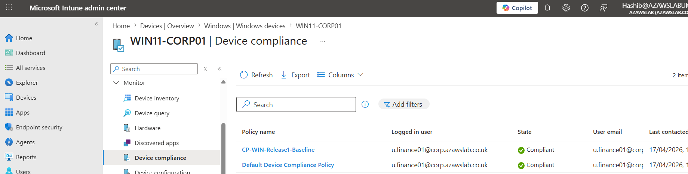

# Monitoring and Alerting

**Navigation:** [README](../README.md) | [Release 1 Build Checklist](16-release1-build-checklist.md) | [Release 1 Final Summary](17-release1-final-summary.md)

**Related docs:** [Hybrid Identity](05-hybrid-identity.md) | [Modern Workplace](06-m365-modern-workplace.md) | [Endpoint Security and Intune Overview](07-endpoint-security-intune.md) | [Information Protection and Purview](10-information-protection-purview.md) | [Security and Compliance Mapping](12-security-compliance-mapping.md)

---

## Purpose

This document records the **monitoring and alerting baseline** for Release 1 of the `azawslab Enterprise Hybrid Security Platform`.

The goal of this workstream is to show how Release 1 moves beyond simple implementation proof and begins to establish operational visibility across:

- identity
- Microsoft 365 administration
- endpoint state
- Conditional Access and compliance outcomes
- information protection controls
- evidence-driven validation and troubleshooting

This document should be read as a **baseline monitoring and visibility page**, not as a claim of a fully mature SOC, SIEM, or enterprise alerting program.

---

## Scope of This Document

This document covers:

- the current monitoring and visibility baseline in Release 1
- what has already been validated through portal evidence
- how monitoring relates to identity, endpoint, and information protection
- what kinds of alerting and review capability are already visible
- what still remains to be implemented for stronger operational maturity

This document does **not** yet claim completion of:

- a fully engineered alert severity model
- formal incident-response playbooks
- Microsoft Sentinel integration
- advanced Defender alerting and investigation workflows
- production-grade security operations maturity

Those are later maturity steps for the platform.

---

## Why Monitoring Matters in Release 1

A hybrid Microsoft platform is not complete if it only shows that:

- services were configured
- devices were enrolled
- controls were assigned
- policies existed in admin portals

It also needs to show that the environment can be:

- observed
- validated
- reviewed
- troubleshot
- improved based on real state

Monitoring matters because it connects implementation to operational confidence.

For Release 1, the monitoring story is currently about **visibility, validation, and next-step readiness**.

---

## Current Monitoring Position in Release 1

Release 1 monitoring is best described as:

### Monitoring baseline established
The project now demonstrates visibility into several important control and platform areas, including:

- user and sync visibility in Entra and Microsoft 365
- device presence and state in Intune and Entra
- compliance-policy result visibility
- Conditional Access policy-state and access-control visibility
- LAPS policy assignment visibility
- Purview protection-policy visibility
- retention-policy baseline visibility
- administrative screenshots and evidence that support validation of platform state

### Full alerting maturity not yet complete
Release 1 still does **not** claim a full monitoring stack with:

- centralized incident workflows
- mature alert routing
- documented severity handling
- broad security analytics correlation
- formalized operational runbooks

That distinction should remain explicit.

---

## Monitoring Baseline Already Demonstrated

### 1. Identity and cloud administration visibility

The project already demonstrates visibility for:

- synchronized users in Microsoft Entra ID
- pilot users in Microsoft 365 admin views
- Microsoft 365 access validation
- Conditional Access configuration and pilot policy state
- MFA and SSPR pilot configuration evidence

This creates a baseline identity-monitoring story even before a more formal log-review process is documented.

### 2. Endpoint visibility

Endpoint monitoring is one of the strongest current monitoring layers in Release 1.

Evidence now exists for visibility into:

- Windows corporate device state
- Windows BYOD device state
- Ubuntu Linux device presence
- iPhone BYOD device presence
- ownership distinction in Intune
- compliance-state progression
- security baseline assignment state
- stale and duplicate device records during rebuild/recovery scenarios
- LAPS policy assignment status

This means the environment can already answer practical operational questions such as:

- what devices exist
- which user they belong to
- which devices are compliant
- which devices have entered an unhealthy or stale state
- which pilot controls are being applied successfully

### 3. Protection-control visibility

Release 1 also demonstrates visibility into protection outcomes through:

- compliance policy results
- Windows security baseline assignment
- BitLocker recovery-key escrow usage
- DLP policy-tip behavior
- sensitivity-label publication and application
- retention-policy presence and baseline configuration visibility

This is important because it shows that monitoring in Release 1 is not limited to identity and devices. It is beginning to cover content-protection controls as well.

---

## Monitoring as Validation, Not Just Logging

A useful way to describe Release 1 monitoring is:

### Monitoring through validation checkpoints

The project already demonstrates operational visibility through evidence-backed validation points such as:

- Entra Connect results visible in cloud admin views
- migrated mailboxes visible and usable in Exchange Online / OWA
- Teams and SharePoint pilot-user actions visibly succeeding
- Intune device state visible after enrollment
- compliance state visible after policy application
- Conditional Access policy and pilot-scope logic visible in Entra
- Purview label, DLP, and retention-policy state visible in admin views
- stale device records visible during recovery cleanup

This is not the same as a mature monitoring platform, but it is still a meaningful operational visibility layer.

---

## Entra and Identity Monitoring Direction

The most natural identity-monitoring path in this project is through Microsoft Entra.

### What is already visible
- synchronized user state
- policy-targeting evidence
- MFA / SSPR / Conditional Access pilot configuration
- basic identity administration visibility

### What still needs to mature
- structured sign-in log review examples
- risky or failed sign-in investigation examples
- clearer Conditional Access result review examples
- documented identity-alert examples

So the correct way to describe Entra monitoring in Release 1 is:

- identity administration visibility exists
- identity-monitoring maturity is still developing

---

## Endpoint Monitoring Direction

Endpoint monitoring is currently the strongest operational monitoring area in the repo.

### What is already visible
- managed-device inventory
- ownership state
- compliance-state changes
- security baseline assignment visibility
- device duplication / stale-object behavior in recovery scenarios
- LAPS policy assignment status

### Why this matters
This already supports real operational thinking around:

- device inventory accuracy
- compliance review
- policy validation
- lifecycle management
- recovery-state troubleshooting

That is stronger than simply saying “Intune is enabled.”

---

## Information Protection Monitoring Direction

Monitoring in Release 1 now also touches the information-protection layer.

### Current visibility
The current Purview-related evidence supports visibility into:

- sensitivity-label structure
- label publication to pilot scope
- label application in Office workflow
- DLP policy existence
- DLP policy-tip triggering in Word
- retention-policy baseline presence

### Why this matters
This means the platform is beginning to show monitoring/visibility not only for:
- users
- devices
- access

but also for:
- labeled content
- sensitive-data detections
- policy-trigger behavior
- retention-control presence

That broadens the operational maturity story significantly.

---

## Alerting Position in Release 1

Alerting should still be described carefully.

### What Release 1 now supports
Release 1 now supports the **foundation for alerting and review**, because it has:

- policy state visibility
- device state visibility
- identity-control visibility
- content-protection visibility
- evidence-backed admin views that can support triage thinking

### What Release 1 does not yet prove
Release 1 does not yet prove a fully engineered alerting model such as:

- defined alert rules with severity categories
- formal notification routing
- response ownership model
- documented triage / escalation workflow
- integrated incident handling

That work remains part of later Release 1 maturity or future release expansion.

---

## Monitoring Relationship to Other Workstreams

Monitoring in this project is a **cross-cutting operational layer**.

### Hybrid identity
Monitoring supports:
- sync visibility
- pilot-user verification
- policy-targeting visibility
- identity-control maturity planning

### Modern workplace
Monitoring supports:
- mailbox and collaboration validation
- admin-side visibility into service readiness
- confirmation of successful pilot-user outcomes

### Endpoint
Monitoring already supports:
- inventory review
- compliance-state review
- lifecycle-state troubleshooting
- rebuild / stale-record observation

### Information protection
Monitoring now supports:
- label publication awareness
- label-application validation
- DLP detection visibility
- retention-policy presence and baseline configuration awareness

That cross-cutting role is why monitoring is such an important next maturity layer.

---

## Release 1 Monitoring Maturity Model

The cleanest way to describe current maturity is:

### Current baseline
- administrative visibility exists
- control-outcome evidence exists
- endpoint-state visibility exists
- identity-control visibility exists
- information-protection policy visibility exists

### Near-term next maturity
- Entra sign-in log review
- audit-log review examples
- Conditional Access result validation examples
- documented alert examples
- clearer monitoring screenshots and evidence mapping

### Later maturity
- broader Defender alerting
- Sentinel / centralized monitoring
- stronger incident workflow and triage depth
- deeper operational correlation across identity, endpoint, and content controls

---

## What Should Be Added Next

The next monitoring priorities should be:

### Identity monitoring
- Entra sign-in log evidence
- risky / failed sign-in review examples
- Conditional Access result review evidence

### Administrative auditing
- audit-log baseline
- evidence of admin/configuration event review

### Endpoint monitoring
- compliance review workflow examples
- configuration / patching state visibility once implemented
- LAPS operational-state review after password retrieval validation

### Information-protection monitoring
- DLP event review
- label-usage awareness
- retention-policy review evidence
- correlation between user workflow and protection policies where useful

---

## Evidence Areas

The current monitoring baseline is supported by evidence across several areas of the repo, especially:

- `screenshots/release1/release1-entra/`
- `screenshots/release1/release1-entra-sync/`
- `screenshots/release1/release1-m365/`
- `screenshots/release1/release1-intune/`
- `screenshots/release1/release1-identity-protection/`
- `screenshots/release1/release1-purview/`

These provide the visibility story even before a dedicated alerting evidence pack is fully engineered.

---

## Diagram Placement Recommendation

This page does not need a standalone major diagram immediately.

Best later options:
- use the main Release 1 architecture diagram in README and overview docs
- embed one or two selected screenshots here to show real monitoring visibility
- optionally add a small “visibility and alerting direction” flow later if the page needs it

For now, content clarity matters more than creating another diagram.

---

## Suggested Embedded Screenshot Strategy

This file should stay selective.

Recommended maximum for a later final pass:
- one Entra or Microsoft 365 visibility screenshot
- one Intune device-state / compliance screenshot
- one Purview DLP or retention-policy screenshot

That is enough to support the story without overstating monitoring maturity.

---

## Flagship Monitoring Evidence

### Sign-in visibility and Conditional Access result review

*Figure: Microsoft Entra sign-in review showing Conditional Access result visibility for the pilot identity-protection model.*

### Audit-log baseline

*Figure: Microsoft Entra audit-log overview used to establish the Release 1 administrative review and change-visibility baseline.*

### Endpoint visibility and compliance state

*Figure: Intune device-compliance status view showing operational visibility into managed endpoint state.*

### Example alert / monitoring signal

*Figure: Example monitoring signal from Intune dashboard views, showing how Release 1 monitoring extends into device-configuration and operational health awareness.*

---
## Why This Matters Professionally

This document is important because it shows architectural honesty.

It does not pretend that Release 1 already has a full SOC or mature enterprise alerting program. Instead, it shows:

- where operational visibility already exists
- where the current monitoring baseline is strong
- how monitoring now spans identity, endpoint, and information protection
- what still needs to be implemented next

That is a more credible and professional presentation than overstating monitoring maturity.

---

## Summary

Release 1 now demonstrates a **monitoring and visibility baseline**, not yet a fully mature alerting program.

What already exists is:

- identity and cloud-admin visibility
- endpoint inventory and compliance visibility
- control-outcome visibility across endpoint and information-protection workflows
- recovery visibility through rebuild and stale-object scenarios
- Purview visibility across labels, DLP, and retention baseline

What still needs to be built is:

- structured sign-in log review
- audit-log baseline
- example alert configurations
- stronger operational monitoring documentation
- later integration with broader security-monitoring tooling

That is the correct and credible monitoring position for Release 1.
