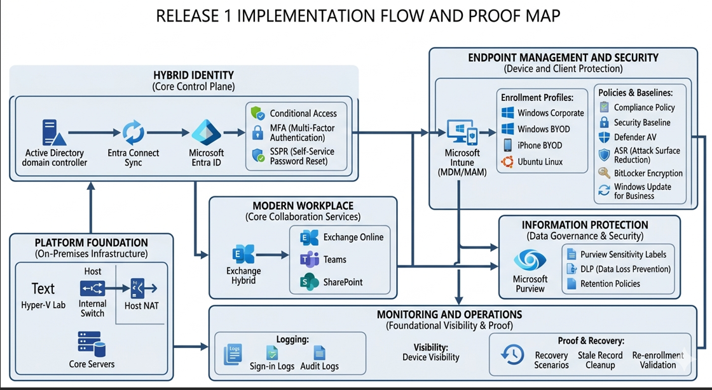

# Release 1 Build Checklist

## Purpose

This checklist is the authoritative task-state tracker for Release 1 of the `azawslab Enterprise Hybrid Security Platform`.

Release 1 focuses on building the hybrid identity, messaging, Microsoft 365, endpoint, security, compliance, and monitoring foundations required for a realistic enterprise-style hybrid platform.

This file reflects actual implementation state, not just original planning.

---

## Release 1 Implementation Flow

---

## Release 1 Scope Summary

Release 1 includes:

- Hyper-V-based on-premises foundation
- Active Directory with DC1 and DC2
- tiered OU structure, users, and groups
- member server build
- Exchange Server Subscription Edition (Exchange SE) source platform
- Microsoft 365 tenant onboarding
- Entra Connect pilot synchronization
- pilot licensing and cloud sign-in validation
- Modern Hybrid readiness and pilot migration path
- Exchange Online, Teams, and SharePoint baseline
- Intune endpoint administration
- Windows, Linux, and iPhone BYOD management scenarios
- Zero Trust baseline controls
- Defender / endpoint protection controls
- information protection controls
- monitoring and alerting baseline
- compliance mapping and implementation evidence

---

## Status Key

- **Completed** = built, validated, and ready to document with evidence
- **In Progress** = actively implemented, partially working, or under documentation/evidence refinement
- **Pending** = not yet started or intentionally sequenced later in Release 1

---

## 1. Core On-Premises Foundation

| Item | Status | Notes |
|---|---|---|
| Hyper-V lab foundation prepared | Completed | Primary lab platform in use |
| Internal switch `AZAWSLAB-Internal` configured | Completed | Internal lab network in place |
| Host NAT enabled | Completed | Supports connectivity from the lab |
| Base image prepared for Windows Server deployment | Completed | Evidence captured in screenshots |
| AD DS domain created: `corp.azawslab.co.uk` | Completed | Core identity source established |
| `DC1` deployed | Completed | Primary DC / DNS |
| `DC1` promotion completed | Completed | AD DS and DNS operational |
| `DC1` health validation completed | Completed | Includes `dcdiag` / DNS validation evidence |
| `DC2` deployed | Completed | Additional DC / DNS |
| `DC2` promotion completed | Completed | Additional domain controller operational |
| DNS validation completed | Completed | Name resolution validated |
| AD replication validated | Completed | Includes `repadmin` / replication checks |
| Tiered OU structure implemented | Completed | Supports cleaner identity governance |
| Standard users created | Completed | Located under `Tier-2 > User Accounts > Standard Users` |
| Baseline groups created | Completed | Includes pilot sync group scope |
| Pilot sync group `SG-Pilot-Hybrid-Sync` configured | Completed | Used for scoped synchronization |

---

## 2. Member Server and Exchange Source Platform

| Item | Status | Notes |
|---|---|---|
| `MEM1` deployed and domain joined | Completed | Hosts Entra Connect Sync |
| `EXCH1` deployed and domain joined | Completed | Exchange source host |
| Exchange Server Subscription Edition installed on `EXCH1` | Completed | Exchange SE, not Exchange 2019 |
| Exchange prerequisites completed | Completed | Evidence captured in Exchange build screenshots |
| Exchange administration access validated | Completed | Exchange Admin Center accessible |
| On-premises pilot mailboxes prepared | Completed | Pilot mailboxes created and validated |
| Pilot mailbox candidates confirmed | Completed | `u.finance01`, `u.hr01` |
| Validation/admin account confirmed | Completed | `u.hashibur` |

---

## 3. Microsoft 365 Tenant and Namespace Onboarding

| Item | Status | Notes |
|---|---|---|
| Microsoft 365 tenant created | Completed | `AZAWSLABUK.onmicrosoft.com` |
| Cloud admin account established | Completed | `Hashib@AZAWSLABUK.onmicrosoft.com` |
| `azawslab.co.uk` added to tenant | Completed | Root business namespace |
| `corp.azawslab.co.uk` added to tenant | Completed | Dedicated hybrid pilot namespace |
| Domain verification completed | Completed | Evidence captured in M365 screenshots |
| Namespace separation decision documented | Completed | Root stays with Zoho, subdomain used for hybrid pilot |
| Root namespace mail flow preserved on Zoho | Completed | Avoids disruption during pilot hybrid work |

---

## 4. Hybrid Identity

| Item | Status | Notes |
|---|---|---|
| Entra Connect installed on `MEM1` | Completed | Sync host established |
| Password Hash Synchronization configured | Completed | Selected sign-in method |
| OU filtering configured | Completed | Pilot-scoped sync design |
| Group-based filtering configured | Completed | Uses `SG-Pilot-Hybrid-Sync` |
| Optional sync features reviewed/configured | Completed | Evidence captured in Entra Connect flow |
| Pilot users synchronized to tenant | Completed | `u.hashibur`, `u.finance01`, `u.hr01` |
| Pilot users visible in Entra admin center | Completed | Sync validated |
| Pilot users visible in Microsoft 365 admin center | Completed | Sync validated |
| Pilot licenses assigned | Completed | Licensing completed |
| Pilot cloud sign-in validated | Completed | At least one pilot user validated |
| Microsoft 365 web app access validated | Completed | Includes apps such as Designer / Excel web |
| Outlook on the web pre-migration behavior reviewed | Completed | Mailbox-not-found treated as expected pre-migration state |
| Entra admin role separation fully documented | Completed | Technical implementation complete enough for pilot scope; wording and final presentation can still improve |

---

## 5. Exchange Hybrid Readiness

| Item | Status | Notes |
|---|---|---|
| Hybrid path decision finalized | Completed | Modern Hybrid |
| HCW mode finalized | Completed | Minimal |
| HCW execution host selected | Completed | `EXCH1` |
| Hybrid Agent installation completed | Completed | Installed during HCW flow |
| Hybrid Agent registration completed | Completed | Registered successfully |
| Hybrid Agent validation succeeded | Completed | Validation passed after troubleshooting |
| EWS external URL set correctly | Completed | `https://mail.corp.azawslab.co.uk/EWS/Exchange.asmx` |
| MRS Proxy enabled | Completed | Enabled on EWS |
| Extended Protection adjustments completed | Completed | Default Web Site EWS off, Back End EWS required |
| IIS reset completed after changes | Completed | Applied during troubleshooting |
| HCW hybrid configuration phase completed | Completed | Hybrid services configured |
| HCW warning HCW8078 recorded | Completed | Automatic migration endpoint creation failed |
| Certificate trust and name coverage corrected | Completed | Final working SAN cert covered `mail` and `exch1` |
| Migration endpoint creation | Completed | Completed manually after HCW warning |
| Remote move readiness validation | Completed | `Test-MigrationServerAvailability` succeeded |

---

## 6. Pilot Mailbox Migration

| Item | Status | Notes |
|---|---|---|
| Pilot migration scope confirmed | Completed | `u.finance01`, `u.hr01` |
| Exchange Online target readiness validated | Completed | Endpoint and remote move path validated |
| Migration endpoint manually verified or created | Completed | Manual PowerShell recovery path used |
| Pilot migration batch created | Completed | Batch created successfully |
| Pilot migration batch synchronization observed | Completed | Sync state evidenced in screenshots |
| Pilot remote move for `u.finance01` | Completed | Migration completed |
| Pilot remote move for `u.hr01` | Completed | Migration completed |
| Migration completion state validated | Completed | User and batch completion screenshots captured |
| Post-migration mailbox access validation | Completed | Outlook on the web validated |
| Post-migration coexistence validation | Completed | Pilot mailbox access proven; broader coexistence and mail-routing validation can be extended later |

---

## 7. Microsoft 365 Workload Baseline

| Item | Status | Notes |
|---|---|---|
| Exchange Online admin readiness | Completed | Tenant and migration path working |
| Exchange Online pilot mailbox service validation | Completed | Pilot users validated post-migration |
| Teams baseline | Completed | Pilot scope validated |
| Teams chat and channel collaboration | Completed | Posts, replies, direct chat, and file sharing validated |
| Teams meeting scheduling baseline | Completed | Meeting/calendar validation completed |
| SharePoint baseline | Completed | Pilot scope validated |
| SharePoint site access validation | Completed | Site and membership visible |
| SharePoint document library validation | Completed | Library browsing and access validated |
| SharePoint file upload and open test | Completed | Upload and file-open confirmed |
| Microsoft 365 admin setup documentation | Completed | Exchange, Teams, and SharePoint progress reflected; final presentation alignment still needed |

---

## 8. Endpoint Administration and Intune

| Item | Status | Notes |
|---|---|---|
| Intune enrollment baseline | Completed | Tenant-side baseline enabled |
| EMS E5 licensing path for Intune capability | Completed | Trial activated and assigned |
| Apple MDM Push Certificate prerequisite | Completed | Required for iOS/iPadOS enrollment |
| Windows 11 managed corporate device scenario | Completed | `WIN11-CORP01` visible and compliant |
| Windows 11 BYOD / personal scenario | Completed | `WIN11-BYOD01` visible and compliant |
| Corporate vs personal ownership distinction | Completed | Both scenarios visible in Intune |
| Linux Intune enrollment scenario | Completed | Ubuntu device visible in Entra and Intune |
| Linux Intune Agent validation | Completed | Agent launch and enrollment flow evidenced |
| iPhone BYOD enrollment scenario | Completed | iPhone visible in Entra and Intune |
| iPhone / iOS compliance validation | Completed | iPhone shown compliant in Intune |
| Windows joined vs registered comparison | Completed | Initial distinction visible; deeper comparison can be expanded |
| Compliance policy baseline | Completed | Windows compliance policy implemented and evaluated across corp/BYOD devices |
| Configuration profile baseline | Completed | Windows configuration profile baseline implemented and evidenced |
| Update rings / patching baseline | Completed | Windows update ring / patching baseline implemented and evidenced |
| Android BYOD / MAM scenario | Pending | Not yet started |
| Linux support path documentation | Completed | Endpoint documentation now includes Linux path |
| Ansible baseline for Linux | Completed | Connectivity, syntax check, baseline playbook execution, and repo files validated |

---

## 9. Endpoint Security and Zero Trust

| Item | Status | Notes |
|---|---|---|
| MFA baseline | Completed | Pilot rollout implemented through Authentication Methods plus Conditional Access-targeted pilot scope |
| Self-Service Password Reset (SSPR) baseline | Completed | Enabled for selected pilot users through `SG-Pilot-MFA-SSPR-CA` |
| Conditional Access baseline | Completed | CA01, CA02, and CA03 created; piloted in report-only and moved toward enforced pilot control |
| Compliant-device access logic | Completed | Office 365 pilot policy requires compliant device and MFA |
| Unmanaged-device access test | Completed | Core compliant-device policy exists; broader negative-path validation can be extended |
| Windows security baseline | Completed | `SB-WIN-Release1-Baseline` assigned to corp and BYOD groups |
| BitLocker policy / disk encryption validation | Completed | Encryption-related policy path tested with recovery observations |
| BitLocker escrow and recovery-key validation | Completed | Recovery key retrieval and recovery workflow evidenced |
| BitLocker recovery and re-enrollment scenario | Completed | Advanced lab scenario documented through rebuild and stale-record cleanup evidence |
| Windows LAPS design decision | Completed | Control requirement now identified clearly through recovery lessons and pilot hardening work |
| Windows LAPS policy implementation | Completed | Pilot LAPS policy created and assigned successfully |
| Windows LAPS password backup validation | In Progress | LAPS policy is implemented, but password retrieval workflow is not yet fully evidenced in the current Windows build path |
| Windows LAPS recovery scenario validation | In Progress | LAPS recovery value is established conceptually, but a full retrieval-and-recovery validation path is not yet evidenced |
| Defender / endpoint protection baseline | Completed | Defender baseline implemented and evidenced |
| Antivirus / policy review | Completed | Antivirus policy baseline reviewed and evidenced |
| ASR rules baseline | Completed | Attack Surface Reduction baseline implemented and evidenced |
| Ransomware resilience controls | Completed | Ransomware resilience controls implemented at Release 1 scope |

---

## 10. Information Protection

| Item | Status | Notes |
|---|---|---|
| Sensitivity labels | Completed | Public, Internal, and Confidential label structure created and validated |
| Label publishing policy baseline | Completed | Publishing policy scoped to pilot users/groups |
| DLP baseline | Completed | U.K. Financial Data pilot DLP policy created and validated |
| Sensitive Information Types usage | Completed | Built-in financial data detection used in pilot DLP validation |
| Retention policy baseline | Completed | Retention-policy baseline created and visible in Purview administration |
| Document fingerprinting example | Pending | Feature availability / role readiness still needs to be confirmed before evidence can be captured |
| Purview evidence capture | Completed | Label, publishing, DLP, and retention screenshots captured |

---

## 11. Monitoring and Alerting

| Item | Status | Notes |
|---|---|---|
| Entra identity administration visibility baseline | Completed | Pilot identity and policy visibility evidenced in Entra admin views |
| Endpoint visibility baseline | Completed | Device presence, ownership, and state evidenced across Intune and Entra |
| Purview protection visibility baseline | Completed | Labels, DLP, and retention-policy visibility evidenced |
| Entra sign-in log visibility baseline | Completed | Sign-in log visibility baseline implemented and evidenced |
| Audit log baseline | Completed | Audit log baseline implemented and evidenced |
| Conditional Access result visibility baseline | Completed | Conditional Access result visibility baseline implemented and evidenced |
| Example alert configuration | Completed | Example alert configuration implemented and evidenced |
| Monitoring documentation | Completed | Monitoring baseline documented and aligned to evidence |

---

## 12. Security and Compliance Mapping

| Item | Status | Notes |
|---|---|---|
| Release 1 control mapping structure created | Completed | Mapping document exists |
| Hybrid identity controls reflected in mapping | In Progress | Mapping structure exists, but final evidence-linked refresh is still pending |
| Messaging / hybrid readiness controls reflected in mapping | In Progress | Mapping structure exists, but final evidence-linked refresh is still pending |
| Endpoint / Zero Trust / Purview controls reflected | In Progress | Endpoint and Purview baseline are implemented, but the final evidence-linked mapping pass is still pending |
| Final evidence-linked mapping pass | Pending | End-of-release task |

---

## 13. Evidence and Documentation Closeout

| Item | Status | Notes |
|---|---|---|
| Hyper-V base image evidence captured | Completed | Evidence exists in screenshot tree |
| Core AD/DNS evidence captured | Completed | DC1 / DC2 build and validation screenshots present |
| OU / identity evidence captured | Completed | OU, groups, and pilot sync group evidenced |
| M365 tenant evidence captured | Completed | Domain verification and onboarding screenshots present |
| Entra Connect and sync evidence captured | Completed | Sync configuration and pilot user evidence present |
| Exchange source evidence captured | Completed | EXCH1 build and EAC screenshots present |
| Teams baseline evidence captured | Completed | Screenshots committed under Teams evidence path |
| SharePoint baseline evidence captured | Completed | Screenshots committed under SharePoint evidence path |
| Intune baseline evidence captured | Completed | Tenant baseline and Windows evidence committed |
| Linux Intune evidence captured | Completed | Ubuntu / Intune Agent / device visibility evidence committed |
| iOS / iPhone BYOD evidence captured | Completed | Apple MDM push certificate, enrollment flow, Entra visibility, and Intune compliance evidence committed |
| Ansible evidence captured | Completed | Project structure, playbook, ping, syntax check, run evidence, and repo files committed |
| Windows compliance policy evidence captured | Completed | Policy creation, assignments, per-device results, and settings detail evidence committed |
| Update ring and configuration profile evidence captured | Completed | Windows update ring and configuration profile evidence committed |
| Windows security baseline evidence captured | Completed | Baseline assignment, Defender, antivirus, ASR, and ransomware-resilience evidence committed |
| BitLocker recovery scenario evidence captured | Completed | Recovery prompt, key retrieval, trust break, duplicate records, cleanup, and restored state evidenced |
| Identity protection evidence captured | Completed | MFA, SSPR, Conditional Access, and LAPS policy implementation evidence captured |
| Purview evidence captured | Completed | Labels, publishing, DLP, and retention evidence captured |
| Monitoring evidence captured | Completed | Monitoring evidence captured for sign-in visibility, audit baseline, CA results, and alert example |
| Diagrams committed | Completed | Release 1 architecture, control flow, recovery scenario, and roadmap diagrams available |
| Pilot licensing and sign-in evidence captured | Completed | Some evidence exists; final organization may still improve |
| HCW warning evidence captured | Completed | HCW8078 screenshots captured |
| Migration endpoint evidence captured | Completed | Manual endpoint creation captured |
| Migration validation evidence captured | Completed | `Test-MigrationServerAvailability` success captured |
| Pilot batch and migration completion evidence captured | Completed | Batch, user, and completion state captured |
| Post-migration Outlook validation evidence captured | Completed | OWA evidence captured |
| `README.md` status updated | In Progress | Final monitoring and Purview-retention wording alignment still needed |
| `docs/06-m365-modern-workplace.md` updated | In Progress | Collaboration baseline updated; may need final wording alignment |
| `docs/07-endpoint-security-intune.md` updated | In Progress | Refactored as endpoint overview/navigation page; final polish still needed |
| `docs/10-information-protection-purview.md` updated | In Progress | Labels and DLP updated; retention baseline now needs alignment |
| `docs/11-monitoring-alerting.md` updated | In Progress | Monitoring baseline now documented; final evidence alignment still needed |
| `docs/15-lessons-learned.md` updated | In Progress | Endpoint/Linux/Ansible/iPhone/BitLocker lessons updated; final numbering alignment still needed |
| This checklist updated | In Progress | Use this file as authoritative status page |
| Excel tracker aligned with GitHub | In Progress | Realignment work underway |

---

## Immediate Next Actions

The next correct execution sequence is:

1. complete the final documentation pass for:
   - `10-information-protection-purview.md`
   - `11-monitoring-alerting.md`
   - `17-release1-final-summary.md`
2. complete the final recruiter/public presentation pass for:
   - `README.md`
   - quick links
   - selected embedded diagrams and screenshots
3. complete remaining Release 1 hardening and validation tasks for:
   - Windows LAPS password retrieval validation
   - Windows LAPS recovery validation
   - Defender / endpoint hardening
   - update rings / configuration profiles
   - audit-log baseline
   - example alert configuration
   - document fingerprinting

---

## Current Release 1 Summary

### Completed

- Hyper-V foundation
- core AD / DNS
- member server build
- Exchange Server Subscription Edition source build
- pilot mailbox preparation
- Microsoft 365 tenant setup
- Entra Connect pilot sync
- pilot licensing and sign-in validation
- Modern Hybrid configuration
- certificate correction and migration endpoint recovery
- migration path validation
- pilot mailbox migration for selected users
- post-migration Outlook on the web validation
- Teams baseline at pilot scope
- SharePoint baseline at pilot scope
- Intune baseline at tenant scope
- Windows corporate and BYOD endpoint scenarios
- Linux Intune enrollment scenario
- Linux baseline automation with Ansible
- iPhone BYOD enrollment scenario
- MFA, SSPR, and Conditional Access pilot baseline
- Windows compliance policy baseline
- Windows security baseline
- Purview sensitivity labels, DLP, and retention baseline
- BitLocker recovery and re-enrollment scenario

### Current Active Phase

- Release 1 documentation and evidence closeout
- endpoint documentation refactor for cleaner public presentation
- monitoring evidence alignment and final monitoring write-up
- final recruiter/public repo polish
- remaining hardening work across LAPS validation, Defender, monitoring depth, and document fingerprinting

### Next Milestone

- complete the Release 1 closeout pack and then transition into the next maturity layer for endpoint hardening, monitoring, and Release 2 planning

---

## Notes

This checklist should remain aligned to actual implementation state.

Do not downgrade completed work back to planning language, and do not mark later security or modern workplace controls as implemented until evidence exists.

