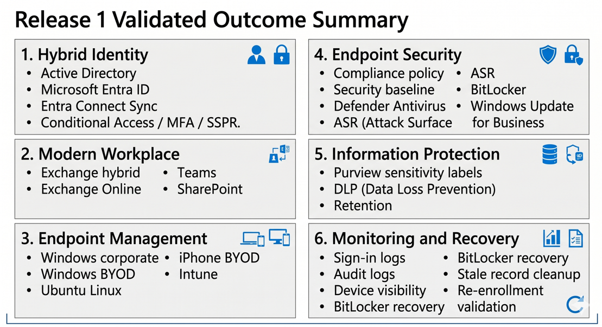
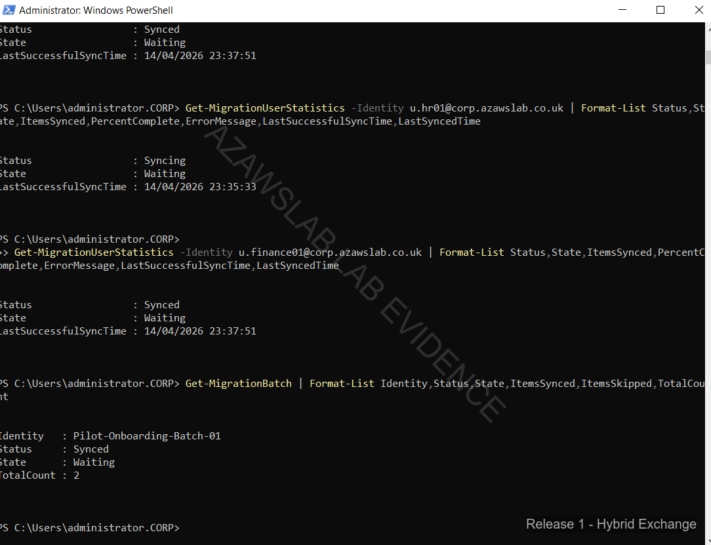
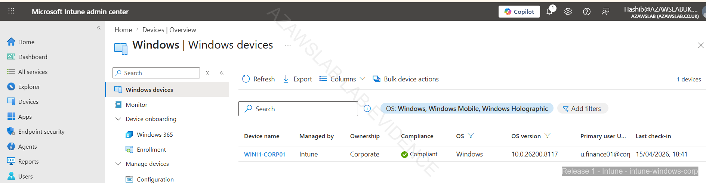

# Release 1 Summary

Release 1 establishes the hybrid Microsoft foundation of the platform across identity, messaging, collaboration, endpoint management and security, information protection, monitoring, and recovery.

This phase is the most complete and most strongly evidenced part of the project. It is intended to prove that the platform is not just configured, but **validated, supportable, and recoverable** under realistic operational conditions.

---

## What Release 1 Achieved

Release 1 delivered a connected hybrid platform spanning:

- Active Directory to Microsoft Entra ID synchronization with controlled pilot scope
- Exchange hybrid migration readiness and successful pilot mailbox validation
- Microsoft 365 collaboration baseline across Exchange Online, Teams, and SharePoint
- Intune-based endpoint onboarding across Windows corporate, Windows BYOD, Ubuntu Linux, and iPhone BYOD scenarios
- Endpoint compliance and security controls using compliance policy, security baseline, Defender Antivirus, ASR, BitLocker controls, and update management
- Purview baseline with sensitivity labels, DLP policy-tip validation, and retention configuration
- Monitoring and operational visibility through sign-in logs, audit logs, control review, and device-state visibility
- Recovery handling for BitLocker escrow, device rebuild, duplicate/stale record cleanup, and restored compliant state

---

## Why This Matters

From an engineering and operations perspective, Release 1 demonstrates:

- **risk reduction** through trusted-device enforcement, endpoint compliance, and identity controls
- **control maturity** through connected identity, endpoint, and information protection baselines
- **supportability** through monitoring, recovery procedures, and evidence-backed validation
- **delivery discipline** through phased scoping, pilot-first validation, and honest treatment of deferred work

This makes Release 1 the strongest portfolio slice for roles involving Modern Workplace administration, Intune, hybrid identity, Microsoft 365 operations, and support-oriented Microsoft infrastructure engineering.

---

## Release 1 at a Glance

*Release 1 implementation flow and proof map showing how platform foundation, hybrid identity, modern workplace services, endpoint management, information protection, and operational validation connect across the release.*

---

## Flagship Evidence

### 1. Exchange Hybrid Validation

*Pilot mailbox validation showing successful post-migration access and confirming that Exchange hybrid connectivity, mail flow, and user access were working as intended for the controlled pilot.*

### 2. Intune-Managed Corporate Endpoint in Compliant State

*Corporate Windows endpoint shown as compliant in Intune, demonstrating that the endpoint onboarding, policy application, and compliance-state evaluation path was functioning correctly.*

### 3. Purview DLP User-Facing Enforcement

*Purview DLP policy-tip validation in Microsoft Word, demonstrating that information protection controls were not only configured, but also visible and enforceable at the user interaction layer.*

---

## Key Operational Insight

One of the strongest aspects of Release 1 is that it includes non-happy-path recovery rather than only first-time setup success.

The most important example is the BitLocker recovery and re-enrollment scenario:
- a trust break was induced
- the recovery key was retrieved from the cloud record
- the device was rebuilt and re-enrolled
- stale and duplicate records were reviewed and cleaned up
- compliant state was restored

This matters because it proves that endpoint controls were not only deployable, but also supportable when the device lifecycle became messy.

Related document:
- [Recovery Scenarios](06-recovery-scenarios.md)

Related evidence:
- `../../screenshots/release1/endpoint-management/intune/intune-bitlocker-recovery-scenario/`

---

## Delivery Highlights by Domain

| Domain | What was validated | Primary doc |
| :--- | :--- | :--- |
| Hybrid Identity | Controlled synchronization, Entra integration, pilot scope filtering | [Hybrid Identity](01-hybrid-identity.md) |
| Modern Workplace | Exchange hybrid validation, Teams and SharePoint baseline | [Modern Workplace](02-modern-workplace.md) |
| Endpoint Management | Device onboarding across corp, BYOD, Linux, and iPhone paths | [Endpoint Enrollment](04-endpoint-enrollment.md) |
| Endpoint Security | Compliance policy, security baseline, Defender AV, ASR, BitLocker, WUfB | [Endpoint Compliance and Security](05-endpoint-compliance-and-security.md) |
| Recovery | BitLocker recovery, rebuild, stale record cleanup, restored compliance | [Recovery Scenarios](06-recovery-scenarios.md) |
| Information Protection | Labels, DLP, retention | [Purview](07-purview.md) |
| Monitoring | Sign-in logs, audit logs, control visibility, device state | [Monitoring](08-monitoring.md) |

---

## Scope Boundaries

Release 1 is intentionally strong on the implemented hybrid Microsoft foundation, but it does **not** claim full maturity in every adjacent area.

The following remain deferred or carefully scoped:
- Android BYOD / MAM validation
- Windows Autopilot / ESP optimization
- advanced Purview capabilities such as document fingerprinting or larger-scale automation
- full enterprise PKI / AD CS deployment
- broader Azure platform security engineering reserved for Release 2
- secure workload modernization capabilities reserved for Release 3

These boundaries are deliberate. Release 1 should be read as an **implemented and evidenced foundation**, not as a claim to all future platform capabilities.

---

## Where to Go Next

For technical deep dives:
- [Hybrid Identity](01-hybrid-identity.md)
- [Modern Workplace](02-modern-workplace.md)
- [Endpoint Overview](03-endpoint-overview.md)
- [Endpoint Enrollment](04-endpoint-enrollment.md)
- [Endpoint Compliance and Security](05-endpoint-compliance-and-security.md)
- [Recovery Scenarios](06-recovery-scenarios.md)
- [Purview](07-purview.md)
- [Monitoring](08-monitoring.md)

For implementation status and future scope:
- [Build Checklist](11-build-checklist.md)
- [Extensions and Future Enhancements](12-extensions-and-future-enhancements.md)

For guided proof browsing:
- [Release 1 Evidence Dashboard](../../screenshots/release1/README.md)