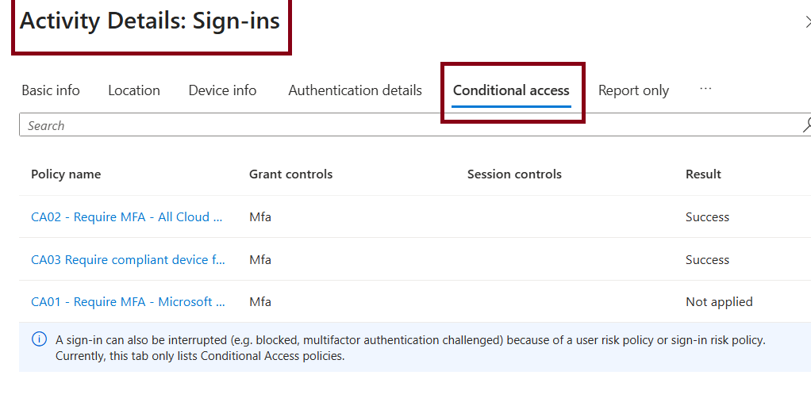
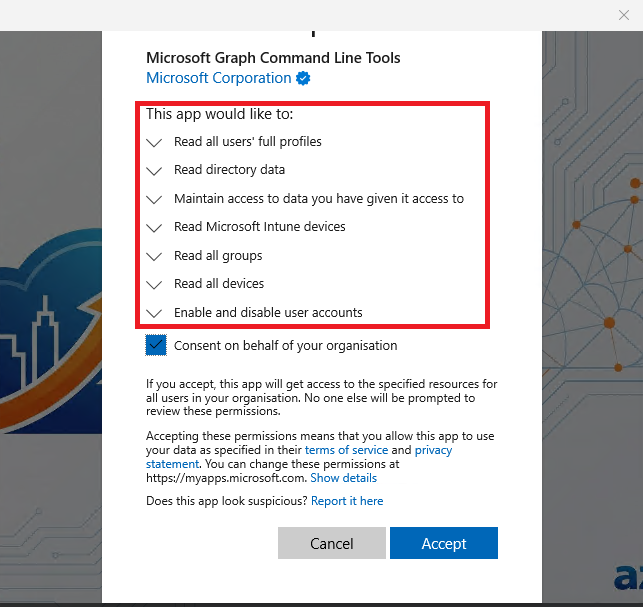
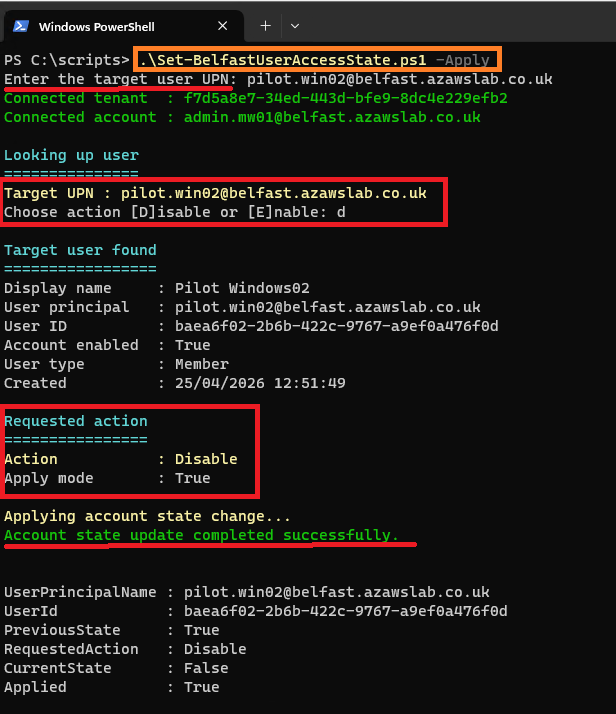
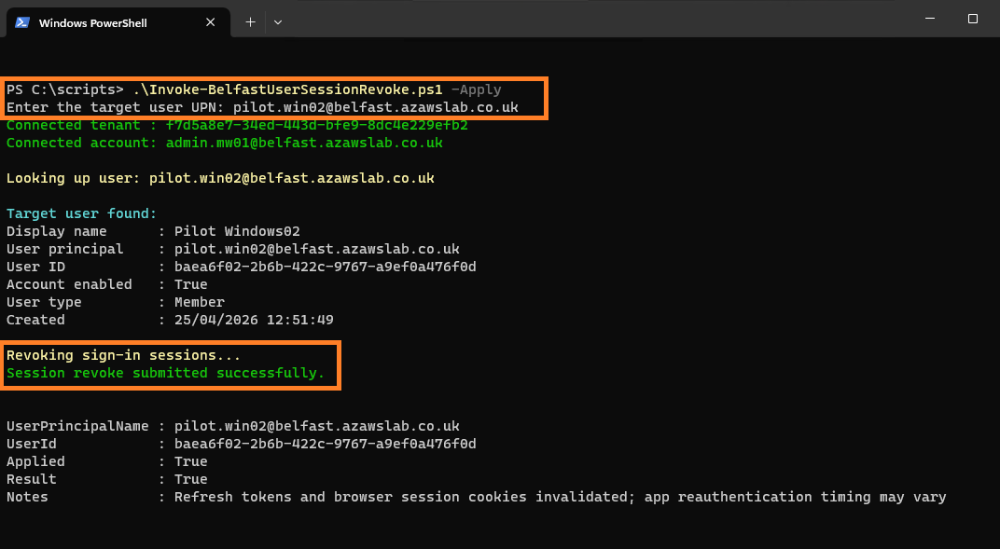
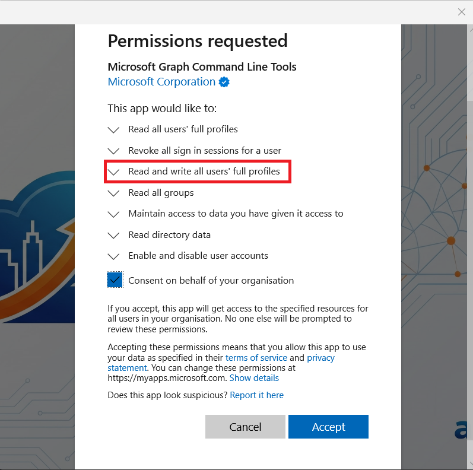
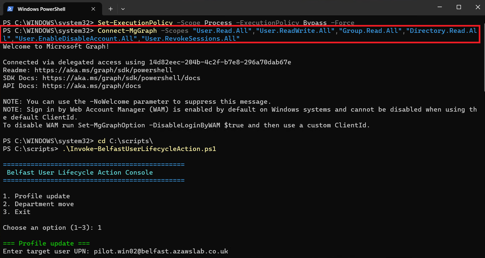
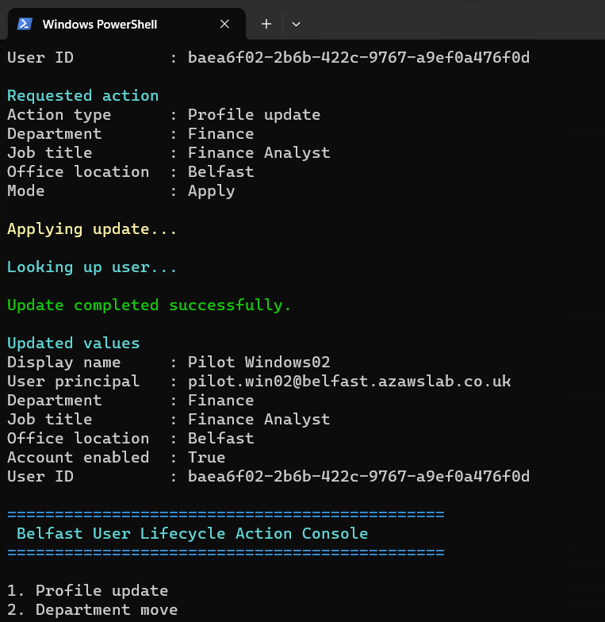
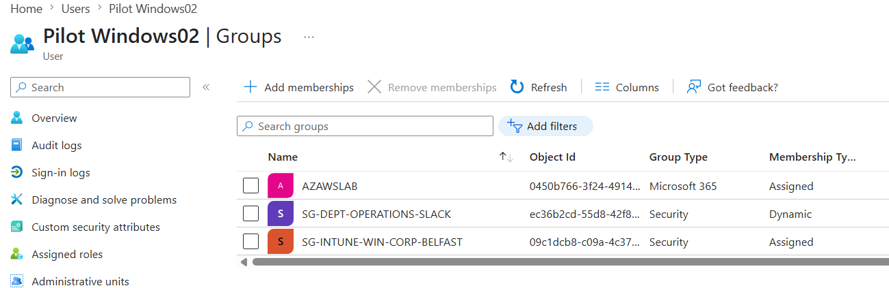
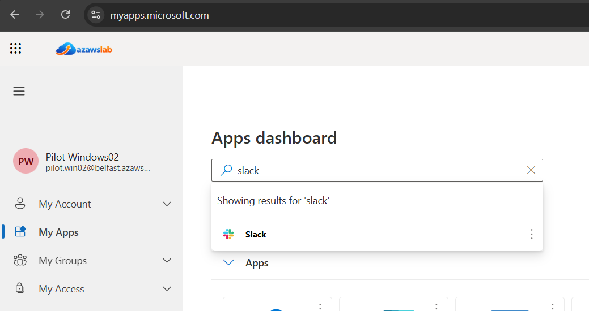

# Hybrid Identity

## Purpose

This page explains how Release 1 introduced hybrid identity between on-premises Active Directory and Microsoft Entra ID using a controlled pilot model rather than broad synchronization from day one, and how the identity story was later extended with lifecycle automation validation after the original baseline was completed.

It covers the identity foundation, synchronization approach, access-control baseline, and the later-added lifecycle controls that demonstrate practical operational identity administration inside the same Release 1 platform story.

---

## What This Page Proves

The hybrid identity implementation proves that the platform established a functioning identity foundation with:

- Active Directory as the authoritative on-premises identity source
- Microsoft Entra ID integration through Entra Connect Sync
- controlled pilot synchronization using filtering and scoped inclusion
- Password Hash Synchronization (PHS) for cloud authentication readiness
- supporting identity controls around Conditional Access, MFA, and SSPR
- identity readiness that enabled Exchange hybrid, endpoint management, and Microsoft 365 service validation
- advanced validation added after baseline for lifecycle access-state controls
- advanced validation added after baseline for mover automation using department-driven dynamic groups and downstream application outcome
- Microsoft Graph API and PowerShell used for practical, operator-led lifecycle administration

---

## Why It Matters

Without hybrid identity, the rest of Release 1 would remain disconnected cloud services.

This work matters because it demonstrates:

- reduced gap between on-premises Active Directory and Microsoft 365 access
- safe pilot-first rollout without bulk synchronization
- a practical baseline for Conditional Access, MFA, and supportability
- downstream validation of Exchange hybrid, Intune, and Microsoft 365 services
- later extension from static identity synchronization into operational identity administration through controlled Graph PowerShell workflows

That last point is important because it shows the identity layer evolving from “users synchronized into Entra” into “user state and access can also be administered in a support-oriented way.”

---

## Implementation Story

The starting point for Release 1 was a traditional on-premises Active Directory environment that needed to connect cleanly to Microsoft 365 without turning hybrid identity into an uncontrolled bulk synchronization exercise.

The chosen approach was to:

- retain Active Directory as the source of identity authority
- introduce Microsoft Entra ID as the cloud identity and access layer
- use Entra Connect Sync with controlled filtering and pilot scope
- validate cloud user visibility, authentication readiness, and synchronization behavior before treating hybrid identity as stable
- later extend the identity story with lifecycle operations that demonstrate controlled administrative action rather than profile presence alone

This makes hybrid identity a deliberate engineering foundation rather than a one-step migration shortcut.

---

## Identity Design Approach

### Active Directory as the Source of Authority

On-premises Active Directory remained the authoritative source for pilot user and device identity during Release 1.

This mattered because Release 1 was not intended to simulate a cloud-only environment. The goal was to demonstrate a realistic hybrid estate where:

- identities originate on-premises
- synchronization is deliberate
- cloud services inherit from a managed source rather than ad hoc account creation

### Microsoft Entra ID as the Cloud Identity Layer

Microsoft Entra ID provided:

- synchronized cloud identity presence
- Conditional Access capability
- authentication and user-state visibility
- the access layer required by Microsoft 365 and Intune

### Entra Connect Sync with Pilot Filtering

Synchronization was intentionally scoped. Rather than synchronizing the whole directory immediately, Release 1 used filtering and pilot inclusion logic so that:

- only intended users and objects entered the cloud estate
- testing stayed controlled
- errors or design mistakes would not affect the full identity population

This pilot-first design is one of the clearest maturity signals in the release.

### Password Hash Synchronization (PHS)

PHS was used to support the cloud authentication path in a way that was practical for the Release 1 pilot model.

This provided:

- a manageable hybrid authentication baseline
- lower implementation complexity than a more advanced federation approach
- enough realism to validate Microsoft 365 user access and service readiness

---

## Identity Protection and Access Baseline

The platform also established the identity-control baseline needed to make hybrid identity meaningful rather than merely connected.

This included:

- **Conditional Access** as the policy layer connecting identity to device and access conditions
- **MFA** as part of the authentication-hardening story
- **SSPR** as part of the user support and identity self-service posture
- supporting user and group design needed for pilot scoping and downstream role-based access

These controls matter because hybrid identity without access policy is only partial progress. Release 1 aimed to connect identity synchronization with real access governance.

---

## Pilot Users, Admin Identities, and Group Design

The pilot model depended not only on synchronized users, but also on a manageable identity structure.

That structure included:

- pilot user accounts used for controlled synchronization and service validation
- administrator identities used for configuration, review, and operational support
- groups used to control pilot scope and downstream service behavior
- later dynamic group logic tied to department-driven lifecycle scenarios

This matters because the identity story in Release 1 is not only “users exist in Entra.” It is also about how those users and groups support policy, service access, and later lifecycle outcomes.

---

## Flagship Evidence

### 1. Entra Connect filtering and synchronization scope

*Entra Connect Sync configuration showing pilot filtering decisions, demonstrating that hybrid identity was introduced in a controlled manner rather than by synchronizing the full environment immediately.*

### 2. Pilot users visible in Microsoft 365

*Pilot users visible in Microsoft 365 after synchronization, confirming that the scoped hybrid identity path was functioning and that the cloud-side user estate was ready for downstream service validation.*

### 3. Conditional Access result visibility

*Conditional Access result visibility showing that synchronized identity and access policy could be reviewed through a real operational signal rather than being treated as an abstract design assumption.*

---

## Additional Identity Evidence

The wider evidence set also includes:

- Entra Connect configuration sequence
- cloud sign-in alignment and pilot user visibility
- Conditional Access and related identity-protection evidence
- group membership and department-driven dynamic group evidence
- lifecycle action screenshots covering disable, revoke session, re-enable, profile update, and department move
- Graph admin-consent evidence and interactive PowerShell lifecycle tooling

For guided browsing:

- [Identity and Access Evidence Hub](../../screenshots/release1/identity-and-access/README.md)
- [Release 1 Evidence Dashboard](../../screenshots/release1/README.md)

---

## What Was Validated

The hybrid identity baseline validated that:

- Active Directory could remain the authoritative identity source while integrating with Microsoft Entra ID
- Entra Connect Sync could be introduced through controlled pilot filtering
- synchronized pilot users could be surfaced and used for downstream Microsoft 365 validation
- PHS provided a practical and supportable cloud authentication path
- Conditional Access, MFA, and SSPR formed a meaningful identity baseline around the synchronized estate

---

## Advanced Validation Added After Baseline

The following capabilities were implemented after the core Release 1 baseline was completed. They extend the hybrid identity story beyond pilot synchronization and access policies into practical, operationally focused identity lifecycle automation using **Microsoft Graph API and PowerShell**.

This matters because Microsoft Graph is the modern programmatic interface for Entra ID and Microsoft 365, and PowerShell with the Microsoft Graph SDK is a practical operational tool for lifecycle administration outside fully event-driven orchestration. Demonstrating Graph-connected PowerShell scripts for lifecycle actions shows that the platform is not only configurable through portals, but also manageable through reusable operational tooling that can be extended for broader administrative requirements.

The scripts in this project were designed as **interactive, operator-led tools** with preview-style execution and controlled apply actions, reflecting real support and engineering workflows rather than hard-coded one-off demos.

The validation covers two distinct scenarios:

- **leaver / access response** — disable, revoke session, enable
- **mover** — department change, dynamic group membership, downstream application access

Evidence was captured in a compatible environment that preserved the existing platform naming and domain context for consistency.

---

### Advanced Validation: Identity Lifecycle - Access-State Controls (Leaver / Access Response) using Graph API + PowerShell

**What was validated**

The platform demonstrates a controlled access-state lifecycle for a pilot user using Graph PowerShell scripts. The validation includes:

- **Disable user account** - dry run and apply, followed by verification of the disabled state in Entra
- **Revoke active sessions** - dry run and apply, forcing sign-out from all active sessions
- **Enable user account** - restoration of the account to an active state

All actions were performed using interactive Graph PowerShell scripts designed to reflect operator-led support workflows rather than fully automated, event-driven orchestration.

**Why this matters**

Identity lifecycle automation is a core expectation for Entra ID administration. Demonstrating disable, session revoke, and enable actions via **Graph API + PowerShell** shows that the platform can respond to leaver events or security incidents without relying solely on portal clicks. The inclusion of dry-run modes and verification steps reflects a safer, support-oriented approach that is more realistic for operational teams than blind, irreversible commands.

**Implementation and evidence**

- The scripts `Set-BelfastUserAccessState.ps1` and `Invoke-BelfastUserSessionRevoke.ps1` were used, both connecting through `Connect-BelfastMgGraph.ps1`.
- Graph admin-consent evidence was captured as part of establishing the required delegated permissions for the demonstrated lifecycle actions, including `User.ReadWrite.All` for user state and profile-update operations.
- For **disable**: a dry run first previewed the change, then the apply command disabled the pilot user `pilot-win02`. Verification in Entra confirmed the account state changed to blocked sign-in.
- For **session revoke**: a dry run confirmed the action, then apply revoked all active sessions.
- For **enable**: the account was restored to an active state, verified through Entra.

**Flagship evidence**

*Graph admin-consent evidence showing that the lifecycle scripts were built with awareness of delegated permission requirements rather than treated as opaque PowerShell commands.*

*Graph PowerShell script output confirming that the pilot user account was disabled, supporting the leaver or access-response scenario.*

*Session-revoke script execution via Graph PowerShell, demonstrating the ability to force sign-out from active sessions for immediate access removal.*

**Outcome**

The platform now includes validated access-state lifecycle controls using **Graph API + PowerShell**. An administrator can disable a user account, revoke active sessions, and restore the account using scripted, repeatable workflows. This strengthens the identity operational-maturity story and makes the automation layer explicit.

---

### Advanced Validation: Identity Lifecycle - Mover Scenario (Department Change, Dynamic Group, Downstream App Access) using Graph API + PowerShell

**What was validated**

The mover scenario is the stronger business-facing lifecycle validation. Using an **interactive Graph PowerShell script** (`Invoke-BelfastUserLifecycleAction.ps1`), the platform demonstrates that updating a user’s organizational attributes can trigger downstream access changes through dynamic group membership and application assignment. The validation covers:

- baseline user profile (`pilot-win02`) in the Finance department, with no access to the Slack gallery app
- dynamic groups: `SG-Dept-Finance-Users` (rule: `department eq "Finance"`) and `SG-Dept-Operations-Slack` (rule: `department eq "Operations"`)
- Slack assigned to `SG-Dept-Operations-Slack` only
- interactive script prompting for department and job title, supporting preview-style and apply modes
- post-update: the user’s department changes to Operations, dynamic group membership recalculates, and Slack becomes available in the user’s My Apps portal

**Why this matters**

The mover scenario reflects a real business need: employees change roles, departments, or locations, and their access to applications should follow automatically. By linking a department attribute change to dynamic group membership and then to a gallery app assignment, the platform shows attribute-driven access control. This is more sophisticated than simply editing a user’s profile; it proves that the identity system can propagate changes into practical access outcomes.

Using **Graph API + PowerShell** to drive this workflow demonstrates that the identity layer is not only synchronized and policy-aware, but also operationally manageable through reusable automation.

**Implementation and evidence**

- Baseline state: `pilot-win02` had department = Finance and job title = Finance Analyst. Slack was not available in My Apps.
- Dynamic group membership was verified: the user was in `SG-Dept-Finance-Users` but not in `SG-Dept-Operations-Slack`.
- The interactive script `Invoke-BelfastUserLifecycleAction.ps1` connected through Graph, prompted for department (`Finance` -> `Operations`) and job title. A preview step showed the intended change, then apply executed.
- After the script completed, Entra showed the user’s department as Operations and job title as Operations Analyst.
- Dynamic group membership recalculated: the user left the Finance-aligned state and joined the Operations-linked Slack group.
- Slack then appeared in the user’s My Apps portal, confirming that the department-driven access-control path was successful.

**Flagship evidence**

*Graph admin-consent evidence showing that the profile-update workflow was built with explicit awareness of the permissions required for lifecycle automation, including `User.ReadWrite.All` for user attribute updates.*

*Launch of `Invoke-BelfastUserLifecycleAction.ps1`, an interactive Graph PowerShell script designed for operator-led lifecycle administration.*

*Script output confirming that the user profile was updated through Graph PowerShell as part of the mover workflow.*

*Dynamic group membership after the department change showing that the user is now a member of `SG-Dept-Operations-Slack`, which is assigned to the Slack gallery app.*

*Slack visible in the user’s My Apps portal after the department change, demonstrating that the attribute update successfully triggered downstream access.*

**Outcome**

The mover scenario is fully validated using **Graph API + PowerShell**. The platform can update a user’s department attribute through an interactive Graph PowerShell script, trigger dynamic group membership recalculation, and change access to a gallery app based solely on that department value. This closes the loop between identity governance and application access, making the identity lifecycle story significantly stronger and more operationally relevant.

---

## Operational Insight

A useful lesson from this area is that identity credibility improves when the documentation distinguishes clearly between:

- baseline hybrid identity foundation
- later operational lifecycle validation added after baseline

That distinction matters because it preserves technical honesty. The project did not begin as a full lifecycle automation platform. It began with controlled synchronization and access baseline, then later extended into practical identity operations.

The result is a stronger narrative:

- hybrid identity establishes the trust foundation
- lifecycle automation shows how that identity can then be administered in realistic support and access-change scenarios using Graph API and PowerShell

---

## Scope Boundaries

This page should be read as evidence of an **implemented and evidenced hybrid identity baseline**, later extended with lifecycle automation validation. It does **not** claim:

- a fully automated, event-driven HR-to-Entra provisioning system
- integration with an external HRIS or source-of-truth system beyond manual script invocation
- enterprise-wide coverage beyond the demonstrated pilot scenarios
- full audit or compliance reporting coverage for every lifecycle action
- full enterprise IAM orchestration
- a complete HR-driven joiner/mover/leaver platform
- every possible identity lifecycle scenario

The evidence is limited to the pilot user and the specific Graph PowerShell scripts shown in the repository. Broader lifecycle automation, HR integration, and event-driven workflows remain future enhancement areas.

Deeper Graph operational scripting detail should be read alongside [Monitoring](08-monitoring.md), where the supporting Graph and PowerShell visibility workflows are documented more directly.

---

## Related Documents

- [Release 1 Summary](00-summary.md)
- [Modern Workplace](02-modern-workplace.md)
- [Endpoint Overview](03-endpoint-overview.md)
- [Monitoring](08-monitoring.md)
- [Compliance Mapping](09-compliance-mapping.md)
- [Lessons Learned](10-lessons-learned.md)
- [Build Checklist](11-build-checklist.md)
- [Extensions and Future Enhancements](12-extensions-and-future-enhancements.md)

For cross-release context:
- [Platform Overview](../foundation/01-platform-overview.md)
- [Current-State Architecture](../foundation/02-current-state-architecture.md)
- [Target-State Architecture](../foundation/03-target-state-architecture.md)
- [Roadmap](../foundation/04-roadmap.md)
- [Skills and Evidence Index](../foundation/05-skills-and-evidence-index.md)

---

## Related Evidence

- [Identity and Access Evidence Hub](../../screenshots/release1/identity-and-access/README.md)
- [Release 1 Evidence Dashboard](../../screenshots/release1/README.md)