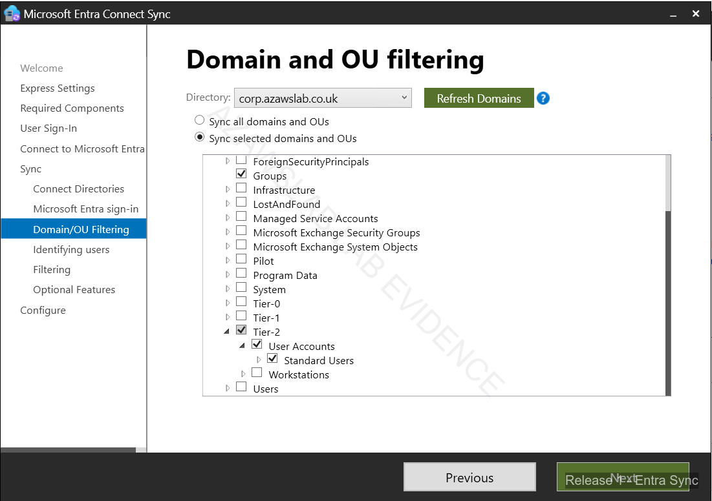
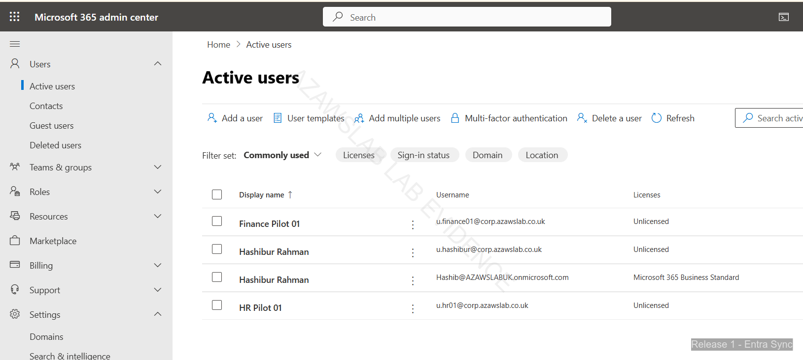

# Hybrid Identity

**Related navigation:** [README](../../README.md) | [Release 1 Summary](00-summary.md) | [Release 1 Build Checklist](11-build-checklist.md)  
**Related docs:** [Modern Workplace](02-modern-workplace.md) | [Endpoint Overview](03-endpoint-overview.md) | [Monitoring](08-monitoring.md)

## Purpose

This page records the hybrid identity foundation implemented in Release 1 of the `azawslab Enterprise Hybrid Security Platform`.

It shows how Release 1 established an on-premises Active Directory foundation, extended selected identities into Microsoft Entra ID through controlled synchronization, and used namespace discipline to support Microsoft 365 onboarding and Exchange hybrid validation. It should be read as the identity-foundation page, not as the deeper Exchange or endpoint-management page.

## What This Page Proves

This page proves that Release 1 hybrid identity was implemented as a controlled design rather than as a broad or accidental synchronization exercise.

It demonstrates:

- Active Directory remaining the authoritative source for pilot synced identities
- Microsoft Entra Connect Sync configured with deliberate pilot filtering for selected users and devices
- namespace separation used to protect the production mail namespace while enabling hybrid pilot work
- Microsoft 365 pilot identities becoming visible and usable after synchronization
- identity design decisions directly supporting Exchange hybrid readiness and later platform controls

## Implementation Story

Release 1 hybrid identity began with an on-premises Windows Server and Active Directory foundation built inside the Hyper-V platform. Domain services, DNS, and identity administration remained anchored on-premises so that Microsoft cloud integration could be added in a controlled way rather than replacing the source-of-authority model.

The next step was Microsoft Entra Connect Sync. This was intentionally scoped to pilot users and selected devices rather than opened broadly across the environment. That design choice matters because it shows Release 1 was not trying to simulate a full enterprise sync rollout. Instead, it used a constrained pilot model that was easier to validate, easier to reason about, and safer to align with later Exchange hybrid work.

Namespace design was one of the most important supporting decisions. The root business namespace, `azawslab.co.uk`, remained associated with Zoho for existing mail flow, while `corp.azawslab.co.uk` was used as the dedicated hybrid pilot namespace. This separation allowed Release 1 to progress into Microsoft 365 and Exchange hybrid validation without disrupting the root business namespace or overstating coexistence maturity.

Once synchronization was in place, the pilot identities became visible in Microsoft 365 and could be used as the basis for later Microsoft 365 validation, Exchange hybrid migration testing, endpoint enrollment relationships, and compliant-device access logic. That makes hybrid identity one of the core enabling layers of Release 1 rather than a standalone configuration task.

The hybrid identity story also became more meaningful because it was connected to Exchange hybrid validation. Successful migration-path testing depended not only on cloud objects existing, but on names, trust relationships, and endpoint readiness aligning properly with the identity design. That is where the page gains additional credibility: it shows that hybrid identity was used, not just configured.

## Flagship Identity Evidence

### Controlled Entra Connect sync scope

*Figure: Microsoft Entra Connect Sync filtering configured for selected pilot users and devices, showing that Release 1 synchronization scope was deliberate and controlled rather than broad by default.*

### Synced pilot identities visible in Microsoft 365

*Figure: Microsoft 365 active-users view showing pilot identities after synchronization, proving that the controlled hybrid identity model produced usable cloud-visible accounts.*

### Exchange hybrid migration readiness validation

*Figure: Migration-endpoint validation succeeding after hybrid identity and namespace prerequisites were aligned, showing that the identity design supported Exchange hybrid readiness rather than existing in isolation.*

## Why This Matters

This workstream strengthens the project because it shows that Release 1 was built on a credible hybrid identity foundation rather than on cloud-only setup or disconnected Microsoft 365 clicks.

It now demonstrates:

- on-premises identity authority
- controlled cloud synchronization
- namespace discipline
- pilot-safe hybrid design
- direct support for Exchange hybrid, Microsoft 365 onboarding, endpoint relationships, and later policy scope

That makes the overall platform story materially stronger than a portfolio that only shows tenant setup or individual Microsoft admin portal screenshots.

## What Release 1 Does Not Claim

To keep the hybrid identity story credible, Release 1 does not claim:

- broad enterprise-wide synchronization rollout
- complex multi-forest or multi-domain hybrid identity architecture
- full production coexistence maturity across all namespaces
- advanced federation design
- completed PKI or identity-governance maturity beyond what is evidenced in the hybrid pilot

Release 1 should therefore be presented as a controlled hybrid identity implementation that enabled Microsoft 365 and Exchange hybrid pilot validation, not as a finished enterprise identity-transformation program.

## Related Docs

- [Release 1 Summary](00-summary.md)
- [Modern Workplace](02-modern-workplace.md)
- [Endpoint Overview](03-endpoint-overview.md)
- [Monitoring](08-monitoring.md)
- [Release 1 Build Checklist](11-build-checklist.md)