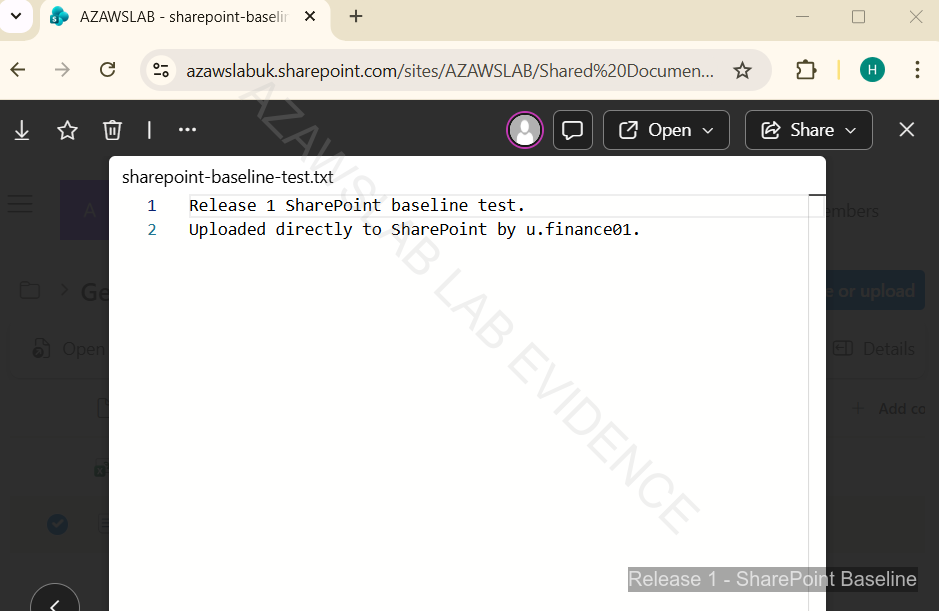

# Modern Workplace

## Purpose

This page explains how Release 1 validated the Microsoft 365 service baseline across Exchange hybrid, Exchange Online, Teams, and SharePoint.

It focuses on how the project moved from identity readiness into user-facing service validation, using a controlled pilot model rather than broad unsupported rollout claims.

---

## What This Page Proves

This page proves that Release 1 established a functioning Modern Workplace baseline with:

- Exchange hybrid configuration and pilot migration validation
- successful pilot mailbox access after migration
- baseline Microsoft 365 collaboration capability across Teams and SharePoint
- namespace and certificate handling that was sufficient for Release 1 hybrid validation
- a practical service layer that could sit on top of the hybrid identity foundation

---

## Why It Matters

Without a validated service layer, hybrid identity would remain an isolated technical foundation rather than a usable platform.

This work enabled:
- practical Microsoft 365 service readiness rather than identity-only integration
- safe pilot-first validation of Exchange hybrid before making broader claims
- visible proof that collaboration workloads were reachable and usable
- a clearer bridge from foundational identity engineering into business-facing cloud services

---

## Implementation Story

The Release 1 goal was not to claim a full enterprise-scale messaging or collaboration transformation. The goal was to prove that a legacy small-enterprise environment could be connected to Microsoft 365 in a controlled, supportable way.

The chosen approach was to:
- prepare hybrid identity first
- introduce Exchange hybrid using a pilot migration model
- validate post-migration mailbox access and service readiness
- confirm baseline collaboration functionality through Teams and SharePoint
- keep the namespace and certificate strategy tightly scoped to what Release 1 needed to validate

This made Modern Workplace delivery an evidence-backed service milestone rather than a broad "cloud migration” claim.

---

## Service Design Approach

### Exchange Hybrid as the Core Validation Path

Exchange hybrid is the most important workload in this page because it connects:
- identity
- namespace and certificate readiness
- cloud mailbox access
- real user-facing service validation

Release 1 used a controlled Exchange hybrid path to validate that pilot users could move into a functioning Microsoft 365 service state without pretending that the whole organization had already completed a full migration programme.

### Teams and SharePoint as Collaboration Baselines

Teams and SharePoint were included to show that Release 1 was not only about identity and messaging plumbing. It also validated a usable Microsoft 365 collaboration baseline.

This matters because it shows that:
- Microsoft 365 access was not only technically provisioned
- collaboration workloads were reachable and usable
- the pilot estate extended beyond mailbox migration into broader service adoption

### Namespace and Certificate Discipline

Release 1 treated namespace and certificate readiness as strategically important to the hybrid path.

The project intentionally kept:
- the root business mail namespace separate from the pilot hybrid path
- hybrid work under the `corp.azawslab.co.uk` namespace
- certificate handling scoped to what was needed for Release 1 validation

This was important because it allowed the project to validate hybrid service readiness without overstating scope or claiming a full enterprise PKI deployment.

---

## Exchange Hybrid Validation

The Exchange hybrid path was treated as a pilot-first validation exercise rather than a broad migration story.

Key themes in this phase included:
- readiness checking before migration
- controlled pilot migration
- post-migration user access validation
- recovery from migration friction rather than pretending the process was perfect

This is one of the strongest parts of Release 1 because it demonstrates that the service layer was tested through visible user outcomes, not just wizard completion.

---

## Collaboration Baseline

Release 1 also validated the collaboration layer through:
- Teams activity
- SharePoint access and document interaction

These proofs are important because they show that Microsoft 365 was functioning as a service environment rather than only as an identity backend.

---

## Flagship Evidence

### 1. Exchange hybrid readiness and migration path

*Exchange hybrid readiness validation showing that the migration path was functioning and that pilot mailbox movement could proceed on a controlled basis.*

### 2. Pilot mailbox validation after migration

*Pilot mailbox validation showing successful post-migration access, confirming that Exchange hybrid connectivity, mailbox state, and user access were functioning as intended for the pilot users.*

### 3. SharePoint service validation

*SharePoint file access validation demonstrating that the collaboration baseline was usable and that Release 1 had moved beyond identity plumbing into practical Microsoft 365 service consumption.*

---

## What Was Validated

The Release 1 Modern Workplace work validated that:
- Exchange hybrid could be prepared and tested in a controlled pilot model
- pilot mailbox migration led to successful post-migration user access
- Teams and SharePoint were available as working collaboration services
- the hybrid service layer was sufficiently stable to support visible user-facing validation
- namespace and certificate decisions were good enough for Release 1 hybrid execution without claiming broader certificate-platform maturity

---

## Operational Insight

A key lesson from this phase is that Modern Workplace validation should be treated as user-visible service proof, not just administrative setup.

The strongest engineering choice here was the pilot-first service model:
- validate the path
- validate user access
- recover from friction where necessary
- avoid claiming broader rollout maturity than the evidence supports

That is what makes this section credible.

---

## Scope Boundaries

Release 1 Modern Workplace should be read as an **implemented and evidenced service baseline**, not as a claim to full enterprise messaging and collaboration maturity.

The following boundaries are important:
- Release 1 does **not** claim a full organization-wide Exchange Online migration
- Release 1 does **not** claim a complete OneDrive administration or governance programme unless separately evidenced
- Release 1 does **not** claim full enterprise PKI / AD CS deployment; certificate handling was scoped to Let's Encrypt / `win-acme` and the hybrid validation path
- Teams and SharePoint are validated as baseline collaboration services, not as a complete enterprise information architecture programme
- broader productivity governance and larger-scale service adoption remain outside Release 1 scope

---

## Related Documents

- [Release 1 Summary](00-summary.md)
- [Hybrid Identity](01-hybrid-identity.md)
- [Endpoint Enrollment](04-endpoint-enrollment.md)
- [Monitoring](08-monitoring.md)
- [Lessons Learned](10-lessons-learned.md)
- [Build Checklist](11-build-checklist.md)

For cross-release context:
- [Platform Overview](../foundation/01-platform-overview.md)
- [Roadmap](../foundation/04-roadmap.md)
- [Skills and Evidence Index](../foundation/05-skills-and-evidence-index.md)

---

## Related Evidence

- [Modern Workplace Evidence Hub](../../screenshots/release1/modern-workplace/README.md)
- [Release 1 Evidence Dashboard](../../screenshots/release1/README.md)

