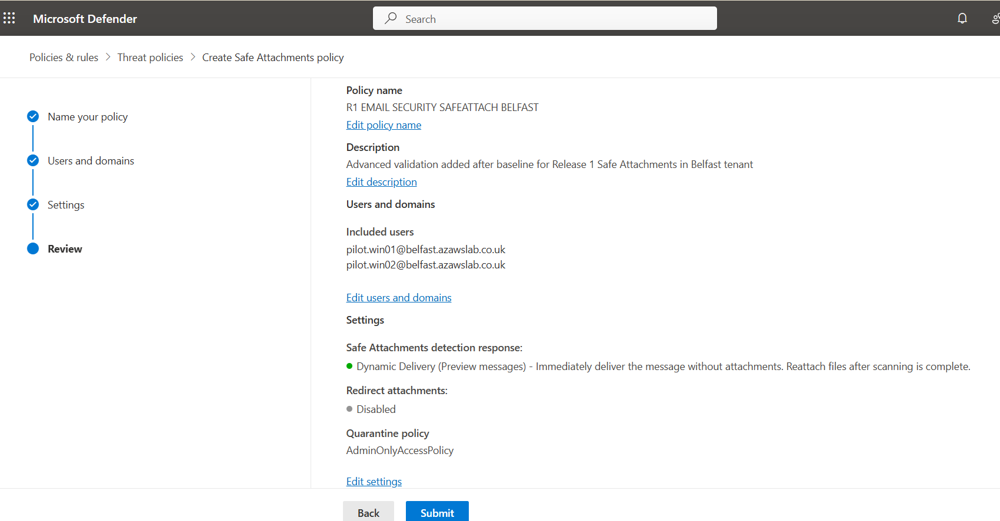
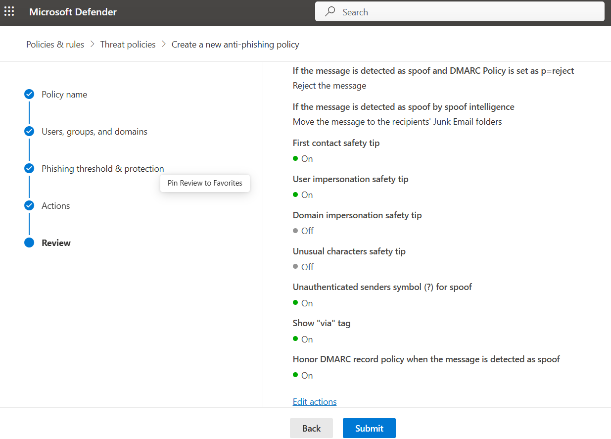
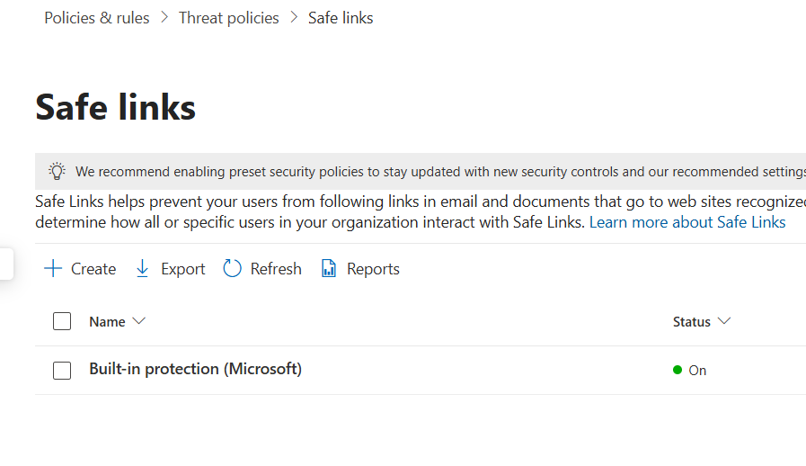

# Modern Workplace

## Purpose

This page explains how Release 1 validated the Microsoft 365 service baseline across Exchange hybrid, Exchange Online, Teams, and SharePoint, and how the modern workplace story was later extended with advanced email security validation after the original baseline was completed.

It focuses on how the project moved from identity readiness into user-facing service validation using a controlled pilot model rather than broad unsupported rollout claims.

---

## What This Page Proves

The Modern Workplace implementation proves that the platform established a functioning service baseline with:

- Exchange hybrid configuration and pilot migration validation
- successful pilot mailbox access after migration
- baseline Microsoft 365 collaboration capability across Teams and SharePoint
- namespace and certificate handling that was sufficient for the Release 1 hybrid validation path
- a practical service layer built on top of the hybrid identity foundation
- advanced validation added after baseline for email security controls
- visible policy-level proof for anti-phishing, Safe Links, and Safe Attachments

---

## Why It Matters

Without a validated service layer, hybrid identity would remain an isolated technical foundation rather than a usable platform.

This work matters because it demonstrates:

- practical Microsoft 365 service readiness rather than identity-only integration
- safe pilot-first validation of Exchange hybrid before making broader claims
- visible proof that collaboration workloads were reachable and usable
- a clear bridge from foundational identity engineering into business-facing cloud services
- later extension into email protection controls that strengthen the operational credibility of the Modern Workplace layer

This makes Release 1 more than a hybrid plumbing exercise. It becomes a working Microsoft 365 platform with both usability and security depth.

---

## Implementation Story

The Release 1 goal was not to claim a full enterprise-scale messaging or collaboration transformation. The goal was to prove that a legacy small-enterprise environment could be connected to Microsoft 365 in a controlled, supportable way.

The chosen approach was to:

- prepare hybrid identity first
- introduce Exchange hybrid using a pilot migration model
- validate post-migration mailbox access and service readiness
- confirm baseline collaboration functionality through Teams and SharePoint
- keep namespace and certificate strategy tightly scoped to what Release 1 needed
- later extend the service story with advanced email security validation once the baseline was already stable

This makes the Modern Workplace work evidence-backed and scope-controlled rather than inflated.

---

## Service Design Approach

### Exchange Hybrid as the Core Validation Path

Exchange hybrid is the most important workload in this page because it connects:

- identity
- namespace and certificate readiness
- cloud mailbox access
- real user-facing service validation

The platform used a controlled Exchange hybrid path to validate that pilot users could move into a functioning Microsoft 365 service state without pretending that the whole organization had already completed a full migration program.

### Teams and SharePoint as Collaboration Baselines

Teams and SharePoint were included to show that Release 1 was not only about identity and messaging plumbing. It also validated a usable Microsoft 365 collaboration baseline.

This matters because it shows that:

- Microsoft 365 access was not only technically provisioned
- collaboration workloads were reachable and usable
- the pilot estate extended beyond mailbox migration into broader service adoption

### Namespace and Certificate Discipline

The implementation treated namespace and certificate readiness as strategically important to the hybrid path.

The project intentionally kept:

- the root business mail namespace separate from the pilot hybrid path
- hybrid work under the `corp.azawslab.co.uk` namespace
- certificate handling scoped to what was needed for Release 1 validation

This was important because it allowed the project to validate hybrid service readiness without overstating scope or claiming a full enterprise PKI deployment.

---

## Exchange Hybrid Validation

The Exchange hybrid path was treated as a pilot-first validation exercise rather than a broad migration story.

Key themes in this validation path included:

- readiness checking before migration
- controlled pilot migration
- post-migration user access validation
- recovery from migration friction rather than pretending the process was perfect

This remains one of the strongest parts of Release 1 because it demonstrates that the service layer was tested through visible user outcomes, not just wizard completion.

---

## Collaboration Baseline

The platform also validated the collaboration layer through:

- Teams activity
- SharePoint access and document interaction

These proofs are important because they show that Microsoft 365 was functioning as a service environment rather than only as an identity backend.

---

## Flagship Evidence

### 1. Exchange hybrid readiness and migration path

*Exchange hybrid readiness validation showing that the migration path was functioning and that pilot mailbox movement could proceed on a controlled basis.*

### 2. Pilot mailbox validation after migration

*Pilot mailbox validation showing successful post-migration access, confirming that Exchange hybrid connectivity, mailbox state, and user access were functioning as intended for the pilot users.*

### 3. SharePoint service validation

*SharePoint file access validation demonstrating that the collaboration baseline was usable and that Release 1 had moved beyond identity plumbing into practical Microsoft 365 service consumption.*

---

## Additional Modern Workplace Evidence

The wider evidence set also includes:

- Exchange hybrid readiness and migration evidence
- pilot mailbox access validation
- Teams collaboration baseline screenshots
- SharePoint baseline access and document interaction evidence
- Microsoft 365 service context that supports the broader Release 1 collaboration story

For guided browsing:

- [Modern Workplace Evidence Hub](../../screenshots/release1/modern-workplace/README.md)
- [Release 1 Evidence Dashboard](../../screenshots/release1/README.md)

---

## What Was Validated

The Modern Workplace baseline validated that:

- Exchange hybrid could be introduced through a controlled pilot path
- pilot users could access migrated mailboxes successfully
- Microsoft 365 collaboration services were reachable and usable beyond messaging alone
- namespace and certificate handling were sufficient for the scoped hybrid validation path
- the service layer could sit credibly on top of the hybrid identity foundation

---

## Advanced Validation Added After Baseline

The following capabilities were implemented after the core Release 1 baseline was completed. They extend the Modern Workplace story with advanced email security validation while keeping the original service baseline intact. Evidence was captured in a compatible environment that preserved the existing platform naming and domain context for consistency.

---

### Advanced Validation: Email Security

**What was validated**

Email security was added after the original baseline to strengthen the Modern Workplace story beyond hybrid messaging and collaboration access. The validation focuses on visible policy-level proof in the Microsoft 365 security layer rather than on broad claims of full enterprise mail-security maturity.

The validation includes:

- anti-phishing policy review
- Safe Links policy visibility
- Safe Attachments policy visibility
- supporting protection settings evidence in the email security administration layer

**Why this matters**

Exchange hybrid and mailbox validation prove that Microsoft 365 services are usable. Email security adds the next layer: proof that the service environment is also being protected.

This matters because it shows that the Modern Workplace story includes not only service delivery, but also control over message and link-based risk in the cloud email layer. That makes the page more relevant to real Microsoft 365 administration and support roles.

**Implementation context**

The original Release 1 baseline focused on hybrid identity, Exchange hybrid validation, and collaboration services. Email security was then added as advanced validation to extend the same service layer into a more security-aware Microsoft 365 posture.

This should therefore be read as **advanced validation added after baseline**, not as if it had always been part of the first-pass Release 1 scope.

---

### Anti-Phishing Validation

Anti-phishing validation is important because it shows that mail protection was not limited to basic service availability. It demonstrates that the environment includes policy-level protection against impersonation-style and phishing-oriented email risks.

The key value in this evidence is policy visibility: the reviewer can see that anti-phishing controls were configured as part of the Microsoft 365 protection layer rather than being left as an implied future capability.

### Safe Links Validation

Safe Links matters because it represents user-facing protection against malicious or suspicious links delivered through the email workflow.

Its relevance in this project is that it extends the platform story from:

- “mailboxes are reachable”
to
- “the email environment includes protection against common link-based threats”

That gives the Modern Workplace section a stronger operational security dimension without requiring the repo to overclaim a full Defender for Office 365 maturity program.

### Safe Attachments Validation

Safe Attachments is included where the evidence supports it as part of the email security protection layer.

Its role is to show that attachment-oriented email risk was considered within the Microsoft 365 security posture and that protection settings were visible in the admin layer.

Where it is retained, it should be read as a validated protection control within the evidenced pilot scope, not as a claim to broad enterprise mail-security architecture.

---

## Flagship Evidence for Advanced Validation

### 1. Anti-phishing policy visibility

*Anti-phishing policy review showing that the Microsoft 365 email environment included configured protection against phishing-style threats rather than relying on service access alone.*

### 2. Safe Links policy visibility

*Safe Links policy visibility showing that link-based protection controls were part of the validated email security posture.*

### 3. Safe Attachments policy visibility

*Safe Attachments policy visibility showing that attachment-oriented protection settings were also represented in the advanced email security validation path.*

> **Implementation note:** The exact screenshot filenames above should be confirmed against the final repo state before merge if the email-security folder uses different content-first names. The documentation placement and storyline are correct; only the final image references may need filename alignment.

---

## Outcome

The Modern Workplace layer now proves two connected things:

- the Microsoft 365 service baseline was implemented and validated through Exchange hybrid, Teams, and SharePoint
- the same service layer was later extended with email security validation through anti-phishing, Safe Links, and Safe Attachments policy visibility

That gives Release 1 a stronger and more supportable Modern Workplace story than service consumption alone.

---

## Operational Insight

A useful lesson from this area is that Microsoft 365 credibility improves when service validation and service protection are documented together, but clearly separated in time and scope.

That is why this page distinguishes:

- the original service baseline
- the later advanced security validation added after baseline

This avoids history rewriting while still showing that the project evolved in a meaningful way. The result is a more complete Modern Workplace story: usable services first, then stronger protection layered on top.

---

## Scope Boundaries

This page should be read as evidence of an **implemented and evidenced Modern Workplace baseline**, later extended with advanced email security validation. It does **not** claim:

- a full enterprise mail-security program
- complete Defender for Office 365 maturity beyond the evidenced controls
- large-scale production migration coverage beyond the pilot Exchange hybrid validation
- universal security coverage across every Microsoft 365 workload

The email security evidence is limited to the specific policy-level controls shown in the repository and should be read as advanced validation inside the Release 1 Modern Workplace story.

---

## Related Documents

- [Release 1 Summary](00-summary.md)
- [Hybrid Identity](01-hybrid-identity.md)
- [Endpoint Overview](03-endpoint-overview.md)
- [Monitoring](08-monitoring.md)
- [Compliance Mapping](09-compliance-mapping.md)
- [Build Checklist](11-build-checklist.md)
- [Extensions and Future Enhancements](12-extensions-and-future-enhancements.md)

For cross-release context:
- [Platform Overview](../foundation/01-platform-overview.md)
- [Current-State Architecture](../foundation/02-current-state-architecture.md)
- [Target-State Architecture](../foundation/03-target-state-architecture.md)
- [Roadmap](../foundation/04-roadmap.md)
- [Skills and Evidence Index](../foundation/05-skills-and-evidence-index.md)

---

## Related Evidence

- [Modern Workplace Evidence Hub](../../screenshots/release1/modern-workplace/README.md)
- [Release 1 Evidence Dashboard](../../screenshots/release1/README.md)