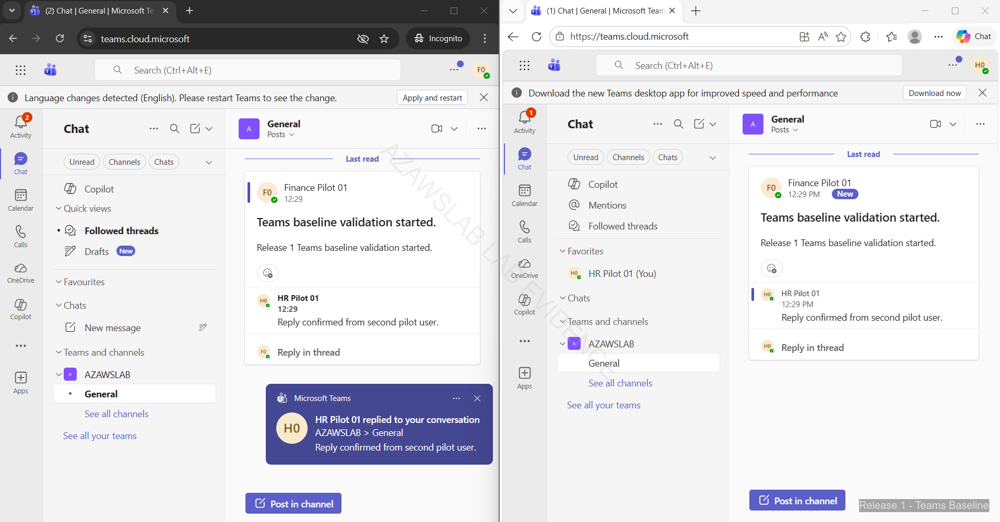

# Microsoft 365 Modern Workplace

**Related navigation:** [README](../../README.md) | [Release 1 Summary](00-summary.md) | [Release 1 Build Checklist](11-build-checklist.md)  
**Related docs:** [Hybrid Identity](01-hybrid-identity.md) | [Endpoint Overview](03-endpoint-overview.md) | [Purview](07-purview.md) | [Monitoring](08-monitoring.md)

## Purpose

This page records the Microsoft 365 modern workplace baseline implemented in Release 1 of the `azawslab Enterprise Hybrid Security Platform`.

It shows how Release 1 moved from tenant onboarding and pilot namespace preparation into Microsoft 365 access validation, Exchange Online pilot migration, Teams collaboration baseline, and SharePoint document collaboration baseline. It should be read as the workplace-services page, not as the deeper hybrid identity or endpoint-control page.

## What This Page Proves

This page proves that Release 1 hybrid identity and Microsoft 365 onboarding translated into usable cloud services rather than stopping at tenant setup.

It demonstrates:

- Microsoft 365 tenant onboarding and pilot namespace integration
- controlled use of `corp.azawslab.co.uk` as the hybrid pilot namespace while the root business namespace remained associated with Zoho
- pilot user access into Microsoft 365 cloud services
- successful Exchange Online mailbox migration for pilot users after hybrid migration recovery work
- Teams collaboration baseline across chat, channel activity, file collaboration, and meeting visibility
- SharePoint baseline across site access, document-library access, file upload, and file-open validation

## Implementation Story

Release 1 modern workplace work began with Microsoft 365 tenant onboarding and domain preparation. The environment was not treated as a cloud-only greenfield setup. Instead, it was aligned to the broader hybrid design already established in the identity workstream.

One of the most important decisions in this phase was namespace separation. The root namespace, `azawslab.co.uk`, remained associated with Zoho for existing business mail flow, while `corp.azawslab.co.uk` was used as the dedicated hybrid pilot namespace. That distinction mattered because it allowed Microsoft 365 onboarding and Exchange hybrid testing to proceed without disrupting the root business namespace or overstating coexistence maturity.

Once pilot identities were synchronized and licensed, Microsoft 365 access became usable at pilot scope. Early validation through browser-based Microsoft 365 apps confirmed that tenant onboarding, identity synchronization, and license assignment were functioning together as expected.

The most important service milestone in this workstream was Exchange Online migration validation. Pilot users initially had no cloud mailbox, which was the expected pre-migration state. After recovery from the HCW8078 migration-path issue, manual migration-endpoint work and validation succeeded, and both pilot users were migrated successfully into Exchange Online. This gave the page real operational value because it shows modern workplace services being reached through hybrid execution rather than only through tenant setup.

Teams baseline came next. Pilot users were able to access Teams on the web, interact in the `AZAWSLAB` team, use the `General` channel, create and reply to posts, use direct chat, and validate basic meeting and calendar behavior. The correct claim here is not deep Teams governance maturity. It is that the collaboration baseline was proven in practical pilot use.

SharePoint baseline then completed the workplace story. Site visibility, membership visibility, document-library access, file upload, and file-open validation were all demonstrated. This matters because it shows that Release 1 workplace services included both communication and document collaboration, not just mailbox migration.

Together, these steps show that Release 1 modern workplace work produced a usable Microsoft 365 collaboration baseline built on top of the hybrid identity and namespace decisions established elsewhere in the platform.

## Flagship Workplace Evidence

### Exchange Online pilot migration validation

*Figure: Outlook on the web showing successful Exchange Online mailbox access for both pilot users after hybrid migration validation and mailbox move completion.*

### Teams collaboration baseline

*Figure: Teams collaboration evidence showing pilot-user interaction in the `AZAWSLAB` team and `General` channel.*

### SharePoint document collaboration baseline

*Figure: SharePoint file-open validation showing successful access to uploaded content in the pilot collaboration site.*

## Why This Matters

This workstream strengthens the project because it shows that Release 1 hybrid identity and namespace design led to usable Microsoft 365 services rather than stopping at synchronization alone.

It now demonstrates:

- pilot-safe Microsoft 365 onboarding
- Exchange Online migration outcome
- practical Teams collaboration
- practical SharePoint document collaboration

That makes the overall platform story materially stronger than a project that only shows tenant creation or isolated service-admin screenshots.

## What Release 1 Does Not Claim

To keep the modern workplace story credible, Release 1 does not claim:

- deep Teams governance maturity
- advanced Teams Phone, guest, or external-access design
- advanced SharePoint governance or external-sharing engineering
- production-scale coexistence across all messaging paths
- full information-protection integration inside this page, which is covered separately in the Purview workstream

Release 1 should therefore be presented as a credible Microsoft 365 collaboration and messaging baseline, not as a finished enterprise modern workplace program.

## Related Docs

- [Release 1 Summary](00-summary.md)
- [Hybrid Identity](01-hybrid-identity.md)
- [Endpoint Overview](03-endpoint-overview.md)
- [Purview](07-purview.md)
- [Monitoring](08-monitoring.md)
- [Release 1 Build Checklist](11-build-checklist.md)