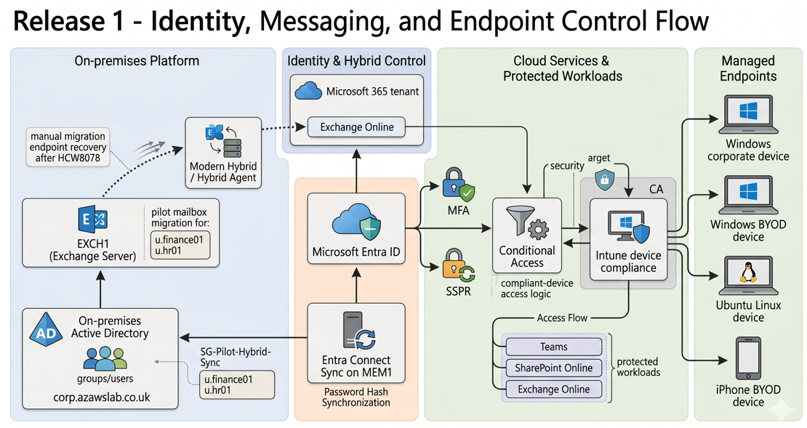

# Endpoint Overview

**Related navigation:** [README](../../README.md) | [Release 1 Summary](00-summary.md) | [Release 1 Build Checklist](11-build-checklist.md)  
**Related docs:** [Endpoint Enrollment](04-endpoint-enrollment.md) | [Endpoint Compliance](05-endpoint-compliance.md) | [Recovery Scenarios](06-recovery-scenarios.md) | [Monitoring](08-monitoring.md)

## Purpose

This page is the overview and navigation point for the Release 1 endpoint workstream in the `azawslab Enterprise Hybrid Security Platform`.

It explains how Release 1 endpoint work progressed from cross-platform enrollment into compliance, hardening, access-control relevance, and operational recovery. It should be read as the high-level endpoint story, not as the deeper enrollment, compliance, or recovery page.

## What This Page Proves

This page proves that the Release 1 endpoint workstream is broader than a single-device Intune setup.

It demonstrates:

- cross-platform endpoint coverage across Windows corporate, Windows BYOD, Ubuntu Linux, and iPhone BYOD scenarios
- Microsoft Intune and Microsoft Entra ID visibility as the foundation for managed endpoint administration
- progression from enrollment into compliance assessment and security hardening
- dependency between endpoint condition and access-control behavior in the Microsoft 365 pilot scope
- operational recovery awareness through BitLocker recovery, re-enrollment, and stale-record cleanup
- a connected endpoint story that spans onboarding, control, and lifecycle handling rather than stopping at device registration

## Implementation Story

Release 1 endpoint work should be understood as a lifecycle story rather than as a collection of isolated screenshots.

The first step was enrollment and platform coverage. Release 1 validated a corporate-managed Windows device, a Windows BYOD path, Ubuntu Linux visibility with supporting Ansible baseline automation, and iPhone BYOD enrollment through Company Portal. That established ownership distinction, platform diversity, and pilot inventory across the managed environment.

The second step was visibility and control. Once devices were present in Intune and Microsoft Entra ID, they could be assessed for compliance, included in hardening scope, and observed in the management plane. This is the point where endpoint administration became more than registration. It became policy-relevant.

The third step was hardening and access-control relevance. Windows compliance policy, security baseline assignment, update governance, and protection controls made the managed Windows devices part of the broader security story. Endpoint state was no longer just informative; it began to matter for access decisions through compliant-device logic in the Microsoft 365 pilot scope.

The fourth step was lifecycle and recovery. The BitLocker recovery, rebuild, re-enrollment, and stale-record cleanup scenario showed that endpoint administration also includes disruption handling and trust restoration, not only successful first-time onboarding.

Taken together, these steps make the endpoint workstream one of the strongest parts of Release 1. It demonstrates breadth across platforms, depth across controls, and credibility through recovery-aware operations.

## Flagship Evidence

*Figure: Release 1 control flow linking hybrid identity, Exchange migration, Intune-managed endpoints, and device-based access control across the Microsoft 365 pilot environment.*

## Why This Matters

This workstream strengthens the project because it shows endpoint administration as a connected operational domain rather than a narrow Intune setup exercise.

It now demonstrates:

- mixed ownership models
- mixed platform coverage
- policy-based compliance and hardening
- access-control dependency on endpoint condition
- lifecycle handling through recovery and cleanup

That makes the endpoint story materially stronger than a portfolio that stops at device enrollment screenshots or a single compliant Windows machine.

## Related Docs

- [Release 1 Summary](00-summary.md)
- [Endpoint Enrollment](04-endpoint-enrollment.md)
- [Endpoint Compliance](05-endpoint-compliance.md)
- [Recovery Scenarios](06-recovery-scenarios.md)
- [Monitoring](08-monitoring.md)
- [Release 1 Build Checklist](11-build-checklist.md)