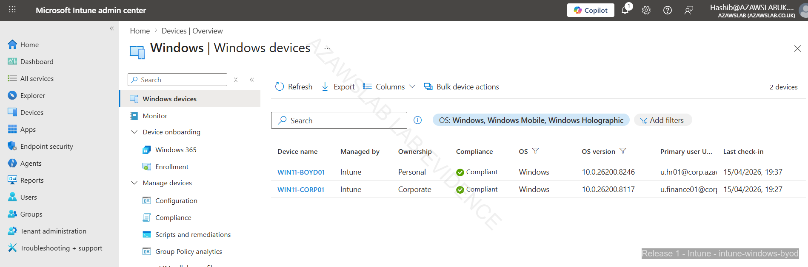
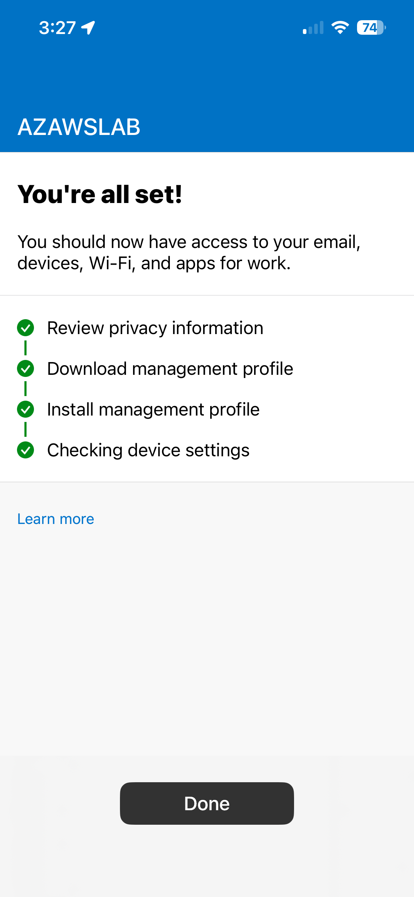
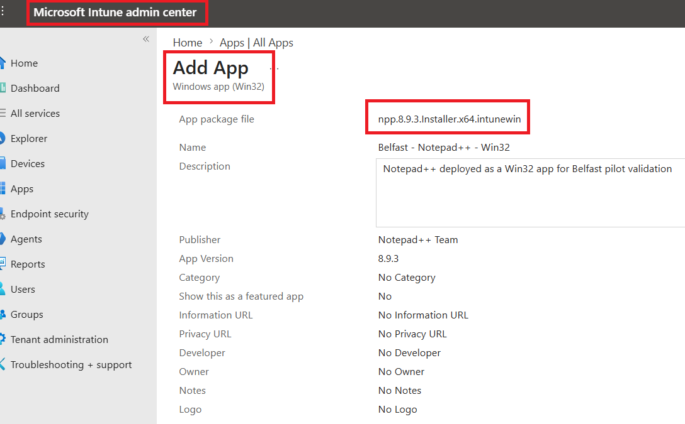
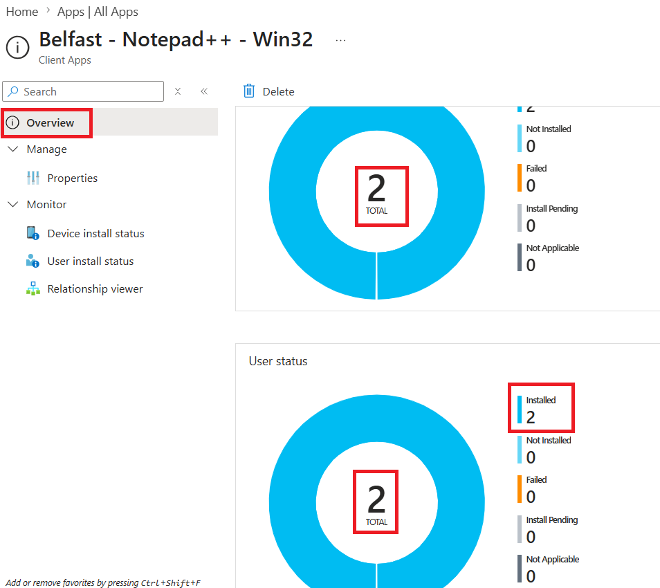
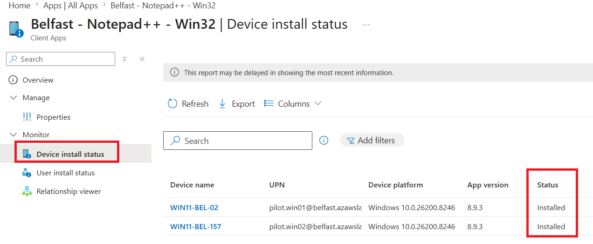

# Endpoint Overview

## Purpose

This document defines the endpoint strategy for the implemented phase of the platform. It explains how device ownership, operating system diversity, compliance, security controls, and recovery thinking were brought together into one manageable endpoint model.

It acts as the bridge between hybrid identity, endpoint onboarding, endpoint security, and operational support.

---

## What This Page Proves

The endpoint strategy proves that the platform established a workable model with:

- clear distinction between corporate and personal ownership models
- support for multiple endpoint types across Windows, Ubuntu Linux, and iPhone BYOD
- Intune as the central management layer for onboarding, compliance, and policy visibility
- a connected model linking endpoint state to identity, access, and protection controls
- an endpoint story that includes recovery and lifecycle cleanup rather than only first-time enrollment

---

## Why It Matters

Without a coherent endpoint model, identity and cloud services remain disconnected from actual device trust.

This strategy enabled:
- clearer separation between corporate and BYOD device handling
- practical support for multiple operating systems in one managed estate
- visible device-state enforcement through compliance and policy evaluation
- a stronger foundation for Conditional Access, endpoint security, and recovery workflows

---

## Endpoint Strategy Summary

The endpoint model was designed around a simple principle:

> **Identity alone is not enough; the platform must also know what device is being used, how it is owned, whether it is trusted, and how it can be recovered when things go wrong.**

That led to a strategy with four key elements:

1. **Ownership awareness** - corporate and BYOD paths should not be treated as the same
2. **Platform coverage** - Windows, Linux, and mobile access should be represented in the estate
3. **Control visibility** - device state should be visible through compliance, policy, and monitoring
4. **Operational recovery** - lifecycle mistakes, trust breaks, and stale records should be manageable

---

## Device Ownership Model

| Ownership | Enrollment / Join Model | Policy Expectation | Evidence Focus |
| :--- | :--- | :--- | :--- |
| **Corporate (Windows)** | Organization-managed enrollment | Full compliance, security baseline, BitLocker, update policy | intune-windows-corp/ |
| **BYOD (Windows)** | Personal ownership | Compliance-aware access with lighter management expectations | intune-windows-byod/ |
| **BYOD (iPhone)** | Company Portal enrollment | Identity-linked access and mobile onboarding proof | intune-ios/ |

### Corporate Devices

Corporate devices were intended to represent managed assets with stronger policy expectation and clearer compliance responsibility.

These devices are the strongest expression of the platform's endpoint trust model because they can be tied more directly to:
- management enrollment
- compliance evaluation
- security baseline application
- recovery-key handling
- update policy

### BYOD Devices

BYOD scenarios were included to show that the endpoint model was not limited to fully managed corporate hardware.

This matters because real environments often need to distinguish:
- what is organization-owned
- what is user-owned
- what level of policy is appropriate
- how access decisions should differ between those states

The platform therefore treats BYOD as part of the supported estate, but not as identical to corporate management.

---

## Platform Coverage

### Windows

Windows is the most important endpoint platform in the implemented estate because it carries the clearest compliance, baseline, recovery, and update-management story.

It demonstrates:
- corporate enrollment
- BYOD distinction
- compliance-state visibility
- security baseline application
- BitLocker handling
- update policy
- recovery after disruption

### Ubuntu Linux

Ubuntu Linux was included to show that the endpoint layer was not treated as Windows-only.

The Linux path matters because it demonstrates:
- platform diversity
- visibility beyond the default Microsoft desktop path
- automation support through Ansible baseline work
- a broader view of endpoint management maturity

### iPhone BYOD

iPhone BYOD validation was included to show that the endpoint model also extended to mobile onboarding and Company Portal-based enrollment.

This adds credibility because it demonstrates that the endpoint story includes mobile identity-linked access, not just desktop systems.

---

## Management and Control Model

Intune is the central management layer for this endpoint strategy.

It provides the platform with:
- enrollment and device visibility
- ownership differentiation
- compliance-state evaluation
- policy application
- baseline enforcement
- update management
- recovery-linked visibility

This makes Intune more than an enrollment tool. In this project, it acts as the operational layer connecting:
- user identity
- device state
- policy outcome
- supportability

---

## Relationship to Identity and Access

The endpoint model is closely tied to the identity model.

Hybrid identity establishes **who** the user is. The endpoint layer helps establish:
- **what** device is being used
- **whether** it is managed or compliant
- **how** access should be interpreted in context

This is why endpoint management, compliance, and Conditional Access should be read together rather than as isolated capabilities.

---

## Relationship to Security and Recovery

The endpoint strategy also supports the protection and recovery model.

A device is not truly part of a manageable platform unless it can be:
- enrolled
- evaluated
- protected
- rebuilt
- re-enrolled
- cleaned up when duplicate or stale records appear

That is why the endpoint story in this project intentionally includes both:
- onboarding and policy control
- recovery and lifecycle correction

---

## Flagship Evidence

### 1. Corporate and BYOD visibility in the managed estate

*Managed device view showing distinction between corporate and personal ownership, demonstrating that the endpoint estate was designed with different ownership models rather than a one-size-fits-all approach.*

### 2. Corporate Windows device in compliant state

*Corporate Windows endpoint shown as compliant in Intune, confirming that enrollment, policy application, and device-state evaluation were functioning together as intended.*

### 3. iPhone BYOD enrollment completion

*iPhone BYOD enrollment completed through Company Portal, showing that the endpoint model extended beyond desktop systems into mobile onboarding.*

---

## What Was Validated

The endpoint strategy validated that:
- the managed estate could distinguish between corporate and personal device ownership
- Windows corporate and BYOD scenarios could both be represented in Intune
- Linux and iPhone paths could be brought into the broader management story
- endpoint state could be linked to compliance, security, and monitoring outcomes
- device lifecycle handling could extend beyond enrollment into recovery and cleanup

---

## Advanced Validation Added After Baseline

The following capability was implemented after the core Release 1 baseline was completed. It extends the endpoint overview story with **Win32 application deployment** – packaging, creation, assignment, and install status – demonstrating practical application lifecycle management within Intune. This directly addresses job‑market demand for Intune application deployment skills.

Evidence was captured in a compatible environment that preserved the existing platform naming and domain context for consistency.

---

### Advanced Validation: Win32 Application Deployment

**What was validated**

The platform includes a validated Win32 application deployment workflow for a real-world productivity tool (Notepad++). The validation covers:

- **Application packaging** – using the `IntuneWinAppUtil.exe` tool to convert the installer into the `.intunewin` format
- **Application creation** – configuring metadata, install/uninstall commands, and detection rules
- **Assignment** – targeting the application to pilot devices or user groups
- **Install status** – verifying successful installation from both device and user perspectives

**Why this matters**

Intune application deployment is a core responsibility for modern endpoint management roles. Demonstrating the complete Win32 app lifecycle – from packaging to successful installation visibility – shows that the platform is capable of delivering line‑of‑business and productivity applications in a managed, repeatable way. This is a direct response to market expectations for Intune administration and application lifecycle management.

**Implementation and evidence**

- The Notepad++ installer was packaged using `IntuneWinAppUtil.exe`, producing an `.intunewin` file.
- In Intune, a Win32 app entry was created with:
  - Install command: `notepadplusplus-installer.exe /S` (silent installation)
  - Uninstall command: `"C:\Program Files\Notepad++\uninstall.exe" /S`
  - Detection rule: file/folder existence at `C:\Program Files\Notepad++\notepad++.exe`
- The app was assigned to the pilot device group (`SG-Autopilot-Win-Belfast` or similar).
- After deployment, the install status was verified:
  - **Device install status** showed successful installation on the target device.
  - **User install status** showed successful installation for the logged‑on user context.

**Flagship evidence**

*Win32 app creation screen showing the packaged Notepad++ application with metadata, install/uninstall commands, and detection rule configuration.*

*Application overview showing successful installation status across two devices, confirming that the deployment was effective.*

*Device‑level install status showing that the Notepad++ application was successfully deployed to the target Windows device.*

**Outcome**

Win32 application deployment is now validated as part of the Intune management capability. The platform can package a Win32 app, create it in Intune, assign it to a pilot group, and verify successful installation. This adds a critical application lifecycle management dimension to the endpoint story.

---

## Updated Scope Boundaries

The Win32 application deployment advanced validation above **does not** claim:

- enterprise‑scale application packaging and deployment across hundreds of applications
- complex dependency management or supersedence rules
- automated application testing or rollback capabilities
- deployment to non‑Windows platforms (the validated app is Windows‑only)

The evidence is limited to a single pilot application (Notepad++) and the specific device/user scope shown. Broader application portfolio management, additional packaging formats (MSI, MSIX), and automated deployment pipelines remain future enhancement areas.

---

## Scope Boundaries

This endpoint overview should be read as a description of the implemented endpoint model, not as a claim to every endpoint-management capability.

Important boundaries:
- Android BYOD / MAM is not yet fully evidenced
- Windows Autopilot / ESP optimization is not yet implemented
- not every platform has the same depth of policy and recovery evidence
- some controls are stronger on Windows than on Linux or mobile
- the broad endpoint security story is documented in the dedicated compliance and security page rather than fully expanded here

---

## Related Documents

- [Release 1 Summary](00-summary.md)
- [Hybrid Identity](01-hybrid-identity.md)
- [Endpoint Enrollment](04-endpoint-enrollment.md)
- [Endpoint Compliance and Security](05-endpoint-compliance-and-security.md)
- [Recovery Scenarios](06-recovery-scenarios.md)
- [Monitoring](08-monitoring.md)

For cross-release context:
- [Platform Overview](../foundation/01-platform-overview.md)
- [Roadmap](../foundation/04-roadmap.md)
- [Skills and Evidence Index](../foundation/05-skills-and-evidence-index.md)

---

## Related Evidence

- [Endpoint Management Evidence Hub](../../screenshots/release1/endpoint-management/README.md)
- [Intune Evidence Hub](../../screenshots/release1/endpoint-management/intune/README.md)
- [Release 1 Evidence Dashboard](../../screenshots/release1/README.md)