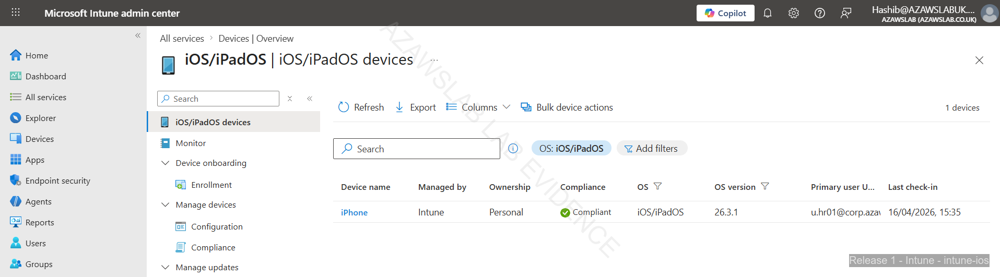
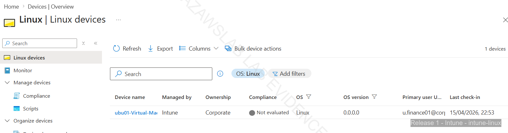

# Endpoint Enrollment

## Purpose

This page explains how the platform validated endpoint onboarding across Windows corporate, Windows BYOD, Ubuntu Linux, and iPhone BYOD scenarios.

It focuses on how enrollment was approached as a controlled operational process rather than a one-time portal exercise, with attention to ownership model, platform differences, and downstream compliance and security outcomes.

---

## What This Page Proves

This page proves that the platform established a workable endpoint onboarding model with:

- distinct enrollment paths for corporate and personal ownership
- successful onboarding across Windows, Ubuntu Linux, and iPhone BYOD scenarios
- Intune as the central service for enrollment visibility and state tracking
- device enrollment that feeds into later compliance, security, monitoring, and recovery workflows
- supportable device onboarding rather than isolated "device added” screenshots

---

## Why It Matters

This work enabled:
- practical onboarding paths for different device types and ownership states
- a stronger link between user identity and device trust
- visible device-state tracking inside the management platform
- downstream validation of compliance, security baseline, update, and recovery controls

Without a functioning enrollment model, the wider endpoint strategy would remain theoretical.

---

## Enrollment Approach

| Platform | Ownership | Enrollment Method | Key Evidence |
| :--- | :--- | :--- | :--- |
| **Windows 11** | Corporate | Organization-managed enrollment | Corporate compliant device screenshot |
| **Windows 11** | BYOD | Personal ownership enrollment | Corporate + BYOD visibility screenshot |
| **iPhone 13** | BYOD | Company Portal enrollment | Enrollment completion screen |
| **Ubuntu Linux** | Test / managed platform validation | Intune enrollment and visibility | Linux visibility evidence referenced in the evidence hub |

| Platform | Ownership | Enrollment Method | Key Evidence |
| :--- | :--- | :--- | :--- |
| **Windows 11** | Corporate | Organization-managed enrollment | Corporate compliant device screenshot |
| **Windows 11** | BYOD | Personal ownership enrollment | Corporate + BYOD visibility screenshot |
| **iPhone 13** | BYOD | Company Portal enrollment | Enrollment completion screen |
| **Ubuntu Linux** | Test / managed platform validation | Intune enrollment and visibility | Linux visibility evidence referenced in the evidence hub |

The onboarding strategy was built around one principle:

> **Enrollment should establish a manageable device state, not just register a device name in the admin portal.**

That meant treating enrollment as the start of the lifecycle rather than the end of the setup process.

The implementation aimed to show:
- different handling for corporate and personal ownership
- support for more than one operating system
- visibility of enrolled state inside Intune
- a path from onboarding into compliance, security, and support workflows

---

## Ownership-Aware Enrollment

### Corporate Windows Enrollment

Corporate Windows onboarding represents the strongest and most fully managed path in this phase.

This path matters because it supports:
- organization-managed enrollment
- stronger compliance expectations
- security baseline application
- BitLocker and update-policy integration
- clearer recovery and rebuild workflows

It is the clearest example of the intended managed-device control model.

### Windows BYOD Enrollment

Windows BYOD onboarding was included to show that the device estate was not limited to organization-owned machines.

This path is important because it demonstrates:
- distinction between personal and corporate ownership
- lighter management expectations than full corporate control
- ability to connect personal devices into a governed access model without pretending they are identical to managed corporate assets

### iPhone BYOD Enrollment

The iPhone BYOD path demonstrates that the onboarding model extends to mobile devices through Company Portal-based enrollment.

This matters because it shows:
- mobile identity-linked access
- non-desktop coverage in the endpoint estate
- a broader understanding of realistic user access patterns

---

## Platform-Specific Enrollment Coverage

### Windows

Windows is the most important enrollment platform in this phase because it carries the clearest connection between:
- enrollment
- compliance
- security baseline
- BitLocker controls
- Windows Update for Business
- recovery and re-enrollment

This gives the Windows path the richest operational story in the endpoint layer.

### Ubuntu Linux

Ubuntu Linux was included to show that the environment was not treated as Windows-only.

The Linux path demonstrates:
- platform diversity
- visibility of Linux devices within the broader management story
- connection between device enrollment and automation support through Ansible baseline work

It is not intended to imply equal policy depth with Windows, but it does strengthen the credibility of the overall endpoint model.

### iPhone BYOD

The iPhone BYOD path demonstrates that enrollment coverage includes mobile access scenarios and not only desktops or laptops.

This strengthens the platform story by showing that:
- user-linked device onboarding extends to mobile
- the management model is broader than traditional Windows administration
- BYOD access scenarios were treated as part of the supported estate

---

## Intune as the Enrollment Layer

Intune is the central service for endpoint onboarding in this phase.

It provides:
- enrollment visibility
- ownership differentiation
- device-state tracking
- the policy path into compliance and security
- the management context needed for monitoring and later recovery workflows

This means enrollment should be understood as the first visible stage of endpoint governance, not merely a registration event.

---

## Relationship to the Rest of the Endpoint Model

Enrollment is only one part of the endpoint story, but it is the part that makes everything else possible.

Once a device is onboarded, it becomes possible to:
- evaluate compliance
- apply baseline and protection controls
- monitor state
- recover from trust disruption
- re-enroll after rebuild
- clean up stale or duplicate records

That is why this page should be read together with:
- endpoint overview
- endpoint compliance and security
- recovery scenarios
- monitoring

---

## Flagship Evidence

### 1. Corporate Windows device in compliant state

*Corporate Windows endpoint shown as compliant in Intune, demonstrating that the enrollment path fed successfully into policy application and device-state evaluation.*

### 2. Corporate and BYOD visibility in the same managed estate

*Managed device view showing both corporate and personal Windows ownership states, confirming that the onboarding model distinguished between ownership types rather than treating all devices identically.*

### 3. iPhone BYOD enrollment completion

*iPhone BYOD enrollment completed through Company Portal, showing that the onboarding strategy extended beyond desktop systems into mobile device access.*

### 4. Ubuntu Linux visibility in the managed estate

*Ubuntu Linux device visible in the managed estate, showing that the endpoint model extended beyond Windows and mobile scenarios into broader platform coverage.*

---

## Additional Enrollment Evidence

The full enrollment evidence set also includes:
- Ubuntu Linux device visibility
- earlier Windows corporate enrollment steps
- Windows BYOD onboarding flow
- iPhone enrollment progression before completion
- related Ansible baseline support for Linux platform preparation

For deeper proof browsing:
- [Intune Evidence Hub](../../screenshots/release1/endpoint-management/intune/README.md)
- [Endpoint Management Evidence Hub](../../screenshots/release1/endpoint-management/README.md)

---

## What Was Validated

The enrollment work validated that:
- Windows corporate and Windows BYOD onboarding could coexist inside one managed estate
- mobile BYOD enrollment could be completed through Company Portal
- Linux device coverage could be included in the wider platform story
- Intune provided the necessary visibility to connect enrollment to later compliance and control outcomes
- onboarding was strong enough to support later security, monitoring, and recovery workflows

---

## Advanced Validation Added After Baseline

The following capabilities were implemented after the core Release 1 baseline was completed. They extend the endpoint enrollment story with modern cloud‑led provisioning (Windows Autopilot and Enrollment Status Page) and Graph‑assisted operational support for device state visibility and management. Evidence was captured in a compatible environment that preserved the existing platform naming and domain context for consistency.

---

### Advanced Validation: Windows Autopilot and ESP

**What was validated**

Windows Autopilot and Enrollment Status Page (ESP) were introduced as an advanced validation layer to demonstrate cloud‑led Windows onboarding alongside the existing manual enrollment paths. The validation covers:

- Autopilot deployment profile assignment to a dynamic device group
- ESP profile configuration (device preparation and account setup stages)
- Company branding visible during the sign‑in experience
- Device import with group tag assignment
- Zero‑touch, user‑driven provisioning through Out‑of‑Box Experience (OOBE)
- Post‑enrollment managed state in Intune

**Why this matters**

Autopilot and ESP are market‑relevant capabilities for modern endpoint management. Adding them after the baseline shows that the platform can evolve from traditional manual enrollment into a more automated, user‑friendly provisioning model without breaking the existing control story.

**Implementation context**

During implementation, the original Azure VM path was not suitable for producing clean, end‑to‑end Autopilot OOBE and ESP validation because of limitations in the Azure nested virtualisation and network experience. To maintain technical credibility, the validation was moved to a local Hyper‑V workflow where the provisioning sequence, ESP stages, and post‑enrollment state could be captured properly.

**Key steps and evidence**

- An Autopilot deployment profile (`R1-Autopilot-Corp-Belfast`) was created and assigned to the dynamic device group `SG-Autopilot-Win-Belfast`.
- An ESP profile (`R1-ESP-Corp-Belfast`) was configured with both device preparation and account setup stages, then assigned to the same group.
- Company branding assets were configured, appearing during the OOBE sign‑in flow.
- A test device was imported into Autopilot using a group tag (`Belfast-Pilot`) to control profile assignment.
- The device was reset, and the user‑driven OOBE flow started with the customised sign‑in screens.
- ESP progressed through the device preparation stage (screenshot captured).
- After completion, the device appeared in Intune as a managed corporate asset.

**Flagship evidence**

*Autopilot device import showing group tag `Belfast-Pilot` and successful profile assignment, demonstrating that the device was correctly associated with the intended deployment profile.*

*ESP device preparation stage during provisioning. The account setup stage was also configured and validated operationally, but its screenshot was not captured separately; the end‑to‑end workflow completed successfully.*

**Outcome**

Windows Autopilot and ESP are now validated as an additional provisioning path alongside existing manual enrollment methods. The platform can support both traditional IT‑led onboarding and modern user‑driven, zero‑touch provisioning.

---

### Advanced Validation: Graph‑Assisted Autopilot Operational Support

**What was validated**

A separate operational validation was added to show how Graph/PowerShell can support Autopilot and broader device management activities. This is not a diagnostics console (Shift+F10) scenario, but rather administrative scripting that provides visibility and control over device state.

The validation includes:

- Querying Autopilot device state using `Get-BelfastAutopilotDeviceState.ps1`
- Retrieving managed device state details via `Get-BelfastManagedDeviceState.ps1`
- Performing a managed device rename using `Rename-BelfastManagedDevice.ps1` (dry‑run and apply)

**Why this matters**

Operational tooling is a key differentiator between a “configured platform” and a “supportable platform”. These scripts demonstrate that an administrator can programmatically check provisioning status, validate device objects, and correct naming issues without relying solely on portal UI. This is especially relevant for supporting Autopilot at scale.

**Implementation and evidence**

- The Graph PowerShell SDK was connected with appropriate delegated permissions (consent scoped to user read/write, device read/write, and organisation read).
- `Get-BelfastAutopilotDeviceState.ps1` was executed to confirm the presence and status of Autopilot‑enrolled devices.
- `Get-BelfastManagedDeviceState.ps1` returned detailed compliance and management state for a specific device.
- `Rename-BelfastManagedDevice.ps1` was run first in dry‑run mode to preview the change, then in apply mode to rename `desktop-cdniaqb` to `win11-bel-02`.

**Flagship evidence**

*Output of `Get-BelfastManagedDeviceState.ps1` showing detailed device properties, compliance state, and management status. This proves that administrative visibility can be scripted rather than only accessed through the portal.*

*Successful apply of the device rename operation via `Rename-BelfastManagedDevice.ps1`, demonstrating script‑controlled device management alongside the Autopilot provisioning workflow.*

**Outcome**

Graph‑assisted operational support for Autopilot and device management is validated. The platform now includes reusable scripts that provide state visibility and control actions, strengthening its supportability story.

---

## Updated Scope Boundaries

The Autopilot and Graph‑assisted advanced validation sections above **do not** claim:

- enterprise‑wide Autopilot deployment maturity
- full Graph orchestration of ESP behaviour (ESP remains policy‑driven, not script‑controlled)
- Shift+F10 or diagnostics console evidence (the validation uses script outputs, not interactive troubleshooting screenshots)
- coverage for non‑Windows platforms in the Autopilot path

The evidence is limited to the pilot Windows corporate device set and the specific operational scripts shown. Broader Autopilot rollouts, additional diagnostics workflows, and Graph automation for full lifecycle management remain future enhancement areas.

## Scope Boundaries

This page should be read as evidence of the implemented onboarding model, not as a claim to every enrollment capability.

Important boundaries:
- Android BYOD / MAM is not yet fully evidenced
- Windows Autopilot / ESP optimization is not yet implemented
- not every operating system has the same depth of control coverage after enrollment
- Windows has the deepest downstream evidence for compliance, baseline, recovery, and update handling
- this page focuses on onboarding; the dedicated compliance and security page carries the broader control story

---

## Related Documents

- [Release 1 Summary](00-summary.md)
- [Endpoint Overview](03-endpoint-overview.md)
- [Endpoint Compliance and Security](05-endpoint-compliance-and-security.md)
- [Recovery Scenarios](06-recovery-scenarios.md)
- [Monitoring](08-monitoring.md)
- [Build Checklist](11-build-checklist.md)

For cross-release context:
- [Platform Overview](../foundation/01-platform-overview.md)
- [Roadmap](../foundation/04-roadmap.md)
- [Skills and Evidence Index](../foundation/05-skills-and-evidence-index.md)

---

## Related Evidence

- [Intune Evidence Hub](../../screenshots/release1/endpoint-management/intune/README.md)
- [Endpoint Management Evidence Hub](../../screenshots/release1/endpoint-management/README.md)
- [Release 1 Evidence Dashboard](../../screenshots/release1/README.md)

