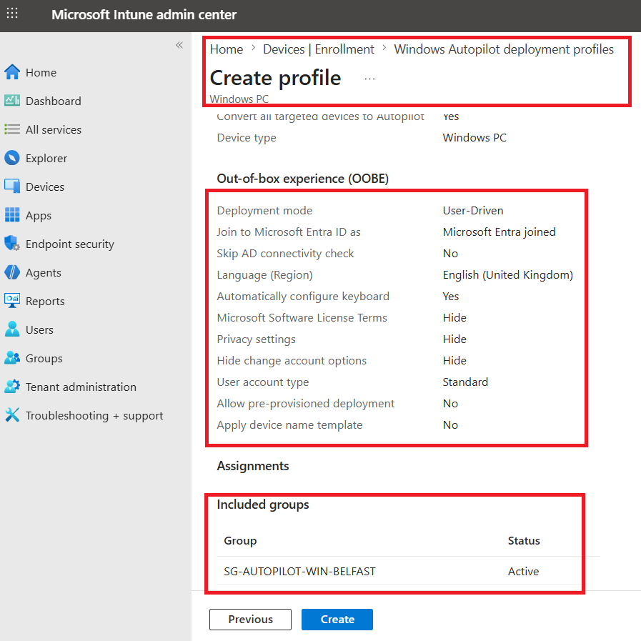
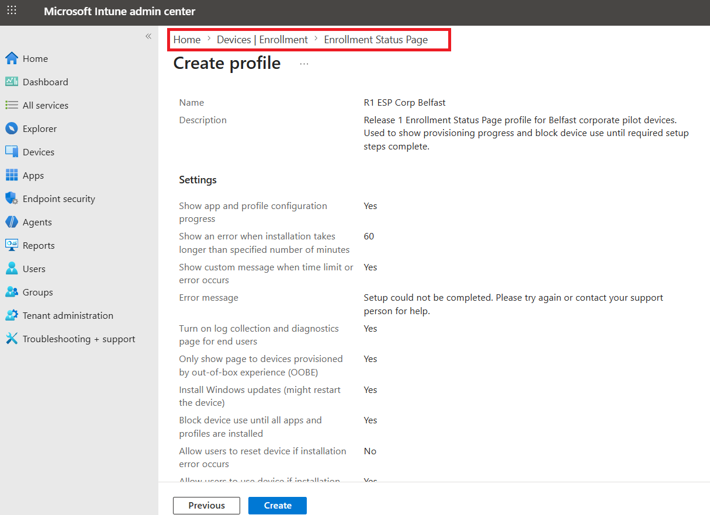
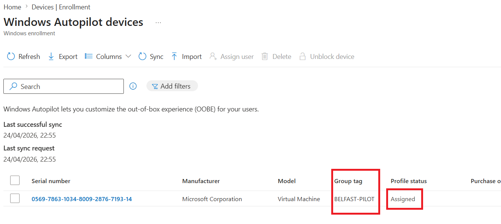
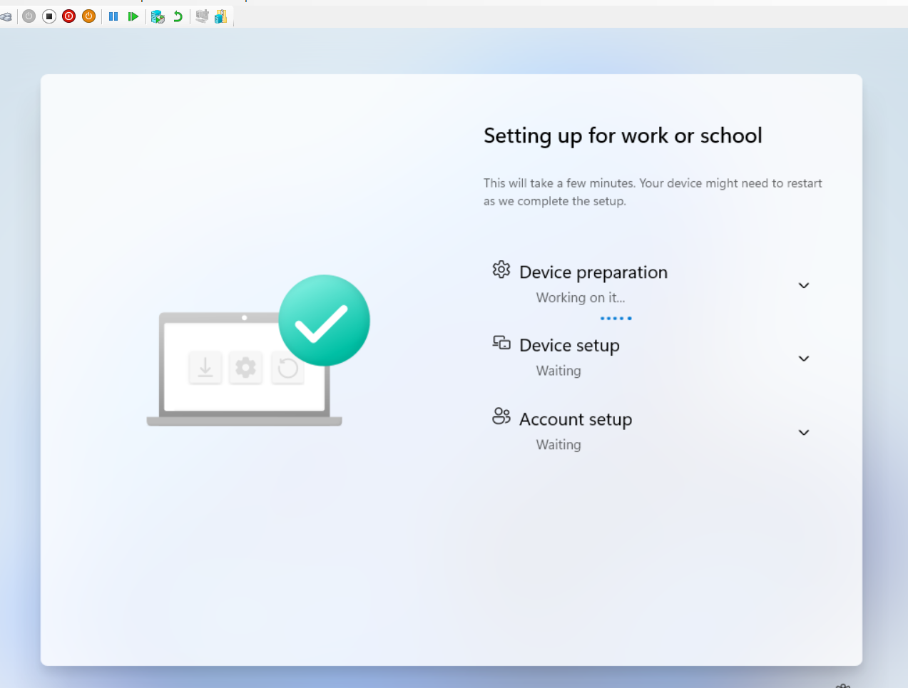

# Endpoint Enrollment

## Purpose

This page explains how Release 1 validated endpoint onboarding across Windows corporate, Windows BYOD, Ubuntu Linux, and iPhone BYOD scenarios, and how the endpoint story was later extended with Autopilot and Enrollment Status Page (ESP) validation as advanced capability work added after the original baseline.

It focuses on endpoint onboarding as a controlled operational workflow rather than a one-time portal exercise, with attention to ownership model, platform differences, provisioning flow, and the managed state reached after enrollment.

---

## What This Page Proves

This page proves that the platform established a workable endpoint onboarding and provisioning model with:

- distinct enrollment paths for corporate and personal ownership
- successful onboarding across Windows, Ubuntu Linux, and iPhone BYOD scenarios
- Intune as the central service for enrollment visibility and state tracking
- device onboarding that feeds into later compliance, security, monitoring, and recovery workflows
- advanced validation added after baseline for Windows Autopilot and ESP
- custom branding and group-targeted Autopilot provisioning
- post-enrollment managed state review and supporting operational follow-up
- Microsoft Graph API and PowerShell used for Autopilot-related operational support after provisioning

---

## Why It Matters

Without a functioning enrollment model, the wider endpoint strategy would remain theoretical.

This work matters because it demonstrates:

- practical onboarding paths for different device types and ownership states
- a stronger link between user identity and device trust
- visible device-state tracking inside the management platform
- a path from onboarding into compliance, security, monitoring, and recovery
- progression from baseline management into more modern cloud-led Windows provisioning

Release 1 therefore shows not only that devices could be enrolled, but that enrollment could become the start of a broader managed-device lifecycle.

---

## Enrollment Approach

| Platform | Ownership | Enrollment Method | Role in the Release 1 story |
| :--- | :--- | :--- | :--- |
| **Windows 11** | Corporate | Organization-managed enrollment | Strongest baseline managed-device path |
| **Windows 11** | BYOD | Personal ownership enrollment | Ownership separation and lighter-governance proof |
| **iPhone** | BYOD | Company Portal enrollment | Mobile onboarding and identity-linked access proof |
| **Ubuntu Linux** | Test / managed platform validation | Intune enrollment and visibility | Platform diversity and Linux visibility in the estate |

The onboarding model was built around one principle:

> **Enrollment should establish a manageable device state, not just register a device name in the admin portal.**

That meant treating enrollment as the first visible stage of endpoint governance rather than the end of setup.

---

## Baseline Enrollment Model

The original Release 1 baseline established endpoint onboarding across multiple ownership and platform types before Autopilot and ESP were introduced.

That baseline already proved that the platform could:

- enroll corporate Windows devices into managed state
- distinguish personal Windows devices from corporate-owned devices
- extend enrollment coverage to iPhone BYOD through Company Portal
- represent Ubuntu Linux in the broader managed estate
- connect enrolled state to later compliance, security, monitoring, and recovery outcomes

This baseline remains important because the later Autopilot work builds on an already functioning endpoint-management foundation rather than replacing it.

---

## Ownership-Aware Enrollment

### Corporate Windows Enrollment

Corporate Windows onboarding represents the strongest and most fully managed path in this phase.

This path matters because it supports:

- organization-managed enrollment
- stronger compliance expectations
- security baseline application
- BitLocker and update-policy integration
- clearer recovery and rebuild workflows

It is the clearest expression of the intended managed-device control model in the original Release 1 baseline.

### Windows BYOD Enrollment

Windows BYOD onboarding was included to show that the device estate was not limited to organization-owned hardware.

This path demonstrates:

- a clear distinction between personal and corporate ownership
- lighter management expectations than full corporate control
- the ability to connect personal devices into a governed access model without pretending they are identical to managed corporate assets

### iPhone BYOD Enrollment

The iPhone BYOD path demonstrates that the onboarding model extends to mobile devices through Company Portal-based enrollment.

This matters because it shows:

- mobile identity-linked access
- non-desktop coverage in the endpoint estate
- a broader understanding of realistic user access patterns

### Ubuntu Linux Enrollment

Ubuntu Linux was included to show that the environment was not treated as Windows-only.

The Linux path demonstrates:

- platform diversity
- visibility of Linux devices within the broader management story
- connection between device enrollment and automation support through Ansible baseline work

It is not intended to imply equal policy depth with Windows, but it does strengthen the credibility of the overall endpoint model.

---

## Intune as the Enrollment Layer

Intune is the central service for endpoint onboarding in this phase.

It provides:

- enrollment visibility
- ownership differentiation
- device-state tracking
- the policy path into compliance and security
- the management context needed for monitoring and later recovery workflows

This means enrollment should be understood as the first visible stage of endpoint governance, not merely a registration event.

---

## Advanced Validation Added After Baseline: Windows Autopilot and ESP

After the original Release 1 baseline was completed, the endpoint story was extended with Windows Autopilot and Enrollment Status Page (ESP) validation to strengthen the project’s modern provisioning coverage.

The original baseline already demonstrated endpoint management, enrollment, compliance, and security control paths. Autopilot and ESP were then added as advanced validation to show how the same platform could support cloud-led Windows onboarding and a more role-relevant Intune provisioning workflow.

This later validation is important because it extends the project from “managed devices can be enrolled” into “managed Windows devices can also be provisioned through a modern deployment path.”

### Why this was added later

Autopilot and ESP were not part of the original baseline freeze. They were introduced later as advanced validation to improve the endpoint-management story without rewriting the earlier implementation history.

That distinction matters because it preserves technical honesty:

- the baseline already proved managed onboarding
- the later work extended that baseline into modern provisioning
- the capability should therefore be presented as **advanced validation added after baseline**, not as if it had always been part of the first-pass build

### Environment constraint and validation approach

During implementation, the original Azure VM path did not produce a clean end-to-end Autopilot OOBE and ESP validation sequence in the way needed for reviewer-facing evidence.

To keep the proof credible, the validation was moved into a more suitable local VM workflow where the branded sign-in experience, provisioning sequence, and post-enrollment state could be captured properly.

This is an operational lesson rather than a project weakness. It shows that the provisioning evidence was captured in the environment best suited to demonstrating the real workflow cleanly.

---

## Autopilot Deployment Profile

The Autopilot validation path begins with the deployment profile and its assignment logic.

In this phase, the important proof point is not just that a profile existed, but that the provisioning path was intentionally structured around:

- a dedicated Autopilot deployment profile
- pilot targeting
- a repeatable route into modern Windows provisioning
- a visible link between import, assignment, and later enrollment behavior

This makes the Autopilot story part of the managed endpoint model rather than a disconnected feature demonstration.

---

## Enrollment Status Page (ESP)

ESP was implemented as part of the overall Autopilot validation path rather than as a separate standalone capability.

The purpose of ESP in this project was to show that provisioning could include a controlled user-facing setup sequence rather than ending at device registration alone.

The strongest proof points in this area are:

- an explicit ESP profile
- branded sign-in and OOBE flow
- visible ESP progress during device preparation
- the managed state reached after enrollment

Account setup was part of the overall ESP workflow, but it was not originally separated as its own documentation subsection because it was treated as a standard stage inside the broader ESP path.

That is the right way to read the evidence here: ESP was validated as an end-to-end provisioning workflow, even where the strongest visible screenshots emphasize the most reviewer-friendly stages rather than every internal phase equally.

---

## Company Branding and User-Facing Provisioning Experience

A useful strength of the Autopilot validation path is that it includes custom branding during sign-in.

This matters because it shows that the provisioning workflow was not only technically functional, but also aligned to a recognizable user-facing enterprise onboarding experience.

In practical terms, branding evidence helps show:

- identity continuity between the tenant and the provisioning flow
- a more realistic sign-in experience
- a cleaner bridge between endpoint provisioning and the wider Microsoft 365 platform story

---

## Dynamic Group Targeting and Device Import

The provisioning model also depended on clear targeting and import logic.

This part of the workflow includes:

- a dynamic device group for the Autopilot pilot scope
- device presence in the targeted group
- import and profile assignment evidence
- group tag assignment as part of the route into the Autopilot workflow

A particularly important proof point here is the device-import and profile-assignment stage, including group tag assignment. That evidence shows how the provisioning path was prepared before the user-facing stages began.

This matters because it demonstrates that Autopilot was not documented as a vague “cloud provisioning exists” claim. It was prepared through real targeting and assignment steps that connect directly to the later OOBE and ESP experience.

---

## OOBE and ESP Execution

The OOBE and ESP portion of the workflow is where the provisioning story becomes reviewer-visible.

This is the part of the evidence that most clearly demonstrates:

- reset and re-entry into the provisioning path
- branded sign-in experience
- progression into ESP
- visible device preparation stage as part of controlled provisioning

The key point is not that every internal provisioning stage was documented as an isolated screenshot label, but that the overall workflow shows a credible route from reset into branded sign-in, then into ESP-controlled setup, and onward into managed state.

This is especially important because the project positions Autopilot and ESP as advanced validation of provisioning maturity rather than as a shallow configuration-only claim.

---

## Managed State After Enrollment

Provisioning only matters if it results in an interpretable managed state.

That is why the Autopilot evidence should be read together with post-enrollment state proof, including:

- device visibility after Autopilot
- Intune managed-state review
- related operational state checks where appropriate

This matters because it closes the loop between provisioning and governance. The Autopilot path is not presented as a wizard-completion story. It is presented as a provisioning workflow that ends in a supportable managed device state.

---

## Operational Follow-Up from the Autopilot Path

The later Autopilot work also surfaced useful operational follow-up actions rather than simple first-pass success.

This is also where **Microsoft Graph API and PowerShell** become part of the endpoint story. The provisioning path was not only validated through Intune profiles and user-facing OOBE / ESP stages, but also supported by reusable Graph-connected PowerShell tooling for device-state visibility and post-enrollment management actions. That makes the Autopilot path more than a configuration exercise; it shows a provisioning workflow that can also be reviewed, interpreted, and administratively refined after enrollment.

Two of the most valuable follow-up outcomes were:

### Managed device rename support

The initial provisioning path did not yet enforce the final generic naming approach. Rather than hide that, the project uses it to demonstrate a separate managed-device rename workflow supported by Graph and PowerShell.

That gives the provisioning story a more practical operational dimension:

- the device was enrolled and managed
- naming could then be corrected through an administrative workflow
- the project therefore demonstrates not only provisioning, but also post-provision operational refinement

The deeper Graph / PowerShell detail belongs in the Monitoring page, but it is relevant to mention here because it arose directly from the provisioning workflow.

### LAPS post-provision remediation

The Autopilot phase also highlighted the difference between user-driven enrollment and device-scoped control targeting.

That created a realistic post-provision remediation scenario in which LAPS behavior required correction through device-based targeting and script-assisted follow-up.

This strengthens the endpoint story because the project does not present Autopilot as a perfect first-pass build. It presents it as a modern provisioning capability that was implemented, validated, troubleshot, and improved operationally.

The detailed LAPS remediation narrative belongs in **Endpoint Compliance and Security**, but it is important to note here because it emerged from the Autopilot provisioning path itself.

---

## Flagship Evidence

### 1. Corporate Windows endpoint shown as compliant in Intune

*Corporate Windows endpoint shown as compliant in Intune, demonstrating that the baseline enrollment path fed successfully into policy application and device-state evaluation.*

### 2. Corporate and BYOD visibility in the same managed estate

*Corporate and personal Windows devices visible in the same managed estate, demonstrating that the enrollment model distinguished ownership while keeping both paths inside the broader Intune management story.*

### 3. Autopilot deployment profile review

*Autopilot deployment profile review showing that advanced provisioning was configured through a defined Intune profile rather than treated as an informal or undocumented setup path.*

### 4. Enrollment Status Page profile review

*ESP profile review showing that provisioning was structured to include a controlled setup experience rather than only a device registration event.*

### 5. Device import and profile assignment for the Autopilot pilot

*Autopilot device import and profile assignment evidence showing the pilot provisioning path, including group-tag-based preparation for the Autopilot workflow.*

### 6. Branded sign-in and ESP execution

*ESP device preparation stage showing the visible provisioning workflow after branded sign-in, confirming that the later-added Autopilot validation progressed into the setup experience rather than ending at profile configuration alone.*

---

## Additional Enrollment Evidence

The wider evidence set also includes:

- corporate Windows OOBE and managed-state screenshots
- Windows BYOD onboarding evidence
- iPhone BYOD enrollment flow
- Ubuntu Linux visibility evidence
- Autopilot entry points
- company branding configuration
- dynamic group targeting for the Autopilot pilot
- branded sign-in screens
- related managed-state and operational follow-up evidence

For guided proof browsing:

- [Intune Evidence Hub](../../screenshots/release1/endpoint-management/intune/README.md)
- [Endpoint Management Evidence Hub](../../screenshots/release1/endpoint-management/README.md)
- [Release 1 Evidence Dashboard](../../screenshots/release1/README.md)

---

## What Was Validated

The endpoint enrollment and provisioning work validated that:

- endpoint onboarding could be demonstrated across corporate, BYOD, Linux, and iPhone scenarios
- ownership-aware enrollment was part of the design rather than an afterthought
- Intune acted as the central service for enrollment visibility and management context
- the baseline enrollment model fed correctly into later compliance, security, monitoring, and recovery stories
- Windows Autopilot and ESP were later implemented as advanced validation added after baseline
- the Autopilot path included profile configuration, ESP configuration, branding, targeting, import, and visible provisioning progress
- provisioning outcomes could be tied to managed state and later operational follow-up
- Microsoft Graph API and PowerShell supported post-enrollment operational visibility and management actions around the provisioning path

---

## Operational Insight

A key lesson from this area is that endpoint onboarding becomes much more credible when it is treated as a lifecycle entry point rather than as a one-time setup success.

The strongest design choice here was to connect:

- enrollment
- ownership model
- provisioning workflow
- managed state after enrollment
- operational follow-up after provisioning

That is what turns the endpoint story from “devices were added” into “devices were onboarded into a governable and supportable estate.”

Autopilot and ESP strengthen that story further because they show that the platform can support a more modern provisioning path while still surfacing realistic operational lessons such as post-enrollment rename handling and LAPS targeting remediation.

---

## Scope Boundaries

This page should be read as evidence of implemented endpoint onboarding and provisioning, not as a claim to every endpoint management capability.

Important boundaries:

- Android BYOD / MAM remains outside the implemented scope of this phase
- Autopilot and ESP are presented as **advanced validation added after baseline**, not as if they were part of the original baseline freeze
- the Graph / PowerShell operational evidence tied to provisioning should be read as administrative state and support tooling, not as diagnostics-console proof
- account setup is included as part of the overall ESP validation path, but not surfaced as a separate flagship claim where distinct reviewer-facing evidence is limited
- not every operating system has the same depth of enrollment and policy evidence
- Windows remains the strongest managed-device and provisioning path in the release

---

## Related Documents

- [Release 1 Summary](00-summary.md)
- [Endpoint Overview](03-endpoint-overview.md)
- [Endpoint Compliance and Security](05-endpoint-compliance-and-security.md)
- [Recovery Scenarios](06-recovery-scenarios.md)
- [Monitoring](08-monitoring.md)
- [Build Checklist](11-build-checklist.md)
- [Extensions and Future Enhancements](12-extensions-and-future-enhancements.md)

For cross-release context:
- [Platform Overview](../foundation/01-platform-overview.md)
- [Target-State Architecture](../foundation/03-target-state-architecture.md)
- [Roadmap](../foundation/04-roadmap.md)
- [Skills and Evidence Index](../foundation/05-skills-and-evidence-index.md)

---

## Related Evidence

- [Intune Evidence Hub](../../screenshots/release1/endpoint-management/intune/README.md)
- [Endpoint Management Evidence Hub](../../screenshots/release1/endpoint-management/README.md)
- [Release 1 Evidence Dashboard](../../screenshots/release1/README.md)