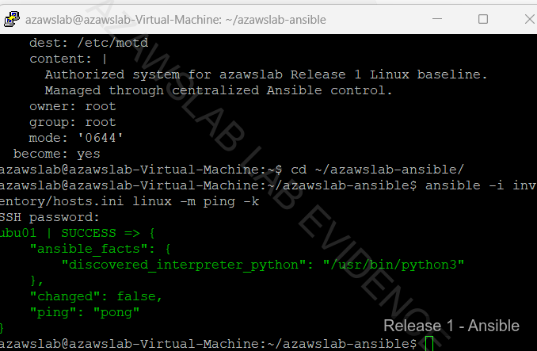

# Endpoint Enrollment and Platform Coverage

**Related navigation:** [README](../../README.md) | [Release 1 Summary](00-summary.md) | [Release 1 Build Checklist](11-build-checklist.md)  
**Related docs:** [Endpoint Overview](03-endpoint-overview.md) | [Endpoint Compliance](05-endpoint-compliance.md) | [Recovery Scenarios](06-recovery-scenarios.md) | [Monitoring](08-monitoring.md)

## Purpose

This page records the cross-platform endpoint enrollment story implemented in Release 1 of the `azawslab Enterprise Hybrid Security Platform`.

It shows how Release 1 endpoint work moved beyond a single Windows device into a broader pilot model covering corporate Windows, Windows BYOD, Ubuntu Linux visibility with Ansible baseline automation, and iPhone BYOD enrollment through Intune Company Portal. It should be read as the enrollment and platform-coverage page, not as the deeper control, compliance, or recovery page.

## What This Page Proves

This page proves that Release 1 endpoint administration is broader than a single Windows enrollment path.

It demonstrates:

- a corporate-managed Windows 11 pilot endpoint enrolled into Intune and Microsoft Entra ID
- a personal Windows 11 BYOD endpoint enrolled separately and recorded with different ownership
- Ubuntu Linux visibility in the Microsoft management plane, strengthened by Ansible baseline automation
- iPhone BYOD enrollment completed through Intune Company Portal
- a Release 1 endpoint model that now spans corporate, personal, desktop, Linux, and mobile scenarios

## Implementation Story

Release 1 endpoint coverage was built around four distinct platform scenarios, each contributing a different part of the management story.

The first and most important path was the Windows 11 corporate-managed pilot device, `WIN11-CORP01`. This device followed the work-or-school corporate enrollment path and became the primary managed Windows platform for later compliance, security-baseline, BitLocker, and recovery work. It was prepared in Hyper-V with Secure Boot and TPM-enabled context so that later security and management outcomes would sit on a credible enterprise-style foundation.

The second path was Windows 11 BYOD through `WIN11-BYOD01`. This scenario mattered because it proved that Release 1 could distinguish between corporate and personal ownership models inside Intune rather than presenting all Windows endpoints as one undifferentiated management story. The value of this path is not simply that a second device enrolled. It is that ownership-aware management became visible and comparable.

The third path was Ubuntu Linux. Release 1 does not claim Windows-equivalent Intune control depth for Linux, and it should not be presented that way. What it does prove is Linux participation in the managed environment through Intune and Entra visibility, strengthened by practical baseline administration through Ansible. That combination is important because Linux becomes more than a console-presence example; it becomes a managed platform with real operational baseline work behind it.

The fourth path was iPhone BYOD enrollment. This extended the endpoint story into mobile device management and validated the full personal-device Company Portal path. The Apple MDM Push Certificate prerequisite was completed first, then the iPhone enrollment flow was taken through Company Portal, profile installation, and final compliant state. That makes the mobile path materially stronger than a generic claim that iOS was “supported.”

Together, these four scenarios show that Release 1 endpoint work now covers platform diversity and ownership awareness, not just a single Windows test device.

## Flagship Evidence

### Windows corporate-managed endpoint

*Figure: Windows corporate-managed pilot device shown as compliant in Intune after cloud-managed onboarding and policy evaluation.*

### Windows BYOD / personal endpoint

*Figure: Intune device view showing both corporate and personal Windows pilot devices, proving ownership-aware endpoint management.*

### Linux baseline automation

*Figure: Ansible baseline playbook execution against the Ubuntu endpoint, showing that Linux governance in Release 1 included operational automation as well as Intune visibility.*

### iPhone BYOD enrollment completion

*Figure: iPhone BYOD enrollment completed through Intune Company Portal, proving the mobile endpoint path was validated end to end.*

## Why This Matters

This workstream strengthens the project because it shows that Release 1 endpoint administration is not limited to a single Windows-only enrollment path.

It now demonstrates:

- corporate-owned Windows enrollment
- personal Windows BYOD enrollment
- mixed-platform Linux participation with baseline automation
- mobile BYOD enrollment through iPhone

That makes the overall endpoint story more credible and more representative of a modern workplace environment than a narrow Intune lab built around one device type.

## What Release 1 Does Not Claim

To keep the endpoint-platform story credible, Release 1 does not claim:

- equal management depth across all platforms
- Windows-equivalent Intune control depth for Linux
- full Android BYOD / MAM validation
- advanced mobile-app protection maturity
- complete recovery or security-control detail for every platform in this page

Deeper compliance, security-baseline, and recovery evidence is intentionally covered in the later endpoint pages.

## Related Docs

- [Release 1 Summary](00-summary.md)
- [Endpoint Overview](03-endpoint-overview.md)
- [Endpoint Compliance](05-endpoint-compliance.md)
- [Recovery Scenarios](06-recovery-scenarios.md)
- [Monitoring](08-monitoring.md)
- [Release 1 Build Checklist](11-build-checklist.md)