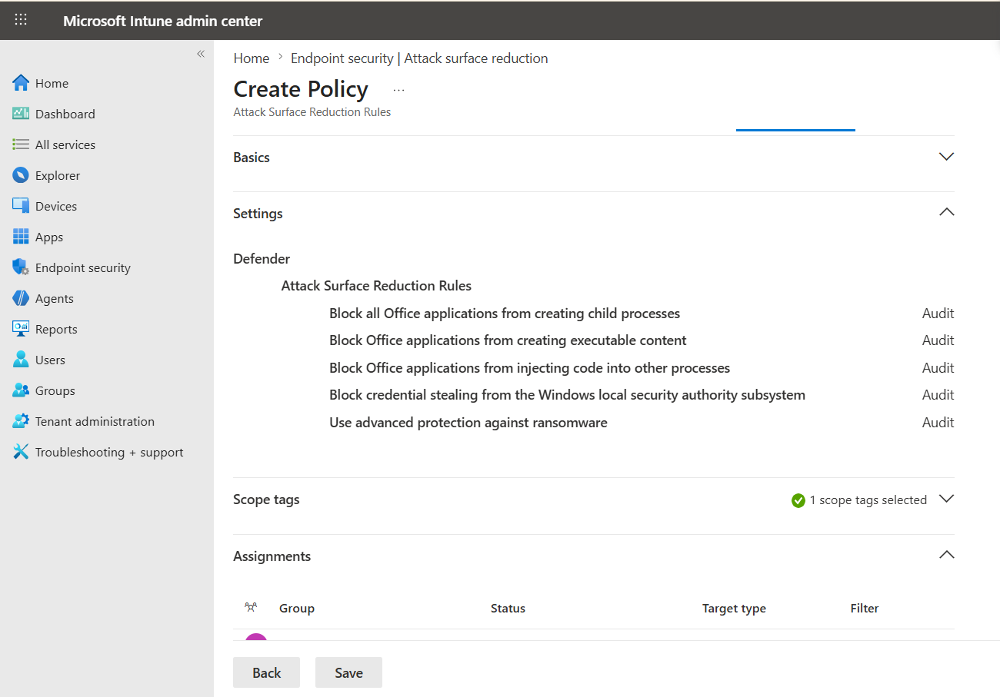

# Endpoint Compliance and Security Baseline

**Related navigation:** [README](../../README.md) | [Release 1 Summary](00-summary.md) | [Release 1 Build Checklist](11-build-checklist.md)  
**Related docs:** [Endpoint Overview](03-endpoint-overview.md) | [Endpoint Enrollment](04-endpoint-enrollment.md) | [Recovery Scenarios](06-recovery-scenarios.md) | [Monitoring](08-monitoring.md)

## Purpose

This page records the endpoint control layer implemented in Release 1 of the `azawslab Enterprise Hybrid Security Platform`.

Where the endpoint enrollment page shows how pilot devices entered the managed environment, this page shows how Release 1 moved into policy assessment, security hardening, update governance, and access-control relevance. It should be read as the endpoint-control and hardening page, not as the deeper recovery page.

## What This Page Proves

This page proves that Release 1 endpoint work progressed beyond device enrollment into actual control enforcement.

It demonstrates:

- a Windows compliance-policy baseline assigned through pilot groups rather than one-off device targeting
- a Windows security baseline applied as a distinct hardening layer beyond compliance assessment
- compliance progression over time, including earlier noncompliant states and later validated compliant states
- patching and update-governance inclusion through Windows Update for Business
- additional endpoint-protection depth through Attack Surface Reduction policy evidence
- BitLocker functioning as both a security requirement and a recovery-relevant control
- compliant-device logic contributing to Conditional Access-aligned access control
- Windows LAPS identified as an important follow-on recovery control, with implementation direction established but not fully validated

## Implementation Story

Release 1 endpoint control was built as a layered Windows management model rather than a simple “device enrolled” outcome.

The first layer was compliance policy. A baseline Windows compliance policy, `CP-WIN-Release1-Baseline`, was created and assigned through pilot groups rather than through per-device direct targeting. That matters because it shows policy scope was designed to be ownership-aware and expandable, not treated as a temporary one-device test.

The compliance story also developed over time. Earlier states showed noncompliance while encryption, policy effects, and remediation behavior were still being validated. Later evidence showed the Windows pilot devices reaching compliant status against both the Release 1 baseline and the default device-compliance layer. That timeline is important because it makes the project more credible than a page that pretends devices were healthy from the first moment of enrollment.

The second layer was security baseline. A Windows security baseline, `SB-WIN-Release1-Baseline`, was applied to the pilot Windows groups as a separate hardening mechanism. In Release 1, the important distinction is that compliance answers whether a device meets required conditions, while the security baseline pushes the device toward a stronger default posture. Together, those controls turn endpoint work into governance rather than just visibility.

The third layer was patching and endpoint-protection depth. Windows Update for Business pilot assignment shows that Release 1 included update governance as part of endpoint control, while Attack Surface Reduction evidence shows that hardening extended beyond simple compliance-state reporting into attack-surface reduction.

BitLocker became one of the most important controls in this layer. It contributed directly to security posture and compliance, but it also became operationally significant during the recovery scenario. That is important because it shows that some endpoint controls are not only about configuration. They also shape recoverability, trust restoration, and lifecycle handling.

The endpoint-control story became stronger still when device state was tied to access logic. Release 1 Conditional Access pilot behavior used compliant-device logic in Microsoft 365 pilot scope, which means access control was beginning to depend on endpoint condition rather than existing independently from it.

Windows LAPS belongs in this story as an important adjacent control. Release 1 should describe it carefully: the direction is established, pilot implementation work has begun, and assignment evidence exists, but password retrieval and deeper recovery validation are not yet documented strongly enough to overstate maturity.

Taken together, these elements show that Release 1 endpoint work moved into policy enforcement, hardening, patching, and access-control relevance rather than stopping at enrollment alone.

## Flagship Compliance and Security Evidence

### Compliance policy evaluation

*Figure: Compliance-policy results view showing enforcement and evaluation state during policy rollout, illustrating that compliance was validated over time rather than assumed from day one.*

### Security baseline assignment

*Figure: Windows security baseline assigned to the Release 1 pilot device groups, showing that hardening was applied through group-based targeting rather than one-off device configuration.*

### Update governance

*Figure: Windows Update for Business pilot assignment showing that patching and update governance were included in the Release 1 endpoint-control layer.*

### Endpoint protection and ASR

*Figure: Attack Surface Reduction policy evidence showing that endpoint-protection controls extended beyond compliance and baseline assignment into attack-surface hardening.*

### Restored healthy managed state

*Figure: Restored compliant state after re-enrollment, showing that Release 1 endpoint control included not only policy assignment but also recovery back to a healthy managed condition.*

## Why This Matters

This workstream strengthens the project because it shows that Release 1 endpoint administration is not limited to registration and device presence.

It now demonstrates:

- policy-based compliance assessment
- group-scoped hardening
- patching governance
- endpoint-protection depth
- access-control relevance through compliant-device logic
- recovery-aware thinking around BitLocker and local admin recovery

That makes the endpoint story materially stronger than a portfolio that stops at enrollment screenshots or isolated Intune portal setup.

## What Release 1 Does Not Claim

To keep the endpoint-control story credible, Release 1 does not claim:

- identical control depth across every platform
- fully matured Windows LAPS retrieval and recovery operations
- complete enterprise-scale policy layering across all Windows scenarios
- formal SOC or incident-response maturity tied to endpoint alerts
- full recovery detail inside this page, which is intentionally covered in the dedicated recovery document

Release 1 should therefore be presented as a credible endpoint compliance and hardening baseline, not as a finished enterprise endpoint-security program.

## Related Docs

- [Release 1 Summary](00-summary.md)
- [Endpoint Overview](03-endpoint-overview.md)
- [Endpoint Enrollment](04-endpoint-enrollment.md)
- [Recovery Scenarios](06-recovery-scenarios.md)
- [Monitoring](08-monitoring.md)
- [Release 1 Build Checklist](11-build-checklist.md)
