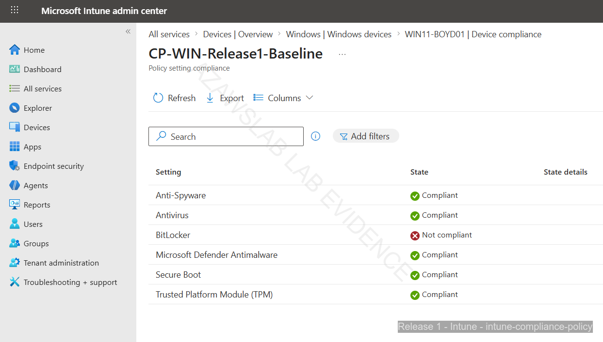
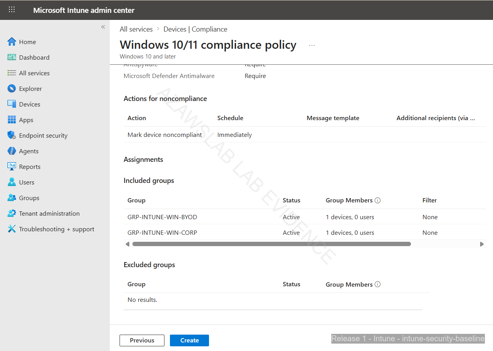
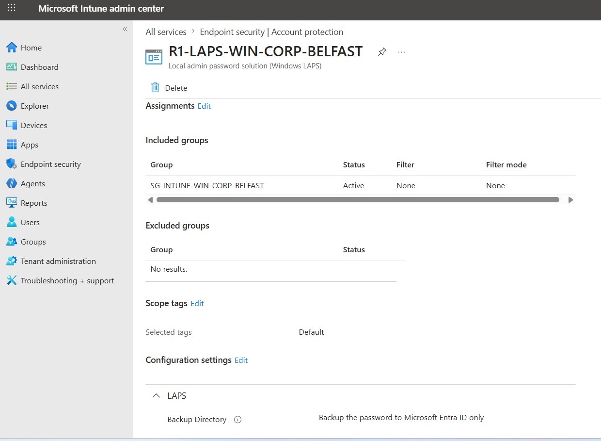
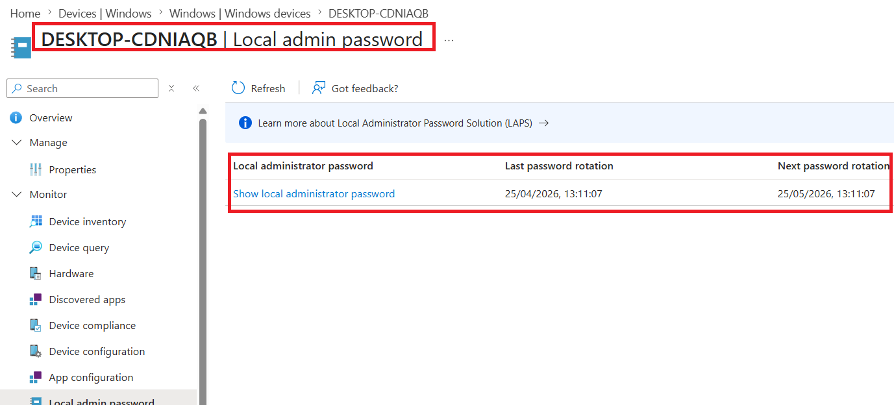

# Endpoint Compliance and Security

## Purpose

This page explains how Release 1 moved beyond endpoint enrollment into endpoint trust, compliance, hardening, recovery readiness, and operationally usable control enforcement.

It covers how compliance policy, security baselines, Defender Antivirus, Attack Surface Reduction (ASR), BitLocker-related controls, Windows Update for Business (WUfB), and Windows LAPS were used to establish a manageable and supportable endpoint security posture. It also documents later advanced validation added after the original baseline to close the loop between policy configuration and real administrative recovery.

---

## What This Page Proves

This page proves that the platform established a functioning endpoint compliance and security model with:

- compliance-state evaluation tied to enrolled devices
- security baseline application across managed Windows endpoints
- Defender Antivirus and Attack Surface Reduction (ASR) policy coverage
- BitLocker-related controls and recovery-key handling
- Windows Update for Business (WUfB) policy configuration
- Windows LAPS policy configuration as part of the endpoint protection model
- visible policy outcome and device-state review in Intune
- advanced validation added after baseline for LAPS password retrieval
- advanced validation added after baseline for LAPS remediation after Autopilot
- script-assisted completion of the intended local administrator control path for LAPS
- an endpoint-control story that connects security enforcement to operational recovery

---

## Why It Matters

Enrollment alone does not create device trust.

This work matters because it demonstrates:

- a stronger link between onboarding and trusted-device status
- visible control enforcement rather than policy definition alone
- a practical baseline for device trust in a hybrid Microsoft environment
- a security posture that could be monitored, challenged, remediated, and recovered when device state changed
- a supportable Windows local administrator recovery path rather than a policy-only LAPS claim

Without compliance, hardening, and recoverability, enrollment would not provide meaningful assurance.

---

## Control Model Overview

The endpoint control model was designed around one principle:

> **A device should not be treated as trusted merely because it is enrolled. It should also be evaluated, protected, recoverable, and operationally supportable.**

In this model, a device must be enrolled, compliant, and hardened before it should be treated as fully trusted for access to corporate resources.

That meant moving beyond simple device presence into:

- compliance evaluation
- baseline hardening
- protection policy
- update governance
- recovery-key visibility
- local administrator recovery readiness
- post-incident restoration of healthy state

---

## Key Controls Applied

| Control | Implementation | Evidence Direction |
| :--- | :--- | :--- |
| **Compliance** | Device compliance policy with visible evaluated state | Compliance policy results and device status |
| **Security Baseline** | Managed Windows security baseline assignment | Security baseline assignment and policy visibility |
| **Defender Antivirus** | Baseline protection policy | Intune security baseline / antivirus policy evidence |
| **Attack Surface Reduction (ASR)** | Attack Surface Reduction policy coverage | Intune security baseline / ASR policy evidence |
| **BitLocker** | BitLocker-related policy and recovery-key visibility | Recovery workflow and restored compliance evidence |
| **Windows LAPS** | Policy configuration, later retrieval validation, and Autopilot remediation | LAPS policy and retrieval evidence |
| **WUfB** | Pilot update ring assignment | WUfB assignment evidence |

---

## Compliance Policy

Compliance policy is one of the clearest expressions of trusted-device evaluation in this phase.

It matters because it turns endpoint management from “device registered” into “device assessed.”

The compliance layer was used to:

- evaluate device state
- surface non-compliance where expected
- show compliant state after the control path had been applied correctly
- support downstream access logic and operational review

This gives the platform a visible checkpoint between onboarding and trusted use.

---

## Security Baseline and Protection Controls

### Security Baseline

The security baseline represents the hardening foundation for managed Windows endpoints.

It matters because it moves the platform from enrollment into a defined protection posture rather than relying on default device settings.

### Defender Antivirus

Defender Antivirus policy coverage is part of the core baseline because it supports endpoint protection readiness within the managed Windows estate.

This should be read as an implemented baseline control, not as a claim to the full Microsoft Defender for Endpoint product stack.

### Attack Surface Reduction (ASR)

ASR policy coverage strengthens the hardening story by showing that the platform was configured to reduce common attack opportunities at the endpoint layer.

This is important because it demonstrates that endpoint protection was treated as a control model rather than a registration exercise.

---

## BitLocker and Recoverability

BitLocker controls here focus on policy configuration, encryption posture, and recovery-key visibility.

The full operational recovery workflow—trust break, key retrieval, rebuild, stale-record cleanup, and restored compliance—is documented in [Recovery Scenarios](06-recovery-scenarios.md).

This page should therefore be read as the control and readiness side of the BitLocker story, while the recovery page carries the deeper operational failure-and-restoration path.

---

## Windows LAPS Baseline

Windows LAPS is part of the endpoint protection model because it strengthens local administrator control and recovery readiness for managed Windows devices.

In the Release 1 baseline, LAPS was already relevant through:

- policy configuration in the endpoint security model
- assignment to the intended managed Windows pilot scope
- relationship to supportability and controlled administrator access
- alignment with the broader endpoint hardening story

That baseline matters because it establishes LAPS as part of the intended control posture even before the later retrieval and remediation proof was added.

At baseline, however, the strongest evidence was still weighted toward policy presence rather than complete operational retrieval validation. That gap is what the later advanced validation closes.

---

## Windows Update for Business

Windows Update for Business is included because update governance is part of endpoint trust, not a separate afterthought.

It contributes to the control model by showing:

- policy-driven update handling
- lifecycle discipline for managed devices
- connection between ongoing maintenance and endpoint health

This is important in a portfolio context because it shows awareness that endpoint security is a continuing state, not a one-time deployment.

---

## Policy Visibility and Operational Review

The control model also required visible outcomes.

This page therefore includes evidence not only of policy configuration, but also of:

- non-compliant state
- compliant state
- policy assignment visibility
- device-state review in Intune
- local administrator recovery readiness
- post-remediation control completion where needed

This matters because control without visibility is difficult to trust and difficult to support.

---

## Flagship Evidence

### 1. Compliance policy showing non-compliant result

*Compliance policy result showing a non-compliant device state, demonstrating that endpoint trust was being evaluated rather than assumed.*

### 2. Security baseline assigned to managed scope

*Security baseline assignment showing that hardening controls were being applied through a managed policy model rather than by manual one-off configuration.*

### 3. Windows Update for Business policy assignment

*Windows Update for Business assignment showing that update governance was part of the managed endpoint control posture.*

### 4. Restored compliant state after recovery workflow

*Restored compliant state after recovery and re-enrollment, showing that endpoint trust could be rebuilt after disruption rather than only configured once.*

### 5. Entra local admin password reveal

*LAPS password retrieval from the Entra admin center, demonstrating that the Windows local administrator password is recoverable through the cloud management layer rather than existing only as a configured policy state.*

---

## Additional Endpoint Security Evidence

The wider evidence set also includes:

- compliance policy assignment and settings detail
- Windows security baseline and protection policy coverage
- Defender Antivirus policy evidence
- ASR policy evidence
- BitLocker-related configuration and recovery linkage
- Windows LAPS policy assignment and device-side retrieval views
- WUfB policy visibility
- Autopilot-related LAPS remediation evidence

For guided browsing:

- [Intune Evidence Hub](../../screenshots/release1/endpoint-management/intune/README.md)
- [Identity and Access Evidence Hub](../../screenshots/release1/identity-and-access/README.md)
- [Release 1 Evidence Dashboard](../../screenshots/release1/README.md)

---

## What Was Validated

The endpoint compliance and security work validated that:

- enrolled devices could be evaluated for trusted state through compliance policy
- Windows security baseline controls were assigned and visible
- Defender Antivirus and ASR were represented as implemented baseline protection controls
- BitLocker-related controls contributed to both protection and recoverability
- WUfB was included as part of ongoing endpoint governance
- Windows LAPS was part of the intended protection model at baseline
- policy visibility and device-state review supported operational interpretation rather than configuration-only claims

---

## Advanced Validation Added After Baseline

The following capabilities were implemented after the core Release 1 baseline was completed. They extend the endpoint compliance and security story with additional Windows LAPS validation covering both standard password retrieval and a post-Autopilot remediation scenario. Evidence was captured in a compatible environment that preserved the existing platform naming and domain context for consistency.

---

### Advanced Validation: Windows LAPS Retrieval

**What was validated**

The baseline Windows LAPS policy configuration was already in place, but the retrieval workflow was not yet fully evidenced. This advanced validation closes that gap by showing that a managed Windows device’s local administrator password can be retrieved from the cloud management layer through both the Entra admin center and the Intune admin center.

**Why this matters**

Local administrator password recovery is an important Windows security and supportability control. Demonstrating retrieval through the cloud management plane shows that LAPS was not only configured as policy, but was also operationally usable when administrative access to a managed device was required outside the normal user session context.

**Implementation and evidence**

- The LAPS policy remained scoped to the corporate Windows pilot device set.
- After policy application, the device `win11-bel-01` showed successful policy status in Intune.
- In the Entra admin center, the device record exposed the local administrator password recovery view for the built-in `beladm01` account.
- The same recovery information was also visible through the Intune admin center’s local admin password view.

**Flagship evidence**

*LAPS password retrieval from the Entra admin center, demonstrating that the Windows local administrator password is recoverable through the cloud management layer rather than existing only as a configured policy state.*

**Outcome**

Windows LAPS retrieval is now fully validated for the pilot corporate Windows path. An administrator can retrieve the local administrator password for a managed Windows device through both Entra and Intune admin surfaces, closing the loop between policy configuration and operational recovery.

---

### Advanced Validation: LAPS Remediation After Autopilot

**What was validated**

During the initial Autopilot implementation, the LAPS outcome was not complete on the Autopilot-provisioned device. This exposed a practical difference between user-driven provisioning and the device-scoped targeting required for the intended LAPS control path. The issue was identified after provisioning, remediated through targeted correction, and then validated through successful password retrieval.

This validation covers:

- issue discovery after Autopilot provisioning
- remediation through `EnableLapsAccount.ps1`
- corrected device-scoped targeting
- successful LAPS retrieval after remediation

**Why this matters**

This is a realistic operational lesson rather than a project weakness. Modern provisioning workflows such as Autopilot and device-scoped security controls such as LAPS do not always align perfectly on the first pass. Identifying the gap, correcting it, and validating the outcome makes the platform more credible than a simplified “everything worked immediately” narrative.

**Implementation and evidence**

- After Autopilot provisioning, the device `desktop-cdniaqb` (later renamed `win11-bel-02`) was visible in Intune as a managed device.
- LAPS was not yet functioning correctly on that path.
- Event Viewer showed that the `beladm01` account was not found.
- The remediation script `EnableLapsAccount.ps1` was reviewed and deployed to restore the intended local administrator account path by enabling or creating the required `beladm01` administrator account used in the pilot build.
- This is important because it shows that the remediation was not only about policy assignment. It also completed the local administrator control path that LAPS depended on.
- Device-based targeting through `SG-Autopilot-Win-Belfast` was used to align the LAPS policy with the Autopilot-managed device.
- Script execution succeeded, the control path completed correctly, and the password became retrievable from the managed device record.

**Design note**

The evidenced remediation path uses the `beladm01` local administrator account present in the pilot design. The same script-led approach could be adapted to a more generic local administrator naming model if required, but that broader variation was not the primary validated path shown in Release 1.

**Flagship evidence**

*LAPS password retrieval after remediation, showing that the Autopilot-provisioned device now correctly exposes the local administrator password through the managed device record after targeted correction.*

**Outcome**

The LAPS gap in the Autopilot provisioning path was identified, remediated, and validated. The platform therefore supports both the standard corporate Windows enrollment path and the later Autopilot provisioning path with completed LAPS functionality across the evidenced pilot device scope.

---

## Operational Insight

One of the strongest endpoint-security lessons in Release 1 is that protection controls are more credible when they are both reviewable and recoverable.

That is especially clear in two areas:

- compliance and hardening controls were visible through device state and policy review
- local administrator recovery moved from policy presence into operationally proven LAPS retrieval

The later Autopilot-related LAPS remediation strengthens this further because it shows that endpoint controls were not documented as flawless first-pass configuration. They were implemented, tested, corrected where necessary, and then validated in a way that reflects real support conditions.

That makes the endpoint security story more operationally credible than a simple “baseline configured” claim.

---

## Scope Boundaries

This page should be read as evidence of an **implemented and evidenced endpoint compliance and security model**, not as a claim to every endpoint-security capability.

Important boundaries:

- Defender Antivirus and ASR are evidenced as baseline controls, not as a full Microsoft Defender for Endpoint stack
- BitLocker is represented here through configuration, recoverability linkage, and related security posture, while the deeper operational recovery workflow lives in [Recovery Scenarios](06-recovery-scenarios.md)
- the LAPS advanced validation sections above do **not** claim a full privileged access management program
- the LAPS advanced validation sections do **not** claim integration with PIM or broader privileged identity governance for local administrator access
- the evidence is limited to the pilot corporate Windows estate and the remediated Autopilot-managed device
- broader LAPS rollout across other device populations remains outside the validated scope shown here
- Android BYOD / MAM, broader Defender depth, and later Azure-native security maturity remain outside the implemented Release 1 endpoint security scope

---

## Related Documents

- [Release 1 Summary](00-summary.md)
- [Endpoint Overview](03-endpoint-overview.md)
- [Endpoint Enrollment](04-endpoint-enrollment.md)
- [Recovery Scenarios](06-recovery-scenarios.md)
- [Monitoring](08-monitoring.md)
- [Compliance Mapping](09-compliance-mapping.md)
- [Lessons Learned](10-lessons-learned.md)
- [Build Checklist](11-build-checklist.md)
- [Extensions and Future Enhancements](12-extensions-and-future-enhancements.md)

For cross-release context:
- [Platform Overview](../foundation/01-platform-overview.md)
- [Target-State Architecture](../foundation/03-target-state-architecture.md)
- [Roadmap](../foundation/04-roadmap.md)
- [Skills and Evidence Index](../foundation/05-skills-and-evidence-index.md)

---

## Related Evidence

- [Intune Evidence Hub](../../screenshots/release1/endpoint-management/intune/README.md)
- [Identity and Access Evidence Hub](../../screenshots/release1/identity-and-access/README.md)
- [Release 1 Evidence Dashboard](../../screenshots/release1/README.md)