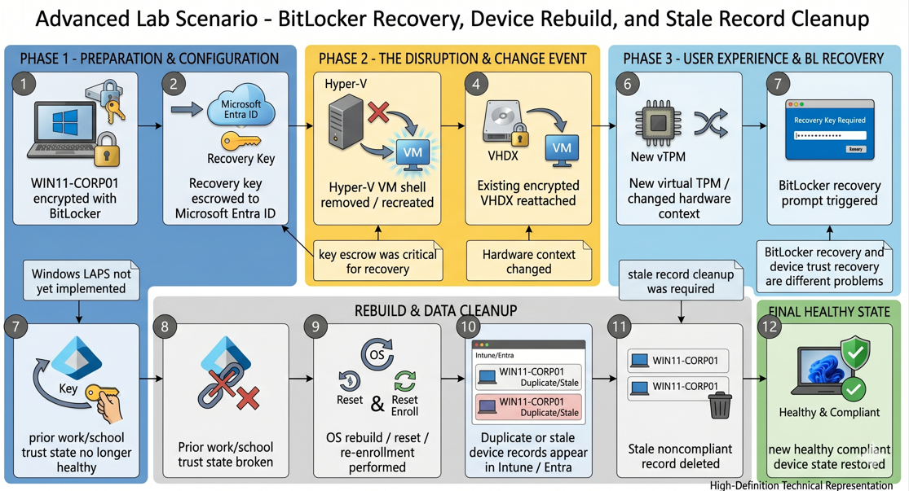
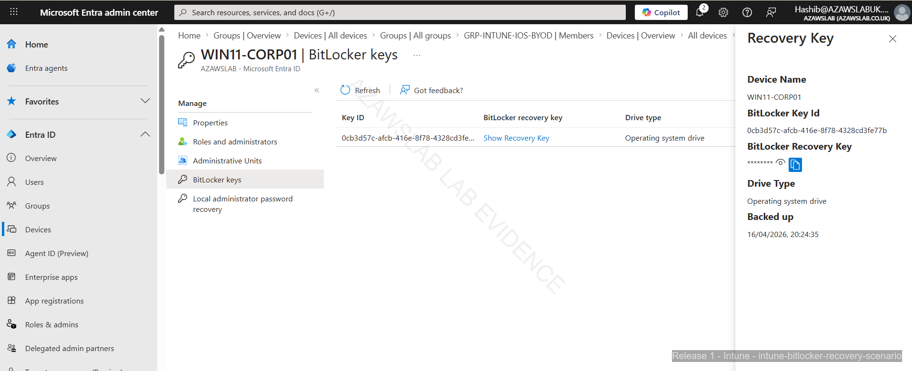
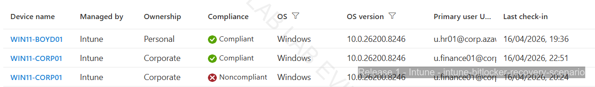
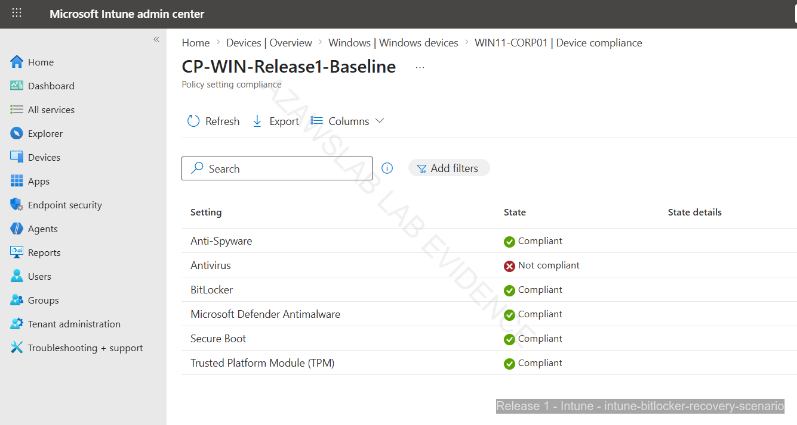

# Advanced Recovery Scenarios

**Related navigation:** [README](../../README.md) | [Release 1 Summary](00-summary.md) | [Release 1 Build Checklist](11-build-checklist.md)  
**Related endpoint docs:** [Endpoint Overview](03-endpoint-overview.md) | [Endpoint Enrollment](04-endpoint-enrollment.md) | [Endpoint Compliance](05-endpoint-compliance.md)

## Purpose

This page records the strongest recovery-led operational scenario encountered during Release 1 of the `azawslab Enterprise Hybrid Security Platform`.

It focuses on BitLocker recovery, virtual hardware-context change, broken trust, device re-enrollment, and stale record cleanup for the Windows corporate pilot endpoint. It is intentionally separate from the enrollment and compliance pages because it captures recovery and lifecycle-management behavior rather than standard onboarding.

## What This Page Proves

This page proves that Release 1 went beyond happy-path endpoint enrollment.

It demonstrates:

- BitLocker recovery-key escrow functioning as a real operational dependency
- Hyper-V rebuild or hardware-context change affecting a previously healthy managed endpoint
- storage recovery and cloud-managed trust recovery behaving as separate problems
- device re-enrollment being required after trust became unhealthy
- stale Intune and Entra records needing manual cleanup after disruptive lifecycle events
- restored compliant state after recovery, cleanup, and re-enrollment

## Recovery Scenario Flow

*Figure: Recovery flow showing BitLocker unlock, recovery-key retrieval, trust disruption, re-enrollment, stale-record cleanup, and restored healthy endpoint state.*

## Recovery Scenario Story

The Windows corporate pilot device, `WIN11-CORP01`, began this scenario as a healthy managed endpoint. It had already been enrolled into Intune, appeared in Microsoft Entra ID, participated in compliance and security-baseline testing, and had BitLocker in scope.

The disruption occurred after a virtual hardware-context change in the Hyper-V lab environment. The VM shell was removed and recreated while the underlying disk and operating-system state were reused. In practical terms, this created a recovery situation similar to a managed-device rebuild or hardware-replacement event.

After that change, the device entered a BitLocker recovery path. The recovery prompt appeared, the escrowed recovery key had to be retrieved from Microsoft Entra ID, and access to the encrypted system was restored. This proved that key escrow was not just a policy checkbox. It was a real operational dependency.

However, successful disk recovery did not restore a fully healthy cloud-managed trust state. The prior work or school relationship was no longer behaving normally, and the endpoint could not be treated as fully recovered through unlock and restart alone.

At that point, the recovery path moved into rebuild and re-enrollment. The device was reintroduced as a healthy managed endpoint, but the environment then showed duplicate or stale device records associated with `WIN11-CORP01`. Older noncompliant or obsolete records remained visible while the new re-enrolled device state appeared separately.

Those stale records were then identified and cleaned up manually so that the live managed endpoint, reporting state, and inventory view aligned again with reality.

The scenario therefore proved a full recovery sequence rather than a single control outcome: encrypted device recovery, trust disruption, re-enrollment, stale-record hygiene, and restored compliant state.

## Flagship Recovery Evidence

### BitLocker recovery prompt

*Figure: BitLocker recovery prompt shown on the Windows corporate pilot device after the virtual hardware-context change.*

### Recovery key retrieved from Microsoft Entra ID

*Figure: Escrowed BitLocker recovery key retrieved from Microsoft Entra ID, proving operational recovery-key availability.*

### Duplicate or stale device records after re-enrollment

*Figure: Duplicate or stale device records visible after the recovery and re-enrollment path, showing the inventory-cleanup problem created by disruptive lifecycle events.*

### Restored compliant state after cleanup and re-enrollment

*Figure: Healthy compliant state restored after recovery, re-enrollment, and stale-record cleanup.*

## Why This Scenario Matters

This is one of the strongest technical pages in the repository because it shows endpoint administration under disruption rather than only under ideal conditions.

It demonstrates that BitLocker recovery, trust health, re-enrollment, and inventory hygiene are connected operational problems. That makes the page materially more credible than a standard endpoint walkthrough that stops once a device becomes compliant.

A related follow-on lesson from this scenario is that recovery-aware endpoint administration also depends on adjacent controls such as Windows LAPS. In Release 1, LAPS is treated as directionally relevant, but not fully evidenced as an operational retrieval-and-recovery story at the same level as BitLocker.

## Related Docs

- [Release 1 Summary](00-summary.md)
- [Endpoint Overview](03-endpoint-overview.md)
- [Endpoint Enrollment](04-endpoint-enrollment.md)
- [Endpoint Compliance](05-endpoint-compliance.md)
- [Monitoring](08-monitoring.md)
- [Release 1 Build Checklist](11-build-checklist.md)