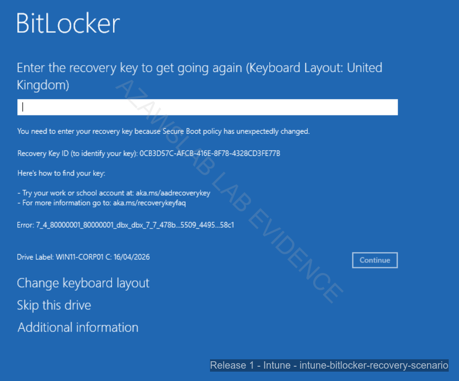

# Recovery Scenarios

## Purpose

This page documents the recovery side of the platform by showing how endpoint trust disruption, BitLocker recovery, stale-record cleanup, and re-enrollment were handled in a controlled and supportable way.

It exists to prove that the platform was not only configurable in a happy-path state, but also recoverable when device identity, compliance state, or trust relationships became messy.

---

## What This Page Proves

This page proves that the platform included a workable recovery model with:

- BitLocker recovery-key visibility tied to managed cloud records
- practical handling of a trust-break scenario
- rebuild and re-enrollment as part of the supported lifecycle
- duplicate and stale record review after recovery
- restored compliant state after the device was brought back into management
- a recovery story that connects endpoint security, device lifecycle, and operational support

---

## Why It Matters

This work enabled:
- recoverable endpoint protection rather than static policy-only hardening
- supportable handling of trust disruption without abandoning the managed-device model
- a cleaner lifecycle story across rebuild, re-enrollment, and record cleanup
- visible proof that the endpoint platform could return to healthy state after failure

Without recovery capability, the wider endpoint-control model would be much less credible.

---

## Scenario Overview

The recovery model was built around one principle:

> **A secure endpoint platform should not only enforce controls when everything is healthy; it should also provide a clear path back to trust when a device falls out of a healthy state.**

That means recovery should cover:
- protection state
- key visibility
- device rebuild
- re-enrollment
- duplicate or stale record handling
- restored compliance after remediation

This page focuses on that operational path.

---

## Recovery Scope in This Phase

The recovery story in this phase is centered on BitLocker and managed-device trust.

It does **not** try to represent every enterprise recovery scenario. Instead, it focuses on one high-value operational sequence:

1. device trust is disrupted
2. BitLocker recovery is required
3. the recovery key must be located
4. the device is rebuilt and re-enrolled
5. duplicate or stale records are reviewed and cleaned up
6. compliant state is restored

This makes recovery a first-class proof of operational maturity rather than a vague “supportability” claim.

---

## BitLocker Recovery and Key Visibility

BitLocker matters here because it links protection with recoverability.

A strong endpoint-control model should not only enable device protection, but also ensure that:
- recovery keys are visible when support intervention is needed
- the recovery path is documented and supportable
- recovery does not permanently break the management model

In this implementation, BitLocker key visibility through the managed identity/device record was a crucial part of the platform’s support story.

---

## Trust Break, Rebuild, and Re-Enrollment

The recovery scenario also demonstrates that the platform can cope with lifecycle disruption.

Once trust is broken, the endpoint story becomes an operational question:
- can the device still be recovered?
- can it be brought back into management?
- can state be cleaned up if duplicate or stale objects appear?
- can compliance be restored without rebuilding the entire control model?

This is why the scenario matters so much. It tests the platform in a condition where static configuration screenshots would no longer be enough.

---

## Duplicate and Stale Record Cleanup

Rebuild and re-enrollment can create operational clutter if stale or duplicate objects remain behind.

This cleanup step matters because it shows that endpoint management was treated as a lifecycle discipline rather than a one-time enrollment event.

Reviewing and cleaning records after recovery demonstrates:
- awareness of post-recovery hygiene
- understanding of the practical side of managed estates
- supportability beyond the immediate recovery event

This is one of the strongest realism signals in the whole release.

---

## Flagship Evidence

### 1. BitLocker recovery prompt on the affected device

*BitLocker recovery prompt showing the device in a broken-trust state, requiring recovery intervention rather than normal managed use.*

### 2. Recovery key visible in the cloud record

*Recovery key visible in the managed cloud record, demonstrating that protection and supportability were connected rather than treated as separate concerns.*

### 3. Duplicate or stale record visibility after recovery activity

*Duplicate or stale managed-device records visible after recovery and re-enrollment activity, showing the kind of lifecycle cleanup required in a realistic operations scenario.*

### 4. Restored compliant state after re-enrollment

*Compliant state restored after rebuild and re-enrollment, demonstrating that the platform could return the endpoint to a healthy and trusted condition after disruption.*

---

## Recovery Flow Summary

| Recovery Stage | What happened | What it proved |
| :--- | :--- | :--- |
| **Trust disruption** | Device entered a BitLocker recovery state | Protection controls were active and meaningful |
| **Key retrieval** | Recovery key was retrieved from the managed cloud record | The platform supported recovery, not just enforcement |
| **Rebuild / re-enrollment** | Device was brought back into the managed estate | The management model could survive disruption |
| **Record cleanup** | Duplicate or stale entries were reviewed | Lifecycle hygiene was treated seriously |
| **Restored compliance** | Device returned to compliant state | The endpoint-control posture was recoverable |

---

## What Was Validated

This recovery work validated that:
- BitLocker protection could be supported with visible recovery-key access
- a broken-trust scenario could be handled without abandoning the managed endpoint model
- rebuild and re-enrollment could be completed successfully
- duplicate or stale records could be identified and cleaned up after recovery
- endpoint trust and compliance could be restored after disruption

---

## Operational Insight

The strongest lesson from this scenario is that endpoint security should be judged by what happens **after something breaks**, not only by what happens during initial configuration.

The key engineering value here is that the platform could:
- protect the device
- recover the device
- clean the lifecycle records
- restore a healthy managed state

That is a much stronger proof of operational maturity than a simple “BitLocker enabled” claim.

---

## Relationship to Other Endpoint Controls

This page should be read together with the broader endpoint pages.

Recovery is not separate from the rest of the endpoint story. It depends on:
- enrollment and re-enrollment
- compliance-state evaluation
- policy visibility
- BitLocker-related configuration
- monitoring and device-state review

That is why the recovery path is an important complement to:
- endpoint overview
- endpoint enrollment
- endpoint compliance and security
- monitoring

---

## Scope Boundaries

This page should be read as evidence of a **specific implemented recovery scenario**, not as a claim to every enterprise recovery workflow.

Important boundaries:
- the strongest recovery evidence in this phase is centered on BitLocker and trust disruption
- not every operating system has the same depth of recovery evidence
- this page does not claim a full enterprise incident-response or desktop engineering programme
- broader endpoint automation and Autopilot / ESP recovery paths remain outside this phase
- recovery-key support and lifecycle cleanup are evidenced here, but broader PKI or advanced device-certification models are not

---

## Related Documents

- [Release 1 Summary](00-summary.md)
- [Endpoint Overview](03-endpoint-overview.md)
- [Endpoint Enrollment](04-endpoint-enrollment.md)
- [Endpoint Compliance and Security](05-endpoint-compliance-and-security.md)
- [Monitoring](08-monitoring.md)
- [Lessons Learned](10-lessons-learned.md)
- [Build Checklist](11-build-checklist.md)

For cross-release context:
- [Platform Overview](../foundation/01-platform-overview.md)
- [Roadmap](../foundation/04-roadmap.md)
- [Skills and Evidence Index](../foundation/05-skills-and-evidence-index.md)

---

## Related Evidence

- [Intune Evidence Hub](../../screenshots/release1/endpoint-management/intune/README.md)
- [Release 1 Evidence Dashboard](../../screenshots/release1/README.md)

