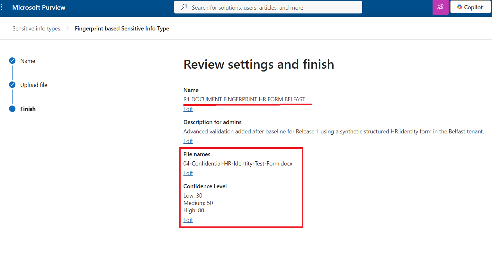
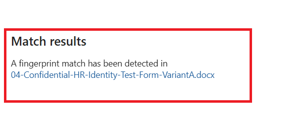
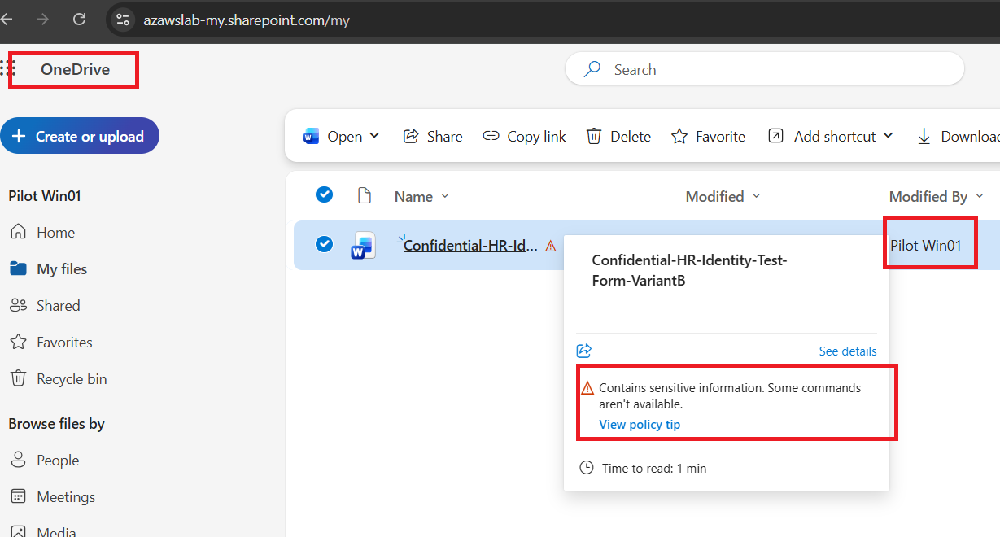

# Purview

## Purpose

This page explains how Release 1 implemented a practical Purview information-protection baseline and how that baseline was later extended with advanced document fingerprinting validation after the original Release 1 baseline was completed.

The focus is on visible and validated controls rather than on claiming a full governance program. The baseline centers on:

- sensitivity labels
- Data Loss Prevention (DLP)
- retention configuration

The later advanced validation extends that story by showing that Purview could recognize a specific structured confidential document type and use that recognition in DLP policy.

---

## What This Page Proves

The Purview implementation proves that Release 1 established a functioning information-protection baseline with:

- sensitivity labels available as usable classification controls
- DLP behavior visible inside Microsoft Word during realistic test scenarios
- retention configuration included as part of the wider governance baseline
- a protection story that connects policy design to real user interaction
- advanced validation added after baseline for document fingerprinting
- a custom fingerprint-based sensitive information type (SIT) built from a structured confidential HR-style form
- DLP linkage and policy-tip validation for that fingerprinted document class

---

## Why It Matters

Information protection only becomes credible when users can see it affecting real content.

This work matters because it demonstrates:

- policy connected to user behavior rather than only existing in the admin layer
- sensitive-content handling surfaced before data leaves the user workflow
- classification and protection introduced without pretending that a full enterprise governance program was already complete
- Microsoft 365 protection controls treated as part of the working platform rather than as future-only ideas
- later extension from generic content-pattern protection into recognition of a known structured business document class

That last point is especially important. It shows that the project can move beyond broad pattern matching and into more precise recognition of a specific confidential document type.

---

## Purview Design Approach

The information-protection baseline was intentionally scoped.

Rather than trying to claim every Purview feature area, the implementation focused first on a smaller set of controls that could be demonstrated clearly:

- sensitivity labels
- DLP
- retention

That approach matters because it keeps the document evidence-backed and avoids drifting into governance claims broader than the actual proof.

The later document fingerprinting work should therefore be read as **advanced validation added after baseline**, not as if it had always been part of the original first-pass Purview scope.

---

## Sensitivity Labels

Sensitivity labels are the clearest classification control in the original Purview baseline.

They matter because they show that:

- documents can be classified in a visible way
- the user experience of labeling is part of the platform story
- information protection is not limited to admin-side policy definitions

In practical terms, labeling helps demonstrate that protection can begin at the content layer rather than only at the endpoint or mailbox layer.

---

## Data Loss Prevention (DLP)

DLP is one of the strongest protection proof points in this area because it shows user-facing enforcement behavior.

The key point is not merely that a DLP policy exists, but that:

- a relevant content pattern was tested
- a policy tip was triggered in Microsoft Word
- the user experience showed that the control was active at the point of interaction

That turns “policy configured” into “policy demonstrated.”

---

## Retention

Retention is included as part of the overall Purview baseline, but it should be read carefully.

Its role here is to show that information protection in the platform was not limited only to labels and DLP. Retention contributes to the broader governance posture, even if the strongest visible proof in this phase remains the labeling and DLP user experience.

---

## Flagship Evidence

### 1. Purview sensitivity labels overview

*Purview sensitivity labels overview showing that classification controls were configured and available as part of the Microsoft 365 protection baseline.*

### 2. Confidential label applied in Word

*Confidential label applied inside Microsoft Word, showing that content classification was visible and usable in the end-user workflow.*

### 3. DLP policy-tip triggered in Word

*DLP policy-tip behavior triggered against test financial data in Microsoft Word, demonstrating that information-protection enforcement was active at the point of user interaction.*

---

## Additional Purview Baseline Evidence

The wider evidence set also includes:

- additional labeling screenshots
- additional DLP policy views
- retention-related configuration
- related compliance and control context in the broader Release 1 documentation

For guided browsing:

- [Information Protection Evidence Hub](../../screenshots/release1/information-protection/README.md)
- [Release 1 Evidence Dashboard](../../screenshots/release1/README.md)

---

## What Was Validated

The Purview baseline validated that:

- sensitivity labels were available and usable in the document workflow
- DLP policy-tip behavior could be triggered in the user workflow
- retention was represented as part of the wider information-governance baseline
- information protection was demonstrated through visible user-facing outcomes rather than admin configuration alone

---

## Advanced Validation Added After Baseline

The following capability was implemented after the core Release 1 baseline was completed. It extends the Purview information-protection story with document fingerprinting: the ability to recognize a specific structured confidential document type using a synthetic HR intake form and use that detection in DLP policy. Evidence was captured in a compatible environment that preserved the existing platform naming and domain context for consistency.

---

### Advanced Validation: Document Fingerprinting

**What was validated**

Document fingerprinting was implemented to prove that Purview can recognize a specific structured business document class, not only generic sensitive data patterns such as credit card numbers or passport identifiers.

The validation covers:

- creation of a synthetic HR intake form as the source document template
- generation of a custom fingerprint-based sensitive information type (SIT)
- testing the SIT with two variant versions of the source document
- linkage of the fingerprint SIT to a DLP policy
- user-visible policy-tip validation in OneDrive

**Why this matters**

Generic pattern matching is useful, but many confidential documents do not rely on fixed regex-style patterns alone. Document fingerprinting allows the platform to identify a recurring high-risk document form based on its structure and formatting.

This moves information protection from:
- “detecting a credit card number”

to:
- “recognizing an entire confidential document class”

For Release 1, that is a meaningful extension of the Purview story because it shows capability beyond baseline labels and generic DLP pattern matching.

**Implementation and evidence**

- A synthetic **HR Identity Test Form** was created in two variant formats (`variant-a` and `variant-b`) to represent the same confidential document class.
- A custom SIT (`R1-Document-Fingerprint-HR-Form-Belfast`) was created using the fingerprint of the source document.
- The fingerprint workflow was tested against both document variants, with successful match validation evidenced in the repository.
- A DLP policy (`R1-DLP-Document-Fingerprint-Belfast`) was created using the fingerprint SIT as a detection rule.
- A policy tip was validated in a pilot user’s OneDrive workflow when a matching document was uploaded or handled in a way that triggered policy evaluation.

**Flagship evidence**

*Custom SIT created from the fingerprint of the HR intake form, showing that Purview was configured to detect the specific document class rather than generic pattern matches.*

*SIT detection result for the HR intake form, confirming that Purview correctly identified the document as matching the fingerprint-based classification.*

*DLP policy tip triggered on a fingerprint-matched document in OneDrive, demonstrating that fingerprint detection was integrated into a user-visible enforcement workflow.*

**Outcome**

Document fingerprinting is now validated as an advanced Purview capability within Release 1. The platform can recognize a specific structured confidential document type, create a custom SIT from its fingerprint, and enforce DLP policies based on that classification. This extends the information-protection story beyond generic SITs and into document-aware detection.

---

## Operational Insight

A useful lesson from this area is that Purview credibility improves when the documentation distinguishes clearly between:

- broad baseline controls that were implemented first
- later advanced validation that deepened the protection model

That is why this page separates the original label/DLP/retention baseline from the later fingerprinting work.

This preserves technical honesty while still showing that the project evolved meaningfully. The result is a stronger Purview story: user-visible classification and DLP first, then more precise recognition of a known confidential document form.

---

## Scope Boundaries

This page should be read as evidence of an **implemented and evidenced Purview baseline**, later extended with advanced document fingerprinting validation. It does **not** claim:

- a full enterprise information-governance program
- broad enterprise document fingerprinting coverage across all document types
- fully automated classification at scale such as auto-labeling based on fingerprinting
- integration with external data sources or third-party document management systems
- production-grade performance or volume testing
- every Purview feature area or advanced compliance workload

The evidence is limited to a single synthetic HR form, a custom fingerprint-based SIT, and a pilot DLP scenario. Wider adoption, additional fingerprint templates, and deeper automation remain future enhancement areas.

---

## Related Documents

- [Release 1 Summary](00-summary.md)
- [Modern Workplace](02-modern-workplace.md)
- [Endpoint Compliance and Security](05-endpoint-compliance-and-security.md)
- [Monitoring](08-monitoring.md)
- [Compliance Mapping](09-compliance-mapping.md)
- [Lessons Learned](10-lessons-learned.md)
- [Build Checklist](11-build-checklist.md)
- [Extensions and Future Enhancements](12-extensions-and-future-enhancements.md)

For cross-release context:
- [Platform Overview](../foundation/01-platform-overview.md)
- [Target-State Architecture](../foundation/03-target-state-architecture.md)
- [Roadmap](../foundation/04-roadmap.md)
- [Skills and Evidence Index](../foundation/05-skills-and-evidence-index.md)

---

## Related Evidence

- [Information Protection Evidence Hub](../../screenshots/release1/information-protection/README.md)
- [Release 1 Evidence Dashboard](../../screenshots/release1/README.md)