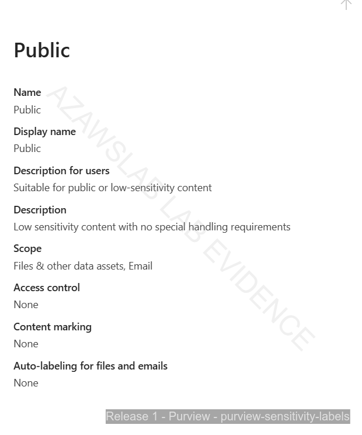
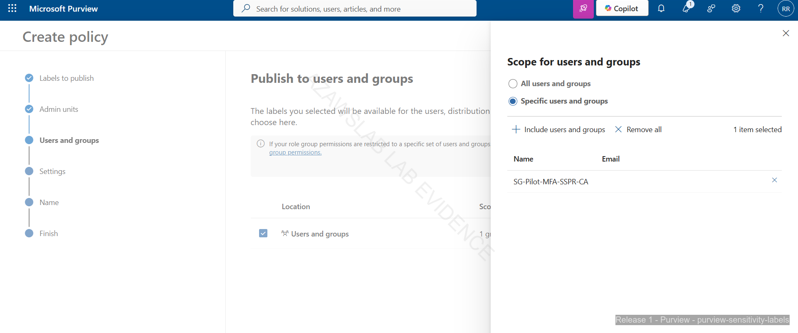
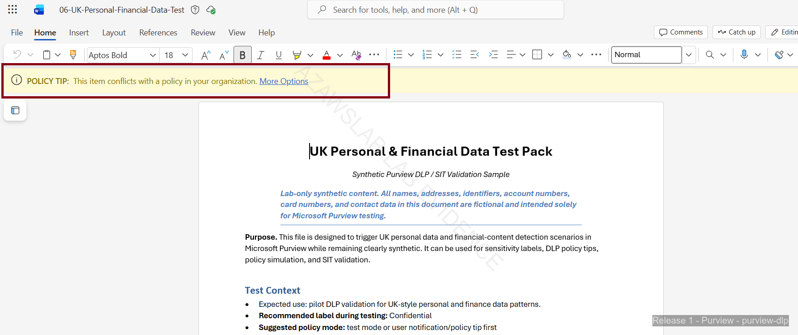
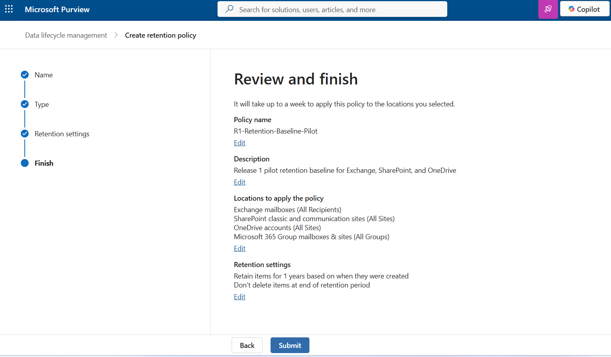

# Information Protection and Purview

**Related navigation:** [README](../../README.md) | [Release 1 Summary](00-summary.md) | [Release 1 Build Checklist](11-build-checklist.md)  
**Related docs:** [Modern Workplace](02-modern-workplace.md) | [Endpoint Overview](03-endpoint-overview.md) | [Monitoring](08-monitoring.md) | [Compliance Mapping](09-compliance-mapping.md)

## Purpose

This page records the Release 1 Purview baseline for the `azawslab Enterprise Hybrid Security Platform`.

It shows how Release 1 extends beyond identity, messaging, and endpoint management into information protection through sensitivity labels, user-visible classification, DLP policy behavior, and retention-policy visibility. It should be read as a baseline information-protection workstream, not as a claim of full Purview maturity.

## What This Page Proves

This page proves that Release 1 includes meaningful content-protection capability rather than stopping at access and device control.

It demonstrates:

- a baseline sensitivity-label model created and published to pilot scope
- visible label application inside Microsoft Word
- a DLP pilot policy built and validated through user-facing policy-tip behavior
- a retention-policy baseline visible in the Purview administration path
- a broader control story that now includes identity, device, and content layers

## Implementation Story

Release 1 implemented a small but credible Purview baseline across three connected layers: classification, content-aware protection, and lifecycle awareness.

The first layer was sensitivity labeling. A simple classification model using **Public**, **Internal**, and **Confidential** was created and published to pilot scope. This provided an understandable starting structure for information classification without overstating the taxonomy as a mature enterprise-wide label program.

The second layer was user-visible label validation. The project did not stop at creating label objects in the admin portal. Labels were published, surfaced in Microsoft Word, and applied in supported Office workflow. That matters because it proves the classification model was usable by real pilot users rather than existing only as an administrative configuration.

The third layer was DLP. A pilot DLP policy based on **U.K. Financial Data** detection was created and reviewed, then validated through user-facing policy-tip behavior in Word. This is one of the strongest parts of the Purview workstream because it demonstrates that the policy did not only exist in the portal; it was able to detect content and surface protection behavior inside the productivity workflow.

Retention completed the baseline story. A retention-policy baseline became visible in the Purview administration path, adding lifecycle-governance awareness to the workstream. The correct claim here is not full records-management maturity. It is that Release 1 now demonstrates awareness of classification, detection, and retention as three distinct information-protection dimensions.

Together, these layers make the Release 1 Purview story stronger than labels alone and materially stronger than a project that stops at identity and endpoint control.

## Flagship Evidence

### Sensitivity-label baseline

*Figure: Purview sensitivity-label baseline showing the Release 1 classification model used to support pilot information protection.*

### User-side label application

*Figure: Confidential sensitivity label applied in Microsoft Word, proving that labels were not only configured in the admin portal but also visible and usable in the end-user workflow.*

### DLP policy-tip validation

*Figure: DLP policy tip triggered in Microsoft Word for the U.K. Financial Data pilot policy, showing user-facing content-protection enforcement.*

### Retention-policy baseline

*Figure: Retention-policy baseline visible in Purview administration, showing that Release 1 includes lifecycle-governance awareness in addition to labels and DLP.*

## Why This Matters

This workstream strengthens the project because it shows that Release 1 is not limited to identity, Exchange, and endpoint administration.

It now also demonstrates practical understanding of:

- classification
- label publication
- content-aware protection
- user-facing protection behavior in Microsoft 365 workflows
- baseline retention and information-lifecycle awareness

That makes the overall platform story more complete by connecting identity, device, and content controls into one Microsoft security and compliance narrative.

## What Release 1 Does Not Claim

To keep the Purview workstream credible, Release 1 does not claim:

- full enterprise label taxonomy maturity
- broad organization-wide label rollout
- auto-labeling at scale
- document fingerprinting
- advanced DLP exception or governance models
- Insider Risk Management deployment
- advanced records-management maturity
- large-scale retention-governance operating maturity

Release 1 should therefore be presented as a baseline Purview implementation, not as a finished enterprise information-protection program.

## Related Docs

- [Release 1 Summary](00-summary.md)
- [Modern Workplace](02-modern-workplace.md)
- [Endpoint Overview](03-endpoint-overview.md)
- [Monitoring](08-monitoring.md)
- [Compliance Mapping](09-compliance-mapping.md)
- [Release 1 Build Checklist](11-build-checklist.md)
