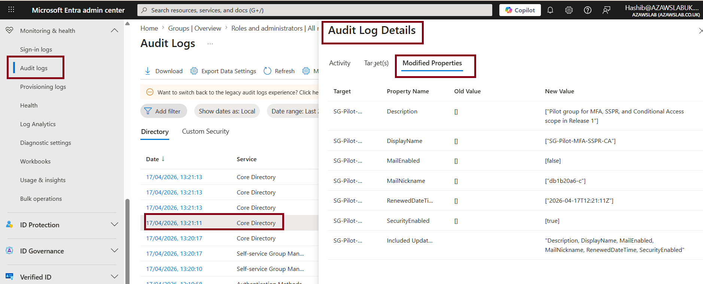
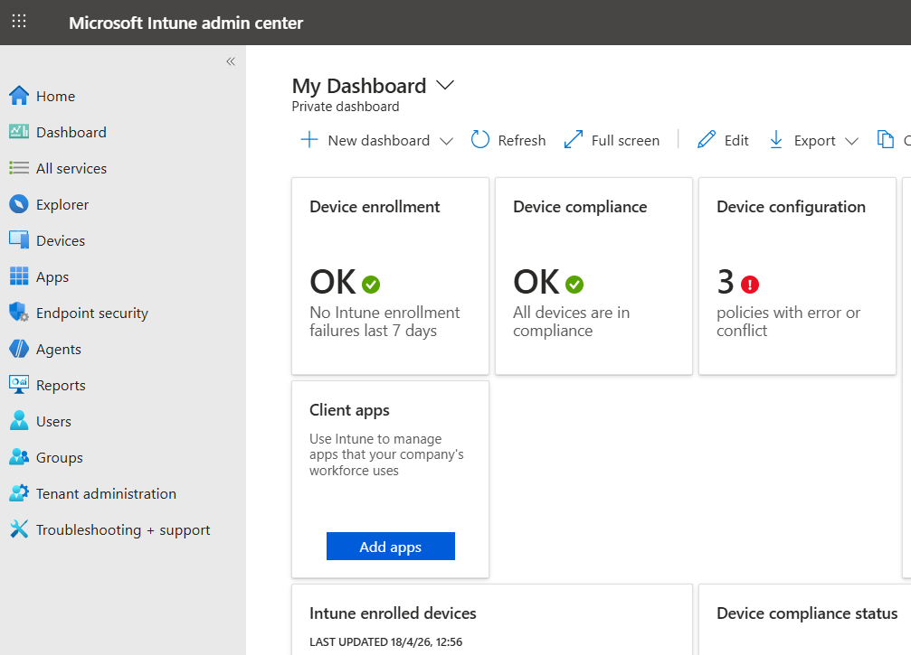
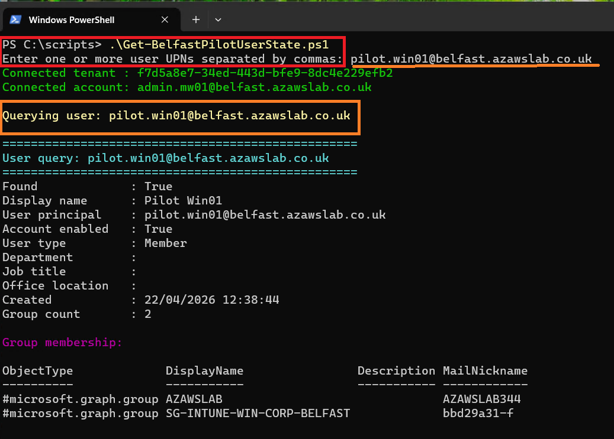
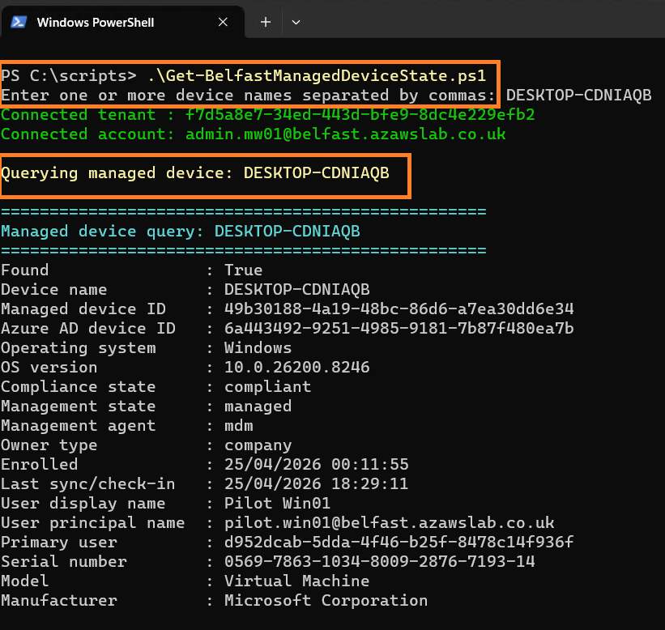
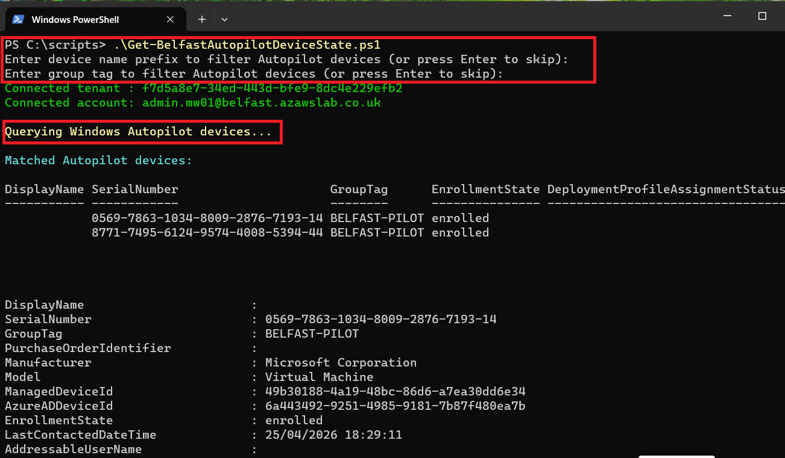
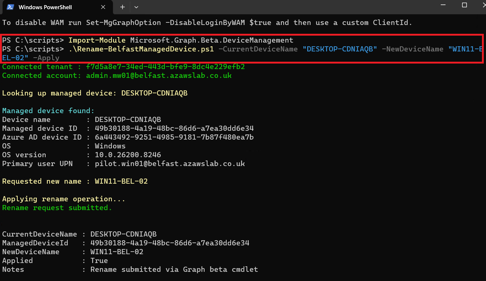
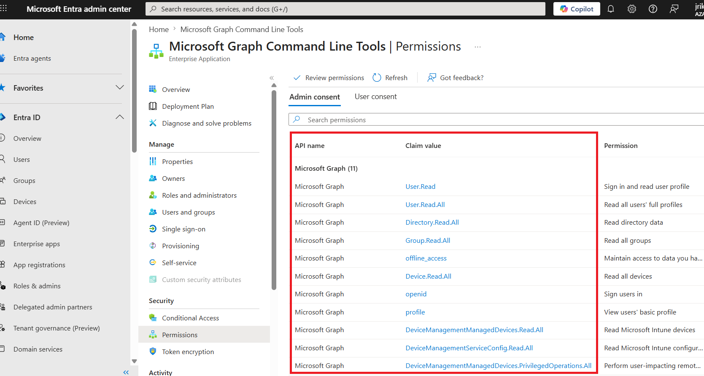

# Monitoring

## Purpose

This page explains how the platform was monitored across identity, endpoint state, policy visibility, and operational activity.

The focus is on practical administrative visibility rather than on claiming a full SOC or enterprise observability program. In Release 1, monitoring is not only about portal-based review. It also includes **Microsoft Graph API and PowerShell operational tooling** used to query pilot user state, review managed device state, support Autopilot-related visibility, and perform controlled management actions such as device rename.

---

## What This Page Proves

The monitoring approach proves that the platform included a practical operational visibility layer with:

- sign-in visibility linked to access and Conditional Access outcomes
- audit-log visibility for administrative and security-relevant actions
- device-state visibility across the managed endpoint estate
- policy and control status review inside the management layer
- example alerting that supports operational awareness
- advanced validation added after baseline for Microsoft Graph API + PowerShell operational support
- Graph-connected scripts for pilot user state, managed device state, and Autopilot-related device-state review
- a managed device rename workflow using Graph PowerShell
- a support-oriented monitoring model tied to the wider identity, endpoint, and recovery story

---

## Why It Matters

A platform that cannot be observed is difficult to trust and difficult to support.

This work matters because it demonstrates:

- access decisions were visible rather than assumed
- endpoint state could be reviewed through both portal tooling and script-assisted operational methods
- administrative activity left an auditable trail
- control status could be checked as part of ongoing operations
- Microsoft Graph API and PowerShell were used as practical operational tooling rather than being treated as buzzwords or future-only ideas

That last point matters because modern workplace and Entra administration increasingly depend on Graph-aware operational methods alongside the admin portals. Release 1 therefore shows not only that the platform could be configured, but also that it could be queried, interpreted, and administratively acted on through reusable tooling.

---

## Monitoring Design Approach

The monitoring model in this phase was intentionally practical.

Rather than trying to claim a fully built SIEM or enterprise-scale detection stack, the implementation focused on the visibility that mattered most for the platform already in place:

- sign-in activity
- audit activity
- device compliance and control status
- policy and dashboard visibility
- alerts relevant to endpoint administration
- Graph-connected state review and operational support workflows

This keeps the document evidence-based and aligned with the actual scope of the phase.

---

## Sign-In Visibility

Sign-in monitoring is one of the most important proof areas because it connects:

- synchronized identity
- Conditional Access review
- device trust interpretation
- practical access monitoring

This matters because identity controls are more credible when the resulting sign-in behavior can be reviewed rather than inferred.

In this implementation, sign-in visibility helps show that access-control logic and endpoint state were part of the same operational picture.

---

## Audit Visibility

Audit logging matters because it provides administrative traceability.

This is important for a supportable platform because configuration changes, identity actions, and control adjustments should not exist only as remembered events. They should be reviewable.

Audit visibility therefore strengthens:

- change traceability
- operational confidence
- governance credibility
- support investigation capability

---

## Device and Control Visibility

Monitoring in this phase also includes the operational view of the endpoint estate.

That means looking at:

- compliance state
- device presence
- policy status
- dashboard-level control views
- whether the managed estate appears healthy, unhealthy, or inconsistent

This matters because endpoint trust is not just about policy existence. It is also about whether the administrator can see the state of the estate clearly enough to act on it.

---

## Alerting and Operational Awareness

This phase does not claim a full enterprise alerting program, but it does include practical alert visibility that supports endpoint administration and operational review.

That is valuable because it shows the platform was not treated as static. Administrators need to know when device configuration, compliance, or control posture requires attention.

In that sense, monitoring here supports day-to-day supportability more than formal security operations.

---

## Flagship Evidence

### 1. Conditional Access result visible in sign-in logs

*Sign-in-log view showing Conditional Access result visibility, linking identity, access review, and device-context interpretation into one operational signal.*

### 2. Audit-log overview

*Audit-log visibility showing that administrative activity was reviewable and that the platform included traceable operational history rather than relying on undocumented changes.*

### 3. Device compliance status visibility

*Device compliance-state visibility showing that the managed endpoint estate could be reviewed through operational status signals rather than through policy assumptions alone.*

### 4. Example alerting in the admin view

*Example alert visibility demonstrating that the platform supported practical administrative awareness when configuration or device-state issues required attention.*

---

## Additional Monitoring Evidence

The wider evidence set also includes:

- additional sign-in views
- more detailed audit visibility
- device-state and control dashboard screenshots
- monitoring context that supports the endpoint, identity, and recovery documents

For guided browsing:

- [Monitoring and Operations Evidence Hub](../../screenshots/release1/monitoring-and-operations/README.md)
- [Release 1 Evidence Dashboard](../../screenshots/release1/README.md)

---

## What Was Validated

The baseline monitoring work validated that:

- sign-in review could be used to interpret access and Conditional Access outcomes
- audit logging gave traceable visibility into administrative activity
- device-state and compliance review supported ongoing endpoint operations
- control and dashboard visibility provided practical monitoring value
- example alerts contributed to day-to-day supportability

---

## Advanced Validation Added After Baseline

The following capability was implemented after the core Release 1 baseline was completed. It extends the monitoring and operational visibility story with **Graph API and PowerShell** scripts that provide programmatic access to device state, user state, and management actions. This directly addresses market demand for Graph API and PowerShell skills in modern workplace and Intune administration roles.

Evidence was captured in a compatible environment that preserved the existing platform naming and domain context for consistency.

---

### Advanced Validation: Graph and PowerShell Operational Visibility

**What was validated**

The platform includes a set of reusable Graph PowerShell scripts that give an administrator programmatic visibility into pilot user state, managed device state, and the ability to perform corrective actions such as device rename. The validation covers:

- **Graph connection** with proper admin consent and delegated permissions
- **Pilot user state query** — retrieving user properties and account status
- **Managed device state query** — compliance, management status, and device details
- **Device rename operation** — dry run and apply to correct a naming inconsistency after enrollment

**Why this matters**

Portal monitoring is useful, but operational maturity also requires scriptable, repeatable visibility. Graph API and PowerShell are the modern standard for programmatic access to Entra ID and Intune data. Demonstrating these scripts proves that the platform is not only observable through dashboards but also supports reusable operational automation.

For roles requiring Graph API, PowerShell, and Intune administration, this section provides direct evidence of those skills in a realistic operational context.

**Implementation and evidence**

- The script `Connect-BelfastMgGraph.ps1` established a Graph connection using device-code or interactive authentication, with admin-consent prompts captured.
- `Get-BelfastPilotUserState.ps1` queried a pilot user such as `pilot-win01` and returned properties including account-enabled status, department, job title, and license details.
- `Get-BelfastManagedDeviceState.ps1` queried a specific managed device such as `desktop-cdniaqb` and returned compliance status, OS version, management state, and last check-in time.
- `Rename-BelfastManagedDevice.ps1` was run first in **dry-run** mode to preview the change, then in **apply** mode to rename the device from `desktop-cdniaqb` to `win11-bel-02`. This demonstrates a controlled, operationally safe approach to device management.

**Flagship evidence**

*Graph admin-consent evidence showing the delegated permission model behind the operational Graph tooling and confirming that the project treated permission scope as part of the implementation story.*

*Successful Graph connection using `Connect-MgGraph`, confirming that the PowerShell environment was correctly authenticated and authorized for later operational actions.*

*Output of `Get-BelfastPilotUserState.ps1` showing user properties such as account-enabled status, department, and job title, proving script-based user visibility.*

*Output of `Get-BelfastManagedDeviceState.ps1` showing device compliance, management state, OS version, and last check-in time, demonstrating programmatic device visibility.*

*Dry run of the device rename operation, showing that the script can preview changes before applying them as part of a safer administrative workflow.*

*Successful apply of the device rename operation, confirming that the script can execute a real management action through Graph-connected PowerShell. This complements the Autopilot validation by correcting post-enrollment naming.*

**Outcome**

Graph and PowerShell operational visibility is now validated. The platform includes scripts that:

- connect to Graph with appropriate consent
- query pilot user state
- query managed device state
- perform a controlled device rename using dry run and apply

These scripts provide immediate operational value and serve as direct evidence of Graph API, PowerShell, and Intune administration skills.

---

## Operational Insight

A useful lesson from this area is that operational visibility becomes more credible when it combines:

- portal-based monitoring
- script-assisted state review
- controlled administrative action

That is why this page is the primary home for the Graph / PowerShell layer.

The identity page should carry the business meaning of lifecycle actions. The endpoint-enrollment page should carry the provisioning story. But this page is where the reusable **operator tooling** becomes most visible as a practical support capability.

That separation improves the overall documentation structure and keeps the Graph / PowerShell keywords visible in the most appropriate technical context.

---

## Scope Boundaries

This page should be read as evidence of an **implemented and evidenced operational monitoring layer**, later extended with Graph-connected PowerShell support. It does **not** claim:

- enterprise-scale monitoring or reporting across large device populations
- full automation of all monitoring workflows, since the scripts are operator-initiated
- integration with external monitoring tools or SIEM platforms
- real-time alerting or event-driven response
- Graph-driven control of ESP behavior
- Shift+F10 diagnostics evidence where none is captured
- deep Graph engineering beyond the evidenced scripts and outcomes

The Graph / PowerShell evidence is limited to the pilot user and device scope shown in the repository. Broader Graph automation, richer diagnostics, full Intune data export, and event-driven alerting pipelines remain future enhancement areas.

---

## Related Documents

- [Release 1 Summary](00-summary.md)
- [Hybrid Identity](01-hybrid-identity.md)
- [Endpoint Enrollment](04-endpoint-enrollment.md)
- [Endpoint Compliance and Security](05-endpoint-compliance-and-security.md)
- [Recovery Scenarios](06-recovery-scenarios.md)
- [Compliance Mapping](09-compliance-mapping.md)
- [Lessons Learned](10-lessons-learned.md)
- [Build Checklist](11-build-checklist.md)

For cross-release context:
- [Platform Overview](../foundation/01-platform-overview.md)
- [Target-State Architecture](../foundation/03-target-state-architecture.md)
- [Roadmap](../foundation/04-roadmap.md)
- [Skills and Evidence Index](../foundation/05-skills-and-evidence-index.md)

---

## Related Evidence

- [Identity and Access Evidence Hub](../../screenshots/release1/identity-and-access/README.md)
- [Monitoring and Operations Evidence Hub](../../screenshots/release1/monitoring-and-operations/README.md)
- [Release 1 Evidence Dashboard](../../screenshots/release1/README.md)