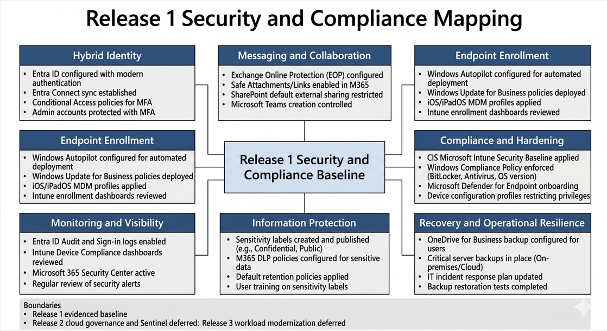

# Security and Compliance Mapping

**Related navigation:** [README](../../README.md) | [Release 1 Summary](00-summary.md) | [Release 1 Build Checklist](11-build-checklist.md)  
**Related docs:** [Hybrid Identity](01-hybrid-identity.md) | [Modern Workplace](02-modern-workplace.md) | [Endpoint Overview](03-endpoint-overview.md) | [Purview](07-purview.md) | [Monitoring](08-monitoring.md)

## Purpose

This page maps the Release 1 work completed in the `azawslab Enterprise Hybrid Security Platform` to the main security and compliance control areas it actually demonstrates.

It is not intended to present Release 1 as a completed enterprise compliance program. Its purpose is to show which control domains were evidenced, how they connect across the platform, and where the current boundaries remain.

## What This Page Proves

This page proves that Release 1 spans multiple meaningful control domains rather than focusing on one isolated Microsoft product.

It demonstrates evidenced baseline capability across:

- hybrid identity and controlled synchronization
- namespace-aware Microsoft 365 onboarding and Exchange hybrid validation
- endpoint enrollment across mixed ownership and mixed platform scenarios
- endpoint compliance, hardening, patching, and access-control relevance
- monitoring visibility across sign-in, audit, endpoint, and control-outcome review
- information protection through sensitivity labels, DLP, and retention baseline
- recovery-aware operations through BitLocker recovery, re-enrollment, and stale-record cleanup

## Control Mapping Overview

*Figure: Release 1 control-domain map showing the main evidenced security and compliance areas implemented across identity, collaboration, endpoint management, monitoring, information protection, and recovery.*

## Mapping Story

Release 1 should be understood as a connected baseline across identity, collaboration, endpoint control, information protection, monitoring, and recovery.

The first control domain is identity. On-premises Active Directory remained authoritative for pilot users, while Microsoft Entra Connect Sync extended selected identities into Microsoft 365 under controlled pilot scope. This established the core identity boundary for later access and service use.

The second control domain is messaging and collaboration. Microsoft 365 tenant onboarding, namespace discipline, Exchange Online pilot migration, Teams collaboration, and SharePoint access collectively show that the project moved from identity into usable workplace services rather than stopping at tenant setup.

The third control domain is endpoint administration. Release 1 validated Windows corporate, Windows BYOD, Ubuntu Linux, and iPhone BYOD enrollment paths. That platform diversity matters because it shows the managed environment is broader than a single test device.

The fourth control domain is endpoint governance and hardening. Compliance policy, Windows security baseline, update governance, attack-surface reduction evidence, and compliant-device access logic show that the endpoint story progressed from registration into policy enforcement and hardening.

The fifth control domain is monitoring and review. Sign-in visibility, audit-log visibility, Intune device-state visibility, and example alert-signal review show that Release 1 can be observed after implementation rather than only configured once.

The sixth control domain is information protection. Purview sensitivity labels, user-visible label application, DLP policy-tip behavior, and retention-policy visibility extend the project into content-aware control rather than limiting it to identity and device boundaries.

The seventh control domain is operational recovery. The BitLocker recovery and stale-record cleanup path is especially important because it proves that Release 1 includes recovery-aware endpoint administration, not only ideal-state policy assignment.

Together, these control domains make Release 1 a coherent baseline security and compliance story rather than a disconnected collection of product exercises.

## Flagship Control Areas

### Identity and access control

Release 1 demonstrates controlled hybrid identity, pilot-safe synchronization scope, and namespace-aware preparation for Microsoft 365 and Exchange hybrid work.

Primary evidence:
- [Hybrid Identity](01-hybrid-identity.md)
- [Monitoring and Alerting](08-monitoring.md)

### Messaging and collaboration control context

Release 1 demonstrates Microsoft 365 onboarding, Exchange Online pilot migration, Teams collaboration, and SharePoint document collaboration under a controlled hybrid namespace model.

Primary evidence:
- [Microsoft 365 Modern Workplace](02-modern-workplace.md)

### Endpoint enrollment and governance

Release 1 demonstrates mixed ownership and mixed platform enrollment across Windows corporate, Windows BYOD, Ubuntu Linux, and iPhone BYOD scenarios.

Primary evidence:
- [Endpoint Overview](03-endpoint-overview.md)
- [Endpoint Enrollment and Platform Coverage](04-endpoint-enrollment.md)

### Compliance and hardening

Release 1 demonstrates compliance-policy assignment, Windows security baseline, update governance, attack-surface reduction evidence, BitLocker relevance, and compliant-device access logic.

Primary evidence:
- [Endpoint Compliance and Security Baseline](05-endpoint-compliance.md)

### Monitoring and administrative visibility

Release 1 demonstrates sign-in review, audit visibility, endpoint-state visibility, and example alert-signal awareness.

Primary evidence:
- [Monitoring and Alerting](08-monitoring.md)

### Information protection

Release 1 demonstrates sensitivity labels, DLP policy-tip behavior, and retention-policy visibility as a baseline Purview implementation.

Primary evidence:
- [Information Protection and Purview](07-purview.md)

### Recovery-aware operations

Release 1 demonstrates BitLocker recovery-key dependency, trust disruption, re-enrollment, stale-record cleanup, and restored healthy endpoint state.

Primary evidence:
- [Advanced Recovery Scenarios](06-recovery-scenarios.md)

## Why This Matters

This page strengthens the project because it shows that Release 1 is not limited to a single control layer.

It demonstrates that the repository now covers:

- identity
- messaging and collaboration
- endpoint management
- compliance and hardening
- monitoring visibility
- information protection
- operational recovery

That breadth makes the platform materially stronger than a portfolio built only around tenant setup, a single managed device, or isolated security screenshots.

## What Release 1 Does Not Claim

To keep the mapping credible, Release 1 does not claim:

- full enterprise compliance-program maturity
- completed Release 2 Azure governance, Sentinel, or cloud-security operations
- completed Release 3 workload modernization, protected ingress, or resilience engineering
- full Android BYOD / MAM validation
- fully evidenced Windows LAPS retrieval and recovery maturity
- advanced Purview maturity such as document fingerprinting, large-scale auto-labeling, or records-management operating depth
- mature SIEM, SOC, or incident-response operating model

Release 1 should therefore be presented as a broad and evidenced control baseline, not as a finished enterprise security program.

## Related Docs

- [Release 1 Summary](00-summary.md)
- [Hybrid Identity](01-hybrid-identity.md)
- [Microsoft 365 Modern Workplace](02-modern-workplace.md)
- [Endpoint Overview](03-endpoint-overview.md)
- [Endpoint Enrollment and Platform Coverage](04-endpoint-enrollment.md)
- [Endpoint Compliance and Security Baseline](05-endpoint-compliance.md)
- [Advanced Recovery Scenarios](06-recovery-scenarios.md)
- [Information Protection and Purview](07-purview.md)
- [Monitoring and Alerting](08-monitoring.md)
- [Release 1 Build Checklist](11-build-checklist.md)