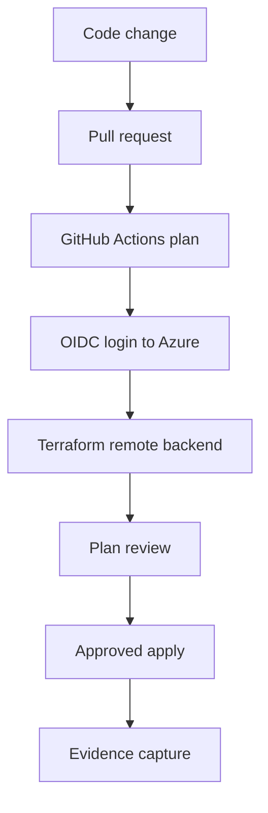

# 01. Landing Zone, IaC & Governance

> **Part of** [Release 2 - Azure Platform Engineering, Security, Automation, Private Platform & AI Operations](./README.md)
>
> **Status:** Implemented and evidenced.

---

## What This Solves

Before Release 2, the Azure environment was a manual, portal-driven setup with no guardrails, no repeatable deployments, and no consistent naming or tagging. This created drift, security gaps, and an inability to prove implementation quality to technical reviewers, hiring managers, and senior engineering interviewers.

This capability story demonstrates how the platform was rebuilt from scratch using **Infrastructure as Code (Terraform)**, deployed through **secretless CI/CD pipelines (GitHub Actions + OIDC)**, and governed by **Azure Policy and RBAC from day one**.

---

## What Was Built

| Layer | Components | Evidence |
|---|---|---|
| **CI/CD Bootstrap** | GitHub Actions OIDC federation, Terraform remote state in Azure Storage with locking | `docs/release2/evidence/P0/` |
| **Management Plane** | Management group hierarchy, subscription organisation | `docs/release2/evidence/P1/` |
| **Reusable Modules** | Terraform modules for networking, compute, Key Vault; split-state model (governance, platform-shared, workloads) | `docs/release2/evidence/P2a/` |
| **Configuration Baseline** | Ansible-driven host preparation, private WinRM paths, Key Vault secrets retrieval, and domain-join automation | `docs/release2/evidence/P2b/` |
| **Controlled Delivery** | GitHub Actions workflow: plan on PR, manual review, approved controlled apply stage | Workflow source: [`release2-terraform-ci.yml`](../../.github/workflows/release2-terraform-ci.yml), [`release2-terraform-apply.yml`](../../.github/workflows/release2-terraform-apply.yml); evidence: [`P0`](./evidence/P0/) |
| **Policy-as-Code** | Azure Policy deny rules: allowed region `norwayeast`, allowed VM SKU `Standard_B2als_v2`, mandatory tags | `docs/release2/evidence/P3/` |
| **Least-Privilege RBAC** | Custom roles scoped to resource groups; separation of deployment vs. operations | `docs/release2/evidence/P3/` |
| **Multi-Tenant Governance** | Azure Lighthouse cross-tenant Reader delegation for managed-service visibility | `docs/release2/evidence/P4/` |

---

## Architecture

Detailed state boundary mapping is maintained in [11. Terraform State & Pipeline Map](./11-terraform-state-and-pipeline-map.md).

---

## How It Works

### 1. Infrastructure is code, not clicks

All Azure resources are defined in Terraform. The platform baseline is defined through Terraform and controlled through GitHub Actions. Portal access is used for validation and review, not as the primary delivery mechanism.

### 2. No secrets in CI/CD

GitHub Actions authenticates to Azure using **OpenID Connect (OIDC)**. There are no long-lived service principal secrets stored in the repository or in GitHub Secrets. Federated credentials are configured once per service principal; the token exchange happens at runtime.

### 3. Policy blocks bad configurations early

Azure Policy deny rules are assigned at the management group level. Specific assignments such as `pa-loc-prod-norwayeast` and `pa-vmsku-prod-b2alsv2` enforce the only allowed region (`norwayeast`) and the approved VM SKU (`Standard_B2als_v2`). Deployments that violate these rules are rejected by Azure Resource Manager before Terraform can create the resource.

### 4. Apply is controlled, not automatic

The GitHub Actions workflow runs `terraform plan` on every pull request. A human reviews the plan output. Only after review and approval does the controlled apply stage execute. There is no auto-apply on push to main.

---

## Evidence

| What | Where | Why It Matters |
|---|---|---|
| OIDC bootstrap and Terraform backend | `docs/release2/evidence/P0/` | Proves secretless CI/CD with remote state locking |
| Management group structure | `docs/release2/evidence/P1/` | Proves governance hierarchy from day one |
| Reusable Terraform modules and split-state roots | `docs/release2/evidence/P2a/` | Proves IaC maturity and lifecycle-aligned state boundaries |
| Ansible configuration baseline, private WinRM, Key Vault secrets | `docs/release2/evidence/P2b/` | Proves idempotent node configuration and secret retrieval |
| Controlled apply pipeline | Workflow source: [`release2-terraform-ci.yml`](../../.github/workflows/release2-terraform-ci.yml), [`release2-terraform-apply.yml`](../../.github/workflows/release2-terraform-apply.yml); evidence: [`P0`](./evidence/P0/) | Proves plan-review-apply discipline |
| Policy deny enforcement (region and SKU) | `docs/release2/evidence/P3/` | Proves governance blocks non-compliant configurations |
| Lighthouse delegation | `docs/release2/evidence/P4/` | Proves cross-tenant visibility readiness |

---

## Operational Notes

- **Local Terraform apply is exceptional.** The default is GitHub Actions controlled apply. Any local apply is documented and justified.
- **State file integrity** is maintained through Azure Storage native locking. No manual state manipulation.
- **Policy exemptions** are rare and documented. The deny rules (including `pa-loc-prod-norwayeast` and `pa-vmsku-prod-b2alsv2`) are enforced globally.
- **RBAC is least-privilege.** Deployment service principals cannot read secrets; operations principals cannot modify infrastructure.

---

## What I Learned

- **OIDC removes a whole class of credential risks.** The pipeline has no secrets to rotate, leak, or expire.
- **Split-state Terraform is a forcing function for good design.** It forces you to define lifecycle boundaries before you write a single resource.
- **Policy-as-code changes the security conversation.** Instead of policing deployments manually, the platform simply rejects non-compliant requests automatically.
- **Azure Lighthouse is a lightweight path to cross-tenant visibility.** Reader delegation proves multi-tenant management without complex tenant-to-tenant trust.

---

## Implementation Positioning

This landing zone demonstrates a production-style portfolio platform: policy-enforced, CI/CD-driven, secretless, and structured around lifecycle-aware state boundaries. The combination of OIDC, Terraform, split-state boundaries, and Azure Policy deny rules makes it a credible demonstration of enterprise platform engineering.

Reviewers evaluating this for a **Senior Cloud Platform Engineer** or **Cloud Architect** role should focus on:
- The deliberate state-boundary design, kept in sync with the platform's lifecycle needs.
- The absence of static credentials in CI/CD.
- The governance-first sequence: policy and RBAC were deployed before any workload resource.
