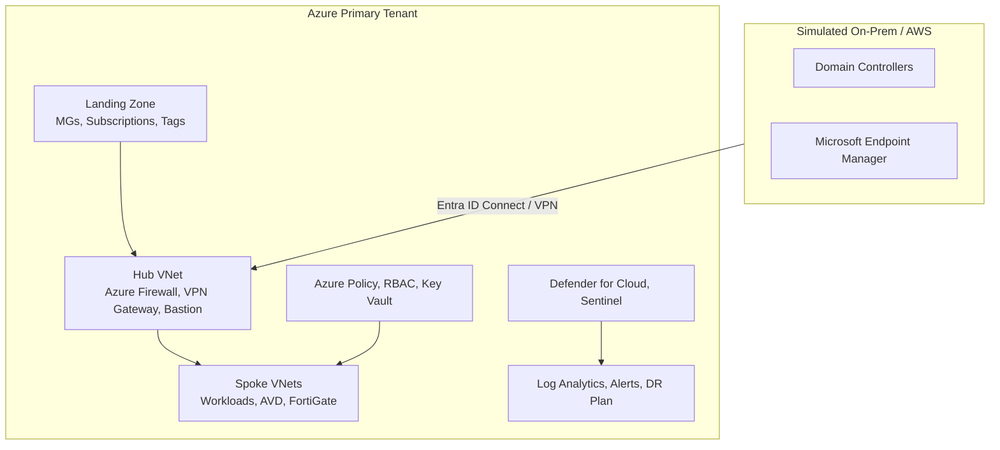

# Release 2 Blueprint: Azure Secure Platform, MSP Operations & Network Security

**Version:** 2.1 (PowerShell / Azure CLI emphasis)  
**Status:** `Planning → In Progress → Complete`  
**Target Release Date:** [Set your date]  
**Related Docs:**  
- [Release 1 Summary](../release1/README.md)  
- [Release 1 Build Checklist](../release1/11-build-checklist.md)  
- [Modern Remote Access Design](./modern-remote-access-design.md)  
- [Evidence Folder](./evidence/)

---

## Table of Contents

1. [Elevator Pitch (For Recruiters)](#elevator-pitch-for-recruiters)
2. [Job Market Alignment](#job-market-alignment)
3. [Architecture Overview](#architecture-overview)
4. [Core Phases (P1–P9c) – Must Have](#core-phases-p1p9c--must-have)
5. [Optional Phases (O1–O7) – Differentiators](#optional-phases-o1o7--differentiators)
6. [PowerShell / Azure CLI Evidence](#powershell--azure-cli-evidence)
7. [Evidence Checklist](#evidence-checklist)
8. [Cost Management Strategy](#cost-management-strategy)
9. [Execution Order & Next Steps](#execution-order--next-steps)

---

## Elevator Pitch (For Recruiters)

> *“This project solves a real enterprise problem: moving from a legacy on‑premises workplace to a secure, governed, and automated Azure platform. Release 2 builds on a stable hybrid identity foundation (Active Directory + Entra ID) and adds Azure Landing Zones, infrastructure as code (Terraform + Ansible), CI/CD pipelines, hub‑spoke networking with Azure Firewall, cloud security posture management (Defender for Cloud), security monitoring (Microsoft Sentinel), and a documented disaster recovery strategy. Optional extensions include FortiGate NVA, Azure Arc, BGP routing, Global Secure Access (ZTNA), and Azure Virtual Desktop (AVD).*

> *All validation steps are executed via **Azure CLI and PowerShell**, with terminal outputs captured as evidence – demonstrating strong scripting and command-line proficiency. The result is a production‑ready blueprint that showcases the automation‑first, multi‑tenant, and hybrid networking skills demanded by today’s Azure Infrastructure Engineer roles.”*

---

## Job Market Alignment

| Common JD Keyword | How Release 2 Delivers | Phase(s) |
|-------------------|------------------------|----------|
| Terraform (deep, modular) | Reusable modules for networking, security, compute, monitoring | P2a |
| Ansible / config management | Playbooks for domain join, security baselines, app install | P2b |
| CI/CD pipelines (GitHub Actions) | Plan on PR, apply on merge, Ansible trigger | P2c |
| Azure Landing Zones | Management groups, subscriptions, naming, tagging | P1 |
| Hub‑spoke networking + UDRs | VNet peering, route tables, forced tunneling | P5 |
| Azure Firewall | Central inspection, rule collections, logging | P6 |
| Defender for Cloud + Secure Score | CSPM, one Defender plan, remediation | P7 |
| Microsoft Sentinel | Data connectors, analytic rules, incident response | P8 |
| Disaster Recovery / Backup | Azure Backup + ASR design, test failover, RPO/RTO | P9b |
| Infrastructure as Code (across compute/cloud/network) | Complete automation of all resources | P2a, P5, P6 |
| Zero Trust (GSA / Entra Private Access) | Replace VPN with identity‑centric app access | O4, O5, O6 |
| Azure Virtual Desktop | Replace legacy RDP servers; FSLogix + Defender | O7 |
| Azure Arc | On‑prem server management from Azure | O2 |
| BGP / dynamic routing | Site‑to‑site VPN with BGP route exchange | O3 |
| Multi‑vendor firewall (FortiGate) | Third‑party NVA deployment | O1 |
| **PowerShell / Azure CLI (terminal usage)** | Every validation step uses CLI commands; `az` and `powershell` outputs captured | P1, P3, P4, P5, O3, and throughout |

---

## Architecture Overview

All resources are deployed via **Terraform**, configured with **Ansible**, and pipelined through **GitHub Actions**. Optional services (GSA, AVD, FortiGate, Arc, BGP) extend the core without breaking it.

---

## Core Phases (P1–P9c) – Must Have

### P1: Azure Landing Zone Foundation

| Aspect | Detail |
|--------|--------|
| **Business Problem** | No cloud governance – subscriptions unorganised, no tagging, scaling impossible. |
| **Technical Solution** | Management groups (`Platform`, `LandingZones`, `Sandbox`), subscription placement, naming convention, tag model (`Environment`, `CostCenter`, `Owner`, `Project`). |
| **Acceptance Criteria** | Hierarchy documented; tags defined; resource groups follow naming standard. |
| **Validation** | `az account management-group show` and portal screenshots. |
| **CLI Commands** | `az account management-group list --expand` |
| **Evidence** | `docs/release2/evidence/P1/` – hierarchy screenshot, naming doc, tag schema, terminal output. |
| **Recruiter Hook** | *“Designed Azure Landing Zone following Cloud Adoption Framework – management groups, subscriptions, and tagging for cost control and governance – all verified with Azure CLI.”* |

### P2a: Terraform – Reusable Modules

| Aspect | Detail |
|--------|--------|
| **Business Problem** | Manual or copy‑paste Terraform – no reusability, inconsistent configs. |
| **Technical Solution** | Modules: `networking`, `security`, `compute`, `monitoring` – each with `variables.tf`, `outputs.tf`, `README.md`. Root `main.tf` consumes them. |
| **Acceptance Criteria** | Folder structure; `terraform validate` passes; module docs include examples. |
| **Validation** | `terraform init && terraform plan` against a test subscription. |
| **CLI Commands** | `terraform plan -out=tfplan` and `terraform show tfplan` |
| **Evidence** | Folder structure screenshot; `terraform plan` terminal output; one module README. |
| **Recruiter Hook** | *“Built reusable Terraform modules for VNet, Key Vault, compute – reducing deployment time and enabling environment consistency.”* |

### P2b: Ansible Configuration Management

| Aspect | Detail |
|--------|--------|
| **Business Problem** | Deployed VMs are unconfigured – no domain join, no hardening, no apps. |
| **Technical Solution** | Playbooks: `domain-join.yml`, `security-baseline.yml`, `install-iis.yml`. Use `ansible-vault` for secrets. |
| **Acceptance Criteria** | Playbooks run idempotently; VM appears in AD; security policy changes verified. |
| **Validation** | `ansible-playbook -i inventory.yml domain-join.yml --ask-vault-pass` – output shows changed=2. |
| **CLI Commands** | `ansible-playbook`, `ansible-vault`, `ansible all -m win_ping` |
| **Evidence** | Playbook terminal output; VM in AD screenshot; `reg query` or `auditpol` output. |
| **Recruiter Hook** | *“Used Ansible to automate post‑deployment configuration – domain join, hardening, and app installation – eliminating manual steps.”* |

### P2c: CI/CD Pipeline (GitHub Actions)

| Aspect | Detail |
|--------|--------|
| **Business Problem** | No audit trail or peer review for infrastructure changes. |
| **Technical Solution** | `.github/workflows/terraform-ci.yml` – `fmt` + `validate` on PR, `plan` comment, `apply` on merge to `release-2`. Optionally trigger Ansible. |
| **Acceptance Criteria** | PR shows plan comment; merge triggers apply; resources created in Azure. |
| **Validation** | Create a PR changing a variable → check Actions tab and comment. |
| **CLI Commands** | (Automatic via workflow) but triggered by `git push` |
| **Evidence** | Screenshot of PR with plan comment; green Actions run; Azure portal resource. |
| **Recruiter Hook** | *“Implemented CI/CD for infrastructure – Terraform plan on every PR, auto‑apply on merge – establishing an auditable, collaborative workflow.”* |

### P3: Governance (Policy, RBAC, Key Vault)

| Aspect | Detail |
|--------|--------|
| **Business Problem** | No guardrails – regions unrestricted, secrets exposed, over‑permissive roles. |
| **Technical Solution** | Azure Policy (allowed locations, required tags), RBAC (Reader at MG, Contributor at RG), Key Vault with access policy. |
| **Acceptance Criteria** | Policy blocks disallowed region/tags; RBAC denies write; secret retrievable. |
| **Validation** | Attempt to create VM in wrong region → fails. Try to modify as Reader → denied. `az keyvault secret show` works. |
| **CLI Commands** | `az keyvault secret show --name <secret> --vault-name <kv>` |
| **Evidence** | Policy compliance dashboard; RBAC assignment screenshot; CLI secret retrieval output. |
| **Recruiter Hook** | *“Enforced least‑privilege access and compliance via Azure Policy, RBAC, and Key Vault – all as code, with CLI verification.”* |

### P4: Azure Lighthouse

| Aspect | Detail |
|--------|--------|
| **Business Problem** | Managing multiple tenants requires separate sign‑ins – no delegated administration. |
| **Technical Solution** | ARM/Terraform template to onboard a customer tenant; delegated roles; cross‑tenant action. |
| **Acceptance Criteria** | Customer tenant appears in “My Customers”; management action performed. |
| **Validation** | Create second Azure AD tenant (free); deploy Lighthouse; list VMs from main tenant. |
| **CLI Commands** | `az vm list --subscription <customer-sub-id>` |
| **Evidence** | “My Customers” blade screenshot; CLI output of cross‑tenant list. |
| **Recruiter Hook** | *“Demonstrated multi‑tenant administration using Azure Lighthouse – MSP operations pattern, verified with Azure CLI cross‑tenant commands.”* |

### P5: Hub‑Spoke Networking + Automation

| Aspect | Detail |
|--------|--------|
| **Business Problem** | Ad‑hoc peerings, no forced tunneling, inconsistent NSG rules. |
| **Technical Solution** | Hub VNet (10.0.0.0/16) with `GatewaySubnet`, `AzureFirewallSubnet`; Spoke VNet (10.1.0.0/16) with `Workload`; peering; UDR forcing internet traffic to firewall; NSG rules (deny RDP from internet, allow from Mgmt). |
| **Acceptance Criteria** | VMs in different VNets can ping; `curl ifconfig.me` shows firewall public IP; RDP from internet blocked. |
| **Validation** | Deploy test VMs; test connectivity; check effective routes. |
| **CLI Commands** | `az network vnet peering list`, `az network route-table show`, `az network nsg rule list` |
| **Evidence** | Peering status screenshot; route table effective routes; NSG flow log; terminal outputs. |
| **Recruiter Hook** | *“Automated hybrid networking: hub‑spoke, forced tunneling, NSG rules – fully version‑controlled with Terraform and validated via Azure CLI.”* |

### P6: Azure Firewall

| Aspect | Detail |
|--------|--------|
| **Business Problem** | No central inspection – traffic flows directly, no outbound blocking. |
| **Technical Solution** | Firewall in `AzureFirewallSubnet`; policy with network rule (DNS), application rule (FQDN allow); logs to Log Analytics. |
| **Acceptance Criteria** | DNS resolution allowed; HTTP to non‑allowed domain blocked; logs captured. |
| **Validation** | From spoke VM: `nslookup` works; `curl example.com` blocked; query `AzureDiagnostics`. |
| **CLI Commands** | `az network firewall show`, KQL query via Log Analytics CLI or portal |
| **Evidence** | Firewall policy rules; KQL query output showing blocked traffic; VM curl error. |
| **Recruiter Hook** | *“Deployed Azure Firewall as central inspection point – all east‑west and north‑south traffic controlled, with logs centralised in Log Analytics.”* |

### P7: Defender for Cloud

| Aspect | Detail |
|--------|--------|
| **Business Problem** | Cloud security posture unknown – no secure score, no compliance baseline. |
| **Technical Solution** | Enable Defender for Cloud (free CSPM); enable one Defender plan (e.g., Servers P1 or Key Vault); remediate one recommendation; track score improvement. |
| **Acceptance Criteria** | Secure Score increases after remediation. |
| **Validation** | Note initial score; apply remediation (e.g., enable diagnostic logs); wait for refresh; compare. |
| **CLI Commands** | `az security secure-score-controls list` (optional) |
| **Evidence** | Before/after score screenshots; enabled plan; remediated recommendation marked “Completed”. |
| **Recruiter Hook** | *“Improved Secure Score by X points – demonstrated CSPM and CWPP capabilities with actionable remediation.”* |

### P8: Microsoft Sentinel

| Aspect | Detail |
|--------|--------|
| **Business Problem** | No cloud‑native SIEM – security events not collected, no alerting. |
| **Technical Solution** | Enable Sentinel on Log Analytics workspace; add Azure Activity connector; create analytic rule (e.g., multiple failed logins); generate test incident; deploy a workbook. |
| **Acceptance Criteria** | Data connector shows “Connected”; incident appears after simulation. |
| **Validation** | Simulate failed sign‑in attempts (or use sample data); wait for rule to fire. |
| **CLI Commands** | `az sentinel` commands (if using CLI – optional) |
| **Evidence** | Data connectors page; analytic rule KQL; incident in Sentinel; workbook view. |
| **Recruiter Hook** | *“Configured Sentinel to detect failed sign‑in anomalies – cloud‑native SIEM with a real analytic rule and custom workbook.”* |

### P9a: Monitoring & Alerting

| Aspect | Detail |
|--------|--------|
| **Business Problem** | No operational visibility – no alerts, no proactive monitoring. |
| **Technical Solution** | Azure Monitor alert (CPU > 80% on test VM); action group (email); Log Analytics saved dashboard. |
| **Acceptance Criteria** | Alert triggers; email received; dashboard tile shows data. |
| **Validation** | Run stress script on VM; wait for alert; check dashboard. |
| **CLI Commands** | `az monitor metrics alert create`, `az monitor alert list` |
| **Evidence** | Alert rule configuration; alert fired screenshot; email; dashboard screenshot. |
| **Recruiter Hook** | *“Set up proactive monitoring with Log Analytics and Azure Monitor alerts – reducing mean time to detection.”* |

### P9b: Disaster Recovery Strategy

| Aspect | Detail |
|--------|--------|
| **Business Problem** | No backup or recovery plan – business continuity undefined. |
| **Technical Solution** | Azure Backup vault (daily backup, 30‑day retention); Azure Site Recovery (replicate test VM to secondary region); test failover performed; DR plan document with RPO=15min, RTO=4h. |
| **Acceptance Criteria** | Backup items protected; ASR replication healthy; test failover VM boots; DR plan committed. |
| **Validation** | Run ASR test failover; validate VM accessible; cleanup. |
| **CLI Commands** | `az backup protection backup-now`, `az site-recovery` commands |
| **Evidence** | Backup items screenshot; ASR replication health; test VM screenshot; DR plan document. |
| **Recruiter Hook** | *“Designed and tested a DR strategy with Azure Backup and ASR – meeting RPO of 15min, RTO of 4h, and automating validation via CLI.”* |

### P9c: Onboarding Documentation

| Aspect | Detail |
|--------|--------|
| **Business Problem** | Knowledge silos – only the author can deploy the platform. |
| **Technical Solution** | `docs/onboarding.md` (prerequisites, service principal, Terraform, Ansible, Azure CLI setup); `CONTRIBUTING.md` (PR process, module versioning). |
| **Acceptance Criteria** | A new engineer can follow the guide and deploy the platform. |
| **Validation** | Walk through the guide on a fresh subscription. |
| **Evidence** | Committed `onboarding.md` and `CONTRIBUTING.md`. |
| **Recruiter Hook** | *“Authored clear onboarding guide – any engineer can self‑deploy the platform within 1 hour, including setting up Azure CLI and required tools.”* |

---

## Optional Phases (O1–O7) – Differentiators

### O1: FortiGate NVA

| Aspect | Detail |
|--------|--------|
| **Business Problem** | Customer requires third‑party firewall with advanced IPS. |
| **Solution** | Deploy FortiGate from Azure Marketplace (30‑day free trial) in a dedicated spoke; route traffic through it; create firewall policies. |
| **CLI Usage** | `az vm list` to verify deployment; no native CLI for FortiGate config, but documentation covers it. |
| **Recruiter Hook** | *“Deployed FortiGate NVA in a dedicated spoke – demonstrated multi‑vendor security automation and third‑party integration.”* |

### O2: Azure Arc

| Aspect | Detail |
|--------|--------|
| **Business Problem** | Manage on‑prem servers (DC1, DC2, MEM1) from Azure. |
| **Solution** | Install Arc agent on simulated on‑prem VMs (AWS Lightsail); assign policy; view Defender recommendations. |
| **CLI Usage** | `az connectedmachine list` to show Arc‑enabled servers. |
| **Recruiter Hook** | *“Extended Azure governance and monitoring to on‑premises servers using Azure Arc – hybrid management without migration.”* |

### O3: BGP over VPN Gateway

| Aspect | Detail |
|--------|--------|
| **Business Problem** | Large networks need dynamic routing, not static routes. |
| **Solution** | Enable BGP on VPN Gateway; configure peer ASN; establish BGP session; verify route exchange. |
| **CLI Commands** | `az network vnet-gateway list-bgp-peer-status` – essential CLI evidence |
| **Recruiter Hook** | *“Configured BGP over site‑to‑site VPN – dynamic route exchange between Azure and simulated on‑prem network, verified with Azure CLI.”* |

### O4: Global Secure Access – Private Access

| Aspect | Detail |
|--------|--------|
| **Business Problem** | Legacy VPN grants full network access – risk; need identity‑driven app access. |
| **Solution** | Install Private Network Connector; publish internal app (RDP); install GSA client; enforce Conditional Access (compliant network). |
| **Recruiter Hook** | *“Implemented Entra Private Access – replaced legacy VPN with Zero Trust, identity‑centric application access.”* |

### O5: Global Secure Access – Internet Access

| Aspect | Detail |
|--------|--------|
| **Business Problem** | Users access M365 from anywhere – need tenant restrictions and web filtering. |
| **Solution** | Enable Internet Access; configure allowed tenants; create web filtering policy; apply to test group. |
| **Recruiter Hook** | *“Secured SaaS access with Entra Internet Access – tenant restrictions and web filtering without proxy servers.”* |

### O6: Global Secure Access – Advanced Patterns (Design)

| Aspect | Detail |
|--------|--------|
| **Business Problem** | Token theft attacks; legacy apps need modern Conditional Access. |
| **Solution** | Design documents: Compliance Routing (stop token replay) and Universal CA (MFA for legacy apps). |
| **Recruiter Hook** | *“Designed advanced GSA patterns – compliance routing for token theft protection and Universal CA for legacy apps.”* |

### O7: Azure Virtual Desktop (AVD)

| Aspect | Detail |
|--------|--------|
| **Business Problem** | Legacy RDP servers lack scalability, personalisation, and endpoint protection. |
| **Solution** | Deploy AVD host pool (Windows Server 2022 session hosts) in dedicated spoke; FSLogix profiles on Azure Files; onboard Defender for Endpoint; test user connection. |
| **CLI Usage** | `az desktopvirtualization` commands (optional) |
| **Recruiter Hook** | *“Deployed Azure Virtual Desktop with FSLogix and Defender for Endpoint – replacing legacy RDP servers with a managed, secure VDI solution.”* |

---

## PowerShell / Azure CLI Evidence

For **every phase**, you are required to capture at least one terminal screenshot (PowerShell or Azure CLI) showing:

- The command used (e.g., `az account show`, `terraform plan`, `ansible-playbook`, `az network vnet-gateway list-bgp-peer-status`)
- The successful output (no errors, relevant resource details)
- The timestamp (optional but good practice)

**Why this matters to recruiters:** It proves you can work effectively from the command line – a non‑negotiable skill for any infrastructure engineer.

---

## Evidence Checklist

| Phase | CLI / Terminal Evidence Required | Location |
|-------|----------------------------------|----------|
| P1 | `az account management-group list` output | `evidence/P1/cli-mg-list.png` |
| P2a | `terraform plan` terminal output | `evidence/P2a/tf-plan.txt` (or .png) |
| P2b | `ansible-playbook` run output | `evidence/P2b/ansible-output.png` |
| P2c | GitHub Actions run (automatic) – but also `git log` | `evidence/P2c/actions-run.png` |
| P3 | `az keyvault secret show` output | `evidence/P3/secret-retrieve.png` |
| P4 | `az vm list --subscription <customer-id>` | `evidence/P4/cross-tenant-vms.png` |
| P5 | `az network vnet peering list` and `az network route-table show` | `evidence/P5/peering-cli.png` |
| P6 | (Log Analytics KQL – optional CLI) | `evidence/P6/kql-blocked.png` |
| P7 | `az security secure-score-controls list` (optional) | – |
| P8 | No CLI required – but Sentinel incident screenshot | `evidence/P8/incident.png` |
| P9a | `az monitor alert list` output | `evidence/P9a/alerts.png` |
| P9b | `az backup job list` output | `evidence/P9b/backup-jobs.png` |
| P9c | No CLI – but onboarding doc includes CLI setup instructions | `docs/onboarding.md` |
| O3 (BGP) | `az network vnet-gateway list-bgp-peer-status` | `evidence/O3/bgp-status.png` |
| Others | As defined in each optional template | `evidence/O1…O7/` |

---

## Cost Management Strategy

All resources are **ephemeral** – deployed only for validation, then destroyed.

| Service | Hourly Cost | Action |
|---------|-------------|--------|
| Azure Firewall | ~$1.20 | Deploy → validate → destroy (≤2h) |
| VPN Gateway | ~$0.10‑0.40 | Deploy → validate → destroy |
| Defender for Cloud plan | ~$0.01/VM/h | Enable only during test |
| Sentinel | Free for 31 days, then low | Use free trial, ingest only Activity logs |
| Windows VM (B1s) | ~$0.01 | Deploy only when needed |
| FortiGate NVA | Free trial (30 days) | Use trial, destroy after validation |
| AVD session hosts | Standard compute | Deploy, test, destroy |

**Estimated total cost for entire Release 2 (ephemeral pattern):** $10–$30 – well within your Azure credit.

**Set a budget alert:** `az consumption budget create` with threshold $50.

---

## Execution Order & Next Steps

| Order | Phase | Effort |
|-------|-------|--------|
| 1 | P1 Landing Zone | 2h |
| 2 | P2a Terraform modules | 4h |
| 3 | P2b Ansible playbooks | 3h |
| 4 | P2c GitHub Actions | 3h |
| 5 | P3 Governance | 3h |
| 6 | P4 Lighthouse | 2h |
| 7 | P5 Hub‑spoke | 4h |
| 8 | P6 Azure Firewall | 3h |
| 9 | P7 Defender | 2h |
| 10 | P8 Sentinel | 3h |
| 11 | P9a Monitoring | 2h |
| 12 | P9b Disaster Recovery | 4h |
| 13 | P9c Onboarding docs | 2h |
| 14 | (Optional) O1–O7 | 1‑4h each |

**After completing all core phases (P1–P9c):**  
- Run `terraform destroy` for ephemeral resources (firewall, VPN gateway, test VMs).  
- Create a GitHub Release `v2.0.0` with a summary of the automation‑first, Zero Trust story.  
- Update the main `README.md` with a “Release 2 Status: Complete” badge.

---

## Final Note

This blueprint is the **single source of truth**. It aligns every technical decision with real job market requirements, tells a cohesive story, includes explicit PowerShell / Azure CLI evidence for recruiters, and provides step‑by‑step execution guidance.

**Ready to start. Begin with Phase 1.**