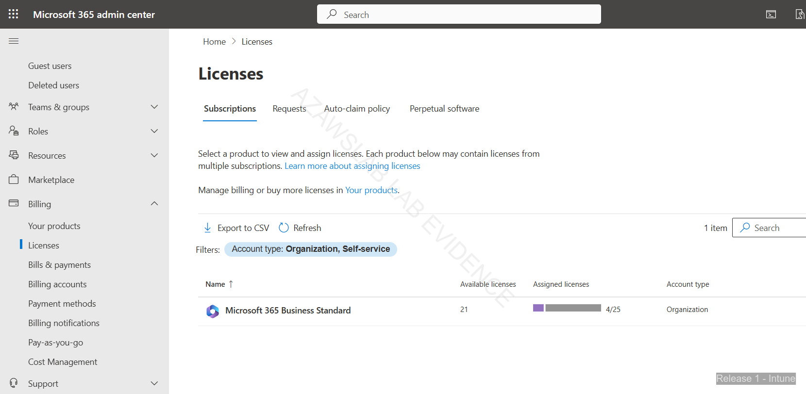
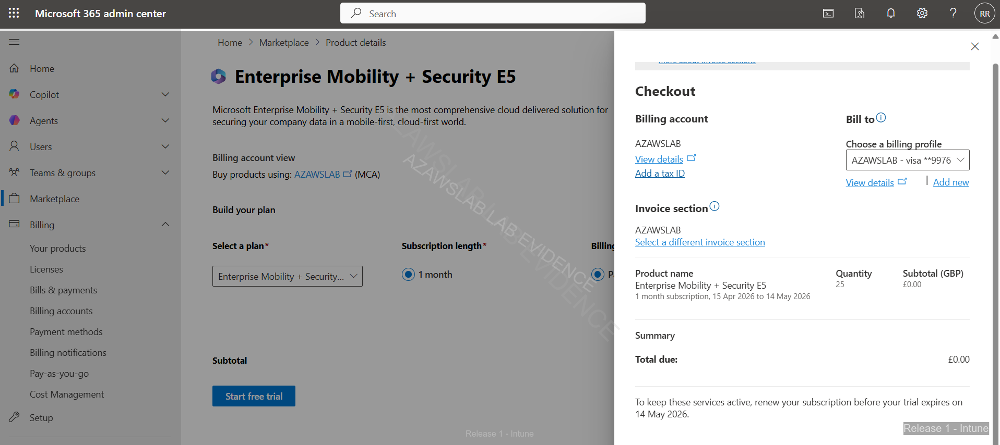
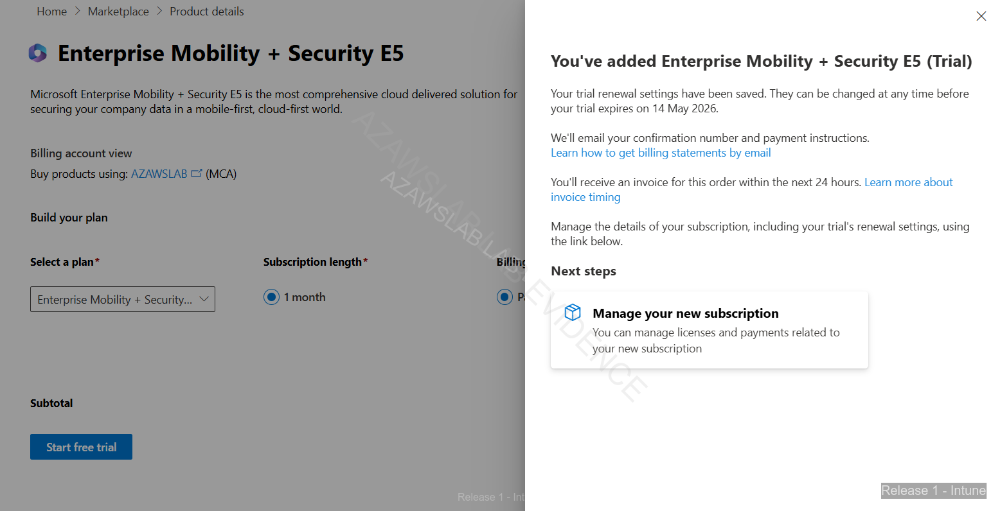

# Intune Evidence

This folder contains the main Release 1 endpoint-management evidence for Microsoft Intune.

## What this folder proves

- Windows corporate and Windows BYOD enrollment were validated
- Ubuntu Linux and iPhone BYOD participated in the managed environment
- compliance, security baseline, Windows Update for Business, and attack-surface controls were demonstrated
- BitLocker recovery, re-enrollment, and stale-record cleanup were documented as real operational scenarios

## Main evidence areas

- Windows corporate enrollment
- Windows BYOD enrollment
- iPhone BYOD enrollment
- Linux visibility and management context
- compliance policy
- security baseline
- Windows Update for Business
- BitLocker recovery and stale-record cleanup

## Related docs

- `docs/release1/03-endpoint-overview.md`
- `docs/release1/04-endpoint-enrollment.md`
- `docs/release1/05-endpoint-compliance.md`
- `docs/release1/06-recovery-scenarios.md`
- `docs/release1/08-monitoring.md`

<!-- AUTO-GENERATED: START -->

## Subfolders

- [Intune Android](./intune-android/)
- [Intune Bitlocker Recovery Scenario](./intune-bitlocker-recovery-scenario/)
- [Intune Compliance Policy](./intune-compliance-policy/)
- [Intune Ios](./intune-ios/)
- [Intune Linux](./intune-linux/)
- [Intune Security Baseline](./intune-security-baseline/)
- [Intune Windows Byod](./intune-windows-byod/)
- [Intune Windows Corp](./intune-windows-corp/)
- [Intune Windows Update](./intune-windows-update/)

## Flagship Evidence

### Intune mdm user scope all

### M365 business standard licenses

### Ems e5 trial checkout

<!-- AUTO-GENERATED: END -->

