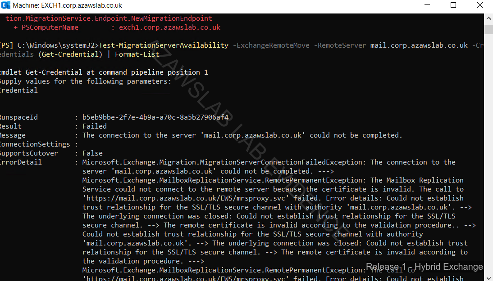
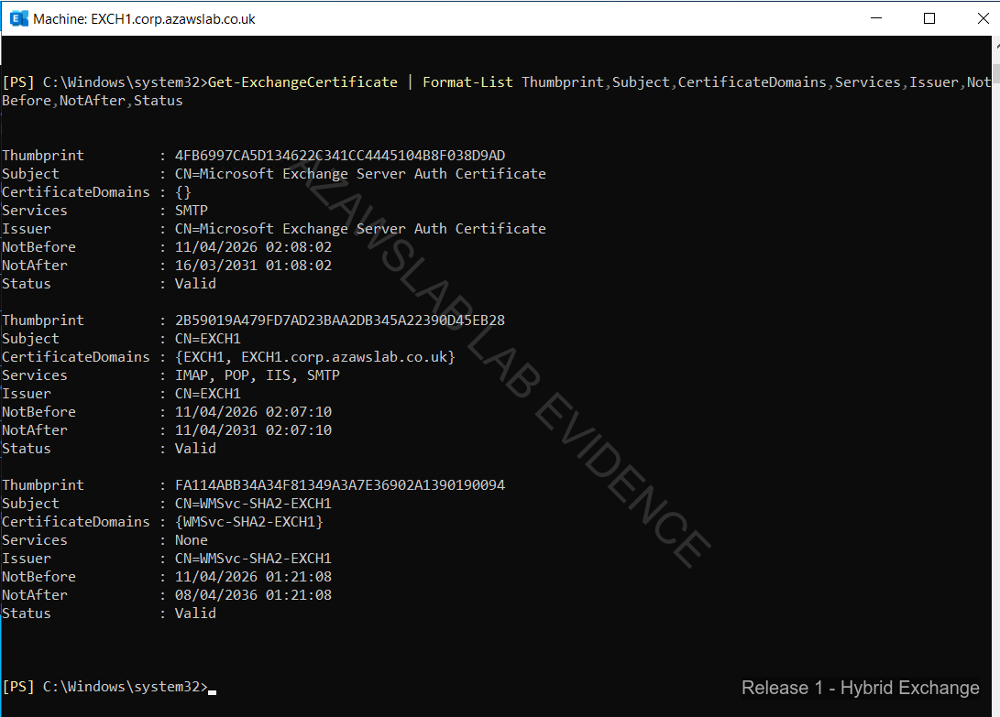
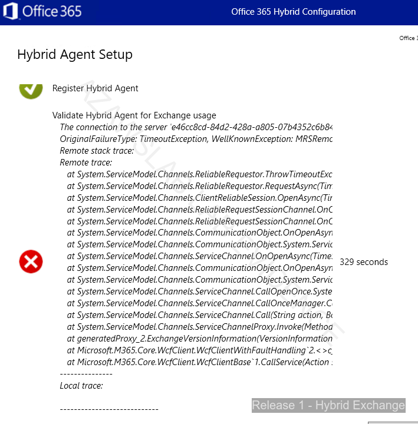

# Exchange Hybrid Evidence

This folder contains the Release 1 Exchange hybrid and Exchange Online pilot-migration evidence.

## What this folder proves

- Exchange hybrid prerequisites and validation were completed
- migration-endpoint readiness was tested successfully
- pilot mailbox migration into Exchange Online succeeded
- Release 1 modern workplace services were reached through real hybrid execution rather than tenant setup alone

## Main evidence areas

- hybrid configuration validation
- migration-endpoint testing
- pilot mailbox migration
- Outlook on the web validation for pilot users

## Related docs

- `docs/release1/01-hybrid-identity.md`
- `docs/release1/02-modern-workplace.md`
- `docs/release1/00-summary.md`

<!-- AUTO-GENERATED: START -->

## Flagship Evidence

### Hcw agent timeout error

### Hcw agent validation success

### Hcw user provisioning page

<!-- AUTO-GENERATED: END -->

