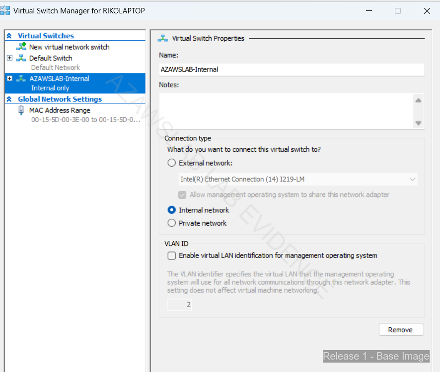
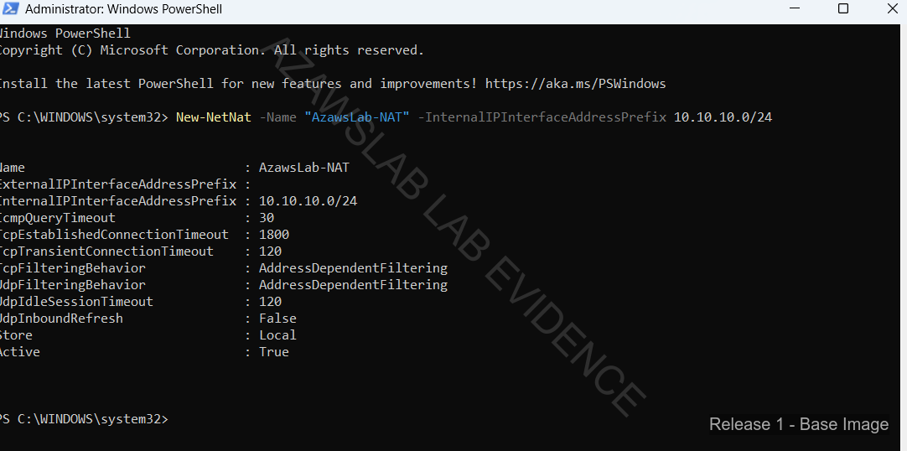
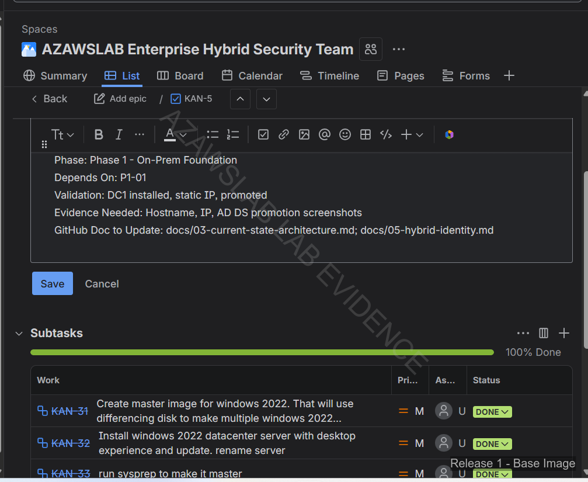

# Hyper-V Foundation Evidence

This folder contains the Release 1 platform-foundation evidence for the Hyper-V lab environment.

## What this folder proves

- Release 1 was built on a deliberate on-premises virtual platform, not a cloud-only test tenant
- internal switching, host NAT, and VM build decisions were part of the implementation story
- differencing-disk reuse and multi-VM orchestration supported repeatable platform delivery
- the later identity, Exchange, and endpoint workstreams depended on this foundation

## Main evidence areas

- Hyper-V host setup
- virtual switching and networking
- base image / differencing-disk strategy
- VM preparation for core Release 1 services

## Related docs

- `README.md`
- `docs/overview/02-current-state-architecture.md`
- `docs/release1/00-summary.md`
- `docs/release1/01-hybrid-identity.md`

<!-- AUTO-GENERATED: START -->

## Flagship Evidence

### . Hyper V Virtual Switch Manager

### . Enable Nat at host

### . jira subtask for master image

<!-- AUTO-GENERATED: END -->

