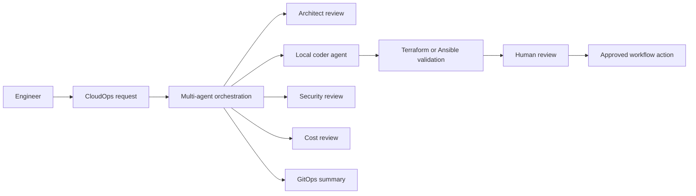

# Governed AI-Assisted CloudOps

O6 is not a chatbot demo. It is a governed AI-assisted CloudOps pattern that connects the main enterprise platform repo with a working local-first companion AI infrastructure lab.

The core principle is simple: AI can draft, validate, review, summarize, and recommend, but infrastructure authority remains with the engineer and the approved workflow.

## Pattern overview

## Control themes

| Control | What it means |
|---|---|
| Local-first generation | Sensitive Terraform and Ansible generation can run locally through Ollama and DeepSeek Coder in the companion lab |
| Multi-agent workflow | Architect, Coder, SecOps, FinOps, and GitOps roles are separated rather than collapsed into one unrestricted assistant |
| Tool permission control | Tool access is governed by project configuration rather than granting every agent broad capability |
| Deny-by-default model | Agents cannot call tools unless allowed for the selected project context |
| Validation without deployment | Terraform and Ansible validation check generated output without applying infrastructure |
| Human review boundary | Generated infrastructure code still requires engineer review before real use |
| Data-boundary design | Local execution and configurable cloud review reduce unnecessary source exposure |

## What O6 proves

| Capability | Reviewer signal |
|---|---|
| Governed AI operations | AI assistance is bounded by policy, validation, and human review |
| AI plus platform engineering | The project connects AI workflow design with Terraform, Ansible, Kubernetes, and CloudOps |
| Local/cloud boundary thinking | Sensitive generation can remain local while optional cloud review is configurable |
| Evidence-backed AI story | The main repo contains O6 evidence; the companion repo contains a working lab/reference implementation |

## Evidence and implementation

- [Main repo O6 evidence](https://github.com/jrikobd-azaws/azawslab-enterprise-hybrid-security/tree/main/docs/release2/evidence/O6){ target="_blank" }
- [Main repo Kubernetes support manifests](https://github.com/jrikobd-azaws/azawslab-enterprise-hybrid-security/tree/main/kubernetes){ target="_blank" }
- [O6 AI operations diagram](https://github.com/jrikobd-azaws/azawslab-enterprise-hybrid-security/blob/main/diagrams/release2/ai-operations-enclave.png){ target="_blank" }
- [Companion implementation: local-ai-lab-infra](https://github.com/jrikobd-azaws/local-ai-lab-infra){ target="_blank" }

!!! warning "Boundary statement"
    O6 is presented as governed AI-assisted infrastructure work, not unsupervised production mutation. Generated outputs require validation and human review before real infrastructure use.

[Back to Home](../index.md)