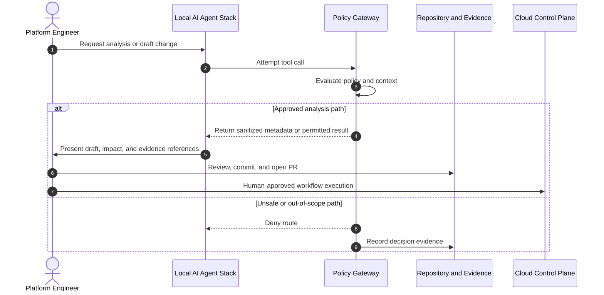

# Secure AI Operations Enclave

O6 models governed AI operations, not unrestricted autonomous infrastructure mutation.

## Enterprise challenge

Uncontrolled AI agents with write access to cloud environments can create risk across security, compliance, cost, and operational stability.

## Architecture solution

The O6 pattern introduces a policy-mediated boundary between AI assistance and infrastructure control-plane execution.

## Principles verified

- AI agents do not hold permanent tenant-wide deployment credentials.
- AI assists with analysis, drafting, and validation.
- Infrastructure mutation remains governed by review, policy, and explicit human-controlled workflows.
- Policy decisions and simulated tool routes are evidenced.

## Targeted verification

- [O6 evidence folder](https://github.com/jrikobd-azaws/azawslab-enterprise-hybrid-security/tree/main/docs/release2/evidence/O6)
- [O6 Kubernetes manifests](https://github.com/jrikobd-azaws/azawslab-enterprise-hybrid-security/tree/main/kubernetes)
- [O6 AI operations diagram](https://github.com/jrikobd-azaws/azawslab-enterprise-hybrid-security/blob/main/diagrams/release2/ai-operations-enclave.png)
- [Companion local AI lab](https://github.com/jrikobd-azaws/local-ai-lab-infra)