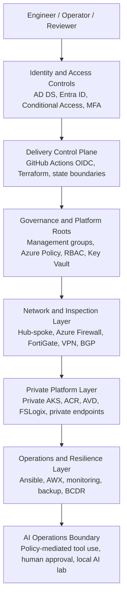

# Architecture Overview

`Platform - Public Ready` `Release 1 - Workplace & Identity` `Release 2 - Platform Engineering`

A high-level architecture view of the staged platform journey, control planes, trust boundaries, delivery paths, and evidence-backed implementation model.

## Architecture principles

- Identity-first access control.
- Infrastructure as Code with separated root ownership and remote state.
- Delivery through GitHub Actions and OIDC - no routine local execution.
- Hybrid and multi-cloud connectivity with explicit routing and inspection: Azure Firewall, FortiGate NVA, VPN, and BGP.
- Private platform delivery for AKS and AVD.
- Automation through Ansible and AWX, not ad-hoc scripts.
- Evidence-backed documentation instead of unsupported claims.
- AI operations enclave with policy-mediated tool use and human approval boundaries.

## Layered platform model

## Key architectural components

### Release 1 - Hybrid Workplace, Identity, Endpoint Security and Microsoft 365 Operations

Release 1 builds a hybrid enterprise fabric: on-premises Active Directory and Exchange Hybrid connect to Microsoft 365 through Entra Connect, forming the identity and collaboration backbone. Intune and Autopilot layer on modern endpoint management, while Conditional Access, MFA, BitLocker, LAPS, Purview, Sentinel, and Defender complete the security, compliance, monitoring, and recovery posture.

- Active Directory Domain Services and Exchange Hybrid running in a Hyper-V enterprise lab environment.
- Entra Connect synchronisation, Conditional Access, MFA, and identity protection.
- Intune enrollment, Autopilot provisioning, compliance policies, BitLocker, and LAPS.
- Microsoft Purview information protection, DLP, and sensitivity labels.
- Microsoft Sentinel, Defender for Cloud, and alerting configuration.
- Operational recovery scenarios including BitLocker key recovery and stale device cleanup.

### Release 2 - Azure Platform Engineering, Security, Automation and Multi-Cloud

- Terraform-defined landing zones, management groups, Azure Policy, RBAC, and multiple separated state roots.
- GitHub Actions OIDC with workflow-controlled Terraform plan/apply delivery.
- Hub-spoke networking, Azure Firewall, forced tunneling, route tables, and service chaining.
- FortiGate NVA integration for advanced traffic inspection.
- AWS branch foundation with site-to-site VPN, BGP, and cross-cloud route validation.
- Ansible playbooks and AWX job templates for configuration management and operational runbooks.
- Private AKS with no public API exposure, network policies, and Kubernetes manifests.
- AVD secure workspace with FSLogix, private endpoints, and privileged access separation.
- Recovery Services Vault, backup policies, BCDR planning, and soft-delete handling.
- AI operations enclave with policy-mediated tool use and companion local-ai-lab-infra implementation.

## Key diagrams and deep dives

- [Platform hero diagram](https://github.com/jrikobd-azaws/azawslab-enterprise-hybrid-security/blob/main/diagrams/platform/hero-diagram.png)
- [Terraform State Boundaries](engineering/terraform-state-boundaries.md)
- [GitHub Actions OIDC](engineering/github-actions-oidc.md)
- [Hybrid Multi-Cloud Networking](engineering/hybrid-multicloud-networking.md)
- [Automation Control Plane](engineering/automation-control-plane.md)
- [Private AKS and AVD Architecture](engineering/private-aks-avd.md)
- [Code Traceability](engineering/code-traceability.md)

## Source architecture

The full architecture source remains available in [ARCHITECTURE.md on GitHub](https://github.com/jrikobd-azaws/azawslab-enterprise-hybrid-security/blob/main/ARCHITECTURE.md).