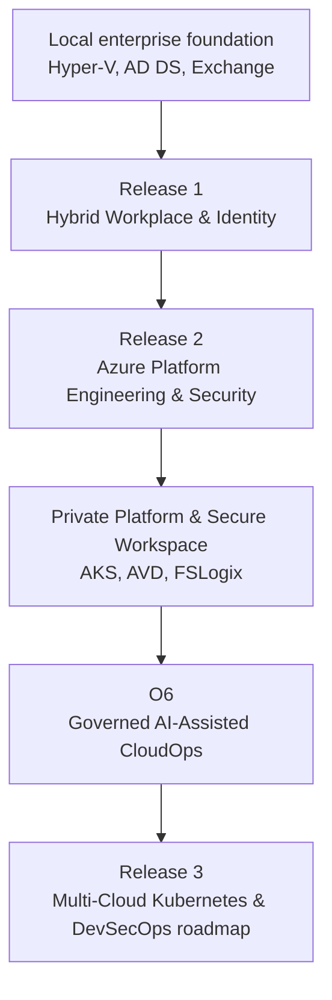

<section class="hero" markdown>

# Azawslab Enterprise Hybrid Security Platform

  

### An evidence-backed Azure, hybrid, and multi-cloud platform engineering portfolio.

AzAWSLab is a staged enterprise platform journey built from a realistic Microsoft hybrid foundation through Azure platform engineering, secure hybrid and multi-cloud networking, private platform delivery, and governed AI-assisted operations.

**What is inside:** Terraform-driven landing zones, OIDC-based CI/CD, hybrid identity, private AKS, AVD, AWX automation, and an O6 AI operations enclave.
**What it proves:** Evidence-backed implementation across identity, security, networking, platform delivery, and operational insight.
**Who should review it:** Cloud engineers, platform engineers, infrastructure architects, security architects, and technical reviewers.
**Where the evidence lives:** The [Proof Gallery](proof-gallery.md) and the [public GitHub repository](https://github.com/jrikobd-azaws/azawslab-enterprise-hybrid-security) hold the full evidence record.

[Explore Platform Journey](architecture.md){ .role-button }
[View Proof Gallery](proof-gallery.md){ .role-button }
[Technical Review](role-paths/technical-reviewer.md){ .role-button }
[Recruiter Path](role-paths/recruiter.md){ .role-button }

</section>

!!! success "Public portfolio status"
    The project is published as a curated case-study portfolio, backed by a public GitHub repository, custom domain, HTTPS, evidence folders, strict documentation checks, and role-based reviewer paths.

<!-- Visual architecture snapshot -->

*Platform architecture overview - [view full diagram on GitHub](https://github.com/jrikobd-azaws/azawslab-enterprise-hybrid-security/blob/main/diagrams/platform/hero-diagram.png)*

## Choose your review path

-   :fontawesome-solid-user-tie: **Recruiter**

    Fast skills scan, role alignment, top evidence, and interview-ready proof.

    [Start recruiter path](role-paths/recruiter.md)

-   :fontawesome-solid-briefcase: **Hiring Manager**

    Business context, delivery ownership, risk reduction, and platform maturity.

    [Start hiring manager path](role-paths/hiring-manager.md)

-   :fontawesome-solid-terminal: **Technical Reviewer**

    IaC design, Terraform state boundaries, workflows, networking, AKS, AVD, and evidence.

    [Start technical review](role-paths/technical-reviewer.md)

-   :fontawesome-solid-shield-halved: **Security Architect**

    Zero-trust boundaries, identity controls, private access, network inspection, and AI governance.

    [Start security review](role-paths/security-architect.md)

-   :fontawesome-solid-gears: **DevOps / SRE**

    CI/CD, OIDC delivery, AWX automation, monitoring, backup, validation, and operational readiness.

    [Start operations review](role-paths/devops-sre.md)

-   :material-file-search: **Evidence-first Reviewer**

    Visual proof map, screenshots, CLI output, logs, workflows, and redacted evidence folders.

    [Open proof gallery](proof-gallery.md)

## Platform journey

-   :material-numeric-1-circle: **Release 1: Workplace & Identity**

    Hybrid identity, Microsoft 365, Intune, endpoint security, compliance, and recovery foundations.

    [Open Release 1 summary](releases/release1.md)

-   :material-numeric-2-circle: **Release 2: Platform Engineering**

    Terraform OIDC, Azure governance, secure networking, automation, private AKS, AVD, and O6 AI operations.

    [Open Release 2 summary](releases/release2.md)

-   :material-numeric-3-circle: **Release 3: Multi-Cloud Roadmap**

    Future platform evolution toward AKS/EKS, GitOps, DevSecOps, observability, and resilience.

    [Open Release 3 summary](releases/release3.md)

## Core architectural capabilities

-   :material-key-chain: **Secretless IaC delivery**

    Reduces credential exposure by using GitHub Actions OIDC and workflow-controlled Terraform delivery.

    [Review OIDC delivery](engineering/github-actions-oidc.md)

-   :material-lan-connect: **Hybrid and multi-cloud fabric**

    Demonstrates secure routing, branch connectivity, firewall/NVA inspection, and trusted path separation.

    [Review networking](engineering/hybrid-multicloud-networking.md)

-   :material-shield-lock: **Private platform delivery**

    Shows private AKS and secure AVD workspace patterns as part of a controlled access model.

    [Review private platform](engineering/private-aks-avd.md)

-   :material-robot-outline: **Governed AI operations**

    Models AI-assisted operations through policy mediation, evidence, and human-controlled execution boundaries.

    [Review O6 AI operations](ai-operations/index.md)

## Featured proof

| Area | Quick proof |
|---|---|
| Secretless Terraform | [OIDC deployment evidence](https://github.com/jrikobd-azaws/azawslab-enterprise-hybrid-security/tree/main/docs/release2/evidence/P0) |
| Multi-cloud routing | [BGP and VPN evidence](https://github.com/jrikobd-azaws/azawslab-enterprise-hybrid-security/tree/main/docs/release2/evidence/P5) |
| Private AKS | [Private cluster validation](https://github.com/jrikobd-azaws/azawslab-enterprise-hybrid-security/tree/main/docs/release2/evidence/O4) |
| AWX automation | [AWX control plane evidence](https://github.com/jrikobd-azaws/azawslab-enterprise-hybrid-security/tree/main/docs/release2/evidence/A2-awx-control-plane) |
| AI governance | [O6 policy evidence](https://github.com/jrikobd-azaws/azawslab-enterprise-hybrid-security/tree/main/docs/release2/evidence/O6) |

## Source repository

The implementation, evidence folders, workflows, Terraform roots, Kubernetes manifests, diagrams, and full Markdown documentation remain in the GitHub source repository.

[:fontawesome-brands-github: Open GitHub repository](https://github.com/jrikobd-azaws/azawslab-enterprise-hybrid-security){ .md-button .md-button--primary }