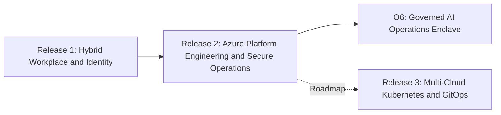

<section class="hero" markdown>

# Enterprise Hybrid Security Platform

### An evidenced blueprint for secure enterprise cloud transformation.

This portfolio presents a staged enterprise platform journey across Microsoft hybrid identity, Azure platform engineering, secure hybrid/multi-cloud networking, automation, private platform delivery, and governed AI operations.

[For Recruiters](role-paths/recruiter.md){ .role-button }
[Hiring Manager Path](role-paths/hiring-manager.md){ .role-button }
[Technical Review](role-paths/technical-reviewer.md){ .role-button }
[Proof Gallery](proof-gallery.md){ .role-button }

</section>

!!! note "Portfolio differentiator"
    Many cloud repositories stop at basic deployment examples. This platform emphasizes enterprise operating concerns: identity boundaries, state isolation, secretless delivery, routing and inspection, private platform access, evidence handling, and AI operations governance.

## Core architectural capabilities

-   :material-key-chain: **Secretless IaC delivery**

    Eliminates long-lived cloud deployment secrets from the normal delivery path by using GitHub Actions OIDC and workflow-controlled Terraform execution.

    [Review OIDC delivery](engineering/github-actions-oidc.md)

-   :material-lan-connect: **Hybrid and multi-cloud fabric**

    Demonstrates secure routing, branch connectivity, firewall/NVA inspection patterns, and separation between trusted and public paths.

    [Review networking](engineering/hybrid-multicloud-networking.md)

-   :material-shield-lock: **Private platform delivery**

    Shows private AKS and secure AVD workspace patterns as part of a controlled platform access model.

    [Review private platform](engineering/private-aks-avd.md)

-   :material-robot-outline: **Governed AI operations**

    Models AI-assisted operations through policy mediation, evidence, and human-controlled execution boundaries.

    [Review O6 AI operations](ai-operations/index.md)

## Release journey

| Stage | Focus | Portfolio signal |
|---|---|---|
| Release 1 | Hybrid Modern Workplace, Identity, Endpoint Security | Proves realistic enterprise foundation before cloud expansion |
| Release 2 | Azure platform engineering, governance, automation, private platform, AI operations | Proves platform engineering and secure operations capability |
| Release 3 | Kubernetes, GitOps, DevSecOps | Defines future platform evolution without false implementation claims |

## Source repository

The implementation, evidence folders, workflows, Terraform roots, Kubernetes manifests, diagrams, and full Markdown documentation remain in the GitHub source repository.

[:fontawesome-brands-github: Open source repository](https://github.com/jrikobd-azaws/azawslab-enterprise-hybrid-security){ .md-button .md-button--primary }