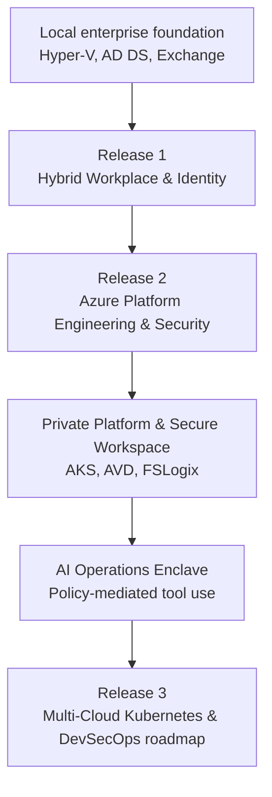

<section class="hero" markdown>

# Azawslab Enterprise Hybrid Security Platform

  

### Evidence-backed Azure, hybrid, and multi-cloud platform engineering portfolio.

AzAWSLab is a staged enterprise platform portfolio built from a realistic Microsoft hybrid enterprise environment through Azure platform engineering, secure hybrid and multi-cloud networking, private platform delivery, and controlled operations.

**Inside:** Terraform-driven landing zones, OIDC-based CI/CD, hybrid identity, private AKS, AVD, AWX automation, and an AI operations enclave with policy-mediated tool use and human approval boundaries.

**Proves:** Evidence-backed implementation across identity, security, networking, platform delivery, automation, resilience, and operational governance.

**Reviewers:** Cloud engineers, platform engineers, infrastructure architects, security architects, and technical reviewers.

[Explore Platform Journey](releases/index.md){ .role-button }
[View Proof Gallery](proof-gallery.md){ .role-button }
[Reviewer Pathways](role-paths/index.md){ .role-button }

</section>

!!! success "Public portfolio status"
    Published as a curated case-study portfolio with a public GitHub repository, custom domain, HTTPS, evidence folders, strict documentation checks, and role-based reviewer paths.

*Platform architecture overview - [view full diagram on GitHub](https://github.com/jrikobd-azaws/azawslab-enterprise-hybrid-security/blob/main/diagrams/platform/hero-diagram.png)*

## What this platform contains

-   :material-numeric-1-circle: **Release 1: Hybrid workplace, identity and Microsoft 365 operations**

    Hyper-V enterprise lab, AD DS, Exchange Hybrid, Entra Connect, Conditional Access, Intune, Autopilot, BitLocker, LAPS, Purview, Sentinel, Defender for Cloud, monitoring, and recovery validation.

    [Open Release 1 summary](releases/release1.md)

-   :material-numeric-2-circle: **Release 2: Azure platform engineering and secure operations**

    Terraform landing zones, OIDC delivery, separated state roots, Azure governance, hub-spoke networking, FortiGate inspection, BGP, AWS branch transit, AWX automation, backup, private AKS, AVD, and AI operations.

    [Open Release 2 summary](releases/release2.md)

-   :material-numeric-3-circle: **Release 3: Multi-cloud Kubernetes and DevSecOps roadmap**

    Defined roadmap toward AKS/EKS, GitOps, DevSecOps, observability, resilience, and platform evolution.

    [Open Release 3 roadmap](releases/release3.md)

## Platform journey

## Core architectural capabilities

-   :material-key-chain: **Secretless IaC delivery**

    GitHub Actions OIDC and workflow-controlled Terraform delivery reduce credential exposure and make deployment behavior reviewable.

    [Review OIDC delivery](engineering/github-actions-oidc.md)

-   :material-lan-connect: **Hybrid and multi-cloud fabric**

    Hub-spoke routing, Azure Firewall, FortiGate NVA inspection, VPN, BGP, and AWS branch patterns demonstrate secure transit design.

    [Review networking](engineering/hybrid-multicloud-networking.md)

-   :material-shield-lock: **Private platform delivery**

    Private AKS and secure AVD workspace patterns show controlled access to platform and operations layers.

    [Review private platform](engineering/private-aks-avd.md)

-   :material-cog-sync: **Automation and resilience**

    Ansible, AWX, backup policies, BCDR planning, Recovery Services Vault, and operational runbooks show Day 2 platform maturity.

    [Review automation control plane](engineering/automation-control-plane.md)

-   :material-robot-outline: **AI operations boundary**

    Policy-mediated tool use, human approval boundaries, and companion local AI infrastructure demonstrate controlled AI-enabled CloudOps.

    [Review AI operations](ai-operations/index.md)

## Featured proof

| Area | Quick proof |
|---|---|
| Secretless Terraform | [OIDC deployment evidence](https://github.com/jrikobd-azaws/azawslab-enterprise-hybrid-security/tree/main/docs/release2/evidence/P0) |
| Multi-cloud routing | [BGP and VPN evidence](https://github.com/jrikobd-azaws/azawslab-enterprise-hybrid-security/tree/main/docs/release2/evidence/P5) |
| Private AKS | [Private cluster validation](https://github.com/jrikobd-azaws/azawslab-enterprise-hybrid-security/tree/main/docs/release2/evidence/O4) |
| AVD secure workspace | [AVD workspace evidence](https://github.com/jrikobd-azaws/azawslab-enterprise-hybrid-security/tree/main/docs/release2/evidence/O5) |
| AWX automation | [AWX control plane evidence](https://github.com/jrikobd-azaws/azawslab-enterprise-hybrid-security/tree/main/docs/release2/evidence/A2-awx-control-plane) |
| AI operations | [AI operations evidence](evidence/release2-evidence-index.md) |

## Choose your review path

-   :fontawesome-solid-user-tie: **Recruiter**

    Fast skills scan, role alignment, top evidence, and interview-ready proof.

    [Start recruiter path](role-paths/recruiter.md)

-   :fontawesome-solid-briefcase: **Hiring Manager**

    Business context, delivery ownership, risk reduction, and platform maturity.

    [Start hiring manager path](role-paths/hiring-manager.md)

-   :fontawesome-solid-terminal: **Technical Reviewer**

    IaC design, Terraform state boundaries, workflows, networking, AKS, AVD, and evidence.

    [Start technical review](role-paths/technical-reviewer.md)

-   :fontawesome-solid-shield-halved: **Security Architect**

    Zero-trust boundaries, identity controls, private access, network inspection, and AI governance.

    [Start security review](role-paths/security-architect.md)

-   :fontawesome-solid-gears: **DevOps / SRE**

    CI/CD, OIDC delivery, AWX automation, monitoring, backup, validation, and operational readiness.

    [Start operations review](role-paths/devops-sre.md)

-   :material-file-search: **Evidence-first Reviewer**

    Visual proof map, screenshots, CLI output, logs, workflows, and redacted evidence folders.

    [Open proof gallery](proof-gallery.md)

## Source repository

The implementation, evidence folders, workflows, Terraform roots, Kubernetes manifests, diagrams, and full Markdown documentation remain in the GitHub source repository.

[:fontawesome-brands-github: Open GitHub repository](https://github.com/jrikobd-azaws/azawslab-enterprise-hybrid-security){ .md-button .md-button--primary }