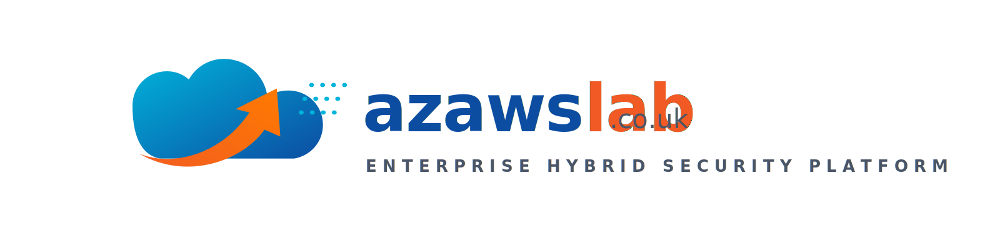
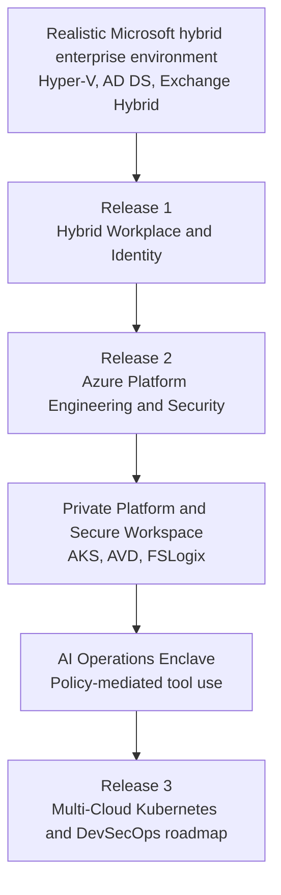

<section class="hero" markdown>

# Azawslab Enterprise Hybrid Security Platform

  

### Azure, hybrid, and multi-cloud platform engineering portfolio with public proof routes.

AzAWSLab is a staged technical portfolio built from a realistic Microsoft hybrid enterprise environment into Azure platform engineering, secure networking, automation, private platform services, operations, and AI governance.

**Inside:** Terraform-driven Azure platform roots, OIDC-based CI/CD, hybrid identity, Exchange Hybrid, private AKS, AVD, AWX automation, backup resilience, and an AI operations enclave with policy-mediated tool use.

**Proof route:** Proof Gallery, Engineering Deep Dive, and Skills Matrix connect implementation claims to screenshots, CLI output, workflow logs, source files, design notes, and evidence folders.

**Reviewers:** Cloud engineers, platform engineers, infrastructure architects, security architects, and technical reviewers.

[Explore Platform Journey](releases/index.md){ .role-button }
[View Proof Gallery](proof-gallery.md){ .role-button }
[Reviewer Pathways](role-paths/index.md){ .role-button }

</section>

!!! success "Public portfolio status"
    Published as a curated case-study portfolio with a public GitHub repository, custom domain, HTTPS, evidence folders, strict documentation checks, and role-based reviewer paths.

*Platform architecture overview - [view full diagram on GitHub](https://github.com/jrikobd-azaws/azawslab-enterprise-hybrid-security/blob/main/diagrams/platform/hero-diagram.png)*

## What this platform contains

-   :material-numeric-1-circle: **Release 1: Hybrid Workplace, Identity, Endpoint Security and Microsoft 365 Operations**

    Realistic Microsoft hybrid enterprise environment with Hyper-V, AD DS, Exchange Hybrid, Entra Connect, Conditional Access, Intune, Autopilot, BitLocker, LAPS, Purview, Sentinel, Defender for Cloud, operational visibility, and Microsoft Graph PowerShell.

    [Open Release 1 summary](releases/release1.md)

-   :material-numeric-2-circle: **Release 2: Azure Platform Engineering, Networking, Automation, Private Platform and AI Operations**

    Terraform-driven Azure platform roots, OIDC delivery, isolated state boundaries, Azure governance, hub-spoke networking, FortiGate inspection, BGP, AWS branch transit, AWX automation, backup resilience, private AKS, AVD secure workspace, and AI operations enclave.

    [Open Release 2 summary](releases/release2.md)

-   :material-numeric-3-circle: **Release 3: Multi-Cloud Kubernetes, GitOps and DevSecOps Roadmap**

    Defined roadmap toward AKS/EKS, Flux, Flagger, DevSecOps scanning, observability, resilience, and platform evolution.

    [Open Release 3 roadmap](releases/release3.md)

## Platform journey

## Core architectural capabilities

-   :material-key-chain: **OIDC-based IaC delivery**

    GitHub Actions OIDC and workflow-controlled Terraform delivery reduce reliance on long-lived credentials and make deployment behaviour reviewable.

    [Review OIDC delivery](engineering/github-actions-oidc.md)

-   :material-lan-connect: **Hybrid and multi-cloud fabric**

    Hub-spoke routing, Azure Firewall, FortiGate NVA inspection, VPN, BGP, and AWS branch patterns show the transit and inspection model.

    [Review networking](engineering/hybrid-multicloud-networking.md)

-   :material-shield-lock: **Private platform delivery**

    Private AKS and secure AVD workspace patterns keep platform and operator access inside controlled network paths.

    [Review private platform](engineering/private-aks-avd.md)

-   :material-cog-sync: **Automation and resilience**

    AWX job templates, governed runbooks, Recovery Services Vault controls, soft-delete handling, backup validation, and BCDR plans provide the operations evidence route.

    [Review automation control plane](engineering/automation-control-plane.md)

-   :material-robot-outline: **AI operations boundary**

    The AI Operations Enclave, evidenced through O6, models policy-mediated tool use and human approval boundaries for AI-assisted CloudOps.

    [Review AI operations](ai-operations/index.md)

## Featured proof

| Area | Quick proof |
|---|---|
| OIDC-based Terraform | [OIDC deployment evidence](https://github.com/jrikobd-azaws/azawslab-enterprise-hybrid-security/tree/main/docs/release2/evidence/P0) |
| Hybrid routing | [Hybrid routing evidence](https://github.com/jrikobd-azaws/azawslab-enterprise-hybrid-security/tree/main/docs/release2/evidence/P5) |
| VPN and BGP | [VPN-specific evidence](https://github.com/jrikobd-azaws/azawslab-enterprise-hybrid-security/tree/main/docs/release2/evidence/P5-vpn) |
| Private AKS | [Private cluster validation](https://github.com/jrikobd-azaws/azawslab-enterprise-hybrid-security/tree/main/docs/release2/evidence/O4) |
| AVD secure workspace | [AVD workspace evidence](https://github.com/jrikobd-azaws/azawslab-enterprise-hybrid-security/tree/main/docs/release2/evidence/O5) |
| AWX automation | [AWX control plane evidence](https://github.com/jrikobd-azaws/azawslab-enterprise-hybrid-security/tree/main/docs/release2/evidence/A2-awx-control-plane) |
| AI operations | [O6 evidence](https://github.com/jrikobd-azaws/azawslab-enterprise-hybrid-security/tree/main/docs/release2/evidence/O6) and [AI Operations Enclave](ai-operations/index.md) |
| Full evidence dashboard | [Proof Gallery](proof-gallery.md) |
| Complete skill map | [Skills Matrix](skills-matrix.md) |

## Choose your review path

-   :fontawesome-solid-user-tie: **Recruiter**

    Fast skills scan, role alignment, top evidence, and interview-ready proof.

    [Start recruiter path](role-paths/recruiter.md)

-   :fontawesome-solid-briefcase: **Hiring Manager**

    Business context, delivery ownership, risk reduction, and platform maturity.

    [Start hiring manager path](role-paths/hiring-manager.md)

-   :fontawesome-solid-terminal: **Technical Reviewer**

    IaC design, Terraform state boundaries, workflows, networking, AKS, AVD, and evidence.

    [Start technical review](role-paths/technical-reviewer.md)

-   :fontawesome-solid-shield-halved: **Security Architect**

    Zero-trust boundaries, identity controls, private access, network inspection, and AI governance.

    [Start security review](role-paths/security-architect.md)

-   :fontawesome-solid-gears: **DevOps / SRE**

    CI/CD, OIDC delivery, AWX automation, monitoring, backup, validation, and operational readiness.

    [Start operations review](role-paths/devops-sre.md)

-   :material-file-search: **Evidence-first Reviewer**

    Visual proof map, screenshots, CLI output, logs, workflows, and redacted evidence folders.

    [Open proof gallery](proof-gallery.md)

## Source repository

The public GitHub repository contains the implementation, evidence folders, workflows, Terraform roots, Kubernetes manifests, diagrams, and Markdown documentation.

[:fontawesome-brands-github: Open GitHub repository](https://github.com/jrikobd-azaws/azawslab-enterprise-hybrid-security){ .md-button .md-button--primary }
