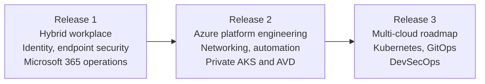

# Portfolio Case Study

  <a class="portfolio-chip" href="/portfolio-case-study/">
    Journey
    Public Ready
  </a>
  <a class="portfolio-chip" href="/releases/release1/">
    R1
    Workplace + M365
  </a>
  <a class="portfolio-chip" href="/releases/release2/">
    R2
    Platform + Multi-Cloud
  </a>
  <a class="portfolio-chip" href="/releases/release3/">
    R3
    Roadmap
  </a>

!!! tip "Case-study summary"
    AzAWSLab is the flagship portfolio project: a staged platform built from a realistic Microsoft hybrid enterprise environment into Azure platform engineering, secure hybrid and multi-cloud networking, automation, private platform services, operations, and AI governance.

This case study gives recruiters, hiring managers, and technical reviewers a direct route through the implemented releases, delivery story, and evidence map. Major capabilities are evidenced through screenshots, CLI output, workflow logs, source files, and design documents in the [public GitHub repository](https://github.com/jrikobd-azaws/azawslab-enterprise-hybrid-security), with review routes organised through the [Proof Gallery](/proof-gallery/), [Engineering Deep Dive](/engineering/), and [Skills Matrix](/skills-matrix/).

## What this project is

AzAWSLab is not a collection of isolated screenshots. It is a staged platform implementation with architecture, delivery, validation, documentation, and operational judgement kept together.

The portfolio starts with a realistic Microsoft hybrid enterprise environment: Active Directory, Exchange Hybrid, Microsoft 365 services, identity, endpoint security, and operational visibility.

## Transformation map

## Release 1 implementation evidence

Release 1 establishes hybrid workplace, identity, endpoint security, and Microsoft 365 operations:

- **Hybrid identity:** Entra Connect synchronisation, Conditional Access, MFA, and identity operations.
- **Exchange Hybrid and Microsoft 365 services:** hybrid mail flow, pilot mailbox migration, Teams, SharePoint, and Microsoft 365 service operations.
- **Modern endpoint management:** Intune enrollment, Autopilot provisioning, compliance policies, BitLocker encryption, Windows LAPS, and Defender controls.
- **Information protection:** Microsoft Purview, data loss prevention, sensitivity labels, and user-visible policy behaviour.
- **Operational recovery:** BitLocker recovery, stale device cleanup, trust-break handling, rebuild, and re-enrollment evidence.
- **Operational visibility:** sign-in and audit log review, device compliance tracking, policy and control review, and practical admin alerting.
- **Script-based operations:** Microsoft Graph and PowerShell for sync monitoring, compliance reporting, and device lifecycle operations.

## Release 2 implementation evidence

Release 2 extends that environment into platform engineering, secure networking, automation, private platform services, operations, and AI governance:

- **Landing zone and governance:** Terraform-defined platform roots, management group hierarchy, Azure Policy, RBAC, and state-boundary discipline.
- **Secret-less CI/CD:** GitHub Actions with OpenID Connect and reduced reliance on long-lived deployment credentials.
- **Code traceability:** source, workflow evidence, documentation, and proof routes mapped to reviewable platform claims.
- **Hub-spoke networking:** Azure Firewall, route tables, controlled routing, and service-chaining context.
- **Advanced traffic inspection:** FortiGate NVA integrated into the inspection path, validated through evidence.
- **Hybrid and multi-cloud routing:** site-to-site VPN, BGP, VyOS, Azure, and AWS branch route validation.
- **Automation control plane:** Ansible and AWX for governed runbooks, job execution evidence, and source-controlled operational automation.
- **Private AKS:** private platform pattern with Kubernetes manifests, controlled access, and network policy context.
- **Secure AVD workspace:** Azure Virtual Desktop with FSLogix, private access patterns, compliance context, and operator toolchain evidence.
- **Backup and disaster recovery:** Recovery Services Vault controls, backup validation, soft-delete handling, and BCDR planning.
- **AI operations:** AI Operations Enclave, evidenced through O6, with policy-mediated tool use and human approval boundaries.

## Delivery story

| Release | Focus | Status |
|---|---|---|
| Release 1 | Hybrid workplace, identity, endpoint security, and Microsoft 365 operations | Implemented and evidenced |
| Release 2 | Azure platform, networking, automation, private AKS and AVD, AI operations | Implemented and evidenced |
| Release 3 | Multi-cloud Kubernetes, GitOps, DevSecOps | Roadmap |

## Reviewer entry points

- **[Proof Gallery](/proof-gallery/)** - curated evidence dashboard covering the major platform capabilities.
- **[Skills Matrix](/skills-matrix/)** - skills map with links to engineering notes and proof routes.
- **[Engineering Deep Dive](/engineering/)** - engineering notes with design rationale, implementation context, configuration details, and evidence maps.
- **[Architecture Overview](/architecture/)** - platform journey, lifecycle domains, and key architectural decisions.
- **Reviewer Pathways** - role-specific routes for recruiters, hiring managers, technical reviewers, security architects, and DevOps/SRE reviewers.

