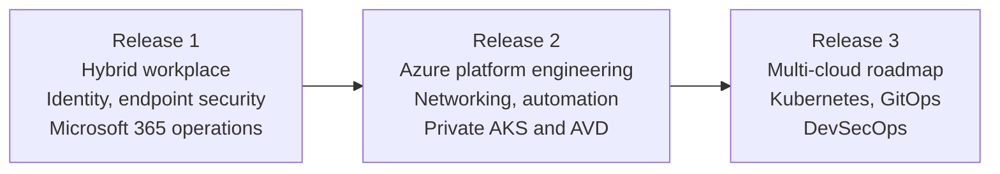

# Portfolio Case Study

<a class="portfolio-chip" href="/portfolio-case-study/">JourneyPublic Ready</a><a class="portfolio-chip" href="/releases/release1/">R1Workplace + M365</a><a class="portfolio-chip" href="/releases/release2/">R2Platform + Multi-Cloud</a><a class="portfolio-chip" href="/releases/release3/">R3Roadmap</a>

!!! tip "Case-study summary"
    AzAWSLab is a staged enterprise platform portfolio built from a realistic Microsoft hybrid enterprise environment into Azure platform engineering, secure hybrid and multi-cloud networking, automation, private platform delivery, and policy-mediated AI operations.

This case study is written for recruiters, hiring managers, and technical reviewers who need to understand the full project scope quickly. Every claim is backed by screenshots, CLI output, workflow logs, or design documents in the [public GitHub repository](https://github.com/jrikobd-azaws/azawslab-enterprise-hybrid-security).

## What this project is

AzAWSLab is not a collection of isolated screenshots. It is a connected platform lifecycle that demonstrates architecture, implementation, validation, documentation, and operational judgement.

The portfolio starts with hybrid workplace, identity, endpoint security, and Microsoft 365 operations. It then extends into Azure platform engineering, secure hybrid and multi-cloud networking, automation control planes, private AKS, AVD secure workspace, backup and disaster recovery, and an AI operations enclave with policy-mediated tool use and human approval boundaries.

## Transformation map

## What it proves - Release 1

Release 1 establishes hybrid workplace, identity, endpoint security, and Microsoft 365 operations:

- **Local enterprise base:** Hyper-V, Active Directory Domain Services, DNS, Exchange Hybrid.
- **Hybrid identity:** Entra Connect synchronisation, Conditional Access, MFA, and identity protection.
- **Modern endpoint management:** Intune enrollment, Autopilot provisioning, compliance policies, BitLocker encryption, LAPS.
- **Information protection:** Microsoft Purview, data loss prevention, sensitivity labels.
- **Operational recovery:** BitLocker key recovery, stale device cleanup, documented recovery scenarios.
- **Security monitoring:** Microsoft Sentinel, Defender for Cloud, alerting configuration.

## What it proves - Release 2

Release 2 builds the Azure platform and extends into multi-cloud territory:

- **Landing zone and governance:** Terraform-defined landing zones, management group hierarchy, Azure Policy, RBAC, and strict state-file separation across multiple Terraform roots.
- **Secretless CI/CD:** GitHub Actions with OpenID Connect (OIDC) and no long-lived deployment credentials.
- **Hub-spoke networking:** Azure Firewall, forced tunneling, route tables, and service chaining.
- **Advanced traffic inspection:** FortiGate NVA integrated into the inspection path, validated through evidence.
- **Hybrid and multi-cloud routing:** Site-to-site VPN, BGP, and a dedicated AWS branch foundation demonstrating cross-cloud transit and route validation.
- **Automation control plane:** Ansible playbooks and AWX used for configuration management and operational runbooks, not ad-hoc scripts. Evidence includes AWX job templates, inventories, and execution logs.
- **Private AKS:** Private cluster with no public API, network policies, and Kubernetes manifests.
- **Secure AVD workspace:** Azure Virtual Desktop with FSLogix, private endpoints, and privileged access separation.
- **Backup and disaster recovery:** Recovery Services Vault, backup policies, and documented BCDR plans including soft-delete handling.
- **AI operations:** AI operations enclave with policy-mediated tool use, human approval boundaries, and a companion local-ai-lab-infra implementation.

## Delivery story

| Release | Focus | Status |
|---|---|---|
| Release 1 | Hybrid workplace, identity, endpoint security, and Microsoft 365 operations | Implemented and evidenced |
| Release 2 | Azure platform, networking, automation, private AKS/AVD, AI operations | Implemented and evidenced |
| Release 3 | Multi-cloud Kubernetes, GitOps, DevSecOps | Roadmap |

## Reviewer entry points

- [Architecture Overview](architecture.md) - platform journey and design principles.
- [Skills Matrix](skills-matrix.md) - skills mapped to evidence.
- [Proof Gallery](proof-gallery.md) - visual evidence dashboard.
- [Evidence Guide](evidence-guide.md) - how evidence is structured and validated.
- For role-specific guidance, use the **Reviewer Pathways** menu at the top of the site.