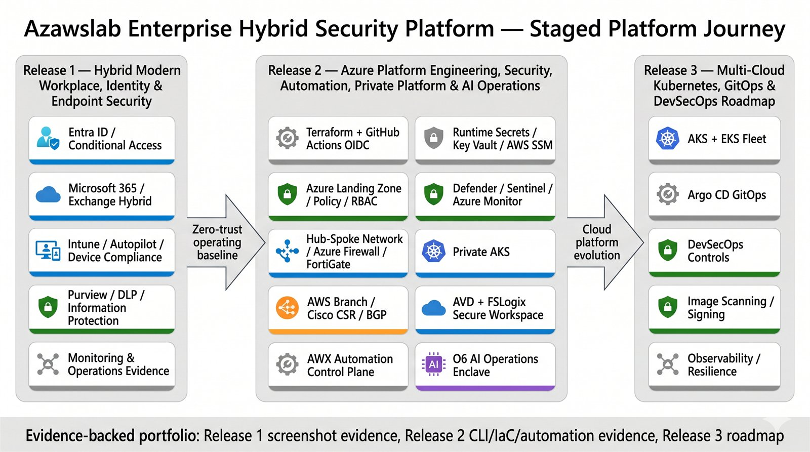
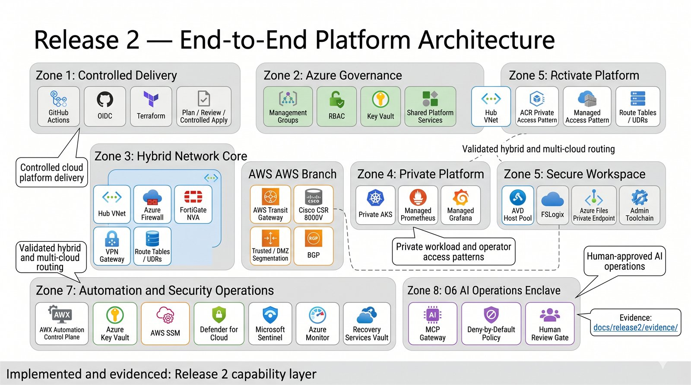
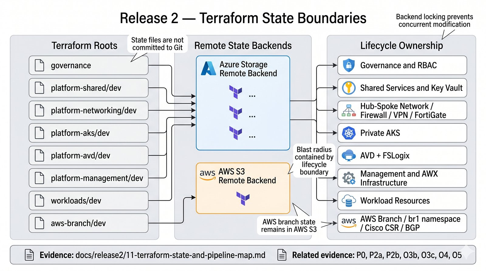
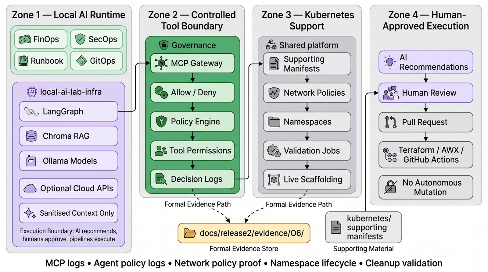
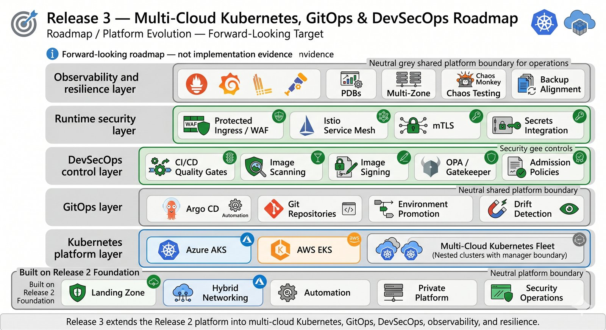

# Proof Gallery

  <a class="portfolio-chip" href="/portfolio-case-study/">
    Journey
    Public Ready
  </a>
  <a class="portfolio-chip" href="/releases/release1/">
    R1
    Workplace + M365
  </a>
  <a class="portfolio-chip" href="/releases/release2/">
    R2
    Platform + Multi-Cloud
  </a>
  <a class="portfolio-chip" href="/releases/release3/">
    R3
    Roadmap
  </a>

!!! summary "Reviewer evidence dashboard"
    The Proof Gallery routes portfolio claims to public-safe proof. It is organised by platform lifecycle domain so reviewers can move from architecture context to engineering notes, evidence folders, screenshots, workflow records, manifests, and source documents.

!!! note "Evidence model"
    Evidence routes use site pages and public repository folders that are safe to review publicly. They avoid one-off filenames, raw secrets, Terraform state, kubeconfigs, private keys, credentials, tokens, and unredacted tenant data.

## Visual proof map

- 
  **Platform Journey**  
  Executive view of the staged platform: Release 1 hybrid workplace and Microsoft 365 operations, Release 2 platform engineering and private platform services, and Release 3 roadmap direction.

- 
  **Release 2 Platform Architecture**  
  Release 2 platform engineering, secure networking, automation, private platform services, operations, and AI governance.

- 
  **Terraform State Boundaries**  
  Multi-root Terraform ownership model showing separated state, lifecycle ownership, and platform responsibility boundaries.

- 
  **O6 AI Operations Enclave**  
  AI Operations Enclave, evidenced through O6, with policy-mediated tool use, evidence capture, and human approval boundaries.

- 
  **Release 3 Roadmap**  
  Multi-cloud Kubernetes, GitOps, DevSecOps, observability, and resilience direction.

## Evidence entry points

| Evidence route | Use it for |
|---|---|
| [Release 1 Evidence Index](evidence/release1-evidence-index.md) | Hybrid workplace, identity, endpoint, Microsoft 365, Purview, monitoring, recovery, Graph, and PowerShell evidence. |
| [Release 2 Evidence Index](evidence/release2-evidence-index.md) | OIDC, Terraform state boundaries, AWX, multi-cloud transit, private AKS, AVD, O6, and platform evidence. |
| [Evidence Guide](evidence-guide.md) | Redaction model, acceptable evidence types, and public-safe handling rules. |
| [Engineering Deep Dive](engineering/index.md) | Engineering notes and implementation context behind each evidence area. |

---

## Release 1 Hybrid Workplace

???+ example "Hybrid identity and access control"
    **Evidence route:** Active Directory, Entra ID, Entra Connect, Conditional Access, MFA, pilot identity scope, and identity operations were implemented and routed to evidence.

    **Why it matters:** Identity is the access boundary for Microsoft 365, endpoint management, administration, and later platform operations. The evidence route shows identity configuration, operation, and review points rather than a static architecture description.

    **Where to inspect:**

    - [Hybrid Identity Engineering](engineering/hybrid-identity.md)
    - [Release 1 Evidence Index](evidence/release1-evidence-index.md)
    - [Identity and access screenshots](https://github.com/jrikobd-azaws/azawslab-enterprise-hybrid-security/tree/main/screenshots/release1/identity-and-access){ target="_blank" }
    - [Release 1 identity documentation](https://github.com/jrikobd-azaws/azawslab-enterprise-hybrid-security/tree/main/docs/release1){ target="_blank" }

    **Review signal:** The project demonstrates practical Microsoft hybrid identity administration and access-control verification.

???+ example "Exchange Hybrid and Microsoft 365 services"
    **Evidence route:** Exchange Hybrid and Microsoft 365 services are part of the Release 1 operating environment, with service configuration and validation evidence.

    **Why it matters:** A realistic Microsoft hybrid enterprise environment includes more than identity sync. Messaging, collaboration, service validation, and operational administration are part of the Release 1 operating model.

    **Where to inspect:**

    - [Exchange Hybrid and M365 Services](engineering/exchange-hybrid-m365-services.md)
    - [Modern workplace screenshots](https://github.com/jrikobd-azaws/azawslab-enterprise-hybrid-security/tree/main/screenshots/release1/modern-workplace){ target="_blank" }
    - [Release 1 Evidence Index](evidence/release1-evidence-index.md)

    **Review signal:** The candidate can explain Microsoft 365 service operations in the context of a hybrid enterprise environment.

???+ example "Modern endpoint management and recovery"
    **Evidence route:** Intune, Autopilot, compliance policy, BitLocker, Windows LAPS, Defender controls, endpoint recovery, and managed-device evidence are part of Release 1.

    **Why it matters:** Device state determines whether access controls are enforceable. Endpoint management is part of the access trust model, not a side feature.

    **Where to inspect:**

    - [Modern Endpoint Management](engineering/modern-endpoint-management.md)
    - [Endpoint management screenshots](https://github.com/jrikobd-azaws/azawslab-enterprise-hybrid-security/tree/main/screenshots/release1/endpoint-management){ target="_blank" }
    - [Release 1 recovery documentation](https://github.com/jrikobd-azaws/azawslab-enterprise-hybrid-security/tree/main/docs/release1){ target="_blank" }

    **Review signal:** The project demonstrates endpoint provisioning, enforcement, recovery, and operational control rather than static policy screenshots.

???+ example "Purview, information protection, and data governance"
    **Evidence route:** Microsoft Purview, sensitivity labels, DLP, retention, and user-visible policy behavior are evidenced in Release 1.

    **Why it matters:** Information protection demonstrates that the Microsoft 365 layer includes data governance, not only identity and device administration.

    **Where to inspect:**

    - [Information protection screenshots](https://github.com/jrikobd-azaws/azawslab-enterprise-hybrid-security/tree/main/screenshots/release1/information-protection){ target="_blank" }
    - [Release 1 Evidence Index](evidence/release1-evidence-index.md)
    - [Release 1 documentation](https://github.com/jrikobd-azaws/azawslab-enterprise-hybrid-security/tree/main/docs/release1){ target="_blank" }

    **Review signal:** The candidate connects identity, endpoint trust, and data protection into one workplace operating model.

???+ example "Graph and PowerShell operations"
    **Evidence route:** Microsoft Graph and PowerShell are used for repeatable identity and endpoint administration, including pilot user state, managed device state, consent validation, and controlled operational actions.

    **Why it matters:** Modern Microsoft administration increasingly depends on Graph-aware operations. Scripted validation makes the environment reviewable and repeatable.

    **Where to inspect:**

    - [Graph and PowerShell Operations](engineering/graph-powershell-operations.md)
    - [Release 1 scripts](https://github.com/jrikobd-azaws/azawslab-enterprise-hybrid-security/tree/main/scripts/release1){ target="_blank" }
    - [Graph and PowerShell screenshots](https://github.com/jrikobd-azaws/azawslab-enterprise-hybrid-security/tree/main/screenshots/release1/identity-and-access){ target="_blank" }

    **Review signal:** The project treats scripting as part of the operating model, not as disconnected helper commands.

???+ example "Monitoring and operational visibility"
    **Evidence route:** Release 1 includes monitoring and visibility through sign-in review, audit-log visibility, Conditional Access result review, device compliance checks, alert review, and Graph-connected validation.

    **Why it matters:** Operational review starts before a full SIEM deployment. The evidence route shows repeatable review points and documented visibility.

    **Where to inspect:**

    - [Monitoring and Operational Visibility](engineering/release1-monitoring-operational-visibility.md)
    - [Monitoring and operations screenshots](https://github.com/jrikobd-azaws/azawslab-enterprise-hybrid-security/tree/main/screenshots/release1/monitoring-and-operations){ target="_blank" }
    - [Release 1 monitoring documentation](https://github.com/jrikobd-azaws/azawslab-enterprise-hybrid-security/blob/main/docs/release1/08-monitoring.md){ target="_blank" }

    **Review signal:** The review route shows operational visibility, not only build evidence.

---

## Release 2 Delivery Engineering

???+ success "Terraform state boundaries"
    **Evidence route:** Terraform ownership is separated across multiple roots so platform networking, management, AKS, AVD, shared services, governance, workloads, and AWS branch concerns do not share one state boundary.

    **Why it matters:** State separation limits blast radius and makes platform ownership reviewable.

    **Where to inspect:**

    - [Terraform State Boundaries](engineering/terraform-state-boundaries.md)
    - [Terraform source](https://github.com/jrikobd-azaws/azawslab-enterprise-hybrid-security/tree/main/terraform){ target="_blank" }
    - [Terraform state and pipeline map](https://github.com/jrikobd-azaws/azawslab-enterprise-hybrid-security/blob/main/docs/release2/11-terraform-state-and-pipeline-map.md){ target="_blank" }
    - [Platform management state split evidence](https://github.com/jrikobd-azaws/azawslab-enterprise-hybrid-security/tree/main/docs/release2/evidence/platform-management-state-split){ target="_blank" }

    **Review signal:** Terraform is treated as a governed platform control plane, not a single deployment script.

???+ success "GitHub Actions OIDC"
    **Evidence route:** GitHub Actions and Azure are connected through OIDC-based delivery instead of routine long-lived deployment secrets.

    **Why it matters:** OIDC-based delivery reduces static credential exposure and makes delivery behaviour easier to review.

    **Where to inspect:**

    - [GitHub Actions OIDC](engineering/github-actions-oidc.md)
    - [P0 evidence](https://github.com/jrikobd-azaws/azawslab-enterprise-hybrid-security/tree/main/docs/release2/evidence/P0){ target="_blank" }
    - [GitHub Actions workflows](https://github.com/jrikobd-azaws/azawslab-enterprise-hybrid-security/tree/main/.github/workflows){ target="_blank" }
    - [Landing zone and governance documentation](https://github.com/jrikobd-azaws/azawslab-enterprise-hybrid-security/blob/main/docs/release2/01-landing-zone-iac-governance.md){ target="_blank" }

    **Review signal:** Platform delivery is identity-aware and workflow-governed.

???+ success "Code traceability"
    **Evidence route:** Documentation, source, evidence folders, workflow records, and platform resources are connected into a reviewable traceability model.

    **Why it matters:** Reviewers can move from a claim to source, from source to workflow, and from workflow to evidence.

    **Where to inspect:**

    - [Code Traceability](engineering/code-traceability.md)
    - [Release 2 Evidence Index](evidence/release2-evidence-index.md)
    - [GitHub repository](https://github.com/jrikobd-azaws/azawslab-enterprise-hybrid-security){ target="_blank" }

    **Review signal:** The project is built for source-to-evidence review, not presentation alone.

---

## Release 2 Network Engineering

???+ success "Hybrid multi-cloud networking"
    **Evidence route:** Azure hub-spoke networking, route control, inspection context, VPN, IPSec, BGP, AWS branch integration, and route validation are represented in the network architecture.

    **Why it matters:** Multi-cloud platforms fail when routing, inspection, and ownership boundaries are implicit. The evidence route shows explicit routing, inspection, and ownership boundaries.

    **Where to inspect:**

    - [Hybrid Multi-Cloud Networking](engineering/hybrid-multicloud-networking.md)
    - [Secure Transmission and Inspection](engineering/secure-transmission-inspection.md)
    - [Hybrid BGP Multi-Cloud Transit](engineering/hybrid-bgp-multicloud-transit.md)
    - [P5 evidence](https://github.com/jrikobd-azaws/azawslab-enterprise-hybrid-security/tree/main/docs/release2/evidence/P5){ target="_blank" }
    - [P5 VPN evidence](https://github.com/jrikobd-azaws/azawslab-enterprise-hybrid-security/tree/main/docs/release2/evidence/P5-vpn){ target="_blank" }
    - [Networking documentation](https://github.com/jrikobd-azaws/azawslab-enterprise-hybrid-security/blob/main/docs/release2/02-hybrid-multicloud-network-security.md){ target="_blank" }

    **Review signal:** The candidate can explain secure routing and inspection across hybrid and multi-cloud boundaries.

???+ success "FortiGate, Azure Firewall, and inspection path"
    **Evidence route:** The network design includes Azure Firewall, FortiGate NVA inspection, routing, and validation evidence.

    **Why it matters:** Inspection sits in the traffic path design, not in a disconnected security diagram.

    **Where to inspect:**

    - [Secure Transmission and Inspection](engineering/secure-transmission-inspection.md)
    - [Hybrid Multi-Cloud Networking](engineering/hybrid-multicloud-networking.md)
    - [Release 2 Evidence Index](evidence/release2-evidence-index.md)
    - [Release 2 evidence folder](https://github.com/jrikobd-azaws/azawslab-enterprise-hybrid-security/tree/main/docs/release2/evidence){ target="_blank" }

    **Review signal:** Security controls are embedded into routing and network engineering decisions.

---

## Release 2 Platform Services

???+ success "Private AKS platform"
    **Evidence route:** Private AKS is presented as a private platform pattern with controlled access, Kubernetes manifests, policy context, and validation evidence.

    **Why it matters:** Kubernetes platform engineering controls exposure, networking, workload policy, and validation, not only cluster creation.

    **Where to inspect:**

    - [Private AKS Platform](engineering/private-aks-platform.md)
    - [Private AKS and AVD Architecture](engineering/private-aks-avd.md)
    - [O4 evidence](https://github.com/jrikobd-azaws/azawslab-enterprise-hybrid-security/tree/main/docs/release2/evidence/O4){ target="_blank" }
    - [Kubernetes source](https://github.com/jrikobd-azaws/azawslab-enterprise-hybrid-security/tree/main/kubernetes){ target="_blank" }

    **Review signal:** The candidate can reason about private Kubernetes platform delivery and validation.

???+ success "AVD secure workspace and FSLogix"
    **Evidence route:** Azure Virtual Desktop, FSLogix, private access orientation, privileged access separation, and secure workspace governance are part of the platform service model.

    **Why it matters:** Privileged administration needs controlled access paths. AVD is used as a secure operations workspace pattern, not only remote desktop.

    **Where to inspect:**

    - [AVD Secure Workspace](engineering/avd-secure-workspace.md)
    - [Private AKS and AVD Architecture](engineering/private-aks-avd.md)
    - [O5 evidence](https://github.com/jrikobd-azaws/azawslab-enterprise-hybrid-security/tree/main/docs/release2/evidence/O5){ target="_blank" }
    - [Private platform documentation](https://github.com/jrikobd-azaws/azawslab-enterprise-hybrid-security/blob/main/docs/release2/04-private-platform-secure-workspace.md){ target="_blank" }

    **Review signal:** The project treats administration paths as part of the security and platform architecture.

---

## Release 2 Operations Engineering

???+ success "Ansible and AWX automation control plane"
    **Evidence route:** Automation is implemented as a governed operations pattern with Ansible, AWX, inventories, job templates, execution records, and evidenced runbooks.

    **Why it matters:** Operations need repeatability, role boundaries, source control, and reviewable execution history.

    **Where to inspect:**

    - [Automation Control Plane](engineering/automation-control-plane.md)
    - [Ansible source](https://github.com/jrikobd-azaws/azawslab-enterprise-hybrid-security/tree/main/ansible){ target="_blank" }
    - [A2 AWX control-plane evidence](https://github.com/jrikobd-azaws/azawslab-enterprise-hybrid-security/tree/main/docs/release2/evidence/A2-awx-control-plane){ target="_blank" }
    - [Automation, SecOps, and resilience documentation](https://github.com/jrikobd-azaws/azawslab-enterprise-hybrid-security/blob/main/docs/release2/03-automation-secops-resilience.md){ target="_blank" }

    **Review signal:** Automation is treated as a platform capability with governed execution.

???+ success "Monitoring, backup, and resilience"
    **Evidence route:** Azure Monitor, Sentinel, Defender for Cloud, Recovery Services Vault, backup policies, BCDR planning, soft-delete handling, immutability, and validation evidence are part of the operations model.

    **Why it matters:** Platform maturity depends on monitoring, recovery, and deletion protection being implemented and validated, not only planned.

    **Where to inspect:**

    - [Monitoring, Backup and Resilience](engineering/monitoring-backup-resilience.md)
    - [Release 2 Evidence Index](evidence/release2-evidence-index.md)
    - [Release 2 evidence folder](https://github.com/jrikobd-azaws/azawslab-enterprise-hybrid-security/tree/main/docs/release2/evidence){ target="_blank" }
    - [Automation, SecOps, and resilience documentation](https://github.com/jrikobd-azaws/azawslab-enterprise-hybrid-security/blob/main/docs/release2/03-automation-secops-resilience.md){ target="_blank" }

    **Review signal:** Operational resilience is evidenced through monitoring, backup, recovery, and protection controls.

---

## AI Operations and Innovation

???+ info "O6 AI Operations Enclave"
    **Evidence route:** O6 defines the AI Operations Enclave with policy-mediated tool use, logging, Kubernetes support context, evidence capture, and human approval boundaries.

    **Why it matters:** AI-assisted infrastructure operations need explicit constraints. O6 frames AI as support inside a governed workflow, with human approval boundaries rather than autonomous infrastructure operation.

    **Where to inspect:**

    - [AI Operations Enclave](ai-operations/index.md)
    - [O6 evidence](https://github.com/jrikobd-azaws/azawslab-enterprise-hybrid-security/tree/main/docs/release2/evidence/O6){ target="_blank" }
    - [O6 capability story](https://github.com/jrikobd-azaws/azawslab-enterprise-hybrid-security/blob/main/docs/release2/05-ai-operations-enclave.md){ target="_blank" }

    **Review signal:** The candidate can reason about AI operations with policy, evidence, and approval boundaries.

???+ info "Companion local AI lab"
    **Evidence route:** The companion project demonstrates a local-first multi-agent infrastructure workflow with RAG, provider routing, validation hooks, tool permissions, data-boundary controls, and human review.

    **Why it matters:** The AI operations route includes the main platform governance pattern and a working lab/reference implementation.

    **Where to inspect:**

    - [Companion Project](companion-project.md)
    - [local-ai-lab-infra repository](https://github.com/jrikobd-azaws/local-ai-lab-infra){ target="_blank" }
    - [Main repo O6 evidence](https://github.com/jrikobd-azaws/azawslab-enterprise-hybrid-security/tree/main/docs/release2/evidence/O6){ target="_blank" }

    **Review signal:** The project connects platform engineering, AI governance, and controlled infrastructure workflow design.

---

## Release 3 Roadmap

???+ note "Multi-cloud Kubernetes, GitOps, DevSecOps, observability, and resilience"
    **Evidence route:** Release 3 is intentionally positioned as roadmap and platform evolution, not delivered implementation evidence.

    **Why it matters:** The roadmap separates implemented evidence from future direction. The roadmap extends the current platform toward multi-cloud Kubernetes, GitOps, DevSecOps, observability, and resilience.

    **Where to inspect:**

    - [Release 3 Platform Journey](releases/release3.md)
    - [Release 3 documentation](https://github.com/jrikobd-azaws/azawslab-enterprise-hybrid-security/tree/main/docs/release3){ target="_blank" }
    - [Release 3 roadmap diagram](https://github.com/jrikobd-azaws/azawslab-enterprise-hybrid-security/blob/main/diagrams/release3/release3-target-roadmap.png){ target="_blank" }

    **Review signal:** The candidate shows roadmap discipline without presenting future work as completed.
