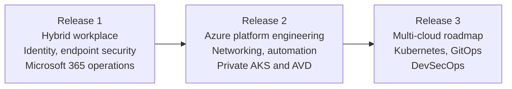

# Platform Journey

  <a class="portfolio-chip" href="/releases/">
    Journey
    Public Ready
  </a>
  <a class="portfolio-chip" href="/releases/release1/">
    R1
    Workplace + M365
  </a>
  <a class="portfolio-chip" href="/releases/release2/">
    R2
    Platform + Multi-Cloud
  </a>
  <a class="portfolio-chip" href="/releases/release3/">
    R3
    Roadmap
  </a>

!!! summary "What this page is"
    A guided entry into the full AzAWSLab platform lifecycle: from on-premises hybrid identity to Azure platform engineering, secure multi-cloud networking, automation, resilience, and an AI operations enclave with policy-mediated tool use and human approval boundaries.

Release 1 and Release 2 are implemented, operationally validated, and evidenced through public-safe screenshots, CLI output, workflow records, source files, manifests, diagrams, and design documents. Release 3 is clearly marked as roadmap until implementation evidence is added.

## Transformation map

## Deliveries at a glance

| Release | Focus | Status |
|---|---|---|
| [Release 1](/releases/release1/) | Hybrid workplace, identity, endpoint security, and Microsoft 365 operations | Implemented and evidenced |
| [Release 2](/releases/release2/) | Azure platform engineering, secure networking, automation, private AKS, AVD, resilience, and AI operations | Implemented and evidenced |
| [Release 3](/releases/release3/) | Multi-cloud Kubernetes, GitOps, DevSecOps, observability, and resilience roadmap | Roadmap |

## How to use this journey

| Reviewer need | Recommended path |
|---|---|
| Fast project understanding | Start here for the release map, then open the [Proof Gallery](/proof-gallery/). |
| Recruiter or hiring-manager scan | Review the delivery table, then use [Release 2](/releases/release2/) for the strongest platform engineering signals. |
| Hybrid workplace and Microsoft 365 proof | Review [Release 1](/releases/release1/) for identity, endpoint, Purview, monitoring, and recovery evidence. |
| Platform architecture depth | Review [Release 2](/releases/release2/) for Terraform roots, OIDC, FortiGate inspection, AWS branch routing, AWX, private AKS, AVD, backup, and AI operations. |
| Security architecture review | Follow Release 1 identity and endpoint controls into Release 2 private access, inspection, Sentinel, Defender, backup, and O6 AI operations boundaries. |
| Future roadmap context | Use [Release 3](/releases/release3/) to understand planned platform evolution without confusing roadmap with delivered proof. |

## Evidence model

The release pages are not standalone marketing summaries. They route reviewers to the implementation source and evidence layers:

- GitHub Markdown documentation for architecture decisions and implementation narratives.
- Screenshot folders for portal-level configuration and operational outcomes.
- CLI and workflow output for runtime validation and delivery proof.
- Terraform, Kubernetes, Ansible, and GitHub Actions source for implementation traceability.
- Curated proof pages for reviewers who need a guided evidence path.

## Source entry points

- [GitHub repository](https://github.com/jrikobd-azaws/azawslab-enterprise-hybrid-security)
- [Release 1 screenshots](https://github.com/jrikobd-azaws/azawslab-enterprise-hybrid-security/tree/main/screenshots/release1)
- [Release 2 evidence](https://github.com/jrikobd-azaws/azawslab-enterprise-hybrid-security/tree/main/docs/release2/evidence)
- [Terraform source](https://github.com/jrikobd-azaws/azawslab-enterprise-hybrid-security/tree/main/terraform)
- [Ansible source](https://github.com/jrikobd-azaws/azawslab-enterprise-hybrid-security/tree/main/ansible)
- [Kubernetes source](https://github.com/jrikobd-azaws/azawslab-enterprise-hybrid-security/tree/main/kubernetes)
- [Proof Gallery](/proof-gallery/)
- [Evidence Guide](/evidence-guide/)