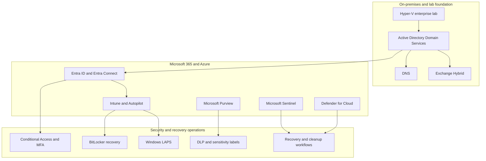

# Release 1 - Hybrid Workplace and Microsoft 365 Operations

  <a class="portfolio-chip" href="/releases/">
    Journey
    Public Ready
  </a>
  <a class="portfolio-chip" href="/releases/release1/">
    R1
    Workplace + M365
  </a>
  <a class="portfolio-chip" href="/releases/release2/">
    R2
    Platform + Multi-Cloud
  </a>
  <a class="portfolio-chip" href="/releases/release3/">
    R3
    Roadmap
  </a>

!!! success "Status: Implemented and evidenced"
    Release 1 is implemented, operationally validated, and evidenced through public-safe screenshots, configuration captures, policy validation, administrative workflows, and recovery scenarios.

Release 1 establishes the enterprise hybrid baseline: an on-premises Active Directory domain extended to Microsoft 365, modern endpoint management, information protection, security monitoring, and operational recovery.

This release proves that the platform starts from a realistic Microsoft hybrid enterprise environment rather than an isolated cloud demo.

## Architecture overview

## What this release proves

- **Hybrid identity** - Entra Connect synchronisation, controlled pilot scoping, Microsoft 365 visibility, Conditional Access result validation, MFA, and identity lifecycle operations.
- **Modern endpoint management** - Intune enrollment, Autopilot provisioning, compliance policies, BitLocker encryption, Defender controls, and Windows LAPS.
- **Information protection** - Microsoft Purview sensitivity labels, data loss prevention, policy-tip validation, retention controls, and document classification workflows.
- **Operational recovery** - BitLocker key escrow, documented recovery, trust-break handling, stale-device cleanup, rebuild, and re-enrollment workflows.
- **Security monitoring** - Sentinel, Defender for Cloud, alert visibility, audit records, and security operations evidence.

## Capability matrix

| Capability | Implementation signal | Evidence path |
|---|---|---|
| Local enterprise base | Hyper-V lab foundation, Active Directory Domain Services, DNS, and Exchange Hybrid provide the starting enterprise fabric. | [Release 1 screenshots](https://github.com/jrikobd-azaws/azawslab-enterprise-hybrid-security/tree/main/screenshots/release1) and [Release 1 docs](https://github.com/jrikobd-azaws/azawslab-enterprise-hybrid-security/tree/main/docs/release1) |
| Hybrid identity | Entra Connect synchronisation, controlled pilot scope, Microsoft 365 visibility, Conditional Access result validation, MFA, and identity lifecycle operations. | [Hybrid identity documentation](https://github.com/jrikobd-azaws/azawslab-enterprise-hybrid-security/blob/main/docs/release1/01-hybrid-identity.md) and [identity screenshots](https://github.com/jrikobd-azaws/azawslab-enterprise-hybrid-security/tree/main/screenshots/release1/identity-and-access) |
| Endpoint enrollment | Intune enrollment, Windows Autopilot, device onboarding, compliance state, and managed endpoint lifecycle evidence. | [Endpoint enrollment documentation](https://github.com/jrikobd-azaws/azawslab-enterprise-hybrid-security/blob/main/docs/release1/04-endpoint-enrollment.md) and [endpoint screenshots](https://github.com/jrikobd-azaws/azawslab-enterprise-hybrid-security/tree/main/screenshots/release1/endpoint-management) |
| Endpoint security | Compliance policies, security baselines, Defender Antivirus controls, attack surface reduction, BitLocker, and Windows LAPS. | [Endpoint compliance and security documentation](https://github.com/jrikobd-azaws/azawslab-enterprise-hybrid-security/blob/main/docs/release1/05-endpoint-compliance-and-security.md) |
| Information protection | Microsoft Purview sensitivity labels, data loss prevention, policy-tip validation, retention controls, and document classification workflows. | [Purview documentation](https://github.com/jrikobd-azaws/azawslab-enterprise-hybrid-security/blob/main/docs/release1/07-purview.md) and [information protection screenshots](https://github.com/jrikobd-azaws/azawslab-enterprise-hybrid-security/tree/main/screenshots/release1/information-protection) |
| Recovery operations | BitLocker key recovery, stale-device cleanup, trust-break handling, rebuild, re-enrollment, and operational recovery documentation. | [Recovery scenarios documentation](https://github.com/jrikobd-azaws/azawslab-enterprise-hybrid-security/blob/main/docs/release1/06-recovery-scenarios.md) |
| Security monitoring | Sentinel, Defender for Cloud, alert visibility, audit records, and security operations evidence. | [Release 1 screenshots](https://github.com/jrikobd-azaws/azawslab-enterprise-hybrid-security/tree/main/screenshots/release1) |

## Evidence hub

All Release 1 evidence is organised around visible administrative state and operational outcomes:

- Identity and access screenshots for hybrid identity, Conditional Access, MFA, and sign-in validation.
- Endpoint management screenshots for Intune, Autopilot, compliance, BitLocker, Windows LAPS, and managed endpoint lifecycle.
- Information protection screenshots for Purview, sensitivity labels, DLP, policy tips, and classification controls.
- Recovery evidence for BitLocker recovery, trust-break remediation, stale-device cleanup, and endpoint lifecycle recovery.
- Release 1 documentation pages that explain the implementation sequence and reviewer-relevant proof.

No Release 1 claim on this page is intentionally presented without a corresponding public-safe source or evidence path.

## Why it matters

Release 1 demonstrates the platform engineer's baseline: identity, device state, data protection, collaboration operations, monitoring, and recovery controls must exist before advanced cloud platform work can be trusted.

## Skills demonstrated

| Skill area | Signal |
|---|---|
| Microsoft hybrid identity | AD DS, Entra Connect, Conditional Access, MFA, pilot scoping, and identity lifecycle operations. |
| Microsoft 365 operations | Exchange Hybrid, Microsoft 365 administration, Purview, DLP, sensitivity labels, and operational governance. |
| Endpoint security | Intune, Autopilot, compliance policy, BitLocker, Windows LAPS, Defender controls, and recovery workflows. |
| Security operations | Sentinel, Defender for Cloud, alert visibility, and audit-driven validation. |
| Evidence-led delivery | Screenshots, configuration captures, recovery notes, and documentation tied to actual implementation. |

## Next step

After Release 1, the project moves into [Release 2 platform engineering and multi-cloud operations](/releases/release2/).