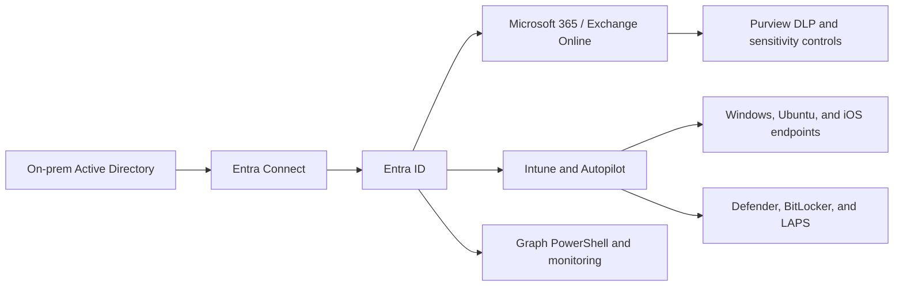

# Release 1 - Hybrid Modern Workplace, Identity & Endpoint Security

Release 1 establishes the enterprise foundation: identity, messaging, endpoint management, compliance, and recovery. It proves that the platform starts from a realistic Microsoft hybrid environment rather than isolated cloud-only examples.

## Architecture at a glance

This release validates the identity and endpoint operating model that later Azure, Kubernetes, and AI operations work depends on.

## What this release proves

| Capability | What it demonstrates |
|---|---|
| Hybrid identity | Active Directory DS integrated with Microsoft cloud identity patterns |
| Microsoft 365 and Exchange hybrid | Messaging coexistence and modern workplace transition planning |
| Endpoint management | Intune, Autopilot, compliance, BitLocker, and LAPS-oriented operations |
| Data protection | Purview-oriented compliance and DLP controls |
| Recovery operations | Device and identity recovery scenarios with evidence-first validation |
| Automation | Graph PowerShell and repeatable identity/operations workflows |

## Flagship proof

| Evidence area | What it shows | Entry point |
|---|---|---|
| Hybrid workplace documentation | Release 1 design, implementation, and validation story | [Release 1 docs](https://github.com/jrikobd-azaws/azawslab-enterprise-hybrid-security/tree/main/docs/release1) |
| Screenshot evidence | Public-safe visual evidence for identity, endpoint, and compliance work | [Release 1 screenshots](https://github.com/jrikobd-azaws/azawslab-enterprise-hybrid-security/tree/main/screenshots/release1) |
| Skills mapping | How Release 1 capabilities map to platform, identity, endpoint, and compliance skills | [Skills Matrix](../skills-matrix.md) |
| Curated proof | Reviewer-friendly evidence summary across releases | [Proof Gallery](../proof-gallery.md) |

!!! quote "Architect's insight"
    Implementing hybrid identity and endpoint governance before cloud platform expansion creates a tested identity perimeter. That sequencing reduces rework because later Azure, private platform, and automation decisions inherit a stable access model.

## Why it matters

Release 1 shows the identity perimeter and workplace operating model that enterprise cloud platforms depend on. It gives reviewers confidence that the later Azure, Kubernetes, and AI operations work is built on real operational foundations.

## Platform evolution notes

- Conditional Access and compliance guardrails could be further codified through policy-as-code patterns as the identity layer matures.
- Endpoint compliance evidence could be extended with deeper Defender hunting queries and incident-response validation.

## Reviewer entry points

- [Proof Gallery](../proof-gallery.md)
- [Skills Matrix](../skills-matrix.md)
- [Full Release 1 documentation](https://github.com/jrikobd-azaws/azawslab-enterprise-hybrid-security/tree/main/docs/release1)
- [Release 1 screenshots](https://github.com/jrikobd-azaws/azawslab-enterprise-hybrid-security/tree/main/screenshots/release1)

Release 1 is complete and evidenced.