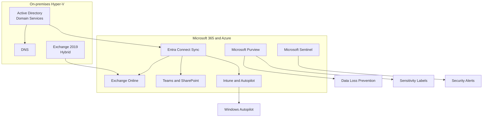

# Release 1: Hybrid Workplace and Microsoft 365

  <a class="portfolio-chip" href="/releases/">
    Journey
    Public Ready
  </a>
  <a class="portfolio-chip" href="/releases/release1/">
    R1
    Workplace + M365
  </a>
  <a class="portfolio-chip" href="/releases/release2/">
    R2
    Platform + Multi-Cloud
  </a>
  <a class="portfolio-chip" href="/releases/release3/">
    R3
    Roadmap
  </a>

!!! success "Status: Implemented and evidenced"
    Release 1 is implemented and evidenced through screenshots, configuration captures, policy evidence, PowerShell output, recovery operation records, and public-safe documentation in [`screenshots/`](https://github.com/jrikobd-azaws/azawslab-enterprise-hybrid-security/tree/main/screenshots) and [`docs/release1/`](https://github.com/jrikobd-azaws/azawslab-enterprise-hybrid-security/tree/main/docs/release1).

Release 1 establishes a realistic Microsoft hybrid enterprise environment: on-premises Active Directory, Exchange Hybrid, Microsoft 365 services, endpoint management, information protection, operational visibility, recovery workflows, and script-based administration.

## Architecture overview

## Delivered capabilities

- **Hybrid identity** - Entra Connect synchronisation, pilot identity scope, Conditional Access, MFA, and identity operations.
- **Exchange Hybrid and Microsoft 365 services** - hybrid mail flow, pilot mailbox migration, Teams, SharePoint, and Microsoft 365 service operations.
- **Modern endpoint management** - Intune enrollment, Autopilot provisioning, compliance policies, BitLocker encryption, Windows LAPS, and Defender controls.
- **Information protection** - Microsoft Purview, data loss prevention, sensitivity labels, and user-visible policy behaviour.
- **Operational recovery** - BitLocker recovery, stale device cleanup, trust-break handling, rebuild, and re-enrollment evidence.
- **Operational visibility** - sign-in and audit log review, device compliance tracking, policy and control review, and practical admin alerting.
- **Script-based operations** - Microsoft Graph and PowerShell for Graph connection validation, pilot user state, managed device state, and device lifecycle operations.
- **Security operations evidence** - Sentinel, Defender for Cloud context, alert visibility, audit records, and security operations proof.

## Capability matrix

| Capability | Implementation | Evidence |
|---|---|---|
| Hybrid identity | Entra Connect, Conditional Access, MFA, pilot identity scope, and identity operations | [`screenshots/`](https://github.com/jrikobd-azaws/azawslab-enterprise-hybrid-security/tree/main/screenshots), Release 1 identity evidence |
| Conditional Access and MFA | MFA, compliant-device context, legacy-auth controls, and sign-in result review | Conditional Access and sign-in evidence under Release 1 screenshots |
| Exchange Hybrid and M365 | Hybrid mail flow, pilot mailbox migration, Teams, SharePoint, and Microsoft 365 service operations | [`screenshots/release1/modern-workplace/exchange-hybrid/`](https://github.com/jrikobd-azaws/azawslab-enterprise-hybrid-security/tree/main/screenshots/release1/modern-workplace/exchange-hybrid) |
| Endpoint management | Intune enrollment, Autopilot, compliance policies, BitLocker, Windows LAPS, and Defender controls | Release 1 endpoint-management evidence |
| Information protection | Microsoft Purview, sensitivity labels, DLP, and policy behaviour | Release 1 information-protection evidence |
| Operational recovery | BitLocker recovery, stale or duplicate device cleanup, trust-break handling, rebuild, and re-enrollment | Release 1 recovery evidence |
| Operational visibility | Sign-in review, audit-log review, device compliance checks, policy review, and alert review | [`screenshots/release1/monitoring-and-operations/monitoring/`](https://github.com/jrikobd-azaws/azawslab-enterprise-hybrid-security/tree/main/screenshots/release1/monitoring-and-operations/monitoring) |
| Graph and PowerShell | Connect-BelfastMgGraph, Get-BelfastPilotUserState, Get-BelfastManagedDeviceState, and Rename-BelfastManagedDevice evidence | [`screenshots/release1/identity-and-access/identity-operations/graph-powershell/`](https://github.com/jrikobd-azaws/azawslab-enterprise-hybrid-security/tree/main/screenshots/release1/identity-and-access/identity-operations/graph-powershell) |
| Security operations | Sentinel, Defender for Cloud context, alert visibility, audit records, and operational review evidence | Release 1 security and monitoring evidence |

## Evidence hub

Release 1 evidence is organised across the public repository:

- **Identity and access** - Entra Connect, Conditional Access, MFA, sign-in evidence, and Graph/PowerShell operations.
- **Exchange Hybrid and Microsoft 365 services** - Exchange Hybrid configuration, pilot mailbox migration, mail flow validation, Teams, SharePoint, and Microsoft 365 service evidence.
- **Endpoint management** - Intune configuration, Autopilot deployment, compliance policy evidence, BitLocker, Windows LAPS, and Defender controls.
- **Information protection** - Microsoft Purview, sensitivity labels, DLP, and policy evidence.
- **Monitoring and operations** - sign-in review, audit-log review, device compliance checks, policy review, practical alerting, and operational visibility.
- **Recovery operations** - BitLocker recovery, device cleanup, trust-break handling, rebuild, and re-enrollment records.
- **Documentation** - Release 1 public documentation under [`docs/release1/`](https://github.com/jrikobd-azaws/azawslab-enterprise-hybrid-security/tree/main/docs/release1).

## Engineering deep dives

- [Hybrid Identity Engineering](/engineering/hybrid-identity/)
- [Exchange Hybrid and M365 Services](/engineering/exchange-hybrid-m365-services/)
- [Modern Endpoint Management](/engineering/modern-endpoint-management/)
- [Graph and PowerShell Operations](/engineering/graph-powershell-operations/)
- [Monitoring and Operational Visibility](/engineering/release1-monitoring-operational-visibility/)

## Skills demonstrated

- Microsoft 365 tenant administration and hybrid identity architecture.
- Exchange Hybrid design and mailbox migration.
- Endpoint security engineering with zero-trust principles.
- Data governance and information protection implementation.
- Security operations workflow design and validation.
- Operational visibility and review discipline.
- Automation with Microsoft Graph and PowerShell.
- Evidence-driven documentation and portfolio presentation.
