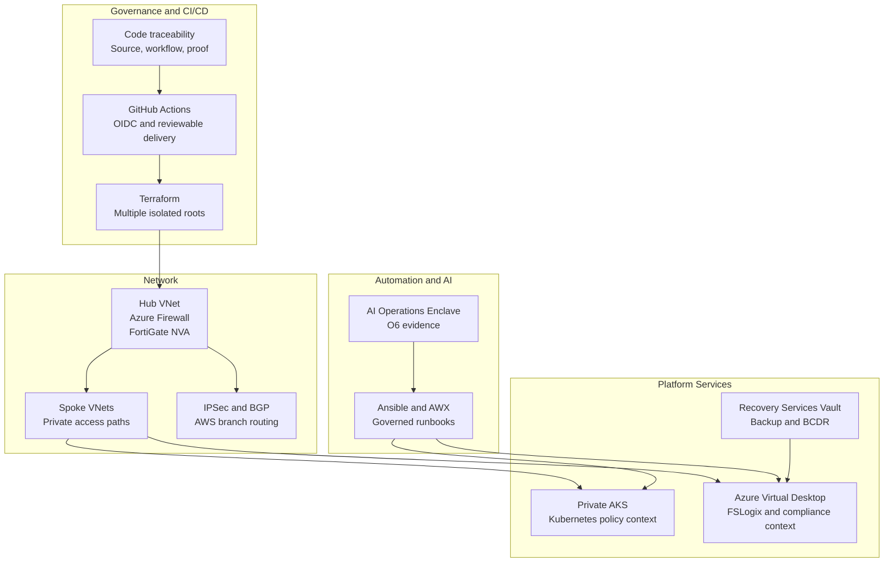

# Release 2: Platform Engineering and Multi-Cloud

  <a class="portfolio-chip" href="/releases/">
    Journey
    Public Ready
  </a>
  <a class="portfolio-chip" href="/releases/release1/">
    R1
    Workplace + M365
  </a>
  <a class="portfolio-chip" href="/releases/release2/">
    R2
    Platform + Multi-Cloud
  </a>
  <a class="portfolio-chip" href="/releases/release3/">
    R3
    Roadmap
  </a>

!!! success "Status: Implemented and evidenced"
    Release 2 is implemented, operationally validated, and evidenced through Terraform source, GitHub Actions workflow records, public-safe evidence folders, screenshots, CLI output, Kubernetes manifests, Ansible/AWX material, architecture documentation, and the companion local AI lab repository.

Release 2 extends the realistic Microsoft hybrid enterprise environment into a governed Azure platform with secret-less CI/CD, multi-cloud networking, private compute, automation, operational resilience, and an AI operations enclave with policy-mediated safety controls.

## Architecture overview

## Delivered capabilities - Delivery Engineering

- **Multi-root Terraform with isolated state** - separate roots divide networking, management, shared services, AKS, AVD, governance, workload, and AWS branch responsibilities.  
  [Terraform State Boundaries](/engineering/terraform-state-boundaries/)

- **Secret-less CI/CD** - GitHub Actions uses OpenID Connect to support workflow-controlled Azure authentication without routine long-lived deployment credentials.  
  [GitHub Actions OIDC](/engineering/github-actions-oidc/)

- **Code traceability** - source files, workflow evidence, documentation, and proof routes connect platform claims to reviewable implementation evidence.  
  [Code Traceability](/engineering/code-traceability/)

- **Automation control plane** - Ansible and AWX provide governed inventories, runbooks, job templates, controlled execution, and job evidence.  
  [Automation Control Plane](/engineering/automation-control-plane/)

## Delivered capabilities - Network Engineering

- **Hub-spoke network design** - Azure hub-spoke routing, route control, Azure Firewall, and private access paths shape the platform network.  
  [Hybrid Multi-Cloud Networking](/engineering/hybrid-multicloud-networking/)

- **Secure transmission and inspection** - FortiGate NVA inspection, Azure Firewall context, route validation, and traffic-path evidence prove more than diagram-level design.  
  [Secure Transmission and Inspection](/engineering/secure-transmission-inspection/)

- **IPSec and BGP multi-cloud transit** - on-premises routing, Azure VPN Gateway, AWS branch routing, Cisco CSR context, and BGP validation demonstrate dynamic transit.  
  [Hybrid BGP Multi-Cloud Transit](/engineering/hybrid-bgp-multicloud-transit/)

## Delivered capabilities - Platform Services

- **Private AKS** - private platform pattern with Kubernetes manifests, controlled access, network policy context, and operational evidence.  
  [Private AKS Platform](/engineering/private-aks-platform/)

- **AVD secure workspace** - Azure Virtual Desktop with FSLogix, private access patterns, compliance context, and operator toolchain evidence.  
  [AVD Secure Workspace](/engineering/avd-secure-workspace/)

- **AKS and AVD integration** - private platform services are connected through controlled routes and inspected access paths.  
  [Private AKS and AVD Architecture](/engineering/private-aks-avd/)

## Delivered capabilities - Operations Engineering

- **Monitoring and alert validation** - Azure Monitor, Sentinel, Defender for Cloud, and alert evidence demonstrate operational visibility.  
  [Monitoring, Backup and Resilience](/engineering/monitoring-backup-resilience/)

- **Backup and resilience** - Recovery Services Vault controls, backup validation, soft-delete handling, and BCDR planning show recoverability beyond deployment.  
  [Monitoring, Backup and Resilience](/engineering/monitoring-backup-resilience/)

- **Day-2 automation** - Ansible/AWX job evidence and source-controlled runbooks show repeatable operational execution.  
  [Automation Control Plane](/engineering/automation-control-plane/)

## Delivered capabilities - AI Governance

- **AI Operations Enclave** - O6 demonstrates policy-mediated tool use, deny-by-default policy decisions, scoped agent access, network isolation, namespace lifecycle validation, decision logs, and cleanup checks.  
  [AI Operations Enclave](/ai-operations/)

- **Companion local AI lab** - local reference implementation aligned with O6, using validation, evidence bundles, human review boundaries, and no-auto-apply posture.  
  [Companion Local AI Lab](/companion-project/)

## Capability matrix

| Capability | Implementation | Evidence |
|---|---|---|
| Terraform state boundaries | Multiple Terraform roots, separate ownership boundaries, remote state discipline | [`terraform/`](https://github.com/jrikobd-azaws/azawslab-enterprise-hybrid-security/tree/main/terraform) |
| GitHub Actions OIDC | Workflow-controlled Azure authentication without routine long-lived deployment credentials | `.github/workflows/` and OIDC evidence |
| Code traceability | Source, workflow, documentation, and proof routes connected to platform claims | [Code Traceability](/engineering/code-traceability/) |
| Automation control plane | Ansible, AWX, inventories, job templates, runbooks, and execution evidence | [`A2-awx-control-plane`](https://github.com/jrikobd-azaws/azawslab-enterprise-hybrid-security/tree/main/docs/release2/evidence/A2-awx-control-plane), [`ansible/`](https://github.com/jrikobd-azaws/azawslab-enterprise-hybrid-security/tree/main/ansible) |
| Hub-spoke networking | Azure hub-spoke routing, Azure Firewall, route control, and private access paths | Release 2 network evidence |
| FortiGate NVA inspection | Inspection path, firewall evidence, and route validation | [`O1 evidence`](https://github.com/jrikobd-azaws/azawslab-enterprise-hybrid-security/tree/main/docs/release2/evidence/O1) |
| IPSec and BGP transit | VPN, BGP, AWS branch routing, and cross-cloud validation | [`P5-vpn`](https://github.com/jrikobd-azaws/azawslab-enterprise-hybrid-security/tree/main/docs/release2/evidence/P5-vpn), [`O3b`](https://github.com/jrikobd-azaws/azawslab-enterprise-hybrid-security/tree/main/docs/release2/evidence/O3b) |
| Private AKS | Private platform pattern, Kubernetes manifests, controlled access, and network policy context | [`O4 evidence`](https://github.com/jrikobd-azaws/azawslab-enterprise-hybrid-security/tree/main/docs/release2/evidence/O4), [`kubernetes/`](https://github.com/jrikobd-azaws/azawslab-enterprise-hybrid-security/tree/main/kubernetes) |
| AVD secure workspace | FSLogix, private access patterns, compliance context, and platform toolchain evidence | [`O5 evidence`](https://github.com/jrikobd-azaws/azawslab-enterprise-hybrid-security/tree/main/docs/release2/evidence/O5) |
| AKS and AVD integration | Controlled private platform connectivity and inspected access paths | O4/O5 integration evidence |
| Monitoring and alerting | Azure Monitor, Sentinel, Defender for Cloud, and alert evidence | [`P7`](https://github.com/jrikobd-azaws/azawslab-enterprise-hybrid-security/tree/main/docs/release2/evidence/P7), [`P8`](https://github.com/jrikobd-azaws/azawslab-enterprise-hybrid-security/tree/main/docs/release2/evidence/P8), [`P9a`](https://github.com/jrikobd-azaws/azawslab-enterprise-hybrid-security/tree/main/docs/release2/evidence/P9a) |
| Backup and BCDR | Recovery Services Vault controls, backup validation, soft-delete handling, and BCDR planning | [`P9b`](https://github.com/jrikobd-azaws/azawslab-enterprise-hybrid-security/tree/main/docs/release2/evidence/P9b), [`P9b-redesign`](https://github.com/jrikobd-azaws/azawslab-enterprise-hybrid-security/tree/main/docs/release2/evidence/P9b-redesign) |
| AI Operations Enclave | O6 policy-mediated tool use, scoped agent access, decision logs, namespace lifecycle, and cleanup checks | [`O6 evidence`](https://github.com/jrikobd-azaws/azawslab-enterprise-hybrid-security/tree/main/docs/release2/evidence/O6) |
| Companion local AI lab | Local AI infrastructure workflow with validation, evidence bundles, and human review boundaries | [`local-ai-lab-infra`](https://github.com/jrikobd-azaws/local-ai-lab-infra) |

## Evidence hub

Release 2 evidence is organised across multiple repository folders:

- **Terraform and delivery** - `terraform/`, `.github/workflows/`, OIDC evidence, state-boundary documentation, and code traceability routes.
- **Network inspection and transit** - `docs/release2/evidence/O1/`, `P5-vpn/`, `O3b/`, and related network validation evidence.
- **AWX automation** - `ansible/` and `docs/release2/evidence/A2-awx-control-plane/`.
- **Private platform services** - `kubernetes/`, `docs/release2/evidence/O4/`, and `docs/release2/evidence/O5/`.
- **Monitoring and resilience** - `P7/`, `P8/`, `P9a/`, `P9b/`, `P9b-redesign/`, and BCDR documentation.
- **AI operations** - `docs/release2/evidence/O6/` and companion `local-ai-lab-infra`.

## Why it matters

Release 2 turns the project from Microsoft hybrid operations into a governed platform engineering environment. The important signal is not just that individual services exist; it is that delivery, network, platform services, operations, and AI governance are documented as one connected lifecycle.

## Skills demonstrated

- Azure platform architecture and governance.
- Infrastructure as Code with multi-root Terraform and isolated state.
- Secret-less CI/CD with GitHub Actions OIDC.
- Code traceability across source, workflow, documentation, and evidence.
- Hybrid and multi-cloud networking with IPSec, BGP, NVA inspection, and AWS branch routing.
- Private Kubernetes and virtual desktop delivery.
- Operational automation with Ansible and AWX.
- Security monitoring, backup resilience, and BCDR planning.
- Policy-mediated AI tool use with safety boundaries.

## Next step

Release 3 extends the platform toward multi-cloud Kubernetes, GitOps, DevSecOps scanning, observability, and resilience.

[Release 3 Roadmap](/releases/release3/)
