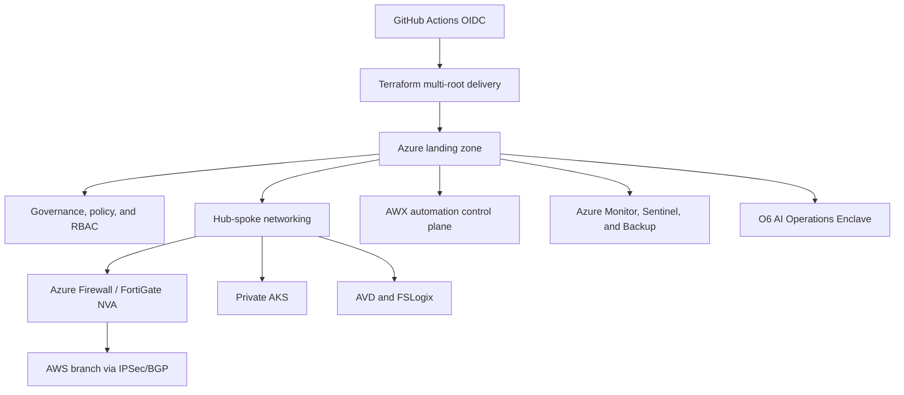

# Release 2 - Azure Platform Engineering, Security, Automation & AI Operations

Release 2 is the core enterprise platform build. It extends the Release 1 identity foundation into Azure platform engineering, Terraform delivery, secure networking, automation, private platform access, and governed AI-assisted operations.

## Architecture at a glance

This release demonstrates the strongest technical proof layer: delivery control, state boundaries, routing, private platform design, and governed AI-assisted operations.

## What this release proves

| Capability | What it demonstrates |
|---|---|
| Secretless IaC | GitHub Actions OIDC and workflow-controlled Terraform delivery |
| State and root boundaries | Separated Terraform roots for governance, networking, management, AKS, AVD, shared services, and AWS branch context |
| Secure hybrid networking | Azure hub-spoke, firewall/NVA inspection, IPSec/BGP branch connectivity |
| Automation control plane | Ansible and AWX patterns for governed day-2 operations |
| Private platform | Private AKS, private endpoints, secure AVD, and FSLogix access patterns |
| O6 AI operations | Policy-mediated, human-reviewed AI-assisted CloudOps workflow model |

## Flagship proof

| Evidence area | What it shows | Entry point |
|---|---|---|
| OIDC Terraform delivery | Secretless, workflow-controlled IaC execution | [P0 evidence](https://github.com/jrikobd-azaws/azawslab-enterprise-hybrid-security/tree/main/docs/release2/evidence/P0) |
| Multi-cloud routing | BGP/IPSec and hybrid network validation | [P5 evidence](https://github.com/jrikobd-azaws/azawslab-enterprise-hybrid-security/tree/main/docs/release2/evidence/P5) |
| AWX automation | Governed automation control plane with RBAC and runtime boundaries | [A2 AWX evidence](https://github.com/jrikobd-azaws/azawslab-enterprise-hybrid-security/tree/main/docs/release2/evidence/A2-awx-control-plane) |
| Private AKS | Private cluster, controlled access, and platform validation | [O4 evidence](https://github.com/jrikobd-azaws/azawslab-enterprise-hybrid-security/tree/main/docs/release2/evidence/O4) |
| Secure workspace | AVD and FSLogix evidence for controlled administrative access | [O5 evidence](https://github.com/jrikobd-azaws/azawslab-enterprise-hybrid-security/tree/main/docs/release2/evidence/O5) |
| AI governance | O6 policy-mediated AI operations evidence | [O6 evidence](https://github.com/jrikobd-azaws/azawslab-enterprise-hybrid-security/tree/main/docs/release2/evidence/O6) |
| Management state split | Control-plane state separation and reduced blast radius | [Platform management state split](https://github.com/jrikobd-azaws/azawslab-enterprise-hybrid-security/tree/main/docs/release2/evidence/platform-management-state-split) |

!!! quote "Architect's insight"
    The most important Release 2 design decision was separating platform management, networking, workload, and shared-service Terraform roots. This reduces blast radius, protects the automation/control plane, and makes changes easier to review and recover.

## Why it matters

Release 2 shows platform design, implementation discipline, operational validation, and evidence-backed security engineering. It is the center of the portfolio because it connects identity, networking, IaC, automation, private compute, and AI operations into one governed platform story.

## Platform evolution notes

- The hybrid routing layer can evolve toward higher-availability active/active patterns where cost and lab constraints allow.
- AWX automation can be expanded into workflow-driven incident response with conditional approvals and richer rollback paths.
- The private platform layer can continue evolving toward Release 3 GitOps and multi-cloud Kubernetes patterns.

## Reviewer entry points

- [Release 2 Proof Gallery](../proof-gallery.md)
- [Technical Reviewer Path](../role-paths/technical-reviewer.md)
- [Security Architect Path](../role-paths/security-architect.md)
- [Terraform State Boundaries](../engineering/terraform-state-boundaries.md)
- [GitHub Actions OIDC](../engineering/github-actions-oidc.md)
- [Hybrid Multi-Cloud Networking](../engineering/hybrid-multicloud-networking.md)
- [Private AKS and AVD](../engineering/private-aks-avd.md)
- [Full Release 2 documentation](https://github.com/jrikobd-azaws/azawslab-enterprise-hybrid-security/tree/main/docs/release2)
- [Release 2 evidence root](https://github.com/jrikobd-azaws/azawslab-enterprise-hybrid-security/tree/main/docs/release2/evidence)

Release 2 is implemented and evidenced.