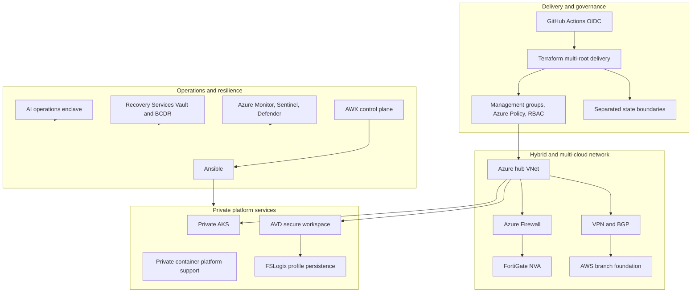

# Release 2 - Platform Engineering and Multi-Cloud

  <a class="portfolio-chip" href="/releases/">
    Journey
    Public Ready
  </a>
  <a class="portfolio-chip" href="/releases/release1/">
    R1
    Workplace + M365
  </a>
  <a class="portfolio-chip" href="/releases/release2/">
    R2
    Platform + Multi-Cloud
  </a>
  <a class="portfolio-chip" href="/releases/release3/">
    R3
    Roadmap
  </a>

!!! success "Status: Implemented and evidenced"
    Release 2 is implemented, operationally validated, and evidenced through Terraform source, GitHub Actions workflow records, public-safe evidence folders, screenshots, CLI output, Kubernetes manifests, Ansible/AWX material, and architecture documentation.

Release 2 transforms the Microsoft hybrid enterprise base into a governed Azure platform. It demonstrates secretless infrastructure delivery, Terraform state-boundary discipline, hub-spoke networking, advanced inspection, hybrid and multi-cloud routing, private platform services, automation control planes, resilience, and an AI operations enclave with policy-mediated tool use and human approval boundaries.

## Architecture overview

## What this release proves

- **Landing-zone governance** - Terraform-defined management groups, Azure Policy, RBAC, and strict state-file separation across multiple Terraform roots.
- **Secretless CI/CD** - GitHub Actions with OpenID Connect and no long-lived deployment credentials for routine platform delivery.
- **Hub-spoke networking with advanced inspection** - Azure Firewall forced routing, route tables, service chaining, and FortiGate NVA inspection.
- **Hybrid and multi-cloud routing** - Site-to-site VPN, IPSec, BGP, Cisco CSR context, AWS branch foundation, route filtering, and cross-cloud route validation.
- **Automation control plane** - Ansible playbooks and AWX inventories, job templates, execution records, and operational runbooks replace ad-hoc scripting.
- **Private AKS** - Private cluster pattern, private access, Kubernetes support manifests, network policy context, and validation evidence.
- **Secure AVD workspace** - Azure Virtual Desktop, FSLogix, private endpoint orientation, privileged access separation, and secure workspace governance.
- **Backup and disaster recovery** - Recovery Services Vault, backup policies, BCDR planning, soft-delete handling, immutability, monitoring, and validation evidence.
- **AI operations enclave** - AI operations enclave with policy-mediated tool use and human approval boundaries, tied to O6 evidence and the dedicated AI operations page.

## Capability matrix

| Capability | Implementation signal | Evidence path |
|---|---|---|
| Landing zone governance | Terraform-defined Azure foundations, management group hierarchy, Azure Policy, RBAC separation, remote state, and controlled delivery boundaries. | [Landing zone documentation](https://github.com/jrikobd-azaws/azawslab-enterprise-hybrid-security/blob/main/docs/release2/01-landing-zone-iac-governance.md), [Terraform source](https://github.com/jrikobd-azaws/azawslab-enterprise-hybrid-security/tree/main/terraform), and [P0 evidence](https://github.com/jrikobd-azaws/azawslab-enterprise-hybrid-security/tree/main/docs/release2/evidence/P0) |
| Secretless CI/CD | GitHub Actions OIDC federation to Azure, workflow-controlled Terraform plan/apply delivery, and reduced static deployment credential exposure. | [P0 OIDC evidence](https://github.com/jrikobd-azaws/azawslab-enterprise-hybrid-security/tree/main/docs/release2/evidence/P0) and [GitHub Actions workflows](https://github.com/jrikobd-azaws/azawslab-enterprise-hybrid-security/tree/main/.github/workflows) |
| Terraform state discipline | Multiple Terraform roots separate platform networking, management, AKS, AVD, shared services, governance, workloads, and AWS branch ownership. | [Terraform state boundary deep dive](/engineering/terraform-state-boundaries/) and [platform management state split evidence](https://github.com/jrikobd-azaws/azawslab-enterprise-hybrid-security/tree/main/docs/release2/evidence/platform-management-state-split) |
| Hub-spoke network security | Azure hub-spoke design, Azure Firewall, forced routing, route tables, inspection boundaries, and service chaining. | [Networking documentation](https://github.com/jrikobd-azaws/azawslab-enterprise-hybrid-security/blob/main/docs/release2/02-hybrid-multicloud-network-security.md) and [P5 evidence](https://github.com/jrikobd-azaws/azawslab-enterprise-hybrid-security/tree/main/docs/release2/evidence/P5) |
| Advanced traffic inspection | FortiGate NVA integration into the inspection path with route and policy validation. | [Hybrid multi-cloud networking deep dive](/engineering/hybrid-multicloud-networking/) and [Release 2 evidence](https://github.com/jrikobd-azaws/azawslab-enterprise-hybrid-security/tree/main/docs/release2/evidence) |
| Hybrid and multi-cloud routing | Site-to-site VPN, IPSec, BGP, Cisco CSR context, AWS branch foundation, route filtering, and cross-cloud route validation. | [P5 evidence](https://github.com/jrikobd-azaws/azawslab-enterprise-hybrid-security/tree/main/docs/release2/evidence/P5) and [P5 VPN evidence](https://github.com/jrikobd-azaws/azawslab-enterprise-hybrid-security/tree/main/docs/release2/evidence/P5-vpn) |
| Automation control plane | Ansible and AWX are used as an operations layer with inventories, job templates, controlled execution, and evidence-backed runbooks. | [Automation documentation](https://github.com/jrikobd-azaws/azawslab-enterprise-hybrid-security/blob/main/docs/release2/03-automation-secops-resilience.md), [Ansible source](https://github.com/jrikobd-azaws/azawslab-enterprise-hybrid-security/tree/main/ansible), and [A2 AWX evidence](https://github.com/jrikobd-azaws/azawslab-enterprise-hybrid-security/tree/main/docs/release2/evidence/A2-awx-control-plane) |
| Private AKS | Private AKS platform pattern with private access, Kubernetes support manifests, network policy context, and validation evidence. | [Private AKS and AVD deep dive](/engineering/private-aks-avd/), [Kubernetes source](https://github.com/jrikobd-azaws/azawslab-enterprise-hybrid-security/tree/main/kubernetes), and [O4 evidence](https://github.com/jrikobd-azaws/azawslab-enterprise-hybrid-security/tree/main/docs/release2/evidence/O4) |
| Secure AVD workspace | Azure Virtual Desktop, FSLogix, private endpoint orientation, privileged access separation, and secure workspace governance. | [Private platform documentation](https://github.com/jrikobd-azaws/azawslab-enterprise-hybrid-security/blob/main/docs/release2/04-private-platform-secure-workspace.md), [AVD secure workspace deep dive](/engineering/avd-secure-workspace/), and [O5 evidence](https://github.com/jrikobd-azaws/azawslab-enterprise-hybrid-security/tree/main/docs/release2/evidence/O5) |
| Backup and disaster recovery | Recovery Services Vault, backup policies, BCDR planning, soft-delete handling, immutability, monitoring, and operational validation. | [Automation, SecOps, and resilience documentation](https://github.com/jrikobd-azaws/azawslab-enterprise-hybrid-security/blob/main/docs/release2/03-automation-secops-resilience.md) and [Release 2 evidence](https://github.com/jrikobd-azaws/azawslab-enterprise-hybrid-security/tree/main/docs/release2/evidence) |
| AI operations enclave | AI operations enclave with policy-mediated tool use and human approval boundaries, tied to O6 evidence and the dedicated AI operations page. | [AI Operations page](/ai-operations/) and [O6 evidence](https://github.com/jrikobd-azaws/azawslab-enterprise-hybrid-security/tree/main/docs/release2/evidence/O6) |

## Automation control plane

AWX is presented as an operations control plane, not a screenshot of a tool. It gives the platform a repeatable execution layer for configuration management and operational runbooks.

The control plane demonstrates:

- Ansible playbooks and inventories for platform operations.
- AWX job templates and execution records for auditable runs.
- Operational separation between source-controlled automation and runtime execution.
- Integration with private platform services and infrastructure evidence.
- A day-2 operations pattern that can support remediation, validation, and controlled execution.

**Evidence:** [Ansible source](https://github.com/jrikobd-azaws/azawslab-enterprise-hybrid-security/tree/main/ansible), [automation documentation](https://github.com/jrikobd-azaws/azawslab-enterprise-hybrid-security/blob/main/docs/release2/03-automation-secops-resilience.md), and [A2 AWX evidence](https://github.com/jrikobd-azaws/azawslab-enterprise-hybrid-security/tree/main/docs/release2/evidence/A2-awx-control-plane).

## Multi-cloud routing detail

The AWS branch foundation is part of the implemented Release 2 network story. It extends the Azure hub-spoke environment into a multi-cloud route-validation pattern with VPN, IPSec, BGP, and AWS branch evidence.

This proves:

- Cross-cloud routing was treated as a network architecture problem, not a diagram-only claim.
- BGP and route validation were included in the evidence model.
- Azure inspection and AWS branch patterns were connected through documented implementation and validation paths.

**Evidence:** [P5 evidence](https://github.com/jrikobd-azaws/azawslab-enterprise-hybrid-security/tree/main/docs/release2/evidence/P5), [P5 VPN evidence](https://github.com/jrikobd-azaws/azawslab-enterprise-hybrid-security/tree/main/docs/release2/evidence/P5-vpn), and [hybrid multi-cloud networking documentation](https://github.com/jrikobd-azaws/azawslab-enterprise-hybrid-security/blob/main/docs/release2/02-hybrid-multicloud-network-security.md).

## AI operations enclave

Release 2 includes an AI operations enclave with policy-mediated tool use and human approval boundaries. It is documented as an operational governance pattern: AI assistance can support analysis and operational requests, but infrastructure mutation remains constrained by approval, policy, and evidence boundaries.

**Evidence:** [AI Operations page](/ai-operations/) and [O6 evidence](https://github.com/jrikobd-azaws/azawslab-enterprise-hybrid-security/tree/main/docs/release2/evidence/O6).

## Evidence hub

Release 2 evidence is structured so reviewers can move from architectural claim to implementation proof:

| Evidence area | What it supports |
|---|---|
| [P0 evidence](https://github.com/jrikobd-azaws/azawslab-enterprise-hybrid-security/tree/main/docs/release2/evidence/P0) | OIDC delivery, GitHub Actions federation, and Terraform pipeline control. |
| [P5 evidence](https://github.com/jrikobd-azaws/azawslab-enterprise-hybrid-security/tree/main/docs/release2/evidence/P5) | Hub-spoke networking, inspection, routing, and multi-cloud network context. |
| [P5 VPN evidence](https://github.com/jrikobd-azaws/azawslab-enterprise-hybrid-security/tree/main/docs/release2/evidence/P5-vpn) | VPN, IPSec, BGP, and cross-cloud route validation. |
| [A2 AWX evidence](https://github.com/jrikobd-azaws/azawslab-enterprise-hybrid-security/tree/main/docs/release2/evidence/A2-awx-control-plane) | AWX inventories, job templates, execution control, and operations automation. |
| [O4 evidence](https://github.com/jrikobd-azaws/azawslab-enterprise-hybrid-security/tree/main/docs/release2/evidence/O4) | Private AKS platform validation and Kubernetes boundary proof. |
| [O5 evidence](https://github.com/jrikobd-azaws/azawslab-enterprise-hybrid-security/tree/main/docs/release2/evidence/O5) | AVD and FSLogix secure workspace governance, readiness, and private access orientation. |
| [O6 evidence](https://github.com/jrikobd-azaws/azawslab-enterprise-hybrid-security/tree/main/docs/release2/evidence/O6) | AI operations boundary, policy decisions, namespace lifecycle, and cleanup validation. |
| [Release 2 evidence index](https://github.com/jrikobd-azaws/azawslab-enterprise-hybrid-security/tree/main/docs/release2/evidence) | Full evidence vault for Release 2 implementation proof. |

## Why it matters

Release 2 demonstrates platform engineering at the control-plane level. It is not only a collection of deployed Azure resources. It shows delivery governance, state isolation, route ownership, private access design, operational automation, security monitoring, backup and recovery, and controlled AI-enabled CloudOps.

## Skills demonstrated

| Skill area | Signal |
|---|---|
| Azure platform engineering | Landing zones, management groups, Azure Policy, RBAC, remote state, and controlled Terraform roots. |
| Infrastructure as Code | Multi-root Terraform, pipeline-controlled delivery, state boundaries, and implementation traceability. |
| CI/CD and identity federation | GitHub Actions OIDC, workflow records, approval flow, and reduced static credential exposure. |
| Network architecture | Hub-spoke, Azure Firewall, FortiGate NVA, VPN, BGP, AWS branch, route validation, and inspection paths. |
| Automation and operations | Ansible, AWX, job templates, inventories, backup, monitoring, and operational runbooks. |
| Private platform delivery | Private AKS, AVD, FSLogix, private endpoints, and privileged access separation. |
| Security and resilience | Sentinel, Defender for Cloud, Recovery Services Vault, BCDR planning, soft-delete handling, and evidence-led operations. |
| AI operations governance | Policy-mediated tool use, human approval boundaries, O6 evidence, and controlled operational context. |

## Next step

After Release 2, [Release 3](/releases/release3/) describes the roadmap for multi-cloud Kubernetes, GitOps, DevSecOps, observability, and resilience.