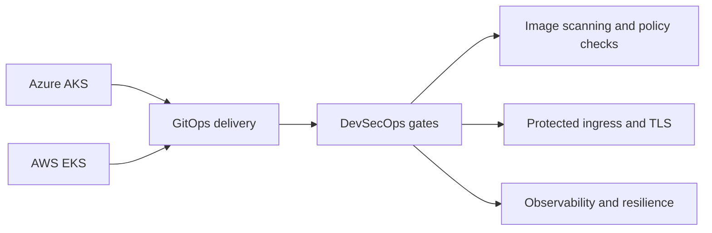

# Release 3 - Multi-Cloud Kubernetes & DevSecOps Roadmap

Release 3 defines the future evolution of the platform. It intentionally remains roadmap-oriented until implementation evidence exists.

## Future-state vision

This roadmap extends the Release 2 foundation into cloud-native workload delivery across Azure and AWS.

## Planned capability map

| Planned capability | Intended signal |
|---|---|
| Multi-cloud Kubernetes | AKS and EKS platform evolution with workload portability |
| GitOps delivery | Argo CD-style delivery controls and environment promotion |
| DevSecOps gates | Image scanning, policy checks, protected ingress, and supply-chain controls |
| Observability | Cross-platform monitoring, logging, alerting, and resilience patterns |
| Platform maturity | Evolution from infrastructure foundation to cloud-native operating model |

## Proof model when implemented

| Future validation area | Expected evidence model |
|---|---|
| AKS and EKS workload clusters | Redacted cluster state, deployment manifests, and access validation |
| GitOps delivery | Argo CD application state, sync history, and controlled promotion evidence |
| DevSecOps controls | Image scan results, policy gate output, and protected ingress validation |
| Observability | Dashboard captures, alert rules, log queries, and failure/recovery validation |
| Resilience | Backup, restore, failover, and operational runbook evidence |

!!! quote "Architect's insight"
    Multi-cloud Kubernetes is not a goal by itself. It becomes valuable only after the platform proves identity, routing, policy, private access, automation, and evidence handling. Release 3 is therefore positioned as a controlled evolution, not a disconnected rewrite.

## Why it matters

Release 3 shows architectural direction without pretending that future work is already complete. This keeps the portfolio honest while demonstrating how the current platform can evolve into multi-cloud Kubernetes, GitOps, and DevSecOps.

## Reviewer entry points

- [Architecture Overview](../architecture.md)
- [Proof Gallery](../proof-gallery.md)
- [Portfolio Case Study](../portfolio-case-study.md)
- [Full Release 3 roadmap](https://github.com/jrikobd-azaws/azawslab-enterprise-hybrid-security/tree/main/docs/release3)
- [Release 3 target roadmap diagram](https://github.com/jrikobd-azaws/azawslab-enterprise-hybrid-security/blob/main/diagrams/release3/release3-target-roadmap.png)

Release 3 is roadmap-only until implementation and evidence are added.