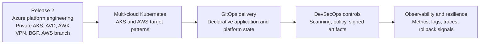

# Release 3 - Multi-Cloud Kubernetes and DevSecOps Roadmap

  <a class="portfolio-chip" href="/releases/">
    Journey
    Public Ready
  </a>
  <a class="portfolio-chip" href="/releases/release1/">
    R1
    Workplace + M365
  </a>
  <a class="portfolio-chip" href="/releases/release2/">
    R2
    Platform + Multi-Cloud
  </a>
  <a class="portfolio-chip" href="/releases/release3/">
    R3
    Roadmap
  </a>

!!! info "Status: Roadmap"
    Release 3 is the multi-cloud Kubernetes, GitOps, and DevSecOps roadmap. It is not implemented proof. Implementation claims belong on this page only when evidence exists under the same public-safe documentation and validation standard used for Release 1 and Release 2.

Release 3 defines the next target state: multi-cloud Kubernetes delivery, GitOps, DevSecOps controls, observability, resilience, and policy-driven operations across Azure and AWS.

This page records architectural direction while keeping roadmap items separate from delivered implementation.

## Target evolution

## Planned capability map

| Planned capability | Direction |
|---|---|
| Multi-cloud Kubernetes | Extend the Release 2 private platform services work toward coordinated AKS and AWS Kubernetes delivery patterns. |
| GitOps delivery | Move application and platform configuration toward declarative, reviewable, pull-based deployment workflows. |
| DevSecOps controls | Add security gates for infrastructure, container images, policy, dependencies, and deployment approvals. |
| Policy as Code | Expand guardrails so cluster and application controls can be validated before and after deployment. |
| Observability | Build cross-platform visibility for metrics, logs, traces, deployment health, and rollback signals. |
| Resilience engineering | Add progressive delivery, failure testing, recovery validation, and service-level operational evidence. |
| Evidence model | Preserve the same standard used in Release 1 and Release 2: public-safe proof, source traceability, and clear validation artefacts. |

## Relationship to Release 2

Release 3 builds on Release 2 capabilities already implemented and routed to evidence:

| Release 2 capability | How it supports Release 3 |
|---|---|
| Private AKS | Provides the first private Kubernetes platform boundary. |
| AWS branch and BGP routing | Establishes cross-cloud network context for future AWS Kubernetes patterns. |
| GitHub Actions OIDC | Provides an identity-aware delivery model for future GitOps and DevSecOps workflows. |
| Terraform root separation | Provides a state-boundary discipline that can be extended to cluster and application platforms. |
| AWX and Ansible | Demonstrates operational automation that can support day-2 runbooks. |
| Sentinel, Defender, backup, and monitoring | Establishes the security and resilience baseline for future platform operations. |

## What can be reviewed now

- [Release 2 platform engineering](/releases/release2/) for the implemented Azure platform, network, automation, private platform services, operations, and resilience evidence.
- [Hybrid multi-cloud networking](/engineering/hybrid-multicloud-networking/) for the implemented network path toward multi-cloud operations.
- [Private AKS and AVD architecture](/engineering/private-aks-avd/) for the current private platform services boundary.
- [Proof Gallery](/proof-gallery/) for implemented Release 1 and Release 2 evidence.
- [Release 3 source roadmap](https://github.com/jrikobd-azaws/azawslab-enterprise-hybrid-security/tree/main/docs/release3) for the GitOps, DevSecOps, observability, and resilience direction.

## Evidence standard for future work

Release 3 implementation should follow the same evidence discipline as Release 1 and Release 2:

- Source-controlled infrastructure and platform manifests.
- Workflow records for delivery and validation.
- Public-safe screenshots, CLI output, and operational records.
- Explicit separation between implemented evidence and future design.
- Reviewer-facing documentation that routes claims to evidence.

Until implementation evidence is added, Release 3 remains a labelled roadmap.
